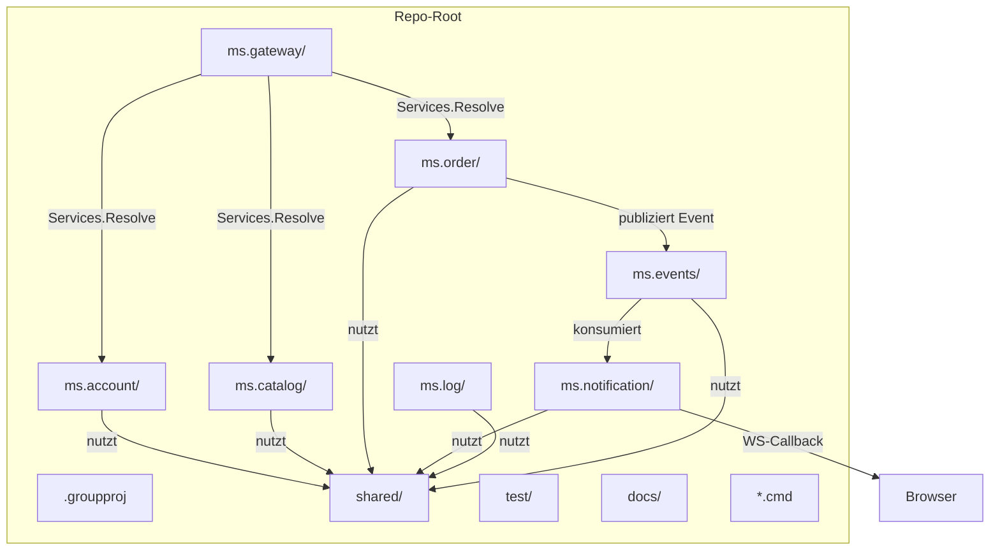

# 01 — Projektstruktur

## Zweck / Wann brauche ich das

Diese Datei beschreibt die kanonische Verzeichnis- und Projektstruktur für ein neues
mORMot2-Microservice-Projekt. Sie gilt ab dem ersten `git init` und bleibt über die gesamte
Laufzeit des Projekts verbindlich. Wer von dieser Vorlage abweicht, erzeugt Inkonsistenzen,
die spätere Tooling-Skripte (Build, Start, Stop, Status) stillschweigend brechen.

## Kernkonzept

Jeder Service ist ein eigenständiger Delphi-Konsolenprozess mit seiner eigenen SQLite-Datenbank.
Gemeinsam genutzte Definitionen (Interfaces, DTOs, Resilience-Helfer) liegen in `shared/` —
dem einzigen Ort, an dem service-übergreifender Code lebt. Tests laufen in-process in einem
einzigen TSynTestCase-Projekt.



## Schritt für Schritt

1. Repo anlegen: `git init <projektname>`, dann Ordner nach Vorlage anlegen (s. u.).
2. `shared/` anlegen und befüllen: API-Interfaces, DTOs, Base-Service-Klasse, Resilience-Units.
3. Pro Service einen Ordner `ms.<name>/` anlegen, darin `.dpr` + `.dproj` + model + server.
4. `test/` mit einem einzigen Delphi-Konsolenprojekt anlegen.
5. `.groupproj` anlegen und alle `.dproj`-Dateien registrieren (Vorlage s. u.).
6. Build-Skripte (`*.cmd`) anlegen.

## Verzeichnis-Vorlage

```
<repo>/
  shared/                    # Gemeinsam genutzte Units (shared library)
    ms.shared.pas            # Kern-Konstanten, Basis-Typen
    ms.shared.api.pas        # ALLE SOA-Interfaces + DTO-Records (single source of truth)
    ms.shared.service.pas    # Abstrakte Basis-Serviceklasse TServiceBase
    ms.shared.jwt.pas        # JWT-Wrapper
    ms.shared.circuitbreaker.pas
    ms.shared.ratelimiter.pas
    ms.shared.correlation.pas
    ms.shared.events.pas     # Event-DTOs und Event-Typ-Enum
    ms.shared.logclient.pas  # Log-Shipping-Helfer

  ms.gateway/                # Web-Gateway (Fassade, keine eigene DB)
    ms.gateway.dpr
    ms.gateway.dproj
    ms.gateway.server.pas
    ms.gateway.config.json
    bootstrap.json

  ms.account/                # Business-Service — Muster für alle weiteren Services
    ms.account.dpr
    ms.account.dproj
    ms.account.model.pas     # ORM-Tabellenklassen + DTO-Records
    ms.account.server.pas    # Interface-Implementierung
    ms.account.config.json
    bootstrap.json

  ms.catalog/                # weitere Business-Services analog ms.account/
  ms.order/
  ms.notification/

  ms.log/                    # Infra: zentrales Logging (FTS5 + Live-WS-Stream)
    ms.log.dpr
    ms.log.dproj
    ms.log.model.pas
    ms.log.server.pas
    ms.log.config.json

  ms.events/                 # Infra: Event-Bus (Outbox, Consumer-Cursor, Replay)
    ms.events.dpr
    ms.events.dproj
    ms.events.model.pas
    ms.events.server.pas
    ms.events.config.json

  test/
    ms.tests.dpr             # Konsolenprojekt — Testeinstiegspunkt
    ms.tests.dproj
    ms.testCases.pas         # ALLE TSynTestCase-Subklassen + Suite-Klasse

  docs/

  <Projektname>.groupproj    # Delphi-Gruppenprojectdatei (alle .dproj)

  build-all-debug.cmd
  build-tests.cmd
  start-all.cmd
  stop-all.cmd
  status.cmd
  seed-data.cmd
```

## Aufbau eines Service-Ordners

Jeder Business-Service `ms.<name>/` enthält exakt diese Dateien:

| Datei | Zweck |
|-------|-------|
| `ms.<name>.dpr` | Konsolen-Einstiegspunkt, startet den HTTP-Server |
| `ms.<name>.dproj` | RAD-Studio-Projektdatei |
| `ms.<name>.model.pas` | ORM-Klassen (`TOrm*`) und DTO-Records |
| `ms.<name>.server.pas` | Implementierung des SOA-Interface aus `shared/` |
| `ms.<name>.config.json` | Runtime-Konfiguration (Port, Bind, DB-Pfad, Threads) |
| `bootstrap.json` | Startup-Bootstrap (Umgebungsvariablen, Logging) |

Kein Service enthält Code, der einem anderen Service gehört. Queries und Business-Logik
bleiben in der eigenen `server.pas`; der Gateway leitet nur durch.

## groupproj-Vorlage (Skelett)

```xml
<Project xmlns="http://schemas.microsoft.com/developer/msbuild/2003">
  <PropertyGroup>
    <ProjectGuid>{XXXXXXXX-XXXX-XXXX-XXXX-XXXXXXXXXXXX}</ProjectGuid>
  </PropertyGroup>
  <ItemGroup>
    <!-- Template zuerst -->
    <Projects Include=".template\ms.template.dproj">
      <Dependencies/>
    </Projects>
    <!-- Business-Services -->
    <Projects Include="ms.account\ms.account.dproj">
      <Dependencies/>
    </Projects>
    <Projects Include="ms.catalog\ms.catalog.dproj">
      <Dependencies/>
    </Projects>
    <Projects Include="ms.order\ms.order.dproj">
      <Dependencies/>
    </Projects>
    <Projects Include="ms.notification\ms.notification.dproj">
      <Dependencies/>
    </Projects>
    <!-- Infra-Services -->
    <Projects Include="ms.log\ms.log.dproj">
      <Dependencies/>
    </Projects>
    <Projects Include="ms.events\ms.events.dproj">
      <Dependencies/>
    </Projects>
    <!-- Gateway -->
    <Projects Include="ms.gateway\ms.gateway.dproj">
      <Dependencies/>
    </Projects>
    <!-- Tests immer zuletzt -->
    <Projects Include="test\ms.tests.dproj">
      <Dependencies/>
    </Projects>
  </ItemGroup>
  <!-- Build/Clean/Make-Targets: je ein <Target> pro Projekt, plus Aggregat-Targets -->
  <Import Project="$(BDS)\Bin\CodeGear.Group.Targets"
          Condition="Exists('$(BDS)\Bin\CodeGear.Group.Targets')"/>
</Project>
```

## Port-Schema

| Service | Port | Datenbank |
|---------|------|-----------|
| `ms.gateway` | 8080 | — |
| `ms.account` | 8081 | `account.db` |
| `ms.catalog` | 8082 | `catalog.db` |
| `ms.order` | 8083 | `order.db` |
| `ms.notification` | 8084 | `notification.db` |
| `ms.log` | 8090 | `log.db` (FTS5) |
| `ms.events` | 8091 | `events.db` (Outbox) |

Weitere Business-Services erhalten Ports 8085–8089. Infra-Services belegen 8090+.

## Build-Skripte (Muster)

**`build-all-debug.cmd`** — baut alle Service-Projekte via MSBuild:

```bat
@echo off
call "%DELPHI_BIN%\rsvars.bat"
set ERRORS=0
call :BUILD ms.account\ms.account.dproj
call :BUILD ms.catalog\ms.catalog.dproj
call :BUILD ms.order\ms.order.dproj
call :BUILD ms.notification\ms.notification.dproj
call :BUILD ms.log\ms.log.dproj
call :BUILD ms.events\ms.events.dproj
call :BUILD ms.gateway\ms.gateway.dproj
exit /b %ERRORS%

:BUILD
MSBuild.exe %1 /p:Config=Debug /p:Platform=Win32 /t:Build /v:minimal
if errorlevel 1 set /a ERRORS+=1
goto :eof
```

**`build-tests.cmd`** — baut nur das Test-Projekt:

```bat
@echo off
call "%DELPHI_BIN%\rsvars.bat"
MSBuild.exe test\ms.tests.dproj /p:Config=Debug /p:Platform=Win32 /t:Build /v:minimal
exit /b %errorlevel%
```

**`start-all.cmd`** — startet Services in Abhängigkeitsreihenfolge:

```bat
@echo off
set OUT=%gitroot%\_out\Win32-Debug\APP
start "ms.log"    /MIN "%OUT%\ms.log.exe"
timeout /t 1 /nobreak >nul
start "ms.events" /MIN "%OUT%\ms.events.exe"
timeout /t 1 /nobreak >nul
start "ms.account" /MIN "%OUT%\ms.account.exe"
start "ms.catalog" /MIN "%OUT%\ms.catalog.exe"
start "ms.order"   /MIN "%OUT%\ms.order.exe"
timeout /t 2 /nobreak >nul
start "ms.gateway" /MIN "%OUT%\ms.gateway.exe"
```

**`stop-all.cmd`** — fährt Services via Shutdown-Endpoint herunter (Gateway zuerst):

```bat
@echo off
curl -s -X POST http://localhost:8080/api/shutdown
timeout /t 2 /nobreak >nul
curl -s -X POST http://localhost:8083/api/shutdown
curl -s -X POST http://localhost:8082/api/shutdown
curl -s -X POST http://localhost:8081/api/shutdown
curl -s -X POST http://localhost:8084/api/shutdown
curl -s -X POST http://localhost:8091/api/shutdown
curl -s -X POST http://localhost:8090/api/shutdown
```

**`status.cmd`** — prüft Health-Endpoint jedes Service:

```bat
@echo off
for %%S in (
  ms.account:8081
  ms.catalog:8082
  ms.order:8083
  ms.notification:8084
  ms.log:8090
  ms.events:8091
  ms.gateway:8080
) do (
  for /f "tokens=1,2 delims=:" %%A in ("%%S") do (
    curl -s -o nul -w "  %%A (%%B): %%{http_code}%%n" ^
      http://localhost:%%B/api/health || echo   %%A: NOT REACHABLE
  )
)
```

## Stolperfallen / Lessons

- **Eine DB pro Service ist keine Performance-Entscheidung, sondern eine Architekturentscheidung.**
  Separate Datenbanken verhindern, dass Services sich über Schema-Änderungen gegenseitig
  blockieren und ermöglichen unabhängige Deployments. Nie konsolidieren, auch nicht für Tests
  (die nutzen `:memory:` — s. [10-testing.md](10-testing.md)).
- **`shared/ms.shared.api.pas` ist die einzige Quelle für Interfaces und DTOs.** Wer ein
  Interface in einer Service-eigenen Unit deklariert, verliert die compile-time-Prüfung der
  Cross-Service-Kompatibilität.
- **Startsequenz einhalten.** Infra-Services (Log, Events) müssen vor Business-Services laufen,
  weil letztere beim Start sofort Einträge loggen. Der Gateway kommt zuletzt.
- **DTOs sind typed records**, niemals `RawJson`. Typ: `T<Name>` oder `T<Name>Dto`
  (s. [11-coding-conventions.md](11-coding-conventions.md)).

## Querverweise

- [02-service-erstellen.md](02-service-erstellen.md) — konkretes Service-Skelett
- [10-testing.md](10-testing.md) — Testprojekt-Setup
- [11-coding-conventions.md](11-coding-conventions.md) — Delphi-Codierungsregeln
- [09-event-bus.md](09-event-bus.md) — Outbox/Consumer-Cursor-Architektur
