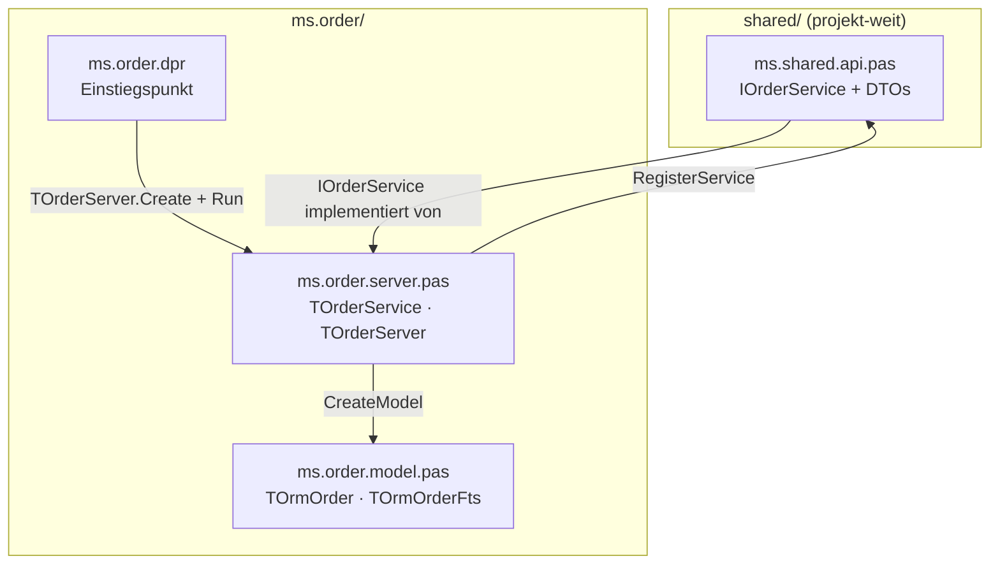
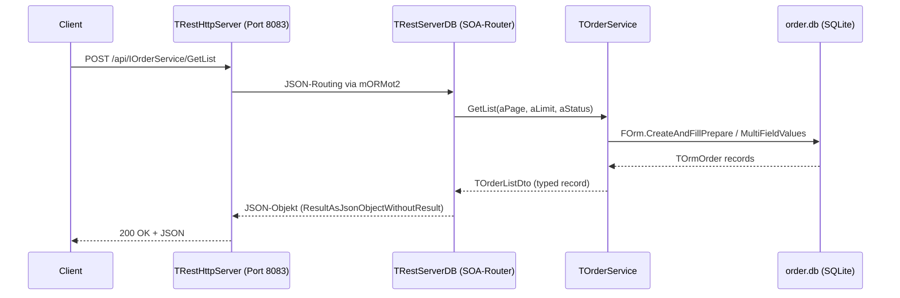

# 02 — Einen Business-Service erstellen

## Zweck / Wann brauche ich das

Dieses Dokument beschreibt, wie ein neuer, eigenständiger mORMot2-Microservice von Grund auf
aufgebaut wird. Es deckt alle vier Schichten ab: Service-Interface und DTOs in `shared/`, das
ORM-Modell, die Service-Implementierung und den Server-Host mit Einstiegspunkt. Verwende es,
wenn du ein neues Fachdomänen-Backend anlegen möchtest — zum Beispiel einen Bestell-, Inventar-
oder Benachrichtigungs-Service — das über eine eigene SQLite-Datenbank, einen eigenen HTTP-Port
und ein eigenes SOA-Interface verfügt.

---

## Kernkonzept

Ein mORMot2-Microservice ist interface-basiert (SOA). Der Client kennt nur das `IInvokable`-
Interface; das Framework generiert automatisch JSON-Serialisierung aller Parameter und ermöglicht
transparente HTTP-Aufrufe. Jede Schicht hat eine klar definierte Verantwortung:



Der Datenfluss bei einem Client-Aufruf:



---

## Schritt für Schritt

1. **Verzeichnis anlegen** — erstelle `ms.order/` auf der Root-Ebene des Projekts.
2. **DTOs und Interface deklarieren** — füge `TOrderDto`, `TOrderCreateDto`, `TOrderListDto`
   und `IOrderService` zu `shared/ms.shared.api.pas` hinzu (im `type`-Block, in
   `initialization` registrieren).
3. **ORM-Modell anlegen** — erstelle `ms.order/ms.order.model.pas` mit `TOrmOrder` (und
   optional `TOrmOrderFts` für Volltext-Suche).
4. **Service-Implementierung anlegen** — erstelle `ms.order/ms.order.server.pas` mit
   `TOrderService = class(TInterfacedObject, IOrderService)` und `TOrderServer = class(TMicroService)`.
5. **Einstiegspunkt anlegen** — erstelle `ms.order/ms.order.dpr` als Console-Applikation.
6. **Projekt-Gruppe** — füge `ms.order.dpr` zur `<Projekt>.groupproj` hinzu.
7. **Port reservieren** — füge `SERVICE_ORDER = 'ms.order'` und `PORT_ORDER = '8083'` zu
   `shared/ms.shared.pas` hinzu; prüfe vorher, ob der Port noch frei ist.
8. **Build verifizieren** — kompiliere und bestätige: 0 Hints, 0 Warnings.

---

## Code-Skelett

Die folgenden vier Skelette sind vollständig adaptierbar. Ersetze überall `Order`/`order`/
`ORDER` durch deinen Domainnamen und passe die Felder an dein Datenmodell an.

---

### A — Interface und DTOs (`shared/ms.shared.api.pas`, Ergänzung)

Dieser Block wird in den bestehenden `type`-Abschnitt von `ms.shared.api.pas` eingefügt.
In `initialization` werden alle neuen Typen mit `Rtti.RegisterType` registriert.

```pascal
  /// <summary>
  ///   Data transfer object for orders. An <c>ID</c> of 0 indicates that no record was found.
  /// </summary>
  TOrderDto = packed record
  public
    /// <summary>
    ///   Unique order identifier (SQLite RowID).
    /// </summary>
    ID: TID;

    /// <summary>
    ///   Foreign key referencing the customer who placed the order.
    /// </summary>
    CustomerId: TID;

    /// <summary>
    ///   Short description or title of the order.
    /// </summary>
    Description: RawUtf8;

    /// <summary>
    ///   Order status code: 0 = pending, 1 = confirmed, 2 = shipped, 3 = cancelled.
    /// </summary>
    Status: integer;

    /// <summary>
    ///   Total amount in the smallest currency unit (e.g. cents).
    /// </summary>
    TotalAmount: Int64;

    /// <summary>
    ///   Timestamp when the order was placed (UTC, ISO 8601).
    /// </summary>
    CreatedAt: TDateTime;

    /// <summary>
    ///   Timestamp of the last status change (UTC, ISO 8601).
    /// </summary>
    UpdatedAt: TDateTime;
  end;

  /// <summary>
  ///   Dynamic array of <c>TOrderDto</c> records.
  /// </summary>
  TOrderDtoArray = array of TOrderDto;

  /// <summary>
  ///   Paginated list result for order queries.
  /// </summary>
  TOrderListDto = packed record
  public
    /// <summary>
    ///   Orders for the current page.
    /// </summary>
    Items: TOrderDtoArray;

    /// <summary>
    ///   Total number of orders matching the filter (across all pages).
    /// </summary>
    Total: integer;

    /// <summary>
    ///   Current page number (1-based).
    /// </summary>
    Page: integer;
  end;

  /// <summary>
  ///   Input record for creating a new order. <c>CustomerId</c> and <c>Description</c> are required.
  /// </summary>
  TOrderCreateDto = packed record
  public
    /// <summary>
    ///   Foreign key to the customer placing the order (required).
    /// </summary>
    CustomerId: TID;

    /// <summary>
    ///   Short description of the order (required, must not be empty).
    /// </summary>
    Description: RawUtf8;

    /// <summary>
    ///   Total amount in the smallest currency unit.
    /// </summary>
    TotalAmount: Int64;
  end;

  /// <summary>
  ///   Order service. Provides paginated CRUD with status-based filtering.
  /// </summary>
  IOrderService = interface(IInvokable)
    ['{A1B2C3D4-E5F6-7890-ABCD-EF1234567890}']

    /// <summary>
    ///   Retrieves a single order by its ID.
    /// </summary>
    /// <param name="aId">
    ///   The order's record ID.
    /// </param>
    /// <returns>
    ///   Order data. <c>ID = 0</c> if not found.
    /// </returns>
    function Get(
      aId: TID
      ): TOrderDto;

    /// <summary>
    ///   Retrieves a paginated list of orders with optional status filter.
    /// </summary>
    /// <param name="aPage">
    ///   Page number (1-based). Values less than 1 default to 1.
    /// </param>
    /// <param name="aLimit">
    ///   Items per page (clamped to 1..100).
    /// </param>
    /// <param name="aStatus">
    ///   Filter by status. Pass -1 or 0 to return all orders regardless of status.
    /// </param>
    /// <returns>
    ///   Paginated result with items array, total count, and current page.
    /// </returns>
    function GetList(
      aPage: integer;
      aLimit: integer;
      aStatus: integer
      ): TOrderListDto;

    /// <summary>
    ///   Creates a new order. Returns the new record ID.
    /// </summary>
    /// <param name="aData">
    ///   Order data. <c>CustomerId</c> and <c>Description</c> are required.
    /// </param>
    /// <returns>
    ///   The ID of the newly created order, or 0 if validation failed.
    /// </returns>
    function Add(
      const aData: TOrderCreateDto
      ): TID;

    /// <summary>
    ///   Partially updates an existing order (PATCH semantics).
    /// </summary>
    /// <param name="aId">
    ///   The order's record ID.
    /// </param>
    /// <param name="aData">
    ///   JSON object containing only the fields to update.
    /// </param>
    /// <returns>
    ///   True if the order was found and updated successfully.
    /// </returns>
    function Update(
      aId: TID;
      const aData: RawJson
      ): boolean;

    /// <summary>
    ///   Deletes an order by its ID.
    /// </summary>
    /// <param name="aId">
    ///   The order's record ID.
    /// </param>
    /// <returns>
    ///   True if the order was deleted successfully.
    /// </returns>
    function Remove(
      aId: TID
      ): boolean;

    /// <summary>
    ///   Full-text search across <c>Description</c> via the parallel FTS5 virtual table.
    /// </summary>
    /// <param name="aText">
    ///   Free-text search expression. Input is sanitised before being passed to FTS5.
    /// </param>
    /// <param name="aLimit">
    ///   Maximum rows to return (clamped to 1..100).
    /// </param>
    /// <returns>
    ///   Matching orders. Empty array if <c>aText</c> is empty or nothing matches.
    /// </returns>
    function Search(
      const aText: RawUtf8;
      aLimit: integer
      ): TOrderDtoArray;
  end;
```

Am Ende von `initialization` in `ms.shared.api.pas` ergänzen:

```pascal
  Rtti.RegisterType(TypeInfo(TOrderDto));
  Rtti.RegisterType(TypeInfo(TOrderDtoArray));
  Rtti.RegisterType(TypeInfo(TOrderListDto));
  Rtti.RegisterType(TypeInfo(TOrderCreateDto));
```

---

### B — ORM-Modell (`ms.order/ms.order.model.pas`)

```pascal
/// <summary>
///   ORM model for the Order service: order records and a parallel FTS5 virtual table
///   for full-text search on the Description field.
///
///   <c>TOrmOrder</c> maps directly to the SQLite table via RTTI-driven reflection.
///   <c>TOrmOrderFts</c> is a virtual FTS5 table sharing the same RowID, kept in sync
///   by <c>TOrderService</c> inside a single transaction per write.
/// </summary>
unit ms.order.model;

{$SCOPEDENUMS ON}
{$I mormot.defines.inc}
{$WARN SYMBOL_PLATFORM OFF}
{$WARN UNIT_PLATFORM   OFF}

interface

uses
  mormot.core.base,
  mormot.orm.base,
  mormot.orm.core;

type

  /// <summary>
  ///   Stores order data. Each published property becomes a SQLite column via RTTI.
  /// </summary>
  TOrmOrder = class(TOrm)
  private
    FCustomerId: TID;
    FDescription: RawUtf8;
    FStatus: integer;
    FTotalAmount: Int64;
    FCreatedAt: TDateTime;
    FUpdatedAt: TDateTime;
  published

    /// <summary>
    ///   Foreign key referencing the customer who placed this order.
    /// </summary>
    property CustomerId: TID
      read FCustomerId write FCustomerId;

    /// <summary>
    ///   Short description or title of the order.
    /// </summary>
    property Description: RawUtf8
      read FDescription write FDescription;

    /// <summary>
    ///   Status code: 0 = pending, 1 = confirmed, 2 = shipped, 3 = cancelled.
    /// </summary>
    property Status: integer
      read FStatus write FStatus;

    /// <summary>
    ///   Total amount in the smallest currency unit (e.g. cents).
    /// </summary>
    property TotalAmount: Int64
      read FTotalAmount write FTotalAmount;

    /// <summary>
    ///   Timestamp when the order was created (UTC).
    /// </summary>
    property CreatedAt: TDateTime
      read FCreatedAt write FCreatedAt;

    /// <summary>
    ///   Timestamp of the last update (UTC).
    /// </summary>
    property UpdatedAt: TDateTime
      read FUpdatedAt write FUpdatedAt;
  end;

  /// <summary>
  ///   Parallel FTS5 virtual table indexing <c>Description</c> of every <c>TOrmOrder</c>.
  ///   Rows share the same <c>RowID</c> as the backing order record. A MATCH query against
  ///   this table is translated by SQLite to a full-text index lookup.
  /// </summary>
  TOrmOrderFts = class(TOrmFts5)
  private
    FDescription: RawUtf8;
  published

    /// <summary>
    ///   Indexed description text. Mirrors <c>TOrmOrder.Description</c>.
    /// </summary>
    property Description: RawUtf8
      read FDescription write FDescription;
  end;

implementation

end.
```

---

### C — Service-Implementierung (`ms.order/ms.order.server.pas`)

```pascal
/// <summary>
///   Interface-based service implementation for the Order microservice.
///   Implements <c>IOrderService</c> with full CRUD, pagination, status filtering, and FTS5 search.
///
///   Key mORMot2 patterns used:
///   - <c>IRestOrm.Retrieve</c>: loads a single record by ID.
///   - <c>IRestOrm.CreateAndFillPrepare</c>: cursor-style iteration over filtered result sets.
///   - <c>IRestOrm.OneFieldValueInt64</c>: efficient COUNT(*) for pagination totals.
///   - <c>FormatUtf8</c>: safe integer-parameterised SQL formatting.
///   - FTS5 upsert inside the same transaction as the main record write.
///   - <c>TDocVariantData</c> for PATCH-style partial updates from a RawJson parameter.
///   - <c>TOrderServer</c> extends <c>TMicroService</c>; overrides <c>CreateModel</c> and
///     <c>SetupServices</c>; the base class handles DB open, HTTP server, and main loop.
/// </summary>
unit ms.order.server;

{$SCOPEDENUMS ON}
{$I mormot.defines.inc}
{$WARN SYMBOL_PLATFORM OFF}
{$WARN UNIT_PLATFORM   OFF}

interface

uses
  System.SysUtils,
  mormot.core.base,
  mormot.core.datetime,
  mormot.core.json,
  mormot.core.os,
  mormot.core.text,
  mormot.core.variants,
  mormot.orm.base,
  mormot.orm.core,
  mormot.rest.core,
  mormot.rest.server,
  mormot.rest.sqlite3,
  mormot.soa.core,
  mormot.soa.server,
  ms.order.model,
  ms.shared,
  ms.shared.api,
  ms.shared.service;

type

  /// <summary>
  ///   Implements <c>IOrderService</c> using mORMot2 ORM persistence.
  ///   Constructed by <c>TOrderServer.SetupServices</c>; owned by the server.
  /// </summary>
  TOrderService = class(TInterfacedObject, IOrderService)
  strict private
    /// <summary>
    ///   ORM interface used for all database operations on orders.
    /// </summary>
    FOrm: IRestOrm;

    /// <summary>
    ///   Inserts or updates the FTS5 row that shadows a <c>TOrmOrder</c>.
    ///   Must be called inside a transaction together with the main record write.
    /// </summary>
    /// <param name="aId">
    ///   The order's record ID. The FTS row carries the same ID.
    /// </param>
    /// <param name="aDescription">
    ///   Description text to index.
    /// </param>
    procedure UpsertFts(
      aId: TID;
      const aDescription: RawUtf8
      );
  public

    /// <summary>
    ///   Creates a new <c>TOrderService</c> bound to the given ORM interface.
    /// </summary>
    /// <param name="aOrm">
    ///   The ORM interface to use for persistence operations.
    /// </param>
    constructor Create(
      const aOrm: IRestOrm
      );

    /// <summary>
    ///   Retrieves a single order by its ID.
    /// </summary>
    /// <param name="aId">
    ///   The unique identifier of the order to retrieve.
    /// </param>
    /// <returns>
    ///   Order data. <c>ID = 0</c> if not found.
    /// </returns>
    function Get(
      aId: TID
      ): TOrderDto;

    /// <summary>
    ///   Retrieves a paginated list of orders with optional status filter.
    /// </summary>
    /// <param name="aPage">
    ///   Page number (1-based). Values less than 1 default to 1.
    /// </param>
    /// <param name="aLimit">
    ///   Items per page (clamped to 1..100).
    /// </param>
    /// <param name="aStatus">
    ///   Filter by status. Pass -1 or 0 to return all statuses.
    /// </param>
    /// <returns>
    ///   Paginated result with items array, total count, and current page.
    /// </returns>
    function GetList(
      aPage: integer;
      aLimit: integer;
      aStatus: integer
      ): TOrderListDto;

    /// <summary>
    ///   Creates a new order.
    /// </summary>
    /// <param name="aData">
    ///   Order data. <c>CustomerId</c> and <c>Description</c> are required.
    /// </param>
    /// <returns>
    ///   The ID of the newly created order, or 0 if validation failed.
    /// </returns>
    function Add(
      const aData: TOrderCreateDto
      ): TID;

    /// <summary>
    ///   Partially updates an existing order (PATCH semantics).
    /// </summary>
    /// <param name="aId">
    ///   The order's record ID.
    /// </param>
    /// <param name="aData">
    ///   JSON object containing only the fields to update.
    /// </param>
    /// <returns>
    ///   True if the order was found and updated successfully.
    /// </returns>
    function Update(
      aId: TID;
      const aData: RawJson
      ): boolean;

    /// <summary>
    ///   Deletes an order and its FTS5 shadow row by ID.
    /// </summary>
    /// <param name="aId">
    ///   The order's record ID.
    /// </param>
    /// <returns>
    ///   True if the order was deleted successfully.
    /// </returns>
    function Remove(
      aId: TID
      ): boolean;

    /// <summary>
    ///   Full-text search across <c>Description</c> via the parallel FTS5 virtual table.
    /// </summary>
    /// <param name="aText">
    ///   Free-text search expression. Input is sanitised before being passed to FTS5.
    /// </param>
    /// <param name="aLimit">
    ///   Maximum rows to return (clamped to 1..100).
    /// </param>
    /// <returns>
    ///   Matching orders. Empty array if <c>aText</c> is empty or nothing matches.
    /// </returns>
    function Search(
      const aText: RawUtf8;
      aLimit: integer
      ): TOrderDtoArray;
  end;

  /// <summary>
  ///   Microservice server for the Order domain. Registers <c>TOrderService</c> as an
  ///   <c>IOrderService</c> SOA service. The base class <c>TMicroService</c> handles DB open,
  ///   <c>TRestServerDB</c> creation, <c>CreateMissingTables</c>, HTTP server start, and the
  ///   main loop. This class only needs to supply the model and register the service.
  /// </summary>
  TOrderServer = class(TMicroService)
  strict private
    /// <summary>
    ///   The <c>TOrderService</c> instance registered as <c>IOrderService</c> on the REST server.
    /// </summary>
    FOrderImpl: TOrderService;
  protected

    /// <summary>
    ///   Creates the ORM model containing <c>TOrmOrder</c> and the parallel <c>TOrmOrderFts</c>
    ///   virtual table used for full-text search.
    /// </summary>
    /// <returns>
    ///   A new <c>TOrmModel</c> configured with both ORM classes.
    /// </returns>
    function CreateModel: TOrmModel; override;

    /// <summary>
    ///   Constructs <c>TOrderService</c> and registers it as <c>IOrderService</c> on the REST server.
    /// </summary>
    procedure SetupServices; override;
  end;

implementation

// ---------------------------------------------------------------------------
// Helper: ORM record -> DTO
// ---------------------------------------------------------------------------

function OrderToDto(
  aRec: TOrmOrder
  ): TOrderDto;
begin
  Result.ID := aRec.IDValue;
  Result.CustomerId := aRec.CustomerId;
  Result.Description := aRec.Description;
  Result.Status := aRec.Status;
  Result.TotalAmount := aRec.TotalAmount;
  Result.CreatedAt := aRec.CreatedAt;
  Result.UpdatedAt := aRec.UpdatedAt;
end;

// ---------------------------------------------------------------------------
// TOrderService
// ---------------------------------------------------------------------------

constructor TOrderService.Create(
  const aOrm: IRestOrm
  );
begin
  inherited Create;
  FOrm := aOrm;
end;

procedure TOrderService.UpsertFts(
  aId: TID;
  const aDescription: RawUtf8
  );
var
  FtsRec: TOrmOrderFts;
begin
  FtsRec := TOrmOrderFts.Create;
  try
    FtsRec.IDValue := aId;
    FtsRec.Description := aDescription;
    if FOrm.Retrieve(aId, FtsRec) then
      FOrm.Update(FtsRec)
    else
      FOrm.Add(FtsRec, True, True);
  finally
    FtsRec.Free;
  end;
end;

function TOrderService.Add(
  const aData: TOrderCreateDto
  ): TID;
var
  Rec: TOrmOrder;
begin
  if (aData.CustomerId = 0) or (aData.Description = '') then
    Exit(0);
  FOrm.TransactionBegin(TOrmOrder);
  try
    Rec := TOrmOrder.Create;
    try
      Rec.CustomerId := aData.CustomerId;
      Rec.Description := aData.Description;
      Rec.TotalAmount := aData.TotalAmount;
      Rec.Status := 0; // pending
      Rec.CreatedAt := NowUtc;
      Rec.UpdatedAt := Rec.CreatedAt;
      Result := FOrm.Add(Rec, True);
      if Result > 0 then
        UpsertFts(Result, Rec.Description);
    finally
      Rec.Free;
    end;
    FOrm.Commit;
  except
    FOrm.RollBack;
    raise;
  end;
end;

function TOrderService.Get(
  aId: TID
  ): TOrderDto;
var
  Rec: TOrmOrder;
begin
  Finalize(Result);
  FillCharFast(Result, SizeOf(Result), 0);
  Rec := TOrmOrder.Create;
  try
    if FOrm.Retrieve(aId, Rec) then
      Result := OrderToDto(Rec);
  finally
    Rec.Free;
  end;
end;

function TOrderService.GetList(
  aPage: integer;
  aLimit: integer;
  aStatus: integer
  ): TOrderListDto;
var
  Rec: TOrmOrder;
  WhereClause: RawUtf8;
  Offset: integer;
  Count: PtrInt;
begin
  Finalize(Result);
  if aPage < 1 then
    aPage := 1;
  if (aLimit < 1) or (aLimit > 100) then
    aLimit := 20;
  Offset := (aPage - 1) * aLimit;
  if aStatus > 0 then
    WhereClause := FormatUtf8('Status=% ORDER BY CreatedAt DESC LIMIT % OFFSET %',
      [aStatus, aLimit, Offset])
  else
    WhereClause := FormatUtf8('1=1 ORDER BY CreatedAt DESC LIMIT % OFFSET %', [aLimit, Offset]);
  Result.Page := aPage;
  if aStatus > 0 then
    Result.Total := FOrm.TableRowCount(TOrmOrder)  // narrow with COUNT(*) for exactness if needed
  else
    Result.Total := FOrm.TableRowCount(TOrmOrder);
  Count := 0;
  Rec := TOrmOrder.CreateAndFillPrepare(FOrm, WhereClause, []);
  try
    SetLength(Result.Items, Rec.FillTable.RowCount);
    while Rec.FillOne do
    begin
      Result.Items[Count] := OrderToDto(Rec);
      Inc(Count);
    end;
    SetLength(Result.Items, Count);
  finally
    Rec.Free;
  end;
end;

function TOrderService.Remove(
  aId: TID
  ): boolean;
begin
  FOrm.Delete(TOrmOrderFts, aId);
  Result := FOrm.Delete(TOrmOrder, aId);
end;

function TOrderService.Search(
  const aText: RawUtf8;
  aLimit: integer
  ): TOrderDtoArray;
var
  IdTable: TOrmTable;
  Rec: TOrmOrder;
  MatchId: TID;
  RowIdx: PtrInt;
  Count: PtrInt;
begin
  Result := nil;
  if aText = '' then
    Exit;
  if (aLimit < 1) or (aLimit > 100) then
    aLimit := 20;
  // Query the FTS5 virtual table; result rows carry RowID = TOrmOrder.ID.
  IdTable := FOrm.MultiFieldValues(TOrmOrderFts, 'RowID',
    FormatUtf8('Description MATCH ? LIMIT %', [aLimit]), [aText]);
  if IdTable = nil then
    Exit;
  try
    Count := 0;
    SetLength(Result, IdTable.RowCount);
    for RowIdx := 1 to IdTable.RowCount do
    begin
      MatchId := IdTable.GetAsInt64(RowIdx, 0);
      Rec := TOrmOrder.Create;
      try
        if FOrm.Retrieve(MatchId, Rec) then
        begin
          Result[Count] := OrderToDto(Rec);
          Inc(Count);
        end;
      finally
        Rec.Free;
      end;
    end;
    SetLength(Result, Count);
  finally
    IdTable.Free;
  end;
end;

function TOrderService.Update(
  aId: TID;
  const aData: RawJson
  ): boolean;
var
  Doc: TDocVariantData;
  Rec: TOrmOrder;
begin
  Result := False;
  Rec := TOrmOrder.Create;
  try
    if not FOrm.Retrieve(aId, Rec) then
      Exit;
    Doc.InitJson(aData, JSON_FAST_FLOAT);
    if not VarIsNull(Doc.Value['Description']) then
      Rec.Description := Doc.U['Description'];
    if not VarIsNull(Doc.Value['Status']) then
      Rec.Status := Doc.I['Status'];
    if not VarIsNull(Doc.Value['TotalAmount']) then
      Rec.TotalAmount := Doc.I['TotalAmount'];
    Rec.UpdatedAt := NowUtc;
    FOrm.TransactionBegin(TOrmOrder);
    try
      Result := FOrm.Update(Rec);
      if Result then
        UpsertFts(aId, Rec.Description);
      FOrm.Commit;
    except
      FOrm.RollBack;
      raise;
    end;
  finally
    Rec.Free;
  end;
end;

// ---------------------------------------------------------------------------
// TOrderServer
// ---------------------------------------------------------------------------

function TOrderServer.CreateModel: TOrmModel;
begin
  Result := TOrmModel.Create([TOrmOrder, TOrmOrderFts], MODEL_ROOT);
end;

procedure TOrderServer.SetupServices;
begin
  FOrderImpl := TOrderService.Create(FRestServer.Orm);
  RegisterService(FOrderImpl, TypeInfo(IOrderService));
end;

end.
```

---

### D — Einstiegspunkt (`ms.order/ms.order.dpr`)

```pascal
program ms.order;

{$APPTYPE CONSOLE}

{$I mormot.defines.inc}

{$R *.res}

uses
  {$I mormot.uses.inc}
  SysUtils,
  mormot.core.base,
  mormot.core.os,
  mormot.db.raw.sqlite3.static,
  mormot.rest.http.server,
  mormot.soa.core,
  mormot.soa.server,
  ms.shared,
  ms.shared.api,
  ms.shared.service,
  ms.order.model,
  ms.order.server;

var
  Server: TOrderServer;
begin
  Server := TOrderServer.Create(SERVICE_ORDER, PORT_ORDER);
  try
    Server.Run;
  finally
    Server.Free;
  end;
end.
```

---

### E — Konstanten in `shared/ms.shared.pas` (Ergänzung)

```pascal
  SERVICE_ORDER = 'ms.order';
  PORT_ORDER    = '8083';
```

---

## Stolperfallen / Lessons

**Typed Records statt RawJson.**
DTOs sind immer `packed record` mit `public`-Abschnitt und konkreten Feldern (`RawUtf8`, `TID`,
`TDateTime`, `integer`). `RawJson` ist nur für PATCH-Parameter zulässig, bei denen nur ein
Teilobjekt übergeben wird. Niemals einen DTO-Typ als `RawJson` definieren — die Typinformation
geht verloren und das Framework kann keine korrekte JSON-Serialisierung erzeugen.

**`VarIsNull(Doc.Value['x'])` verwenden, nicht `Doc.IsNull('x')`.**
`Doc.IsNull(...)` existiert in mORMot2 nicht. Der korrekte Test auf das Vorhandensein eines
JSON-Felds in `TDocVariantData` ist `not VarIsNull(Doc.Value['FieldName'])` bzw.
`Doc.GetValueIndex('FieldName') >= 0` für reine Existenzprüfungen ohne Null-Semantik.

**Separate SQLite-DB pro Service — bewusste Entscheidung.**
Jeder Service hat eine eigene `<serviceName>.db`-Datei. Die Base-Klasse `TMicroService` öffnet
sie automatisch. Cross-Service-Joins werden auf Gateway-Ebene aufgelöst, nicht im ORM.
Niemals mehrere Services auf eine gemeinsame DB zeigen lassen.

**`IRestOrm` statt `TRestServerDB` im Konstruktor.**
`TOrderService.Create` empfängt `IRestOrm`, nicht `TRestServerDB`. Das entkoppelt die
Implementierung vom konkreten Server und erlaubt Tests mit einer `:memory:`-SQLite-Datenbank
ohne laufenden HTTP-Server.

**`ResultAsJsonObjectWithoutResult` muss auf Server UND Client übereinstimmen.**
`RegisterService` setzt `ByPassAuthentication := True` und `ResultAsJsonObjectWithoutResult :=
True`. Der Gateway-Client muss dieselbe Einstellung auf seiner `TServiceFactoryClient`-Instanz
setzen — sonst schlägt das JSON-Deserialisieren des Rückgabewerts stumm fehl.

**Build muss 0 Hints und 0 Warnings haben.**
Keine Warnung ist harmlos. Häufige Quellen: `{$WARN SYMBOL_PLATFORM OFF}` und
`{$WARN UNIT_PLATFORM OFF}` fehlen; fehlende `uses`-Einträge (z. B. `mormot.core.unicode`
für `IdemPChar`); unbenutzte Variablen nach einem Refactoring.

**Methoden-Deklarationen: jeder Parameter auf eigener Zeile (§5.2 delphiSyntax.md).**
Auch bei einem einzigen Parameter wird mehrzeilig formatiert. Diese Regel gilt für
Deklarationen; Aufrufe im Code-Body folgen nur der 120-Zeichen-Regel.

**`Exit(value)` Pattern durchgängig verwenden.**
Frühzeitige Rückgaben werden mit `Exit(0)`, `Exit(False)` usw. formuliert — niemals
`Result := X; Exit;` in zwei Zeilen.

**`Rtti.RegisterType` nicht vergessen.**
Jeder neue DTO-Typ und sein Array-Alias müssen in `initialization` von `ms.shared.api.pas`
mit `Rtti.RegisterType(TypeInfo(...))` registriert werden. Fehlt dieser Aufruf, schlägt die
JSON-Serialisierung zur Laufzeit stumm fehl oder es werden leere Objekte zurückgegeben.

**FTS5-Upsert im gleichen Transaktionsblock wie der Hauptrecord.**
`UpsertFts` immer innerhalb desselben `TransactionBegin`/`Commit`-Blocks aufrufen wie den
`Add`- oder `Update`-Call auf `TOrmOrder`. Sonst sind Haupttabelle und FTS-Index bei einem
Absturz inkonsistent.

---

## Querverweise

- [01-projektstruktur.md](01-projektstruktur.md) — Verzeichnislayout, Dateibenennung, Projekt-Gruppe
- [03-inter-service-kommunikation.md](03-inter-service-kommunikation.md) — Gateway-Proxying,
  `Services.Resolve`, Cross-Service-Aufrufe
- [10-testing.md](10-testing.md) — `TSynTestCase`, `:memory:`-SQLite, In-Process-Tests für
  `TOrderService`
- [11-coding-conventions.md](11-coding-conventions.md) — delphiSyntax.md-Checkliste,
  Parameterformat, Exit-Pattern, Zeilenlänge
