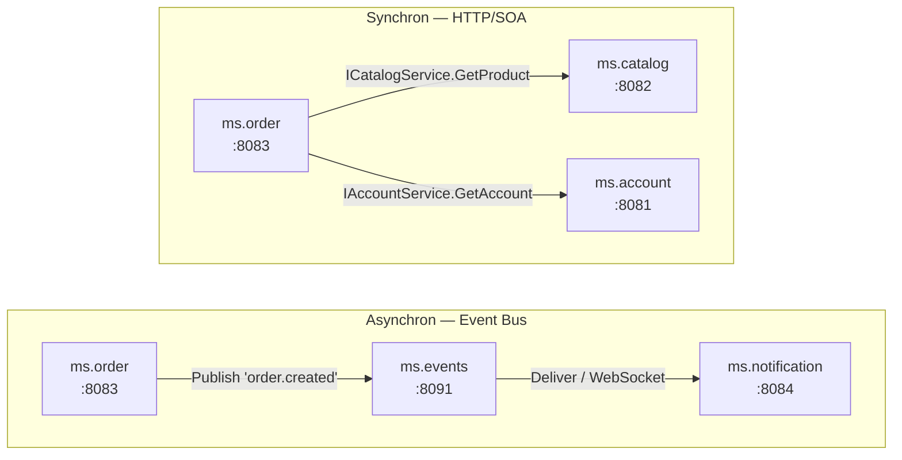

# 03 — Inter-Service-Kommunikation

## Zweck / Wann brauche ich das

Sobald ein Microservice Daten aus einem anderen Service benötigt oder Ereignisse
domänenübergreifend auslösen muss, braucht er eine definierte Kommunikationsstrategie.
Dieser Leitfaden zeigt, wann synchrone REST-Calls (Service ruft Service direkt via
`TRestHttpClient`) und wann asynchrone Event-Bus-Nachrichten (fire-and-forget via ms.events)
die richtige Wahl sind — und wie beide Muster in mORMot2 korrekt implementiert werden.

---

## Kernkonzept

Zwei grundlegende Muster decken den Großteil der Anforderungen ab:

- **Synchron** — ms.order ruft ms.catalog auf und wartet auf die Antwort. Geeignet, wenn
  der Aufrufer das Ergebnis sofort für seine Antwort benötigt (z. B. Produktdaten beim
  Anlegen einer Bestellung). Der Client hält eine dauerhafte `TRestHttpClient`-Instanz und
  löst Methoden über die transparente mORMot2-SOA-Brücke aus.

- **Asynchron** — ms.order publiziert ein Ereignis (`order.created`) an ms.events und kehrt
  sofort zurück. ms.notification (und beliebig viele weitere Consumer) holen das Ereignis
  zu einem eigenen Zeitpunkt ab. Geeignet für lose gekoppelte Reaktionsketten, bei denen
  der Produzent das Ergebnis nicht abwarten kann oder muss.



---

## Schritt für Schritt

### A — Synchroner Service-Call (ms.order → ms.catalog)

1. **Interface im aufrufenden Service deklarieren** — Das `ICatalogService`-Interface
   muss in einer gemeinsam genutzten Unit stehen (z. B. `shared\Interfaces.Catalog.pas`),
   damit beide Services es kennen. Der Client benötigt ausschließlich die Interface-Deklaration,
   keine Implementierung.

2. **Client im Konstruktor aufbauen** — `TRestHttpClient` ist teuer zu erzeugen; eine Instanz
   pro Server-Lifetime ist ausreichend (`sicShared`-Semantik auf der Client-Seite entspricht
   genau dem, was der Server bietet).

   ```pascal
   FCatalogClient := TRestHttpClient.Create('localhost', '8082', TOrmModel.Create([], MODEL_ROOT));
   FCatalogClient.Model.Owner := FCatalogClient;   // Model wird mit Client freigegeben
   FCatalogClient.ServiceRegister([TypeInfo(ICatalogService)], sicShared);
   (FCatalogClient.Services['ICatalogService'] as TServiceFactoryClient)
     .ResultAsJsonObjectWithoutResult := True;
   FCatalogClient.OnBeforeCall := ForwardCorrelationId;
   FCatalogClient.Services.Resolve(ICatalogService, FCatalog);
   ```

3. **Aufruf im Service-Code** — `FCatalog` verhält sich wie eine lokale Implementierung;
   mORMot2 serialisiert Aufruf und Antwort transparent über HTTP/JSON.

   ```pascal
   var ProductData := FCatalog.GetProduct(ProductId);
   ```

4. **Correlation-ID forwarden** — Im `OnBeforeCall`-Handler wird der aktuelle
   Correlation-ID-Threadvar-Wert als HTTP-Header in den ausgehenden Call eingebettet.
   Damit ist die gesamte Aufrufkette in ms.logs nachverfolgbar.

5. **Client im Destruktor freigeben** — `FreeAndNil(FCatalogClient)` genügt; das Model
   wird automatisch mitgefre­eit, weil `Model.Owner := FCatalogClient` gesetzt wurde.

---

### B — Asynchrones Event-Publizieren (ms.order → ms.events)

1. **`TEventPublisher` im Server-Feld halten** — Der Publisher kapselt den HTTP-Call an
   ms.events und stellt eine typsichere `Publish`-Methode bereit.

2. **Event nach dem Erzeugen der Ressource publishen** — Der Call kehrt sofort zurück;
   ms.events persistiert das Ereignis in seiner Outbox.

   ```pascal
   FEvents.Publish('order.created', FormatUtf8('{"orderId":%}', [NewOrderId]));
   ```

3. **Keine Fehlerbehandlung im Hot-Path** — `Publish` ist fire-and-forget. Fehler des
   Event-Bus (z. B. ms.events nicht erreichbar) werden geloggt, dürfen aber die
   primäre Service-Antwort nicht blockieren.

---

### C — Asynchrones Event-Konsumieren (ms.notification ← ms.events)

1. **Consumer-Cursor anlegen** — Beim ersten Start registriert ms.notification seinen
   Cursor bei ms.events (`POST /api/consumers`). Der Cursor-Name ist stabil und eindeutig
   je Consumer (z. B. `'notification-service'`).

2. **Events abrufen** — Entweder per Poll (`GET /api/events?consumer=...&limit=50`) oder
   über einen WebSocket-Callback (ms.events pushes neue Ereignisse; siehe
   [06-websocket-callbacks.md](06-websocket-callbacks.md)).

3. **Verarbeiten und Acknowledge** — Nach erfolgreicher Verarbeitung ruft der Consumer
   `POST /api/consumers/{name}/ack` mit der letzten verarbeiteten Event-ID auf. Der Cursor
   rückt vor; nach einem Neustart beginnt ms.notification ab dem letzten Checkpoint.

4. **Idempotenz sicherstellen** — Netzwerkprobleme können dazu führen, dass ein Ereignis
   mehrfach geliefert wird. Consumer müssen bereits verarbeitete Event-IDs erkennen und
   doppelte Verarbeitung stillschweigend überspringen.

---

## Code-Skelett

### Shared — Interface-Deklarationen

```pascal
/// <summary>
///   Gemeinsame Service-Interfaces für ms.catalog, ms.account und ms.order.
///   Dieses Unit wird von allen beteiligten Services referenziert.
/// </summary>
unit Shared.Interfaces;

{$SCOPEDENUMS ON}

{$WARN SYMBOL_PLATFORM OFF}
{$WARN UNIT_PLATFORM   OFF}

interface

uses
  mormot.core.base,
  mormot.soa.core;

type

  /// <summary>
  ///   Produkt-DTO: schlanke Transferstruktur für ms.catalog → ms.order.
  /// </summary>
  TProductDto = record
  public
    /// <summary>
    ///   Eindeutige Produkt-ID.
    /// </summary>
    Id: Int64;

    /// <summary>
    ///   Produktbezeichnung.
    /// </summary>
    Name: RawUtf8;

    /// <summary>
    ///   Aktueller Listenpreis in Cent (Integer, kein Float).
    /// </summary>
    PriceCents: Integer;

    /// <summary>
    ///   Erstellt einen leeren <c>TProductDto</c>-Wert.
    /// </summary>
    /// <returns>
    ///   Neuen, null-initialisierten <c>TProductDto</c>.
    /// </returns>
    class function Create: TProductDto; static; inline;
  end;

  /// <summary>
  ///   Account-DTO: schlanke Transferstruktur für ms.account → ms.order.
  /// </summary>
  TAccountDto = record
  public
    /// <summary>
    ///   Eindeutige Account-ID.
    /// </summary>
    Id: Int64;

    /// <summary>
    ///   Anzeigename des Account-Inhabers.
    /// </summary>
    DisplayName: RawUtf8;

    /// <summary>
    ///   Gibt an, ob der Account aktiv ist.
    /// </summary>
    Active: Boolean;

    /// <summary>
    ///   Erstellt einen leeren <c>TAccountDto</c>-Wert.
    /// </summary>
    /// <returns>
    ///   Neuen, null-initialisierten <c>TAccountDto</c>.
    /// </returns>
    class function Create: TAccountDto; static; inline;
  end;

  /// <summary>
  ///   SOA-Interface für ms.catalog. Wird von ms.order als Client verwendet.
  /// </summary>
  ICatalogService = interface(IInvokable)
    ['{A1B2C3D4-E5F6-7890-ABCD-EF1234567890}']

    /// <summary>
    ///   Liefert Produktdaten anhand der ID.
    /// </summary>
    /// <param name="aProductId">
    ///   Eindeutige Produkt-ID.
    /// </param>
    /// <returns>
    ///   <c>TProductDto</c> mit den Produktdaten; leerer Record wenn nicht gefunden.
    /// </returns>
    function GetProduct(
      aProductId: Int64
      ): TProductDto;
  end;

  /// <summary>
  ///   SOA-Interface für ms.account. Wird von ms.order als Client verwendet.
  /// </summary>
  IAccountService = interface(IInvokable)
    ['{B2C3D4E5-F6A7-8901-BCDE-F12345678901}']

    /// <summary>
    ///   Liefert Account-Daten anhand der ID.
    /// </summary>
    /// <param name="aAccountId">
    ///   Eindeutige Account-ID.
    /// </param>
    /// <returns>
    ///   <c>TAccountDto</c> mit den Account-Daten; leerer Record wenn nicht gefunden.
    /// </returns>
    function GetAccount(
      aAccountId: Int64
      ): TAccountDto;
  end;

implementation

class function TProductDto.Create: TProductDto;
begin
  FillCharFast(Result, SizeOf(Result), 0);
end;

class function TAccountDto.Create: TAccountDto;
begin
  FillCharFast(Result, SizeOf(Result), 0);
end;

end.
```

---

### ConnectToBackend-Hilfsfunktion (Gateway-Muster, überall anwendbar)

```pascal
/// <summary>
///   Baut einen wiederverwendbaren <c>TRestHttpClient</c> zu einem Backend-Service auf.
///   Das zurückgegebene Objekt hält eine permanente Verbindung; der Aufrufer ist
///   für die Freigabe verantwortlich.
/// </summary>
/// <param name="aHost">
///   Hostname oder IP-Adresse des Ziel-Services (z. B. <c>'localhost'</c>).
/// </param>
/// <param name="aPort">
///   TCP-Port des Ziel-Services als String (z. B. <c>'8082'</c>).
/// </param>
/// <param name="aInterfaces">
///   Array von <c>PRttiInfo</c>-Zeigern der zu registrierenden SOA-Interfaces.
///   Übergabe: <c>[TypeInfo(ICatalogService), TypeInfo(IAccountService)]</c>.
/// </param>
/// <returns>
///   Vollständig konfigurierter <c>TRestHttpClient</c> mit gesetztem
///   <c>Model.Owner</c> und aktiviertem <c>ResultAsJsonObjectWithoutResult</c>.
/// </returns>
function ConnectToBackend(
  const aHost: RawUtf8;
  const aPort: RawUtf8;
  const aInterfaces: array of PRttiInfo
  ): TRestHttpClient;
var
  ClientModel: TOrmModel;
  CurrentInterfaceIdx: Integer;
  CurrentFactory: TServiceFactoryClient;
begin
  ClientModel := TOrmModel.Create([], MODEL_ROOT);
  Result := TRestHttpClient.Create(aHost, aPort, ClientModel);
  // Model wird automatisch mit dem Client freigegeben
  Result.Model.Owner := Result;
  Result.ServiceRegister(aInterfaces, sicShared);
  // ResultAsJsonObjectWithoutResult muss auf JEDEM Factory-Client gesetzt werden,
  // da es sonst zu JSON-Parse-Fehlern kommt (Server gibt Objekt, Client erwartet Array)
  for CurrentInterfaceIdx := 0 to High(aInterfaces) do
  begin
    CurrentFactory := Result.Services[aInterfaces[CurrentInterfaceIdx]^.Name]
      as TServiceFactoryClient;
    if CurrentFactory <> nil then
    begin
      CurrentFactory.ResultAsJsonObjectWithoutResult := True;
    end;
  end;
end;
```

---

### ms.order — Server mit synchronen Upstream-Clients

```pascal
/// <summary>
///   Implementierung von ms.order (Port 8083). Hält permanente SOA-Clients
///   zu ms.catalog (Port 8082) und ms.account (Port 8081).
/// </summary>
unit Order.Server;

{$SCOPEDENUMS ON}

{$WARN SYMBOL_PLATFORM OFF}
{$WARN UNIT_PLATFORM   OFF}

interface

uses
  mormot.core.base,
  mormot.core.log,
  mormot.db.raw.sqlite3,
  mormot.orm.core,
  mormot.rest.client,
  mormot.rest.http.client,
  mormot.rest.http.server,
  mormot.rest.server,
  mormot.soa.core,
  mormot.soa.server,
  Shared.Interfaces;

const
  /// <summary>
  ///   Modell-Root-Pfad für alle mORMot2-REST-Services in diesem Projekt.
  /// </summary>
  MODEL_ROOT = 'api';

type

  /// <summary>
  ///   TOrderServer kapselt den gesamten Lebenszyklus von ms.order:
  ///   SQLite-DB, SOA-Server, HTTP-Listener und ausgehende SOA-Clients.
  /// </summary>
  TOrderServer = class
  strict private
    /// <summary>
    ///   HTTP-Server-Instanz, die auf Port 8083 lauscht.
    /// </summary>
    FHttpServer: TRestHttpServer;

    /// <summary>
    ///   REST/ORM-Server-Instanz mit SQLite-Backend.
    /// </summary>
    FRestServer: TRestServerDB;

    /// <summary>
    ///   SOA-Client zu ms.catalog (Port 8082).
    /// </summary>
    FCatalogClient: TRestHttpClient;

    /// <summary>
    ///   SOA-Client zu ms.account (Port 8081).
    /// </summary>
    FAccountClient: TRestHttpClient;

    /// <summary>
    ///   Aufgelöste Catalog-Service-Schnittstelle.
    /// </summary>
    FCatalog: ICatalogService;

    /// <summary>
    ///   Aufgelöste Account-Service-Schnittstelle.
    /// </summary>
    FAccount: IAccountService;

    /// <summary>
    ///   Baut den SOA-Client zu ms.catalog auf und löst das Interface auf.
    /// </summary>
    procedure InitCatalogClient;

    /// <summary>
    ///   Baut den SOA-Client zu ms.account auf und löst das Interface auf.
    /// </summary>
    procedure InitAccountClient;

    /// <summary>
    ///   <c>OnBeforeCall</c>-Handler: fügt den aktuellen Correlation-ID-Wert
    ///   als HTTP-Header in alle ausgehenden SOA-Calls ein.
    /// </summary>
    /// <param name="aSender">
    ///   Der aufrufende <c>TRestClientUri</c>.
    /// </param>
    /// <param name="aCall">
    ///   Referenz auf die URI-Parameter des ausgehenden Calls.
    /// </param>
    procedure ForwardCorrelationId(
      aSender: TRestClientUri;
      var aCall: TRestUriParams
      );

  public
    /// <summary>
    ///   Erstellt und startet den Order-Server.
    /// </summary>
    constructor Create;

    /// <summary>
    ///   Hält den Server an und gibt alle Ressourcen frei.
    /// </summary>
    destructor Destroy; override;
  end;

implementation

uses
  mormot.core.unicode,
  Order.Correlation;   // GetCorrelationId-Threadvar

constructor TOrderServer.Create;
var
  ServerModel: TOrmModel;
begin
  inherited Create;
  ServerModel := TOrmModel.Create([], MODEL_ROOT);
  FRestServer := TRestServerDB.Create(ServerModel, 'order.db');
  FRestServer.Model.Owner := FRestServer;
  FHttpServer := TRestHttpServer.Create('8083', FRestServer);
  InitCatalogClient;
  InitAccountClient;
  TSynLog.Add.Log(sllInfo, 'ms.order started on port 8083', self);
end;

destructor TOrderServer.Destroy;
begin
  FreeAndNil(FHttpServer);
  FreeAndNil(FRestServer);
  // Clients zuletzt freigeben — Interfaces (FCatalog, FAccount) müssen zuerst nil sein
  FCatalog := nil;
  FAccount := nil;
  FreeAndNil(FCatalogClient);
  FreeAndNil(FAccountClient);
  inherited Destroy;
end;

procedure TOrderServer.ForwardCorrelationId(
  aSender: TRestClientUri;
  var aCall: TRestUriParams
  );
begin
  aCall.InHead := aCall.InHead + #13#10 + 'X-Correlation-ID: ' + GetCorrelationId;
end;

procedure TOrderServer.InitAccountClient;
begin
  FAccountClient := ConnectToBackend('localhost', '8081', [TypeInfo(IAccountService)]);
  FAccountClient.OnBeforeCall := ForwardCorrelationId;
  if not FAccountClient.Services.Resolve(IAccountService, FAccount) then
  begin
    TSynLog.Add.Log(sllWarning, 'ms.account nicht erreichbar — FAccount bleibt nil', self);
  end;
end;

procedure TOrderServer.InitCatalogClient;
begin
  FCatalogClient := ConnectToBackend('localhost', '8082', [TypeInfo(ICatalogService)]);
  FCatalogClient.OnBeforeCall := ForwardCorrelationId;
  if not FCatalogClient.Services.Resolve(ICatalogService, FCatalog) then
  begin
    TSynLog.Add.Log(sllWarning, 'ms.catalog nicht erreichbar — FCatalog bleibt nil', self);
  end;
end;

end.
```

---

### ms.order — Bestellung anlegen (synchron + asynchron kombiniert)

```pascal
/// <summary>
///   Implementierung von IOrderService.CreateOrder.
///   Holt Produkt- und Account-Daten synchron; publiziert danach asynchron ein Ereignis.
/// </summary>
/// <param name="aAccountId">
///   ID des bestellenden Accounts.
/// </param>
/// <param name="aProductId">
///   ID des bestellten Produkts.
/// </param>
/// <returns>
///   ID der neu angelegten Bestellung; 0 bei Fehler.
/// </returns>
function TOrderServiceServer.CreateOrder(
  aAccountId: Int64;
  aProductId: Int64
  ): Int64;
var
  Account: TAccountDto;
  Product: TProductDto;
  NewOrderId: Int64;
begin
  Result := 0;
  // Synchrone Upstream-Calls — blockieren den aufrufenden Thread bis zur Antwort
  Account := FAccount.GetAccount(aAccountId);
  if not Account.Active then
  begin
    TSynLog.Add.Log(sllWarning, 'CreateOrder: Account % nicht aktiv', [aAccountId], self);
    Exit(0);
  end;
  Product := FCatalog.GetProduct(aProductId);
  if Product.Id = 0 then
  begin
    TSynLog.Add.Log(sllWarning, 'CreateOrder: Produkt % nicht gefunden', [aProductId], self);
    Exit(0);
  end;
  // Bestellung in der lokalen SQLite-DB anlegen
  NewOrderId := PersistOrder(aAccountId, aProductId, Product.PriceCents);
  // Asynchrones Event publishen — fire-and-forget, blockiert nicht
  FEvents.Publish('order.created',
    FormatUtf8('{"orderId":%,"accountId":%,"productId":%}', [NewOrderId, aAccountId, aProductId]));
  TSynLog.Add.Log(sllInfo, 'Order % created for account % product %',
    [NewOrderId, aAccountId, aProductId], self);
  Result := NewOrderId;
end;
```

---

### TEventPublisher — Fire-and-Forget-Helper

```pascal
/// <summary>
///   Schlanker Publisher, der Ereignisse per HTTP-POST an ms.events sendet.
///   Alle Methoden sind fire-and-forget; Fehler werden nur geloggt.
/// </summary>
TEventPublisher = class
strict private
  /// <summary>
  ///   HTTP-Client zur ms.events-Outbox-API.
  /// </summary>
  FEventsClient: TRestHttpClient;

  /// <summary>
  ///   Name des produzierenden Services (erscheint im Event-Header).
  /// </summary>
  FProducerName: RawUtf8;

public
  /// <summary>
  ///   Erstellt einen neuen Publisher und verbindet ihn mit ms.events.
  /// </summary>
  /// <param name="aEventsHost">
  ///   Hostname von ms.events (z. B. <c>'localhost'</c>).
  /// </param>
  /// <param name="aEventsPort">
  ///   Port von ms.events (z. B. <c>'8091'</c>).
  /// </param>
  /// <param name="aProducerName">
  ///   Eindeutiger Name des produzierenden Services.
  /// </param>
  constructor Create(
    const aEventsHost: RawUtf8;
    const aEventsPort: RawUtf8;
    const aProducerName: RawUtf8
    );

  /// <summary>
  ///   Gibt den HTTP-Client frei.
  /// </summary>
  destructor Destroy; override;

  /// <summary>
  ///   Publiziert ein Ereignis in die ms.events-Outbox.
  ///   Kehrt sofort zurück; Fehler werden geloggt, nicht geworfen.
  /// </summary>
  /// <param name="aEventType">
  ///   Ereignistyp als dotted-string (z. B. <c>'order.created'</c>).
  /// </param>
  /// <param name="aPayload">
  ///   JSON-Payload des Ereignisses.
  /// </param>
  procedure Publish(
    const aEventType: RawUtf8;
    const aPayload: RawUtf8
    );
end;

constructor TEventPublisher.Create(
  const aEventsHost: RawUtf8;
  const aEventsPort: RawUtf8;
  const aProducerName: RawUtf8
  );
var
  EventsModel: TOrmModel;
begin
  inherited Create;
  FProducerName := aProducerName;
  EventsModel := TOrmModel.Create([], MODEL_ROOT);
  FEventsClient := TRestHttpClient.Create(aEventsHost, aEventsPort, EventsModel);
  FEventsClient.Model.Owner := FEventsClient;
end;

destructor TEventPublisher.Destroy;
begin
  FreeAndNil(FEventsClient);
  inherited Destroy;
end;

procedure TEventPublisher.Publish(
  const aEventType: RawUtf8;
  const aPayload: RawUtf8
  );
var
  RequestBody: RawUtf8;
  ResponseStatus: Integer;
  ResponseBody: RawUtf8;
begin
  RequestBody := FormatUtf8('{"type":"%","producer":"%","payload":%}',
    [aEventType, FProducerName, aPayload]);
  ResponseStatus := FEventsClient.URI(
    FormatUtf8('%/events', [MODEL_ROOT]), 'POST', @ResponseBody, nil, @RequestBody);
  if ResponseStatus <> HTTP_SUCCESS then
  begin
    TSynLog.Add.Log(sllWarning,
      'EventPublisher.Publish failed: type=% status=%', [aEventType, ResponseStatus], self);
  end;
end;
```

---

### ms.notification — Event-Consumer mit Cursor

```pascal
/// <summary>
///   Implementierung von ms.notification (Port 8084).
///   Registriert einen dauerhaften Cursor bei ms.events und verarbeitet
///   eingehende <c>order.created</c>-Ereignisse.
/// </summary>
unit Notification.Consumer;

{$SCOPEDENUMS ON}

{$WARN SYMBOL_PLATFORM OFF}
{$WARN UNIT_PLATFORM   OFF}

interface

uses
  mormot.core.base,
  mormot.core.log,
  mormot.rest.http.client;

const
  /// <summary>
  ///   Stabiler, eindeutiger Consumer-Name für ms.notification.
  ///   Überlebt Neustarts — der Cursor bei ms.events wird anhand dieses
  ///   Namens wiederhergestellt.
  /// </summary>
  CONSUMER_NAME = 'notification-service';

type

  /// <summary>
  ///   Kapselt die Consumer-Logik: Cursor-Registrierung, Event-Polling
  ///   und Acknowledge-Zyklus.
  /// </summary>
  TNotificationConsumer = class
  strict private
    /// <summary>
    ///   HTTP-Client zu ms.events (:8091).
    /// </summary>
    FEventsClient: TRestHttpClient;

    /// <summary>
    ///   Letztes bestätigtes Event als Checkpoint für den nächsten Poll-Zyklus.
    /// </summary>
    FLastAckedEventId: Int64;

    /// <summary>
    ///   Registriert oder reaktiviert den Consumer-Cursor bei ms.events.
    /// </summary>
    procedure RegisterCursor;

    /// <summary>
    ///   Verarbeitet eine einzelne Event-JSON-Zeile.
    /// </summary>
    /// <param name="aEventJson">
    ///   Vollständiges JSON-Objekt eines Events.
    /// </param>
    /// <param name="aEventId">
    ///   ID des Events; wird nach Verarbeitung für Acknowledge verwendet.
    /// </param>
    procedure ProcessEvent(
      const aEventJson: RawUtf8;
      aEventId: Int64
      );

    /// <summary>
    ///   Bestätigt die Verarbeitung bis zur angegebenen Event-ID.
    /// </summary>
    /// <param name="aUpToEventId">
    ///   ID des zuletzt erfolgreich verarbeiteten Events.
    /// </param>
    procedure AcknowledgeUpTo(
      aUpToEventId: Int64
      );

  public
    /// <summary>
    ///   Erstellt den Consumer und registriert den Cursor bei ms.events.
    /// </summary>
    constructor Create;

    /// <summary>
    ///   Gibt alle Ressourcen frei.
    /// </summary>
    destructor Destroy; override;

    /// <summary>
    ///   Führt einen einzelnen Poll-Zyklus durch: holt bis zu 50 Events,
    ///   verarbeitet und bestätigt sie.
    /// </summary>
    procedure PollAndProcess;
  end;

implementation

uses
  mormot.core.json,
  mormot.core.unicode;

constructor TNotificationConsumer.Create;
var
  EventsModel: TOrmModel;
begin
  inherited Create;
  FLastAckedEventId := 0;
  EventsModel := TOrmModel.Create([], MODEL_ROOT);
  FEventsClient := TRestHttpClient.Create('localhost', '8091', EventsModel);
  FEventsClient.Model.Owner := FEventsClient;
  RegisterCursor;
end;

destructor TNotificationConsumer.Destroy;
begin
  FreeAndNil(FEventsClient);
  inherited Destroy;
end;

procedure TNotificationConsumer.AcknowledgeUpTo(
  aUpToEventId: Int64
  );
var
  AckBody: RawUtf8;
  AckStatus: Integer;
begin
  AckBody := FormatUtf8('{"lastEventId":%}', [aUpToEventId]);
  AckStatus := FEventsClient.URI(
    FormatUtf8('%/consumers/%/ack', [MODEL_ROOT, CONSUMER_NAME]),
    'POST', nil, nil, @AckBody);
  if AckStatus = HTTP_SUCCESS then
  begin
    FLastAckedEventId := aUpToEventId;
  end
  else
  begin
    TSynLog.Add.Log(sllWarning,
      'Consumer ack failed: upTo=% status=%', [aUpToEventId, AckStatus], self);
  end;
end;

procedure TNotificationConsumer.PollAndProcess;
var
  ResponseBody: RawUtf8;
  PollStatus: Integer;
  EventArray: TDocVariantData;
  CurrentEventIdx: Integer;
  CurrentEvent: PDocVariantData;
  CurrentEventId: Int64;
  HighestProcessedId: Int64;
begin
  PollStatus := FEventsClient.URI(
    FormatUtf8('%/events?consumer=%&limit=50', [MODEL_ROOT, CONSUMER_NAME]),
    'GET', @ResponseBody, nil, nil);
  if PollStatus <> HTTP_SUCCESS then
  begin
    TSynLog.Add.Log(sllWarning, 'Consumer poll failed: status=%', [PollStatus], self);
    Exit;
  end;
  if not EventArray.InitJson(ResponseBody, JSON_FAST) then
  begin
    Exit;
  end;
  HighestProcessedId := 0;
  for CurrentEventIdx := 0 to EventArray.Count - 1 do
  begin
    CurrentEvent := _Safe(EventArray.Values[CurrentEventIdx]);
    CurrentEventId := CurrentEvent^.I['id'];
    // Idempotenz-Guard: bereits bestätigte Events überspringen
    if CurrentEventId <= FLastAckedEventId then
    begin
      continue;
    end;
    ProcessEvent(CurrentEvent^.ToJson, CurrentEventId);
    if CurrentEventId > HighestProcessedId then
    begin
      HighestProcessedId := CurrentEventId;
    end;
  end;
  if HighestProcessedId > 0 then
  begin
    AcknowledgeUpTo(HighestProcessedId);
  end;
end;

procedure TNotificationConsumer.ProcessEvent(
  const aEventJson: RawUtf8;
  aEventId: Int64
  );
var
  EventDoc: TDocVariantData;
  EventType: RawUtf8;
begin
  if not EventDoc.InitJson(aEventJson, JSON_FAST) then
  begin
    TSynLog.Add.Log(sllWarning, 'ProcessEvent: ungültiges JSON id=%', [aEventId], self);
    Exit;
  end;
  EventType := EventDoc.U['type'];
  TSynLog.Add.Log(sllInfo, 'ProcessEvent: id=% type=%', [aEventId, EventType], self);
  if EventType = 'order.created' then
  begin
    // Domänenlogik: Benachrichtigung für neue Bestellung auslösen
    HandleOrderCreated(EventDoc.U['payload']);
  end;
end;

procedure TNotificationConsumer.RegisterCursor;
var
  RegBody: RawUtf8;
  RegStatus: Integer;
begin
  RegBody := FormatUtf8('{"name":"%"}', [CONSUMER_NAME]);
  RegStatus := FEventsClient.URI(
    FormatUtf8('%/consumers', [MODEL_ROOT]), 'POST', nil, nil, @RegBody);
  // HTTP 409 Conflict = Cursor existiert bereits — kein Fehler
  if (RegStatus <> HTTP_SUCCESS) and (RegStatus <> HTTP_CONFLICT) then
  begin
    TSynLog.Add.Log(sllWarning,
      'Consumer-Registrierung fehlgeschlagen: status=%', [RegStatus], self);
  end;
end;

end.
```

---

## Stolperfallen / Lessons

**`ResultAsJsonObjectWithoutResult` muss auf Server UND Client gesetzt sein.**
Wenn der Server `TServiceFactoryServer.ResultAsJsonObjectWithoutResult := True` setzt, der
Client dies aber nicht spiegelt, erwartet der Client eine Array-Antwort und wirft einen
JSON-Parse-Fehler. Beide Seiten müssen konsistent konfiguriert sein.

**`TOrmModel` für den Client immer leer anlegen.**
`TOrmModel.Create([], MODEL_ROOT)` erzeugt ein Modell ohne ORM-Tabellen. Das ist korrekt
für reine SOA-Clients. Tabellen-Klassen des Ziel-Services im Client-Modell zu registrieren
führt zu unnötigem Schema-Overhead und ist fehleranfällig.

**`Model.Owner := Client` nicht vergessen.**
Ohne diese Zuweisung muss das Modell separat freigegeben werden. Mit `Model.Owner := Client`
wird das Modell automatisch beim Freigeben des Clients zerstört — kein separates
`FreeAndNil(Model)` nötig.

**`sicShared` ist die richtige Lifetime-Strategie für zustandslose Backend-Services.**
Eine Instanz pro Server-Lifetime. Zustandsbehaftete Operationen (z. B. User-Session-Daten)
gehören in die Datenbank, nicht in die Service-Instanz.

**Client im Konstruktor aufbauen, nicht pro Aufruf.**
`TRestHttpClient.Create` ist teuer (TCP-Verbindung, TLS-Handshake, mORMot2-Introspektion).
Eine Instanz für die gesamte Server-Lifetime ist der Standard; per-Call-Erzeugung würde
unter Last schnell zum Bottleneck.

**Synchrone Calls blockieren den aufrufenden Thread — Timeouts einplanen.**
Wenn ms.catalog unter Last steht oder nicht erreichbar ist, blockiert `FCatalog.GetProduct`
den SOA-Thread von ms.order. Ein Circuit Breaker (siehe
[.claude/circuit-breaker.md](../.claude/circuit-breaker.md)) vor dem Client-Call verhindert
Kaskadenausfälle.

**Für lose gekoppelte Kaskaden den Event-Bus bevorzugen.**
Direkte synchrone Calls zwischen Services erzeugen strukturelle Kopplung. Wenn ms.order
ms.notification direkt aufrufen würde, wäre ms.notification ein harter Abhängigkeitspunkt.
Über den Event-Bus kann ms.notification hinzugefügt, entfernt oder ersetzt werden, ohne
ms.order zu ändern.

**Correlation-ID in alle ausgehenden Calls forwarden.**
Ohne Weitergabe der `X-Correlation-ID` endet die Tracing-Kette an der ersten
Service-Grenze. `OnBeforeCall` auf jedem Client setzt den aktuellen Threadvar-Wert.
ms.logs kann dann alle Logs eines End-to-End-Requests über die Correlation-ID bündeln.

**Consumer-Idempotenz ist nicht optional.**
At-least-once-Delivery ist die Standardgarantie des Event-Bus. Network-Timeouts beim Ack
können dazu führen, dass ms.events dasselbe Event nochmals liefert. Consumer müssen
bereits verarbeitete Event-IDs erkennen und stillschweigend überspringen.

---

## Querverweise

- [02-service-erstellen.md](02-service-erstellen.md) — Wie ein neuer Service aufgesetzt wird
  (SQLite-DB, HTTP-Server, SOA-Registrierung)
- [04-web-gateway.md](04-web-gateway.md) — Gateway-Proxying und `ConnectToBackend`-Pattern
  im Gateway-Kontext
- [06-websocket-callbacks.md](06-websocket-callbacks.md) — WebSocket-Push-Variante des
  Event-Konsumierens statt Polling
- [09-event-bus.md](09-event-bus.md) — Vollständige Event-Bus-Referenz: Outbox-Schema,
  Consumer-Cursor, Replay, Shutdown-Disziplin
