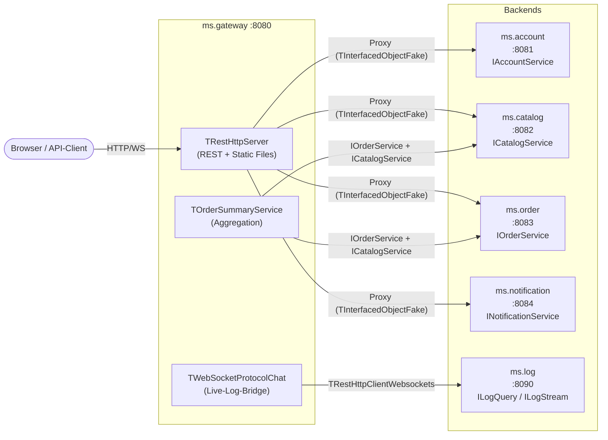

# 04 — Web-Gateway

## Zweck / Wann brauche ich das

Das Web-Gateway ist der einzige öffentlich erreichbare Einstiegspunkt in das Microservice-System.
Es empfängt HTTP-Requests vom Browser oder API-Client, leitet sie an die zuständigen Backend-Services
weiter und aggregiert bei Bedarf Antworten aus mehreren Services — ohne selbst Geschäftslogik oder eine
eigene Datenbank zu besitzen. Dieses Kapitel zeigt, wie das Gateway als transparenter Proxy aufgebaut
wird, wie Aggregations-Services mehrere Backends kombinieren und wie Browser-WebSocket-Streams
(Live-Logs) über das Gateway geroutet werden.

## Kernkonzept

Das Gateway registriert **keine eigene Datenbank** und besitzt **keinen ORM-Daten-Layer**. Es verbindet
sich beim Start mit jedem Backend-Service via `TRestHttpClient`, löst die Service-Interfaces via
`Services.Resolve` auf und re-registriert die resultierenden `TInterfacedObjectFake`-Objekte auf dem
eigenen REST-Server. Eingehende Client-Calls werden so transparent an das richtige Backend
durchgeleitet — das Gateway ist ein HTTP-Proxy auf Interface-Ebene.



### Transparenter Proxy vs. Aggregation

| Muster | Einsatz | Gateway-Code |
|--------|---------|--------------|
| Transparenter Proxy | 1 Interface → 1 Backend | `ObjectFromInterface(FAccount) as TInterfacedObject` |
| Aggregation | mehrere Backends → 1 neues Interface | echte Service-Klasse (`TOrderSummaryService`) |

### Correlation-ID-Propagation

Das Gateway weist jedem eingehenden Request eine `X-Correlation-Id` zu (neu generiert falls
abwesend) und leitet sie via `OnBeforeCall`-Hook an alle ausgehenden Backend-Calls weiter. Alle
Backend-Services tragen die ID im `threadvar` und schreiben sie als Präfix in jede Logzeile —
End-to-End-Tracing ohne Änderung der Backend-Logik.

## Schritt für Schritt

1. **Interfaces in `shared/` deklarieren** — `IAccountService`, `ICatalogService`, `IOrderService`,
   `INotificationService` als `IInvokable` mit `ResultAsJsonObjectWithoutResult = True` (sowohl
   auf Client- als auch auf Server-Factory). Aggregations-Interfaces (`IOrderSummaryService`) gehören
   ebenfalls in `shared/`.

2. **`TGatewayServer` ableiten** — erbt von `TMicroService`. Felder für jeden Backend-Client
   (`TRestHttpClient`) und jedes Interface deklarieren. `ms.log` bekommt einen
   `TRestHttpClientWebsockets`-Client (WS-Upgrade erforderlich).

3. **`CreateModel` überschreiben** — leeres Modell zurückgeben: `TOrmModel.Create([], MODEL_ROOT)`.
   Das Gateway hat keine ORM-Tabellen — Datenbank-Konsolidierung ist bewusst verboten.

4. **`ConnectToBackend` implementieren** — verbindet einen `TRestHttpClient` mit einem Backend,
   registriert alle Interfaces per `ServiceRegister` und setzt `ResultAsJsonObjectWithoutResult`
   auf jeder Client-Factory.

5. **`SetupServices` überschreiben** — ruft `ConnectToBackend` für jeden Backend-Service auf,
   löst Interfaces via `Services.Resolve` auf, re-registriert sie als Proxies. Aggregations-Services
   als echte Klassen anlegen und ebenfalls registrieren.

6. **Static-File-Serving einrichten** — `FOriginalHandler` sichern, eigenen `HandleRequest`-Wrapper
   einhaengen: `/api/*` geht an REST, alles andere an den Static-File-Handler.

7. **Log-WebSocket-Bridge aufbauen** — `TRestHttpClientWebsockets` für `ms.log` anlegen,
   `WebSocketsUpgrade` aufrufen, `ILogQuery` und `ILogStream` registrieren; Browser-seitige
   `TWebSocketProtocolChat` mit Custom-Name in `WsServer.WebSocketProtocols.Add` eintragen.

8. **Health-Endpoint registrieren** — `ServiceMethodRegister('health', HandleHealth, True, [mGET])`
   liefert Service-Name, Uptime, Version und Connectivity-Status jedes Backends.

9. **Entry-Point schreiben** — `TGatewayServer.Create('ms.gateway', '8080').Run`.

## Code-Skelett

### shared/ms.shared.interfaces.pas (Ausschnitt — Gateway-relevante Interfaces)

```pascal
type
  /// <summary>
  ///   Konto-Informationen als typisierter DTO.
  /// </summary>
  TAccountDto = record
  public
    Id: TID;
    Email: RawUtf8;
    DisplayName: RawUtf8;

    /// <summary>
    ///   Erstellt einen <c>TAccountDto</c> mit den übergebenen Feldern.
    /// </summary>
    /// <param name="aId">
    ///   Eindeutiger Bezeichner des Kontos.
    /// </param>
    /// <param name="aEmail">
    ///   E-Mail-Adresse des Kontos.
    /// </param>
    /// <param name="aDisplayName">
    ///   Anzeigename des Nutzers.
    /// </param>
    /// <returns>
    ///   Neuer <c>TAccountDto</c> mit den übergebenen Werten.
    /// </returns>
    class function Create(
      aId: TID;
      const aEmail: RawUtf8;
      const aDisplayName: RawUtf8
      ): TAccountDto; static; inline;
  end;

  /// <summary>
  ///   Katalog-Eintrag als typisierter DTO.
  /// </summary>
  TCatalogItemDto = record
  public
    Id: TID;
    Name: RawUtf8;
    PriceCents: Int64;

    /// <summary>
    ///   Erstellt einen <c>TCatalogItemDto</c>.
    /// </summary>
    /// <param name="aId">
    ///   Eindeutiger Bezeichner des Katalog-Eintrags.
    /// </param>
    /// <param name="aName">
    ///   Bezeichnung des Artikels.
    /// </param>
    /// <param name="aPriceCents">
    ///   Preis in Cent (Integer, keine Fließkommaarithmetik).
    /// </param>
    /// <returns>
    ///   Neuer <c>TCatalogItemDto</c>.
    /// </returns>
    class function Create(
      aId: TID;
      const aName: RawUtf8;
      aPriceCents: Int64
      ): TCatalogItemDto; static; inline;
  end;

  /// <summary>
  ///   Aggregiertes Bestell-Übersichts-DTO aus Order- und Catalog-Daten.
  /// </summary>
  TOrderSummaryDto = record
  public
    OrderId: TID;
    AccountId: TID;
    ItemName: RawUtf8;
    TotalCents: Int64;
    Status: RawUtf8;

    /// <summary>
    ///   Erstellt einen <c>TOrderSummaryDto</c>.
    /// </summary>
    /// <param name="aOrderId">
    ///   Bestell-ID.
    /// </param>
    /// <param name="aAccountId">
    ///   Zugehörige Account-ID.
    /// </param>
    /// <param name="aItemName">
    ///   Artikelbezeichnung aus dem Katalog.
    /// </param>
    /// <param name="aTotalCents">
    ///   Gesamtbetrag in Cent.
    /// </param>
    /// <param name="aStatus">
    ///   Aktueller Bestell-Status.
    /// </param>
    /// <returns>
    ///   Neuer <c>TOrderSummaryDto</c>.
    /// </returns>
    class function Create(
      aOrderId, aAccountId: TID;
      const aItemName: RawUtf8;
      aTotalCents: Int64;
      const aStatus: RawUtf8
      ): TOrderSummaryDto; static; inline;
  end;

  /// <summary>
  ///   Account-Service-Interface: Nutzerverwaltung.
  /// </summary>
  IAccountService = interface(IInvokable)
    ['{A1000001-0000-4000-8000-000000000001}']

    /// <summary>
    ///   Liefert einen Account anhand seiner ID.
    /// </summary>
    /// <param name="aId">
    ///   Account-ID.
    /// </param>
    /// <returns>
    ///   <c>TAccountDto</c> des gefundenen Kontos; Id=0 wenn nicht vorhanden.
    /// </returns>
    function GetById(
      aId: TID
      ): TAccountDto;

    /// <summary>
    ///   Legt einen neuen Account an.
    /// </summary>
    /// <param name="aEmail">
    ///   E-Mail-Adresse des neuen Kontos (muss eindeutig sein).
    /// </param>
    /// <param name="aDisplayName">
    ///   Anzeigename des Nutzers.
    /// </param>
    /// <returns>
    ///   ID des neu angelegten Kontos, 0 bei Fehler.
    /// </returns>
    function Create(
      const aEmail, aDisplayName: RawUtf8
      ): TID;
  end;

  /// <summary>
  ///   Catalog-Service-Interface: Artikelverwaltung.
  /// </summary>
  ICatalogService = interface(IInvokable)
    ['{A1000002-0000-4000-8000-000000000002}']

    /// <summary>
    ///   Liefert einen Katalogeintrag anhand seiner ID.
    /// </summary>
    /// <param name="aId">
    ///   Artikel-ID.
    /// </param>
    /// <returns>
    ///   <c>TCatalogItemDto</c> des Artikels; Id=0 wenn nicht vorhanden.
    /// </returns>
    function GetById(
      aId: TID
      ): TCatalogItemDto;
  end;

  /// <summary>
  ///   Order-Service-Interface: Bestellverwaltung.
  /// </summary>
  IOrderService = interface(IInvokable)
    ['{A1000003-0000-4000-8000-000000000003}']

    /// <summary>
    ///   Legt eine neue Bestellung an.
    /// </summary>
    /// <param name="aAccountId">
    ///   Account-ID des Bestellers.
    /// </param>
    /// <param name="aCatalogItemId">
    ///   Zu bestellender Artikel aus dem Katalog.
    /// </param>
    /// <returns>
    ///   Bestell-ID, 0 bei Fehler.
    /// </returns>
    function PlaceOrder(
      aAccountId, aCatalogItemId: TID
      ): TID;

    /// <summary>
    ///   Liefert Bestell-ID, Account-ID, Artikel-ID und Status einer Bestellung.
    /// </summary>
    /// <param name="aOrderId">
    ///   Bestell-ID.
    /// </param>
    /// <param name="aAccountId">
    ///   Enthält die zugehörige Account-ID bei Erfolg.
    /// </param>
    /// <param name="aCatalogItemId">
    ///   Enthält die bestellte Artikel-ID bei Erfolg.
    /// </param>
    /// <param name="aStatus">
    ///   Enthält den aktuellen Bestell-Status bei Erfolg.
    /// </param>
    /// <returns>
    ///   True wenn die Bestellung gefunden wurde.
    /// </returns>
    function GetOrder(
      aOrderId: TID;
      out aAccountId, aCatalogItemId: TID;
      out aStatus: RawUtf8
      ): Boolean;
  end;

  /// <summary>
  ///   Notification-Service-Interface: Versand von Nutzer-Benachrichtigungen.
  /// </summary>
  INotificationService = interface(IInvokable)
    ['{A1000004-0000-4000-8000-000000000004}']

    /// <summary>
    ///   Sendet eine Benachrichtigung an einen Nutzer.
    /// </summary>
    /// <param name="aAccountId">
    ///   Empfänger-Account-ID.
    /// </param>
    /// <param name="aMessage">
    ///   Nachrichtentext.
    /// </param>
    procedure Notify(
      aAccountId: TID;
      const aMessage: RawUtf8
      );
  end;

  /// <summary>
  ///   Aggregiertes Interface: kombiniert Order- und Catalog-Daten für den Client.
  /// </summary>
  IOrderSummaryService = interface(IInvokable)
    ['{A1000005-0000-4000-8000-000000000005}']

    /// <summary>
    ///   Liefert eine vollständige Bestell-Übersicht aus Order- und Catalog-Daten.
    /// </summary>
    /// <param name="aOrderId">
    ///   Bestell-ID.
    /// </param>
    /// <returns>
    ///   <c>TOrderSummaryDto</c> mit aggregierten Daten; OrderId=0 wenn nicht vorhanden.
    /// </returns>
    function GetSummary(
      aOrderId: TID
      ): TOrderSummaryDto;
  end;
```

### ms.gateway/ms.gateway.server.pas — Klassen-Deklaration

```pascal
/// <summary>
///   Web-Gateway: transparenter HTTP-Proxy und Aggregations-Layer für alle Backend-Services.
///   Keine eigene Datenbank; leitet Requests an ms.account, ms.catalog, ms.order,
///   ms.notification und ms.log weiter.
/// </summary>
unit ms.gateway.server;

{$SCOPEDENUMS ON}
{$WARN SYMBOL_PLATFORM OFF}
{$WARN UNIT_PLATFORM   OFF}

interface

uses
  mormot.core.base,
  mormot.core.log,
  mormot.core.text,
  mormot.core.unicode,
  mormot.net.client,
  mormot.net.ws.client,
  mormot.orm.core,
  mormot.rest.client,
  mormot.rest.http.client,
  mormot.rest.http.server,
  mormot.rest.server,
  mormot.soa.core,
  mormot.soa.server,
  ms.shared.interfaces,
  shared.correlation,
  shared.service;

type
  /// <summary>
  ///   Aggregations-Service: kombiniert <c>IOrderService</c> und <c>ICatalogService</c>
  ///   zu einer einzigen, client-freundlichen Antwort. Wird nur im Gateway instanziiert.
  /// </summary>
  TOrderSummaryService = class(TInterfacedObject, IOrderSummaryService)
  strict private
    FOrder: IOrderService;
    FCatalog: ICatalogService;
  public

    /// <summary>
    ///   Erstellt den Aggregations-Service mit den aufgelösten Backend-Interfaces.
    /// </summary>
    /// <param name="aOrder">
    ///   Aufgelöstes <c>IOrderService</c>-Interface (zeigt auf ms.order-Backend).
    /// </param>
    /// <param name="aCatalog">
    ///   Aufgelöstes <c>ICatalogService</c>-Interface (zeigt auf ms.catalog-Backend).
    /// </param>
    constructor Create(
      const aOrder: IOrderService;
      const aCatalog: ICatalogService
      );

    /// <summary>
    ///   Holt Bestelldaten aus ms.order und Artikeldaten aus ms.catalog und aggregiert sie.
    /// </summary>
    /// <param name="aOrderId">
    ///   Bestell-ID.
    /// </param>
    /// <returns>
    ///   <c>TOrderSummaryDto</c> mit kombinierten Daten; OrderId=0 wenn nicht vorhanden.
    /// </returns>
    function GetSummary(
      aOrderId: TID
      ): TOrderSummaryDto;
  end;

  /// <summary>
  ///   Web-Gateway-Server: einziger öffentlicher Einstiegspunkt des Systems.
  ///   Kein ORM-Modell, keine eigene Datenbank. Verbindet sich beim Start mit
  ///   allen Backends und re-registriert ihre Interfaces als transparente Proxies.
  /// </summary>
  TGatewayServer = class(TMicroService)
  strict private
    /// <summary>
    ///   HTTP-Client zu ms.account (reines REST, kein WebSocket).
    /// </summary>
    FAccountClient: TRestHttpClient;

    /// <summary>
    ///   HTTP-Client zu ms.catalog (reines REST, kein WebSocket).
    /// </summary>
    FCatalogClient: TRestHttpClient;

    /// <summary>
    ///   HTTP-Client zu ms.order (reines REST, kein WebSocket).
    /// </summary>
    FOrderClient: TRestHttpClient;

    /// <summary>
    ///   HTTP-Client zu ms.notification (reines REST, kein WebSocket).
    /// </summary>
    FNotificationClient: TRestHttpClient;

    /// <summary>
    ///   WebSocket-Client zu ms.log — WS-Upgrade erforderlich für Live-Log-Stream.
    /// </summary>
    FLogsClient: TRestHttpClientWebsockets;

    /// <summary>
    ///   Aufgelöstes Interface aus ms.account-Backend.
    /// </summary>
    FAccount: IAccountService;

    /// <summary>
    ///   Aufgelöstes Interface aus ms.catalog-Backend.
    /// </summary>
    FCatalog: ICatalogService;

    /// <summary>
    ///   Aufgelöstes Interface aus ms.order-Backend.
    /// </summary>
    FOrder: IOrderService;

    /// <summary>
    ///   Aufgelöstes Interface aus ms.notification-Backend.
    /// </summary>
    FNotification: INotificationService;

    /// <summary>
    ///   Gesicherter originaler <c>OnRequest</c>-Handler von <c>TRestHttpServer</c>.
    ///   Wird für /api/*-Calls durchgereicht.
    /// </summary>
    FOriginalHandler: TOnHttpServerRequest;

    /// <summary>
    ///   Browser-seitiges WebSocket-Protokoll für den Live-Log-Stream.
    /// </summary>
    FLogChatProtocol: TWebSocketProtocolChat;

    /// <summary>
    ///   Verbindet einen Backend-Service und registriert die angegebenen Interfaces.
    /// </summary>
    /// <param name="aHost">
    ///   Hostname des Backend-Services.
    /// </param>
    /// <param name="aPort">
    ///   Port des Backend-Services.
    /// </param>
    /// <param name="aInterfaces">
    ///   Array von <c>PRttiInfo</c>-Zeigern der zu registrierenden Interfaces.
    /// </param>
    /// <returns>
    ///   Konfigurierter <c>TRestHttpClient</c>; Ownership liegt beim Caller.
    /// </returns>
    function ConnectToBackend(
      const aHost: RawUtf8;
      const aPort: RawUtf8;
      const aInterfaces: array of PRttiInfo
      ): TRestHttpClient;

    /// <summary>
    ///   <c>OnBeforeCall</c>-Callback: hängt die aktuelle Correlation-ID an jeden
    ///   ausgehenden Backend-Call an. Läuft im aufrufenden Thread.
    /// </summary>
    /// <param name="aSender">
    ///   REST-Client, der den Call ausführt.
    /// </param>
    /// <param name="aCall">
    ///   Ausgehender URI-Call; <c>InHead</c> wird mit dem Header ergänzt.
    /// </param>
    procedure ForwardCorrelationId(
      const aSender: TRestClientUri;
      var aCall: TRestUriParams
      );

    /// <summary>
    ///   Ersetzt den Standard-<c>OnRequest</c>-Handler: leitet /api/* an REST,
    ///   alle anderen Pfade an den Static-File-Handler.
    /// </summary>
    /// <param name="aRequest">
    ///   Eingehender HTTP-Request.
    /// </param>
    /// <returns>
    ///   HTTP-Status-Code.
    /// </returns>
    function HandleRequest(
      aRequest: THttpServerRequestAbstract
      ): cardinal;

    /// <summary>
    ///   Health-Endpoint: liefert Service-Name, Uptime, Version und Backend-Status.
    /// </summary>
    /// <param name="aCtxt">
    ///   REST-Server-Kontext des eingehenden Requests.
    /// </param>
    procedure HandleHealth(
      aCtxt: TRestServerUriContext
      );
  protected

    /// <summary>
    ///   Überschreibt die Basisklasse: gibt ein leeres ORM-Modell zurück.
    ///   Das Gateway hat keine eigene Datenbank.
    /// </summary>
    /// <returns>
    ///   Leeres <c>TOrmModel</c> mit <c>MODEL_ROOT</c> als Root.
    /// </returns>
    function CreateModel: TOrmModel; override;

    /// <summary>
    ///   Verbindet alle Backends, re-registriert Interfaces als Proxies und
    ///   richtet den Aggregations-Service und den Health-Endpoint ein.
    /// </summary>
    procedure SetupServices; override;

    /// <summary>
    ///   Trennt alle Backend-Clients und gibt sie frei.
    /// </summary>
    procedure DoFinalize; override;
  end;
```

### ms.gateway/ms.gateway.server.pas — Implementierung

```pascal
implementation

uses
  System.SysUtils,
  mormot.core.datetime,
  mormot.core.os,
  mormot.core.variants,
  mormot.net.ws.server;

{ TOrderSummaryService }

constructor TOrderSummaryService.Create(
  const aOrder: IOrderService;
  const aCatalog: ICatalogService
  );
begin
  inherited Create;
  FOrder := aOrder;
  FCatalog := aCatalog;
end;

function TOrderSummaryService.GetSummary(
  aOrderId: TID
  ): TOrderSummaryDto;
var
  AccountId: TID;
  CatalogItemId: TID;
  Status: RawUtf8;
  CatalogItem: TCatalogItemDto;
begin
  Finalize(Result);
  FillCharFast(Result, SizeOf(Result), 0);
  if not FOrder.GetOrder(aOrderId, AccountId, CatalogItemId, Status) then
    Exit;
  CatalogItem := FCatalog.GetById(CatalogItemId);
  Result := TOrderSummaryDto.Create(aOrderId, AccountId, CatalogItem.Name, CatalogItem.PriceCents, Status);
end;

{ TGatewayServer }

function TGatewayServer.ConnectToBackend(
  const aHost: RawUtf8;
  const aPort: RawUtf8;
  const aInterfaces: array of PRttiInfo
  ): TRestHttpClient;
var
  ClientModel: TOrmModel;
  IntfIdx: PtrInt;
begin
  ClientModel := TOrmModel.Create([], MODEL_ROOT);
  Result := TRestHttpClient.Create(aHost, aPort, ClientModel);
  Result.Model.Owner := Result;
  Result.ServiceRegister(aInterfaces, sicShared);
  // ResultAsJsonObjectWithoutResult muss auf der Client-Factory gesetzt sein —
  // spiegelt die Einstellung auf dem Backend-Server.
  for IntfIdx := 0 to High(aInterfaces) do
    TServiceFactoryClient(Result.Services.Info(aInterfaces[IntfIdx])).ResultAsJsonObjectWithoutResult := True;
  Result.OnBeforeCall := ForwardCorrelationId;
end;

function TGatewayServer.CreateModel: TOrmModel;
begin
  // Gateway hat KEINE eigene Datenbank — leeres Modell, kein TOrmClass eingetragen.
  Result := TOrmModel.Create([], MODEL_ROOT);
end;

procedure TGatewayServer.DoFinalize;
begin
  // Interfaces vor den Clients freigeben, damit keine Calls mehr auf sterbende Clients
  // ausgeführt werden.
  FAccount := nil;
  FCatalog := nil;
  FOrder := nil;
  FNotification := nil;
  FreeAndNil(FAccountClient);
  FreeAndNil(FCatalogClient);
  FreeAndNil(FOrderClient);
  FreeAndNil(FNotificationClient);
  FreeAndNil(FLogsClient);
  inherited DoFinalize;
end;

procedure TGatewayServer.ForwardCorrelationId(
  const aSender: TRestClientUri;
  var aCall: TRestUriParams
  );
var
  CorrId: RawUtf8;
begin
  CorrId := GetCurrentCorrelationId;
  if CorrId <> '' then
    AppendLine(aCall.InHead, [CORRELATION_HEADER + ': ', CorrId]);
end;

procedure TGatewayServer.HandleHealth(
  aCtxt: TRestServerUriContext
  );
var
  Doc: TDocVariantData;
  AccountOk: Boolean;
  CatalogOk: Boolean;
  OrderOk: Boolean;
  NotificationOk: Boolean;
begin
  Doc.InitFast;
  Doc.AddValueFromText('service', FServiceName);
  Doc.AddValueFromText('version', SERVICE_VERSION);
  Doc.AddValue('uptime_seconds', SecondsBetween(FStartTime, NowUtc));
  // Einfacher Connectivity-Check: Interface aufgelöst und nicht nil → Backend war beim Start erreichbar.
  AccountOk := FAccount <> nil;
  CatalogOk := FCatalog <> nil;
  OrderOk := FOrder <> nil;
  NotificationOk := FNotification <> nil;
  Doc.AddValue('backends_ok', AccountOk and CatalogOk and OrderOk and NotificationOk);
  var BackendDoc: TDocVariantData;
  BackendDoc.InitFast;
  BackendDoc.AddValue('ms.account', AccountOk);
  BackendDoc.AddValue('ms.catalog', CatalogOk);
  BackendDoc.AddValue('ms.order', OrderOk);
  BackendDoc.AddValue('ms.notification', NotificationOk);
  BackendDoc.AddValue('ms.log', FLogsClient <> nil);
  Doc.AddItem(variant(BackendDoc));
  aCtxt.Returns(variant(Doc));
end;

function TGatewayServer.HandleRequest(
  aRequest: THttpServerRequestAbstract
  ): cardinal;
begin
  // /api/* → REST-Handler (Original-OnRequest der TRestHttpServer-Instanz)
  if IdemPChar(pointer(aRequest.Url), '/API/') then
    Exit(FOriginalHandler(aRequest));
  // Alles andere → statische Dateien aus dem www/-Verzeichnis
  aRequest.Url := '/www' + aRequest.Url;
  Result := FOriginalHandler(aRequest);
end;

procedure TGatewayServer.SetupServices;
var
  LogModel: TOrmModel;
  SummaryImpl: TOrderSummaryService;
  SummaryFactory: TServiceFactoryServerAbstract;
  WsServer: TWebSocketServerRest;
begin
  // --- Backend-Clients verbinden ---
  FAccountClient := ConnectToBackend(
    Config.AccountHost, Config.AccountPort,
    [TypeInfo(IAccountService)]);
  FCatalogClient := ConnectToBackend(
    Config.CatalogHost, Config.CatalogPort,
    [TypeInfo(ICatalogService)]);
  FOrderClient := ConnectToBackend(
    Config.OrderHost, Config.OrderPort,
    [TypeInfo(IOrderService)]);
  FNotificationClient := ConnectToBackend(
    Config.NotificationHost, Config.NotificationPort,
    [TypeInfo(INotificationService)]);

  // --- Interfaces auflösen ---
  // Services.Resolve liefert TInterfacedObjectFake — ein clientseitiger Proxy, der
  // Methoden-Calls transparent per HTTP an das jeweilige Backend weiterleitet.
  if not FAccountClient.Services.Resolve(IAccountService, FAccount) then
    raise EServiceException.Create('ms.account: IAccountService not resolved');
  if not FCatalogClient.Services.Resolve(ICatalogService, FCatalog) then
    raise EServiceException.Create('ms.catalog: ICatalogService not resolved');
  if not FOrderClient.Services.Resolve(IOrderService, FOrder) then
    raise EServiceException.Create('ms.order: IOrderService not resolved');
  if not FNotificationClient.Services.Resolve(INotificationService, FNotification) then
    raise EServiceException.Create('ms.notification: INotificationService not resolved');

  // --- Transparente Proxies auf dem Gateway-Server registrieren ---
  // ObjectFromInterface(FXxx) as TInterfacedObject ist das einzig korrekte Cast-Muster.
  // Der Gateway-Server wird dadurch zum HTTP-Proxy: Client ruft Gateway, Gateway ruft Backend.
  RegisterService(ObjectFromInterface(FAccount) as TInterfacedObject, TypeInfo(IAccountService));
  RegisterService(ObjectFromInterface(FCatalog) as TInterfacedObject, TypeInfo(ICatalogService));
  RegisterService(ObjectFromInterface(FOrder) as TInterfacedObject, TypeInfo(IOrderService));
  RegisterService(ObjectFromInterface(FNotification) as TInterfacedObject, TypeInfo(INotificationService));

  // --- Aggregations-Service registrieren ---
  // TOrderSummaryService ist eine echte Klasse — kein Proxy. Sie kombiniert zwei Backend-Interfaces
  // und erzeugt eine neue, client-freundliche Antwort.
  SummaryImpl := TOrderSummaryService.Create(FOrder, FCatalog);
  SummaryFactory := RegisterService(SummaryImpl, TypeInfo(IOrderSummaryService));
  SummaryFactory.ResultAsJsonObjectWithoutResult := True;

  // --- ms.log: WebSocket-Client und Browser-Bridge ---
  LogModel := TOrmModel.Create([], MODEL_ROOT);
  FLogsClient := TRestHttpClientWebsockets.Create(Config.LogHost, Config.LogPort, LogModel);
  FLogsClient.Model.Owner := FLogsClient;
  FLogsClient.ServiceRegister([TypeInfo(ILogQuery), TypeInfo(ILogStream)], sicShared);
  // WebSocket-Upgrade: erforderlich damit ILogStream-Callbacks (NotifyEntry) eintreffen können.
  if not FLogsClient.WebSocketsUpgrade(Config.LogWebSocketKey) then
    TSynLog.Add.Log(sllWarning, 'ms.log WebSocket upgrade failed — live log stream unavailable', self);
  RegisterService(
    ObjectFromInterface(FLogsClient.Services.Resolve(ILogQuery)) as TInterfacedObject,
    TypeInfo(ILogQuery));

  // Browser-WebSocket mit Custom-Protocol-Name (synopsejson ist NICHT für Browser geeignet).
  FLogChatProtocol := TWebSocketProtocolChat.Create('log-stream', '');
  WsServer := FHttpServer.HttpServer as TWebSocketServerRest;
  WsServer.WebSocketProtocols.Add(FLogChatProtocol);

  // --- Static-File-Serving ---
  // Original-Handler sichern, eigenen Wrapper davor schalten.
  FOriginalHandler := FHttpServer.HttpServer.OnRequest;
  FHttpServer.HttpServer.OnRequest := HandleRequest;

  // --- Health-Endpoint ---
  FRestServer.ServiceMethodRegister('health', HandleHealth, True, [mGET]);
end;
```

### ms.gateway/ms.gateway.program.pas — Entry-Point

```pascal
/// <summary>
///   Einsprungpunkt für ms.gateway — Web-Gateway des Microservice-Systems.
/// </summary>
unit ms.gateway.program;

{$SCOPEDENUMS ON}
{$WARN SYMBOL_PLATFORM OFF}
{$WARN UNIT_PLATFORM   OFF}

interface

procedure RunGateway;

implementation

uses
  ms.gateway.server;

procedure RunGateway;
var
  Server: TGatewayServer;
begin
  Server := TGatewayServer.Create('ms.gateway', '8080');
  try
    Server.Run;
  finally
    Server.Free;
  end;
end;

end.
```

### ms.gateway/ms.gateway.config.pas — Konfigurationsstruktur

```pascal
/// <summary>
///   Konfigurationsstruktur für ms.gateway: Hosts und Ports aller Backend-Services.
/// </summary>
unit ms.gateway.config;

{$SCOPEDENUMS ON}
{$WARN SYMBOL_PLATFORM OFF}
{$WARN UNIT_PLATFORM   OFF}

interface

uses
  mormot.core.base;

type
  /// <summary>
  ///   Geladene Gateway-Konfiguration aus JSON-Datei oder Umgebungsvariablen.
  /// </summary>
  TGatewayConfig = record
  public
    /// <summary>Hostname von ms.account.</summary>
    AccountHost: RawUtf8;
    /// <summary>Port von ms.account.</summary>
    AccountPort: RawUtf8;

    /// <summary>Hostname von ms.catalog.</summary>
    CatalogHost: RawUtf8;
    /// <summary>Port von ms.catalog.</summary>
    CatalogPort: RawUtf8;

    /// <summary>Hostname von ms.order.</summary>
    OrderHost: RawUtf8;
    /// <summary>Port von ms.order.</summary>
    OrderPort: RawUtf8;

    /// <summary>Hostname von ms.notification.</summary>
    NotificationHost: RawUtf8;
    /// <summary>Port von ms.notification.</summary>
    NotificationPort: RawUtf8;

    /// <summary>Hostname von ms.log.</summary>
    LogHost: RawUtf8;
    /// <summary>Port von ms.log.</summary>
    LogPort: RawUtf8;
    /// <summary>Shared-Secret für den WebSocket-Upgrade zu ms.log.</summary>
    LogWebSocketKey: RawUtf8;

    /// <summary>
    ///   Erstellt eine Standardkonfiguration für lokale Entwicklung.
    /// </summary>
    /// <returns>
    ///   <c>TGatewayConfig</c> mit localhost-Defaults für alle Services.
    /// </returns>
    class function CreateDefault: TGatewayConfig; static;
  end;

implementation

class function TGatewayConfig.CreateDefault: TGatewayConfig;
begin
  Result.AccountHost := 'localhost';
  Result.AccountPort := '8081';
  Result.CatalogHost := 'localhost';
  Result.CatalogPort := '8082';
  Result.OrderHost := 'localhost';
  Result.OrderPort := '8083';
  Result.NotificationHost := 'localhost';
  Result.NotificationPort := '8084';
  Result.LogHost := 'localhost';
  Result.LogPort := '8090';
  Result.LogWebSocketKey := 'gateway-log-ws-secret';
end;

end.
```

## Stolperfallen / Lessons

**Gateway hat KEINE eigene DB — leeres TOrmModel.**
`CreateModel` gibt `TOrmModel.Create([], MODEL_ROOT)` zurück. Niemals eine ORM-Tabelle einbauen,
auch nicht für temporäre Caches. Separate Datenbank pro Service ist eine bewusste Architektur-
entscheidung des Systems. Die Versuchung, ein Gateway-eigenes SQLite für Session-Daten zu öffnen,
führt zur ungewollten Kopplung.

**`ResultAsJsonObjectWithoutResult` muss auf BEIDEN Seiten gesetzt sein.**
Die Einstellung ist nicht automatisch symmetrisch: `TServiceFactoryClient.ResultAsJsonObjectWithoutResult`
muss auf dem Client gesetzt werden *und* `TServiceFactoryServer.ResultAsJsonObjectWithoutResult` auf dem
Backend-Server. Fehlt eine Seite, deserialisiert der Client falsch — stumme Datenfehler ohne Exception.

**`ObjectFromInterface(FXxx) as TInterfacedObject` — genau dieses Cast-Muster.**
`Services.Resolve` liefert einen `TInterfacedObjectFake`. Dieser muss mit `ObjectFromInterface`
zurück in ein Objekt gewandelt werden, bevor er als `TInterfacedObject` an `RegisterService`
übergeben wird. Ein direkter Cast ohne `ObjectFromInterface` liefert `nil` und führt zu
`EAccessViolation` beim ersten Client-Aufruf.

**`TRestHttpClientWebsockets` für Backends mit WS-Stream; `TRestHttpClient` reicht für reine REST-Backends.**
`ms.log` benötigt `TRestHttpClientWebsockets`, weil der `ILogStream`-Service Callbacks (Push-Events)
über das WebSocket-Upgrade erhält. Für `ms.account`, `ms.catalog`, `ms.order` und `ms.notification`
reicht `TRestHttpClient` — der WebSocket-Overhead wäre sinnlos.

**Für Browser-WebSocket: `TWebSocketProtocolChat` mit Custom-Name.**
`synopsejson` ist das interne mORMot2-Protokoll für Server-zu-Server-Callbacks und ist für Browser
*nicht* geeignet (Frame-Format, Handshake und Subprotokoll-Name passen nicht). Für Browser immer
`TWebSocketProtocolChat` mit einem anwendungsdefinierten Namen anlegen und über
`WsServer.WebSocketProtocols.Add` registrieren.

**`OnBeforeCall`-Callback für Correlation-ID-Forwarding — NICHT Request-Header manuell kopieren.**
Der richtige Ort für das Header-Forwarding ist `TRestClientUri.OnBeforeCall`. Dieser Callback läuft
im aufrufenden Thread und hat Zugriff auf den `threadvar`-Correlation-ID. Manuelle Header-Kopie im
Service-Handler läuft Gefahr, den falschen Thread-Kontext zu lesen oder bei parallelen Requests
Daten zu vertauschen.

**Aggregations-Services als echte Klassen implementieren — nicht als weiteren Proxy.**
`TOrderSummaryService` hat eigene Logik (zwei Backend-Calls zusammenführen). Er ist eine echte
`TInterfacedObject`-Subklasse, die zwei aufgelöste Interfaces als Konstruktorparameter bekommt.
Wer versucht, Aggregation mit einem zusätzlichen transparenten Proxy abzubilden, scheitert: ein
Proxy kann nur ein vorhandenes Interface durchleiten, nicht zwei kombinieren.

**Statische Dateien: Original-`OnRequest`-Handler sichern, eigenen Wrapper davor schalten.**
`TRestHttpServer.HttpServer.OnRequest` wird beim Start der Basisklasse auf den REST-Dispatcher
gesetzt. Den Zeiger vor der Überschreibung in `FOriginalHandler` speichern — der Wrapper ruft ihn
für `/api/*` auf. Ohne dieses Sicherungsmuster gehen alle REST-Calls verloren.

**`DoFinalize`: Interfaces vor Clients freigeben.**
Wenn Interfaces noch auf lebende Client-Objekte zeigen, während `FreeAndNil(FOrderClient)` läuft,
können Background-Threads noch ausstehende Callbacks abarbeiten und auf den freigegebenen Client
zugreifen. Reihenfolge: Interface-Variablen zuerst auf `nil` setzen (gibt Fake-Objekt frei),
dann Clients freigeben.

**Health-Endpoint prüft Connectivity beim Start — kein Laufzeit-Ping.**
Der Health-Endpoint zeigt `backends_ok = true`, wenn die Interfaces beim Start aufgelöst wurden.
Für echte Laufzeit-Prüfung wäre ein Ping-Interface auf jedem Backend notwendig. Dieser Kompromiss
ist bewusst: der Startup-Check deckt die häufigste Fehlerquelle (fehlkonfigurierter Port/Host) ab,
ohne bei jedem `/health`-Call einen Backend-RTT zu erzeugen.

## Querverweise

- [02-service-erstellen.md](02-service-erstellen.md) — `TMicroService`-Basisklasse, `SetupServices`, `RegisterService`
- [03-inter-service-kommunikation.md](03-inter-service-kommunikation.md) — `TRestHttpClient`, `Services.Resolve`, `sicShared`
- [05-authentifizierung.md](05-authentifizierung.md) — Bearer-Token-Validierung im Gateway, `IAuth.Validate`
- [06-websocket-callbacks.md](06-websocket-callbacks.md) — `ILogStreamCallback`, `TWebSocketProtocolChat`, Shutdown-Disziplin
- [07-observability-logging.md](07-observability-logging.md) — Correlation-ID-Threadvar, `ForwardCorrelationId`, `EnsureCorrelationIdFromHeaders`
