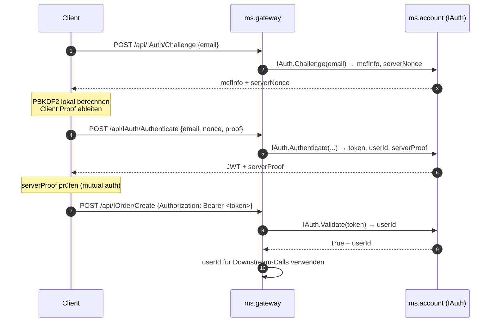

# 05 — Authentifizierung

## Zweck / Wann brauche ich das

Microservices, die schreibende Operationen oder benutzerspezifische Daten schützen müssen, brauchen
eine sichere Authentifizierung ohne Klartextpasswörter. mORMot2 liefert dafür kryptografische
Primitive (SCRAM-MCF, JWT) out-of-the-box. Dieses Kapitel zeigt, wie ein dedizierter Auth-Service
SCRAM-MCF für den Anmeldeflow nutzt, anschließend ein JWT ausstellt und das Gateway dieses Token
bei jedem Folgeaufruf validiert.

## Kernkonzept



### Warum SCRAM-MCF?

- Das Klartext-Passwort wird **niemals übertragen** und **niemals gespeichert** — nur der MCF-Hash
  und der SCRAM Persisted Key landen in der Datenbank.
- `ModularCryptHash(mcfPbkdf2Sha256, password)` erzeugt einen PBKDF2-SHA256-Hash im PHC/passlib-
  kompatiblen MCF-Format (`$pbkdf2-sha256$310000$salt$checksum`).
- `ModularCryptFakeInfo` gibt nicht-existierenden Nutzern eine realistische MCF-Antwort — der
  Angreifer kann Accounts nicht durch Timing-Analyse enumerieren.
- `ScramPersistedKey` + `ScramServerProof` implementieren RFC-5802-SCRAM; gegenseitige
  Authentifizierung ist damit gratis.

### JWT-Flow

`TJwtHS256` (HMAC-SHA256) signiert den Token. Der Service bettet die User-ID als Custom-Claim
`uid` ein; `jrcIssuer`, `jrcExpirationTime`, `jrcIssuedAt` werden automatisch geprüft.
Das Gateway extrahiert `uid` via `TJwtContent.data.I['uid']` und reicht sie als Downstream-Kontext
weiter.

## Schritt für Schritt

1. **Interface deklarieren** — `IAuth` als `IInvokable` in `shared/` mit `Challenge`, `Authenticate`,
   `Register`, `Validate`, `ChangePassword`.
2. **ORM-Modell** — `TOrmAccountAuth` speichert `Email`, `McfInfo`, `PersistedKey`, `AccountId`,
   `IsActive`, `LastLogin`.
3. **TAccountJwt** kapselt `TJwtHS256` (Secret aus Config, TTL konfigurierbar).
4. **TAuthService** implementiert `IAuth`: Challenge erzeugt Nonce + speichert die Challenge für
   `CHALLENGE_TTL_SEC` Sekunden; Authenticate konsumiert die Challenge, prüft via `ScramServerProof`,
   stellt JWT aus.
5. **Rate-Limiting** — pro E-Mail `TRateLimiter` für fehlgeschlagene Authenticate-Versuche; per-IP
   `TRateLimiter` im Gateway für den `/api/IAuth/*`-Pfad. Erfolgreiche Logins resetten den Bucket.
6. **Gateway** — validiert das Bearer-Token über `IAuth.Validate` vor dem Weiterleiten, reicht
   `userId` als Kontext-Header an Backends weiter.

## Code-Skelett

### shared/ms.shared.interfaces.pas (Ausschnitt)

```pascal
type
  /// <summary>
  ///   Auth-Challenge-Antwort: MCF-Info für clientseitige PBKDF2 + Server-Nonce.
  /// </summary>
  IAuth = interface(IInvokable)
    ['{A1B2C3D4-0001-0000-0000-000000000001}']

    /// <summary>
    ///   Erstellt eine SCRAM-Challenge für die angegebene E-Mail.
    /// </summary>
    /// <param name="aEmail">
    ///   E-Mail-Adresse des Nutzers.
    /// </param>
    /// <param name="aMcfInfo">
    ///   MCF-Format-Info für clientseitige PBKDF2-Ableitung.
    /// </param>
    /// <param name="aServerNonce">
    ///   Serverseitig generierter Nonce, der die Challenge identifiziert.
    /// </param>
    procedure Challenge(
      const aEmail: RawUtf8;
      out aMcfInfo, aServerNonce: RawUtf8
      );

    /// <summary>
    ///   Prüft den SCRAM-Proof des Clients und liefert JWT + Server-Proof.
    /// </summary>
    /// <param name="aEmail">
    ///   E-Mail-Adresse des authentifizierenden Nutzers.
    /// </param>
    /// <param name="aServerNonce">
    ///   Nonce aus dem vorangegangenen Challenge-Aufruf.
    /// </param>
    /// <param name="aClientProof">
    ///   Vom Client abgeleiteter SCRAM-Proof.
    /// </param>
    /// <param name="aToken">
    ///   JWT bei erfolgreicher Authentifizierung.
    /// </param>
    /// <param name="aAccountId">
    ///   Account-ID bei Erfolg.
    /// </param>
    /// <param name="aServerProof">
    ///   Server-Proof für gegenseitige Authentifizierung.
    /// </param>
    /// <returns>
    ///   True bei erfolgreicher Authentifizierung.
    /// </returns>
    function Authenticate(
      const aEmail, aServerNonce, aClientProof: RawUtf8;
      out aToken: RawUtf8;
      out aAccountId: TID;
      out aServerProof: RawUtf8
      ): boolean;

    /// <summary>
    ///   Registriert einen neuen Nutzer mit E-Mail und Passwort.
    /// </summary>
    /// <param name="aEmail">
    ///   E-Mail-Adresse des neuen Accounts.
    /// </param>
    /// <param name="aPassword">
    ///   Klartext-Passwort (wird ausschließlich für die lokale SCRAM-Ableitung genutzt,
    ///   niemals gespeichert).
    /// </param>
    /// <param name="aAccountId">
    ///   Account-ID aus dem Account-Service (FK-Verknüpfung).
    /// </param>
    /// <returns>
    ///   Die Account-ID bei Erfolg, 0 bei Fehler.
    /// </returns>
    function Register(
      const aEmail, aPassword: RawUtf8;
      aAccountId: TID
      ): TID;

    /// <summary>
    ///   Validiert ein JWT und extrahiert die Account-ID.
    /// </summary>
    /// <param name="aToken">
    ///   JWT-Token-String.
    /// </param>
    /// <param name="aAccountId">
    ///   Enthält die Account-ID bei gültigem Token.
    /// </param>
    /// <returns>
    ///   True wenn Signatur und Ablaufzeit korrekt sind.
    /// </returns>
    function Validate(
      const aToken: RawUtf8;
      out aAccountId: TID
      ): boolean;
  end;
```

### ms.account/ms.account.server.pas (Ausschnitt)

```pascal
type
  /// <summary>
  ///   Kapselt TJwtHS256 für Token-Erstellung und -Validierung.
  /// </summary>
  TAccountJwt = class
  strict private
    FJwt: TJwtHS256;
  public
    constructor Create(
      const aSecret: RawUtf8;
      aExpirationMinutes: integer = 1440
      );
    destructor Destroy; override;

    /// <summary>
    ///   Erzeugt einen signierten JWT mit Custom-Claim 'uid'.
    /// </summary>
    /// <param name="aAccountId">
    ///   Account-ID, die als 'uid'-Claim eingebettet wird.
    /// </param>
    /// <returns>
    ///   Signierter JWT-String (header.payload.signature).
    /// </returns>
    function CreateToken(
      aAccountId: TID
      ): RawUtf8;

    /// <summary>
    ///   Prüft Signatur und Ablaufzeit; extrahiert die Account-ID aus dem 'uid'-Claim.
    /// </summary>
    /// <param name="aToken">
    ///   Zu prüfender JWT-String.
    /// </param>
    /// <param name="aAccountId">
    ///   Enthält die Account-ID bei erfolgreich geprüftem Token.
    /// </param>
    /// <returns>
    ///   True wenn der Token gültig und nicht abgelaufen ist.
    /// </returns>
    function ValidateToken(
      const aToken: RawUtf8;
      out aAccountId: TID
      ): boolean;
  end;

  /// <summary>
  ///   Pending SCRAM-Challenge, die auf den Client-Proof wartet.
  /// </summary>
  TScramChallenge = record
  public
    Email: RawUtf8;
    ServerNonce: RawUtf8;
    McfInfo: RawUtf8;
    PersistedKey: RawUtf8;
    AccountId: TID;
    IsReal: boolean;
    CreatedAt: TDateTime;
  end;

  /// <summary>
  ///   Implementiert IAuth mit SCRAM-MCF-Passwortprüfung.
  /// </summary>
  TAuthService = class(TInterfacedObject, IAuth)
  strict private
    FOrm: IRestOrm;
    FJwt: TAccountJwt;
    FChallenges: array of TScramChallenge;
    FChallengeSafe: TLightLock;
    FLoginLimiter: TRateLimiter;

    function FindUserByEmail(
      const aEmail: RawUtf8
      ): TOrmAccountAuth;

    procedure ComputeScramCredentials(
      const aEmail, aPassword: RawUtf8;
      out aMcfInfo, aPersistedKey: RawUtf8
      );

    procedure StoreChallenge(
      const aChallenge: TScramChallenge
      );

    function ConsumeChallenge(
      const aServerNonce: RawUtf8;
      out aChallenge: TScramChallenge
      ): boolean;
  public
    constructor Create(
      const aOrm: IRestOrm;
      aJwt: TAccountJwt
      );
    destructor Destroy; override;

    procedure Challenge(
      const aEmail: RawUtf8;
      out aMcfInfo, aServerNonce: RawUtf8
      );

    function Authenticate(
      const aEmail, aServerNonce, aClientProof: RawUtf8;
      out aToken: RawUtf8;
      out aAccountId: TID;
      out aServerProof: RawUtf8
      ): boolean;

    function Register(
      const aEmail, aPassword: RawUtf8;
      aAccountId: TID
      ): TID;

    function Validate(
      const aToken: RawUtf8;
      out aAccountId: TID
      ): boolean;
  end;

implementation

constructor TAccountJwt.Create(
  const aSecret: RawUtf8;
  aExpirationMinutes: integer
  );
begin
  inherited Create;
  // aPBKDF2Round=0: Schlüssel direkt verwenden (kein Key Derivation Step)
  // aClaims: welche Standard-Claims eingebettet und geprüft werden
  FJwt := TJwtHS256.Create(
    aSecret, 0,
    [jrcIssuer, jrcExpirationTime, jrcIssuedAt],
    [], aExpirationMinutes);
end;

destructor TAccountJwt.Destroy;
begin
  FJwt.Free;
  inherited Destroy;
end;

function TAccountJwt.CreateToken(
  aAccountId: TID
  ): RawUtf8;
begin
  // Custom-Claim 'uid' trägt die Account-ID; Standard-Claims (iss/exp/iat) werden
  // automatisch ergänzt. 'ms.account' ist der Issuer-String.
  Result := FJwt.Compute(['uid', aAccountId], 'ms.account');
end;

function TAccountJwt.ValidateToken(
  const aToken: RawUtf8;
  out aAccountId: TID
  ): boolean;
var
  Content: TJwtContent;
begin
  FJwt.Verify(aToken, Content);
  Result := (Content.result = jwtValid);
  if Result then
    // TDocVariantData.I[] extrahiert den Claim als Int64
    aAccountId := Content.data.I['uid']
  else
    aAccountId := 0;
end;

procedure TAuthService.ComputeScramCredentials(
  const aEmail, aPassword: RawUtf8;
  out aMcfInfo, aPersistedKey: RawUtf8
  );
var
  McfHash: RawUtf8;
begin
  // Erzeugt PBKDF2-SHA256 im MCF-Format; Formatinformation separat extrahieren
  McfHash := ModularCryptHash(mcfPbkdf2Sha256, aPassword);
  ModularCryptIdentify(McfHash, @aMcfInfo);
  // SCRAM Persisted Key: E-Mail dient als Salz für die Ableitung
  aPersistedKey := ScramPersistedKey(McfHash, aEmail);
  FillZero(RawByteString(McfHash)); // Hash sofort aus dem Speicher löschen
end;

procedure TAuthService.Challenge(
  const aEmail: RawUtf8;
  out aMcfInfo, aServerNonce: RawUtf8
  );
var
  User: TOrmAccountAuth;
  Chal: TScramChallenge;
  RandomData: THash128;
begin
  Finalize(Chal);
  FillCharFast(Chal, SizeOf(Chal), 0);
  Chal.Email := aEmail;
  RandomBytes(@RandomData, SizeOf(RandomData));
  Chal.ServerNonce := BinToBase64uri(@RandomData, SizeOf(RandomData));
  Chal.CreatedAt := NowUtc;
  User := FindUserByEmail(aEmail);
  try
    if (User <> nil) and User.IsActive then
    begin
      Chal.McfInfo := User.McfInfo;
      Chal.PersistedKey := User.PersistedKey;
      Chal.AccountId := User.AccountId;
      Chal.IsReal := True;
    end
    else
    begin
      // Anti-Enumeration: nicht-existierende Nutzer erhalten eine fake MCF-Info
      Chal.McfInfo := ModularCryptFakeInfo(aEmail, mcfPbkdf2Sha256);
      Chal.IsReal := False;
    end;
  finally
    User.Free;
  end;
  StoreChallenge(Chal);
  aMcfInfo := Chal.McfInfo;
  aServerNonce := Chal.ServerNonce;
end;

function TAuthService.Authenticate(
  const aEmail, aServerNonce, aClientProof: RawUtf8;
  out aToken: RawUtf8;
  out aAccountId: TID;
  out aServerProof: RawUtf8
  ): boolean;
var
  Chal: TScramChallenge;
begin
  Result := False;
  aToken := '';
  aAccountId := 0;
  aServerProof := '';
  // Challenge konsumieren: abgelaufener oder unbekannter Nonce wird abgelehnt
  if not ConsumeChallenge(aServerNonce, Chal) then
    Exit;
  if Chal.Email <> aEmail then
    Exit;
  if not Chal.IsReal then
    Exit;
  // Rate-Limit: jeder Proof-Versuch kostet ein Token
  if not FLoginLimiter.TryAcquire(aEmail) then
    Exit;
  // SCRAM: Server-Proof als Rückgabe und Proof-Verifizierung in einem Schritt
  aServerProof := ScramServerProof(Chal.PersistedKey, aClientProof, [aEmail, aServerNonce]);
  if aServerProof = '' then
    Exit;
  // Erfolgreiche Authentifizierung
  aAccountId := Chal.AccountId;
  aToken := FJwt.CreateToken(aAccountId);
  // Bucket zurücksetzen, damit ehrliche Nutzer mit Tippfehlern nicht ausgesperrt bleiben
  FLoginLimiter.Reset(aEmail);
  Result := True;
end;
```

### ms.account/ms.account.server.pas — SetupServices

```pascal
procedure TAccountServer.SetupServices;
begin
  FJwt := TAccountJwt.Create(Config.JwtSecret, JWT_EXPIRATION_MINUTES);
  FAuthImpl := TAuthService.Create(FRestServer.Orm, FJwt);
  RegisterService(FAuthImpl, TypeInfo(IAuth));
end;

procedure TAccountServer.DoFinalize;
begin
  FreeAndNil(FJwt);
  // FAuthImpl wird ref-counted via IAuth und durch die Service-Factory freigegeben
  inherited DoFinalize;
end;
```

### ms.gateway — Token-Validierung pro Request

```pascal
function TGatewayServer.ValidateBearer(
  const aInHeaders: RawUtf8;
  out aAccountId: TID
  ): boolean;
var
  Bearer: RawUtf8;
begin
  // Authorization: Bearer <token>
  Bearer := FindNameValue(aInHeaders, 'AUTHORIZATION: BEARER ');
  if Bearer = '' then
    Exit(False);
  Result := FAuth.Validate(Bearer, aAccountId);
end;
```

## Stolperfallen / Lessons

**Rate-Limiting auf zwei Ebenen:** Der per-IP-Limiter im Gateway stoppt Brute-Force-Angriffe über
verteilte IPs nicht allein. Deshalb gibt es zusätzlich einen per-E-Mail-Limiter im Auth-Service.
Erfolgreiche Logins müssen den Bucket resetten, sonst werden ehrliche Nutzer nach wenigen Tippfehlern
ausgesperrt.

**Challenge-TTL:** Challenges müssen zeitbegrenzt sein (`CHALLENGE_TTL_SEC`), sonst sammelt der Server
unbegrenzt viele offene Nonces. Die `StoreChallenge`-Methode räumt abgelaufene Einträge bei jedem
Aufruf auf.

**Anti-Enumeration:** `ModularCryptFakeInfo` zurückgeben statt einen Fehler, wenn die E-Mail nicht
existiert. Ohne das unterscheidet sich die Antwortzeit oder der Inhalt zwischen echten und
unbekannten Nutzern — ein Angreifer kann damit Accounts enumerieren.

**JWT-Secret aus der Config:** Das Secret darf niemals hart kodiert im Quellcode stehen. Es kommt aus
`Config.JwtSecret`, das aus einer Umgebungsvariablen oder Konfigurationsdatei geladen wird, die nicht
im Repository liegt.

**FreeAndNil(FJwt) in DoFinalize:** `TAuthService` hält nur eine Referenz auf `TAccountJwt`, besitzt
ihn aber nicht (Ownership liegt beim Server). Die Reihenfolge in `DoFinalize` muss sicherstellen, dass
der Service-Factory die Service-Instanz freigibt, bevor `FJwt` freigegeben wird.

**SCRAM Persisted Key vs. MCF Hash:** Die Datenbank speichert **nicht** den MCF-Hash, sondern nur den
Persisted Key (`ScramPersistedKey`) und die MCF-Info. Der vollständige Hash wird nach der Ableitung
sofort mit `FillZero` gelöscht.

## Querverweise

- [02-service-erstellen.md](02-service-erstellen.md) — ORM-Modell und Service-Registrierung
- [04-web-gateway.md](04-web-gateway.md) — Gateway-Proxying und Header-Forwarding
- [08-resilience.md](08-resilience.md) — Rate-Limiting (TRateLimiter, Token-Bucket)
- [10-testing.md](10-testing.md) — Auth-Tests mit in-process SCRAM-Flow
