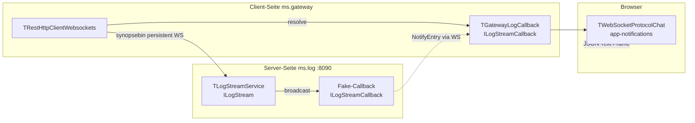

# 06 — WebSocket-Callbacks

## Zweck / Wann brauche ich das

Sobald ein Service Daten **aktiv zum Client pushen** muss — Live-Logs, Event-Benachrichtigungen,
Echtzeit-Updates — reicht normales Request/Response-HTTP nicht mehr. mORMot2 löst das mit
interface-basierten Callbacks über persistente WebSocket-Verbindungen: Der Server ruft eine
Methode auf dem Client-seitigen Interface auf, als wäre es ein normaler lokaler Aufruf.
Dieses Kapitel erklärt das vollständige Pattern inklusive aller hart erarbeiteten Stolperfallen.

## Kernkonzept



Drei Transportschichten:

1. **synopsebin** (intern, Pascal-zu-Pascal): persistente WS-Verbindung zwischen Service und Gateway.
   mORMot2-eigenes binäres Framing mit Aufruf-IDs und Callback-Registrierungssequenz.
2. **TWebSocketProtocolChat** (letzter Hop, Browser): austauscht beliebige Text-Frames. Das Gateway
   schickt `{"entry": ...}` JSON, der Browser parst es. Kein mORMot2-Framing auf dieser Seite.
3. **HTTP SOA** (subscribe/ack): `IEventStream.Subscribe` und `Acknowledge` fahren über denselben
   WS zurück zum Server.

## Schritt für Schritt

### Server-Seite

1. **Callback-Interface** in `shared/` deklarieren: `IMyCallback = interface(IInvokable)` mit den
   Push-Methoden.
2. **Service-Interface** deklarieren: `IMyStream = interface(IInvokable)` mit `Subscribe`,
   `Unsubscribe`. Service implementiert zusätzlich `IServiceWithCallbackReleased` für automatisches
   Cleanup.
3. **Service implementieren**: Subscriber-Liste mit Critical Section schützen.
   `CallbackReleased`-Hook entfernt tote Callbacks automatisch.
4. **Service registrieren** mit `optExecLockedPerInterface` damit Callbacks pro Subscriber serialisiert
   dispatched werden.
5. **Pre-Registrierung** in der Initialization-Section der Shared-API-Unit:
   `TInterfaceFactory.RegisterInterfaces([TypeInfo(IMyStream), TypeInfo(IMyCallback)])`.

### Client-Seite

1. `TRestHttpClientWebsockets` erstellen, `WebSocketsUpgrade(WEBSOCKETS_KEY)` aufrufen.
2. `ServiceRegister([TypeInfo(IMyStream)], sicShared)` auf dem Client.
3. `ResultAsJsonObjectWithoutResult := True` auf der Service-Factory.
4. Interface via `Services.Resolve(IMyStream, FStream)` holen.
5. Callback-Klasse von `TInterfacedCallback` ableiten (nicht `TInterfacedObject`).
6. Callback instanziieren mit `TMyCallback.Create(FWsClient, IMyCallback)`.
7. `FStream.Subscribe(FCallback)` aufrufen.

### Browser-Interop (Gateway)

1. `TWebSocketProtocolChat.Create('mein-protokoll-name', '')` erstellen.
2. `OnIncomingFrame` als Property setzen (nicht als Konstruktor-Argument — `Clone()` propagiert
   Konstruktor-Callbacks nicht zuverlässig).
3. `WsServer.WebSocketProtocols.Add(Protocol)` aufrufen.
4. In `Broadcast`: `Protocol.SendFrameJson(Connection, JsonText)` für jeden aktiven Browser.

## Code-Skelett

### shared/ms.shared.interfaces.pas — Interface-Deklarationen

```pascal
type
  /// <summary>
  ///   Server-zu-Client-Callback: wird vom Server aufgerufen, wenn eine Benachrichtigung vorliegt.
  /// </summary>
  INotificationCallback = interface(IInvokable)
    ['{B2C3D4E5-0002-0000-0000-000000000002}']

    /// <summary>
    ///   Wird für jede neue Benachrichtigung aufgerufen.
    /// </summary>
    /// <param name="aEntry">
    ///   Die Benachrichtigung, die an den Subscriber gesendet wird.
    /// </param>
    procedure OnNotification(
      const aEntry: TNotificationDto
      );
  end;

  /// <summary>
  ///   Stream-Service: verwaltet Subscriber und pusht Benachrichtigungen.
  /// </summary>
  INotificationStream = interface(IInvokable)
    ['{C3D4E5F6-0003-0000-0000-000000000003}']

    /// <summary>
    ///   Registriert einen Callback-Subscriber für eingehende Benachrichtigungen.
    /// </summary>
    /// <param name="aCallback">
    ///   Der Callback, der Benachrichtigungen empfangen soll.
    /// </param>
    procedure Subscribe(
      const aCallback: INotificationCallback
      );

    /// <summary>
    ///   Meldet einen Callback-Subscriber ab.
    /// </summary>
    /// <param name="aCallback">
    ///   Der abzumeldende Callback.
    /// </param>
    procedure Unsubscribe(
      const aCallback: INotificationCallback
      );
  end;
```

### ms.notification/ms.notification.server.pas — Server-Implementierung

```pascal
type
  /// <summary>
  ///   Hält die aktiven Subscriber und dispatcht Benachrichtigungen per WebSocket.
  ///   IServiceWithCallbackReleased sorgt für automatisches Cleanup wenn ein WS stirbt.
  /// </summary>
  TNotificationStreamService = class(TInterfacedObject,
    INotificationStream, IServiceWithCallbackReleased)
  strict private
    FLock: TRTLCriticalSection;
    FSubscribers: array of INotificationCallback;
  public
    constructor Create;
    destructor Destroy; override;

    procedure Subscribe(
      const aCallback: INotificationCallback
      );

    procedure Unsubscribe(
      const aCallback: INotificationCallback
      );

    /// <summary>
    ///   mORMot2 ruft diese Methode auf, wenn der WebSocket eines Subscribers geschlossen wurde.
    ///   Entfernt den Subscriber aus der Liste ohne manuelles Bookkeeping.
    /// </summary>
    /// <param name="aCallback">
    ///   Der freigegeben Callback.
    /// </param>
    /// <param name="aInterfaceName">
    ///   Name des Interface; nur 'INotificationCallback' behandeln.
    /// </param>
    procedure CallbackReleased(
      const aCallback: IInvokable;
      const aInterfaceName: RawUtf8
      );

    /// <summary>
    ///   Sendet eine Benachrichtigung an alle aktiven Subscriber.
    ///   Tote Subscriber (Exception beim Senden) werden automatisch entfernt.
    /// </summary>
    /// <param name="aEntry">
    ///   Zu sendende Benachrichtigung.
    /// </param>
    procedure Broadcast(
      const aEntry: TNotificationDto
      );
  end;

implementation

constructor TNotificationStreamService.Create;
begin
  inherited Create;
  InitializeCriticalSection(FLock);
end;

destructor TNotificationStreamService.Destroy;
begin
  EnterCriticalSection(FLock);
  try
    FSubscribers := nil;
  finally
    LeaveCriticalSection(FLock);
  end;
  DeleteCriticalSection(FLock);
  inherited Destroy;
end;

procedure TNotificationStreamService.Subscribe(
  const aCallback: INotificationCallback
  );
begin
  if aCallback = nil then
    Exit;
  EnterCriticalSection(FLock);
  try
    SetLength(FSubscribers, Length(FSubscribers) + 1);
    FSubscribers[High(FSubscribers)] := aCallback;
  finally
    LeaveCriticalSection(FLock);
  end;
end;

procedure TNotificationStreamService.Unsubscribe(
  const aCallback: INotificationCallback
  );
var
  Idx: PtrInt;
begin
  if aCallback = nil then
    Exit;
  EnterCriticalSection(FLock);
  try
    for Idx := High(FSubscribers) downto 0 do
      if FSubscribers[Idx] = aCallback then
      begin
        Delete(FSubscribers, Idx, 1);
        Break;
      end;
  finally
    LeaveCriticalSection(FLock);
  end;
end;

procedure TNotificationStreamService.CallbackReleased(
  const aCallback: IInvokable;
  const aInterfaceName: RawUtf8
  );
var
  Idx: PtrInt;
  Released: INotificationCallback;
begin
  if aInterfaceName <> 'INotificationCallback' then
    Exit;
  if not Supports(aCallback, INotificationCallback, Released) then
    Exit;
  EnterCriticalSection(FLock);
  try
    for Idx := High(FSubscribers) downto 0 do
      if FSubscribers[Idx] = Released then
      begin
        Delete(FSubscribers, Idx, 1);
        Break;
      end;
  finally
    LeaveCriticalSection(FLock);
  end;
end;

procedure TNotificationStreamService.Broadcast(
  const aEntry: TNotificationDto
  );
var
  Idx: PtrInt;
begin
  EnterCriticalSection(FLock);
  try
    for Idx := High(FSubscribers) downto 0 do
      try
        FSubscribers[Idx].OnNotification(aEntry);
      except
        // Toten Subscriber entfernen; echte Fehler führen zum Aufruf von CallbackReleased
        Delete(FSubscribers, Idx, 1);
      end;
  finally
    LeaveCriticalSection(FLock);
  end;
end;
```

### ms.notification/ms.notification.server.pas — SetupServices

```pascal
procedure TNotificationServer.SetupServices;
var
  StreamFactory: TServiceFactoryServerAbstract;
begin
  FStreamImpl := TNotificationStreamService.Create;
  StreamFactory := RegisterService(FStreamImpl, TypeInfo(INotificationStream));
  // optExecLockedPerInterface: Callbacks pro Subscriber serialisiert
  StreamFactory.SetOptions([], [optExecLockedPerInterface]);
end;
```

### shared/ms.shared.api.pas — Pre-Registrierung (initialization)

```pascal
initialization
  // ... Rtti.RegisterType für alle DTOs ...

  // ⚡ PFLICHT: Callback-Interface-Typen VORAB registrieren.
  // ServiceRegister deckt das Service-Interface (INotificationStream) ab,
  // aber nicht den Callback-Parameter-Typ (INotificationCallback).
  // Fehlt diese Registrierung, wirft GetFakeCallback auf der Serverseite
  // 'Unexpected INotificationCallback' beim ersten Subscribe-Aufruf.
  TInterfaceFactory.RegisterInterfaces([
    TypeInfo(INotificationStream),
    TypeInfo(INotificationCallback)]);
```

### ms.gateway — Client mit Callback-Klasse

```pascal
type
  /// <summary>
  ///   TInterfacedCallback ist die richtige Basisklasse für WS-Callbacks (nicht TInterfacedObject).
  ///   Sie verwaltet den WS-gebundenen Refcount und informiert CallbackReleased korrekt.
  /// </summary>
  TGatewayNotificationCallback = class(TInterfacedCallback, INotificationCallback)
  strict private
    FBroker: TNotificationBrokerService;
  public
    constructor Create(
      aRest: TRest;
      aBroker: TNotificationBrokerService
      ); reintroduce;

    procedure OnNotification(
      const aEntry: TNotificationDto
      );
  end;

implementation

constructor TGatewayNotificationCallback.Create(
  aRest: TRest;
  aBroker: TNotificationBrokerService
  );
begin
  // Zweiter Parameter: der konkrete Interface-Typ dieses Callbacks
  inherited Create(aRest, INotificationCallback);
  FBroker := aBroker;
end;

procedure TGatewayNotificationCallback.OnNotification(
  const aEntry: TNotificationDto
  );
begin
  if FBroker <> nil then
    FBroker.Broadcast(aEntry);
end;
```

### ms.gateway — SetupServices (WS-Verbindung + Chat-Protokoll für Browser)

```pascal
procedure TGatewayServer.SetupServices;
var
  NotifClientModel: TOrmModel;
  UpgradeError: RawUtf8;
  BrokerFactory: TServiceFactoryServerAbstract;
begin
  // ... andere Backends ...

  // WebSocket-Client zum Notification-Service
  NotifClientModel := TOrmModel.Create([], MODEL_ROOT);
  FNotifClient := TRestHttpClientWebsockets.Create('localhost', PORT_NOTIFICATION, NotifClientModel);
  FNotifClient.Model.Owner := FNotifClient;
  UpgradeError := FNotifClient.WebSocketsUpgrade(WEBSOCKETS_KEY);
  if UpgradeError <> '' then
    TSynLog.Add.Log(sllWarning, 'gateway: WS upgrade zu ms.notification fehlgeschlagen: %',
      [UpgradeError], self);

  FNotifClient.ServiceRegister([TypeInfo(INotificationStream)], sicShared);
  TServiceFactoryClient(FNotifClient.Services.Info(TypeInfo(INotificationStream)))
    .ResultAsJsonObjectWithoutResult := True;
  FNotifClient.Services.Resolve(INotificationStream, FNotifStream);

  // Gateway-seitiger Broker: empfängt Callbacks von ms.notification, leitet an Browser weiter
  FNotifBroker := TNotificationBrokerService.Create;
  if FNotifStream <> nil then
  begin
    FNotifCallback := TGatewayNotificationCallback.Create(FNotifClient, FNotifBroker);
    try
      FNotifStream.Subscribe(FNotifCallback);
    except
      on E: Exception do
      begin
        TSynLog.Add.Log(sllWarning,
          'gateway: Subscribe zu ms.notification fehlgeschlagen: %', [E.Message], self);
        FNotifCallback := nil;
      end;
    end;
  end;

  // Broker als INotificationStream auf dem Gateway registrieren (Browser subscriben hier)
  BrokerFactory := RegisterService(FNotifBroker, TypeInfo(INotificationStream));
  BrokerFactory.SetOptions([], [optExecLockedPerInterface]);
end;

procedure TGatewayServer.DoInitialize;
var
  WsServer: TWebSocketAsyncServer;
begin
  // ... Handler-Interception ...

  // Chat-Protokoll für Browser-Hop registrieren
  if (FNotifBroker <> nil) and (FHttpServer.HttpServer is TWebSocketAsyncServer) then
  begin
    WsServer := TWebSocketAsyncServer(FHttpServer.HttpServer);
    // ⚡ OnIncomingFrame als Property setzen — NICHT als Konstruktor-Argument.
    // Clone() propagiert Konstruktor-Callbacks nicht zuverlässig.
    FNotifChatProtocol := TWebSocketProtocolChat.Create('mein-protokoll-name', '');
    FNotifChatProtocol.OnIncomingFrame := OnNotifChatFrame;
    WsServer.WebSocketProtocols.Add(FNotifChatProtocol);
    FNotifBroker.AttachChatProtocol(FNotifChatProtocol);
  end;
end;

procedure TGatewayServer.DoFinalize;
begin
  // Interface vor dem Client freigeben: ms.notification bekommt CallbackReleased
  // während der WS noch steht
  if (FNotifCallback <> nil) and (FNotifStream <> nil) then
    try
      FNotifStream.Unsubscribe(FNotifCallback);
    except
      // ms.notification kann schon down sein — Framework räumt auf
    end;
  FNotifCallback := nil;
  FNotifStream := nil;
  FreeAndNil(FNotifBroker);
  FreeAndNil(FNotifClient);
  // ... andere Clients ...
end;
```

### Consumer mit Shutdown-Flag (Event-Bus-Muster)

Wenn ein Service selbst als Consumer an einen Event-Bus angebunden ist (vgl. [09-event-bus.md](09-event-bus.md)),
braucht der Callback zwingend ein Shutdown-Flag und eine Master-Exception-Absicherung:

```pascal
type
  /// <summary>
  ///   Consumer-Callback mit Shutdown-Disziplin. Läuft auf dem WS-Reader-Thread des Clients.
  /// </summary>
  TOrderEventConsumer = class(TInterfacedObject, IEventStreamCallback)
  strict private
    FOrm: IRestOrm;
    FStream: IEventStream;
    FShutdown: boolean;
  public
    constructor Create(
      const aOrm: IRestOrm;
      const aStream: IEventStream
      );

    /// <summary>
    ///   Setzt das Shutdown-Flag. Muss als allererstes in DoFinalize aufgerufen werden,
    ///   bevor der Reconnect-Thread gestoppt oder der Client freigegeben wird.
    /// </summary>
    procedure Shutdown;

    /// <summary>
    ///   Wird von ms.events für jedes Event aufgerufen.
    ///   Enthält Master-try/except + Shutdown-Flag-Prüfung als Pflicht.
    /// </summary>
    /// <param name="aEvent">
    ///   Das vom Event-Bus gesendete Event.
    /// </param>
    procedure OnEvent(
      const aEvent: TEventDto
      );
  end;

implementation

procedure TOrderEventConsumer.Shutdown;
begin
  FShutdown := True;
end;

procedure TOrderEventConsumer.OnEvent(
  const aEvent: TEventDto
  );
begin
  // ⚡ Sofortiger Exit wenn Shutdown läuft — verhindert 5..30 s Timeout-Block
  // durch synchrone Bus-Calls über einen sterbenden WebSocket.
  if FShutdown then
    Exit;
  try
    // Fachliche Verarbeitung
    if aEvent.EventType = EVENT_SOMETHING_HAPPENED then
    try
      // ... DB-Operationen ...
    except
      // Einzelnes fehlerhaftes Event darf den Consumer nicht stoppen
    end;
    // Flag erneut prüfen: die DB-Operation oben kann lange dauern
    if FShutdown then
      Exit;
    if FStream <> nil then
    try
      FStream.Acknowledge(CONSUMER_ORDER_CASCADE, aEvent.ID);
    except
      // Bus nicht erreichbar — Cursor wird beim nächsten Subscribe(-1) neu aufgelöst
    end;
  except
    // ⚡ Master-try/except: unbehandelte Exception auf dem WS-Reader-Thread
    // crasht den Prozess beim Shutdown — diese Absicherung ist nicht optional.
  end;
end;
```

### Teardown eines Consumer-Services

```pascal
procedure TOrderServer.DoFinalize;
begin
  // Schritt 1: Flag setzen — BEVOR der Reconnect-Thread gestoppt wird
  if FEventConsumer <> nil then
    FEventConsumer.Shutdown;

  // Schritt 2: Reconnect-Worker stoppen
  if FReconnectThread <> nil then
  begin
    FReconnectThread.Terminate;
    FReconnectThread.WakeUp;       // aus dem WaitFor aufwecken
    FReconnectThread.WaitFor;
    FreeAndNil(FReconnectThread);
  end;

  // Schritt 3: Referenzen fallen lassen — KEIN Unsubscribe/Acknowledge über den sterbenden WS.
  // FreeAndNil(FEventsClient) schließt den Socket; mORMot2 feuert CallbackReleased serverseitig.
  EnterCriticalSection(FConnectionLock);
  try
    FEventConsumer := nil;   // Back-Pointer; Ownership via FEventCallback
    FEventCallback := nil;
    FEventStream := nil;
    FreeAndNil(FEventsClient);
  finally
    LeaveCriticalSection(FConnectionLock);
  end;
  DeleteCriticalSection(FConnectionLock);
  inherited DoFinalize;
end;
```

## Stolperfallen / Lessons

### synopsejson ist NICHT für Browser-Interop

`synopsejson` ist REST-über-WebSocket mit mORMot2-eigenem Framing (Aufruf-IDs, Callback-
Registrierungssequenz). Ein Browser-`new WebSocket(url)` kann diese Handshake-Sequenz nicht
produzieren — die Verbindung hängt idle, bis der Timeout greift.

**Lösung:** `TWebSocketProtocolChat` mit Custom-Namen für den letzten Hop Browser↔Gateway.
Der Pascal-Stack (Producer → Service → Gateway) bleibt auf `synopsebin`. Nur der allerletzte Hop
zum Browser verwendet das Chat-Protokoll mit plaintext JSON-Frames.

### Pre-Registrierung aller Callback-Interfaces ist Pflicht

`ServiceRegister` auf dem Client registriert das Service-Interface (`INotificationStream`), aber
**nicht** den Callback-Parameter-Typ (`INotificationCallback`). Fehlt die Pre-Registrierung in der
`initialization`-Sektion der Shared-Unit, wirft `TServiceContainerServer.GetFakeCallback` beim ersten
`Subscribe`-Aufruf: `Unexpected INotificationCallback`.

**Lösung:** In der `initialization` der Shared-API-Unit immer beide registrieren:

```pascal
TInterfaceFactory.RegisterInterfaces([
  TypeInfo(INotificationStream),
  TypeInfo(INotificationCallback)]);
```

### TInterfacedCallback statt TInterfacedObject für Callbacks

Client-seitige Callbacks müssen von `TInterfacedCallback` erben, nicht von `TInterfacedObject`.
`TInterfacedCallback` verwaltet den WS-gebundenen Refcount und informiert den Server korrekt über
`CallbackReleased` wenn die Instanz freigegeben wird.

### OnIncomingFrame als Property setzen, nicht als Konstruktor-Argument

`TWebSocketProtocolChat.Create(name, uri)` und danach `Protocol.OnIncomingFrame := Handler` als
Property. Die dritte Konstruktor-Überladung mit Callback-Argument sieht verlockend aus, aber
`Clone()` — das mORMot2 pro Verbindung aufruft — propagiert Konstruktor-Callbacks nicht zuverlässig.

### Shutdown-Disziplin: niemals synchrone Bus-Calls im Teardown

Beim Teardown eines Consumer-Services gibt es zwei Gefahren:

1. **Synchrone SOA-Calls über einen sterbenden WS blockieren** auf den Socket-Timeout (5..30 s).
   `Unsubscribe` und `Acknowledge` sind solche Calls. Im beobachteten Fall: 44 s Gesamtzeit beim
   Stoppen, weil sechs synchrone Teardown-Schritte mit Timeouts aufaddiert wurden.

2. **In-flight `OnEvent`-Calls** kommen weiter auf dem WS-Reader-Thread an, bis der Socket wirklich
   tot ist. Jeder davon versucht `Acknowledge` zurückzusenden — selber Timeout.

**Lösung (drei Regeln, alle verpflichtend):**
- **Niemals Unsubscribe/Acknowledge im Teardown.** `FreeAndNil(FEventsClient)` schließt den Socket;
  mORMot2 feuert `CallbackReleased` serverseitig — das ist der saubere Weg.
- **Shutdown-Flag setzen als allererstes** in `DoFinalize`, bevor der Reconnect-Thread oder der Client
  angefasst wird. Das Flag muss vor **jedem** Bus-Call in `OnEvent` geprüft werden, auch nach
  Zeit-intensiven DB-Operationen.
- **Master-try/except** um den gesamten `OnEvent`-Body. Unbehandelte Exceptions auf dem WS-Reader-
  Thread crashen den Prozess beim Shutdown.

### IServiceWithCallbackReleased für automatisches Cleanup

Wenn der Service `IServiceWithCallbackReleased` implementiert, ruft mORMot2 `CallbackReleased`
automatisch auf, wenn ein WS-Subscriber stirbt (hard drop, kein FIN). Ohne das muss der Service
selbst tote Subscribers erkennen und entfernen — fehleranfällig.

## Querverweise

- [03-inter-service-kommunikation.md](03-inter-service-kommunikation.md) — Grundlagen SOA, ServiceRegister
- [04-web-gateway.md](04-web-gateway.md) — Proxy-Pattern, Header-Forwarding
- [07-observability-logging.md](07-observability-logging.md) — Live-Log-Stream als konkretes Anwendungsbeispiel
- [09-event-bus.md](09-event-bus.md) — Event-Bus mit persistentem Outbox und Consumer-Cursor
