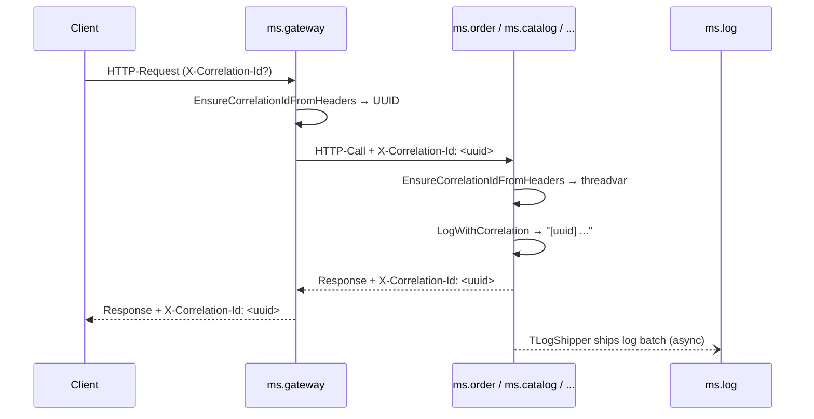
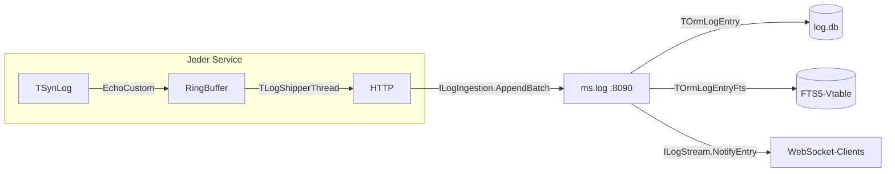

# 07 — Observability & Logging

## Zweck / Wann brauche ich das

In einem Microservice-System laufen Dutzende Requests pro Sekunde durch mehrere Services gleichzeitig.
Ohne Korrelation sind Logzeilen aus `ms.order`, `ms.catalog` und `ms.notification` nicht einer
konkreten Anfrage zuzuordnen. Dieses Kapitel zeigt, wie ein **Correlation-ID-Threadvar** jeden Request
end-to-end markiert, wie ein **zentraler Log-Service** (`ms.log`) alle Zeilen per FTS5 durchsuchbar
macht und wie ein **Live-WebSocket-Stream** neu einlaufende Einträge sofort sichtbar macht — ohne
einen einzigen Änderung in der Service-Logik.

## Kernkonzept

### Correlation ID

Jeder eingehende HTTP-Request erhält eine UUID (`X-Correlation-Id`-Header). Das Gateway erzeugt sie,
falls der Client keine schickt. Alle Services tragen sie im `threadvar` und schreiben sie als Präfix
in jede Logzeile. Ausgehende Backend-Calls hängen sie über einen `OnBeforeCall`-Hook wieder an —
so propagiert die ID automatisch durch die gesamte Service-Kette.



### Zentraler Log-Service

Jeder Service betreibt einen `TLogShipper`: ein `EchoCustom`-Hook auf `TSynLog.Family` kopiert jede
Logzeile in einen Ring-Buffer (maximal 10 000 Einträge). Ein Hintergrund-Thread leert den Buffer alle
250 ms und schickt Batches per `ILogIngestion.AppendBatch` an `ms.log`. Das lokale Logging bleibt
davon unberührt — der Shipper ist rein additiv. `ms.log` persistiert die Einträge in `log.db` und
spiegelt den Message-Text in eine parallele FTS5-Tabelle für Volltextsuche.



### Live-Stream

`ms.log` registriert einen `ILogStream`-Service mit `optExecLockedPerInterface`. Clients abonnieren
sich via WebSocket-Callback (`ILogStreamCallback.NotifyEntry`). Beim Ingestion-Schritt ruft
`TLogIngestionService.AppendBatch` nach jedem erfolgreichen Insert `TLogStreamService.Broadcast` auf.
Tote Connections werden über den mORMot2-`CallbackReleased`-Hook automatisch entfernt.

## Schritt für Schritt

1. **`shared/` vorbereiten** — Unit `shared.correlation` mit `threadvar`, Helper-Funktionen und der
   Header-Konstante anlegen (s. Code-Skelett A).
2. **`TMicroService`-Basisklasse** — `HandleRequestWithCorrelation` als `OnRequest`-Wrapper einbauen:
   extrahiert/setzt die Correlation-ID, loggt REQ/RSP, leert den Threadvar nach dem Call (s. Skelett B).
3. **Gateway** — `EnsureCorrelationIdFromHeaders` am Anfang des eigenen `HandleRequest` aufrufen;
   `ForwardCorrelationId` als `OnBeforeCall` auf jedem `TRestHttpClient`-Backend registrieren (Skelett C).
4. **`TLogShipper`** in `shared/` anlegen — `Attach` installiert den `EchoCustom`-Hook, `Detach` stellt
   ihn wieder her; Hintergrund-Thread flusht Batches (Skelett D).
5. **`ms.log` aufsetzen** — ORM-Modell mit `TOrmLogEntry` + `TOrmLogEntryFts`, drei SOA-Klassen
   `ILogIngestion`, `ILogQuery`, `ILogStream` registrieren (Skelett E).
6. **Logging in Service-Code** — überall `LogWithCorrelation` statt `TSynLog.Add.Log` verwenden;
   Correlation-ID-Präfix erscheint automatisch (Skelett F).

## Code-Skelette

### A — shared/shared.correlation.pas (Auszug)

```pascal
/// <summary>
///   Correlation-ID-Infrastruktur für verteiltes Request-Tracing.
/// </summary>
unit shared.correlation;

{$SCOPEDENUMS ON}
{$WARN SYMBOL_PLATFORM OFF}
{$WARN UNIT_PLATFORM   OFF}

interface

uses
  System.SysUtils,
  mormot.core.base,
  mormot.core.log,
  mormot.core.text,
  mormot.core.unicode;

const
  /// <summary>
  ///   HTTP-Header-Name für die Correlation-ID.
  /// </summary>
  CORRELATION_HEADER = 'X-Correlation-Id';

  /// <summary>
  ///   Großgeschriebene Suchnadel für <c>FindNameValue</c> (inkl. Doppelpunkt + Leerzeichen).
  /// </summary>
  CORRELATION_HEADER_UPPER = 'X-CORRELATION-ID: ';

/// <summary>
///   Liefert die Correlation-ID des aktuellen Threads, oder einen leeren String.
/// </summary>
/// <returns>
///   Aktuelle Correlation-ID oder leer.
/// </returns>
function GetCurrentCorrelationId: RawUtf8;

/// <summary>
///   Speichert eine Correlation-ID im Threadvar des aufrufenden Threads.
/// </summary>
/// <param name="aId">
///   Die zu speichernde Correlation-ID.
/// </param>
procedure SetCurrentCorrelationId(
  const aId: RawUtf8
  );

/// <summary>
///   Löscht die Correlation-ID des aktuellen Threads (nach Request-Ende aufrufen).
/// </summary>
procedure ClearCurrentCorrelationId;

/// <summary>
///   Liest die Correlation-ID aus dem HTTP-Header-Block oder generiert eine neue.
///   Schreibt das Ergebnis in den Threadvar.
/// </summary>
/// <param name="aHeaders">
///   Roher HTTP-Header-Block (CRLF-getrennt).
/// </param>
/// <returns>
///   Effektive Correlation-ID für diesen Request.
/// </returns>
function EnsureCorrelationIdFromHeaders(
  const aHeaders: RawUtf8
  ): RawUtf8;

/// <summary>
///   Schreibt eine Logzeile mit vorangestellter Correlation-ID <c>[uuid] </c>.
///   Funktioniert auch ohne aktive Correlation-ID (Präfix wird weggelassen).
/// </summary>
/// <param name="aLevel">
///   Log-Schweregrad.
/// </param>
/// <param name="aFormat">
///   Format-String mit <c>%</c>-Platzhaltern (mORMot2-Stil).
/// </param>
/// <param name="aArgs">
///   Argumente für den Format-String.
/// </param>
/// <param name="aInstance">
///   Instanz für den TSynLog-Kontext (oder <c>nil</c>).
/// </param>
procedure LogWithCorrelation(
  aLevel: TSynLogLevel;
  const aFormat: RawUtf8;
  const aArgs: array of const;
  aInstance: TObject
  );

implementation

threadvar
  FCurrentCorrelationId: RawUtf8;

function GetCurrentCorrelationId: RawUtf8;
begin
  Result := FCurrentCorrelationId;
end;

procedure SetCurrentCorrelationId(
  const aId: RawUtf8
  );
begin
  FCurrentCorrelationId := aId;
end;

procedure ClearCurrentCorrelationId;
begin
  FCurrentCorrelationId := '';
end;

function EnsureCorrelationIdFromHeaders(
  const aHeaders: RawUtf8
  ): RawUtf8;
var
  NewId: TGuid;
  AsText: RawUtf8;
begin
  // FindNameValue erwartet die Nadel in Großschreibung inkl. ': '
  FindNameValue(aHeaders, PAnsiChar(CORRELATION_HEADER_UPPER), Result);
  if Result = '' then
  begin
    CreateGuid(NewId);
    AsText := GuidToRawUtf8(NewId);
    if (Length(AsText) >= 2) and (AsText[1] = '{') then
      Result := LowerCase(Copy(AsText, 2, Length(AsText) - 2))
    else
      Result := LowerCase(AsText);
  end;
  FCurrentCorrelationId := Result;
end;

procedure LogWithCorrelation(
  aLevel: TSynLogLevel;
  const aFormat: RawUtf8;
  const aArgs: array of const;
  aInstance: TObject
  );
var
  Prefixed: RawUtf8;
begin
  if FCurrentCorrelationId <> '' then
    Prefixed := FormatUtf8('[%] %', [FCurrentCorrelationId, aFormat])
  else
    Prefixed := aFormat;
  TSynLog.Add.Log(aLevel, FormatUtf8(Prefixed, aArgs), aInstance);
end;

end.
```

### B — TMicroService.HandleRequestWithCorrelation (in shared/shared.service.pas)

```pascal
function TMicroService.HandleRequestWithCorrelation(
  aCtxt: THttpServerRequestAbstract
  ): cardinal;
var
  CorrId: RawUtf8;
begin
  CorrId := EnsureCorrelationIdFromHeaders(aCtxt.InHeaders);
  aCtxt.OutCustomHeaders :=
    aCtxt.OutCustomHeaders + #13#10 + CORRELATION_HEADER + ': ' + CorrId;
  LogWithCorrelation(sllInfo, '% REQ % %', [FServiceName, aCtxt.Method, aCtxt.Url], self);
  try
    Result := FInnerHttpHandler(aCtxt);
    LogWithCorrelation(sllInfo, '% RSP % % -> %',
      [FServiceName, aCtxt.Method, aCtxt.Url, Result], self);
  finally
    // HTTP-Thread-Pool: Threadvar nach Request leeren, damit der nächste Request
    // keine veraltete ID erbt.
    ClearCurrentCorrelationId;
  end;
end;
```

Einbinden im `Run`-Verfahren der Basisklasse:

```pascal
// OnRequest-Kette: originalen Handler sichern, Wrapper einhängen
FInnerHttpHandler := FHttpServer.HttpServer.OnRequest;
FHttpServer.HttpServer.OnRequest := HandleRequestWithCorrelation;
```

### C — Gateway: ForwardCorrelationId-Hook

```pascal
// Callback-Typ: TOnRestClientCallUri → fires on the calling thread before every outgoing call
procedure TOrderGateway.ForwardCorrelationId(
  const aSender: TRestClientUri;
  var aCall: TRestUriParams
  );
var
  CorrId: RawUtf8;
begin
  CorrId := GetCurrentCorrelationId;
  if CorrId <> '' then
    AppendLine(aCall.InHead, [CORRELATION_HEADER + ': ', CorrId]);
end;

// Bei ConnectToBackend registrieren:
FOrderClient.OnBeforeCall := ForwardCorrelationId;
FCatalogClient.OnBeforeCall := ForwardCorrelationId;
```

### D — TLogShipper (shared/shared.logclient.pas, Grundstruktur)

```pascal
/// <summary>
///   Hintergrund-Log-Shipper: leitet TSynLog-Zeilen per Batch an ms.log weiter.
/// </summary>
unit shared.logclient;

{$SCOPEDENUMS ON}
{$WARN SYMBOL_PLATFORM OFF}
{$WARN UNIT_PLATFORM   OFF}

// ... (uses, Konstanten MAX_QUEUE_SIZE=10000, MAX_BATCH_SIZE=100, FLUSH_INTERVAL_MS=250)

type

  TLogShipper = class
  strict private
    FServiceName: RawUtf8;
    FHost: RawUtf8;
    FPort: RawUtf8;
    FClient: TRestHttpClientWebsockets;
    FIngestion: ILogIngestion;
    FQueue: TLogEntryIngestDtoArray;    // Ring-Buffer, Größe MAX_QUEUE_SIZE
    FQueueHead: PtrInt;
    FQueueCount: PtrInt;
    FQueueLock: TRTLCriticalSection;
    FThread: TThread;                  // TLogShipperThread
    FAttached: Boolean;
    FPreviousEcho: TOnTextWriterEcho;

    /// <summary>
    ///   EchoCustom-Callback: läuft im Log-Lock, darf nicht blockieren.
    ///   Trägt Eintrag in den Ring-Buffer ein und weckt den Flush-Thread.
    /// </summary>
    /// <param name="aSender">Text-Writer (ungenutzt).</param>
    /// <param name="aLevel">Log-Level des Eintrags.</param>
    /// <param name="aText">Vollständig formatierte Logzeile.</param>
    /// <returns>Immer <c>True</c> (Logging fortsetzen).</returns>
    function OnLogEcho(
      aSender: TEchoWriter;
      aLevel: TSynLogLevel;
      const aText: RawUtf8
      ): Boolean;
  public

    /// <summary>
    ///   Erstellt den Shipper. Shipping startet erst nach <c>Attach</c>.
    /// </summary>
    /// <param name="aServiceName">Bezeichner des produzierenden Service.</param>
    /// <param name="aHost">Hostname von ms.log.</param>
    /// <param name="aPort">Port von ms.log.</param>
    constructor Create(
      const aServiceName, aHost, aPort: RawUtf8
      );

    destructor Destroy; override;

    /// <summary>
    ///   Installiert den EchoCustom-Hook und startet den Flush-Thread.
    /// </summary>
    procedure Attach;

    /// <summary>
    ///   Stellt den vorherigen EchoCustom wieder her und stoppt den Thread.
    /// </summary>
    procedure Detach;
  end;
```

Lebenszyklus im Service:

```pascal
FLogShipper := TLogShipper.Create(FServiceName, LogsHost, LogsPort);
FLogShipper.Attach;
// ... Service läuft ...
FLogShipper.Detach;
FreeAndNil(FLogShipper);
```

### E — ms.log Service-Setup (ms.log/log.server.pas, Auszug)

```pascal
procedure TLogServer.SetupServices;
var
  StreamFactory: TServiceFactoryServerAbstract;
begin
  // Stream-Service zuerst, damit der Ingestion-Service ihn referenzieren kann.
  FStreamImpl := TLogStreamService.Create;
  FIngestionImpl := TLogIngestionService.Create(FRestServer.Orm, FStreamImpl);
  FQueryImpl := TLogQueryService.Create(FRestServer.Orm);
  RegisterService(FIngestionImpl, TypeInfo(ILogIngestion));
  RegisterService(FQueryImpl, TypeInfo(ILogQuery));
  StreamFactory := RegisterService(FStreamImpl, TypeInfo(ILogStream));
  // NotifyEntry-Calls serialisiert pro Subscriber → vorhersagbare Reihenfolge.
  StreamFactory.SetOptions([], [optExecLockedPerInterface]);
end;
```

ORM-Modell: reguläre Tabelle `TOrmLogEntry` + FTS5-Virtualtabelle `TOrmLogEntryFts`.
FTS5-Suche über Join auf `RowID`:

```pascal
// In ILogQuery.Search:
WhereClause := FormatUtf8(
  'RowID IN (SELECT RowID FROM LogEntryFts WHERE Message MATCH ''%'' LIMIT %) ORDER BY Timestamp DESC',
  [aText, Limit]);
Result := LogEntriesFromQuery(FOrm, WhereClause);
```

Correlation-ID per Regex aus der Message extrahieren (beim Ingestion-Schritt):

```pascal
// Sucht '[xxxxxxxx-xxxx-xxxx-xxxx-xxxxxxxxxxxx]'-Muster, gibt UUID ohne Klammern zurück.
Rec.CorrelationId := ExtractCorrelationIdFromMessage(aEntries[EntryIdx].Message);
```

### F — Logging im Service-Code

```pascal
uses
  shared.correlation;

// Statt:   TSynLog.Add.Log(sllInfo, 'Order % placed', [OrderId], self);
// Einfach:
LogWithCorrelation(sllInfo, 'Order % placed', [OrderId], self);
// Erzeugt: 20260618 14:05:22 [a8f3c1e9-...] IFO  Order 99 placed
```

## Stolperfallen / Lessons

- **Threadvar nach Request leeren**: der HTTP-Server von mORMot2 arbeitet mit einem Thread-Pool.
  Ohne `ClearCurrentCorrelationId` am Ende des Handlers erbt der nächste Request die ID des
  vorherigen — subtiler, schwer reproduzierbarer Bug.
- **`EchoCustom`-Hook darf nicht blockieren**: der Hook läuft im internen Log-Lock. Jede I/O-
  Operation hier erzeugt einen Deadlock. Ausschließlich in den Ring-Buffer schreiben und den
  Thread-Event setzen.
- **Eigenen Flush-Thread ausschließen**: beim `AppendBatch`-Call erzeugt mORMot2 selbst
  Logzeilen. Ohne Prüfung der Thread-ID entsteht eine Endlosrekursion im `OnLogEcho`.
- **`FindNameValue` erwartet Großschreibung**: die Nadel muss in Großbuchstaben übergeben werden
  inklusive `: ` — also `'X-CORRELATION-ID: '`, nicht `'X-Correlation-Id'`.
- **FTS5-Join über RowID**: die FTS5-Virtualtabelle hat keine Foreign-Key-Spalte; der Join
  läuft ausschließlich über `RowID = RowID`. Beide Rows in derselben Transaktion einfügen.
- **`optExecLockedPerInterface` für den Stream-Service**: ohne diese Option können mehrere
  Ingestion-Threads denselben Subscriber gleichzeitig aufrufen und Nachrichten vertauschen.

## Querverweise

- [02-service-erstellen.md](02-service-erstellen.md) — TMicroService-Basisklasse, `Run`-Methode
- [06-websocket-callbacks.md](06-websocket-callbacks.md) — ILogStreamCallback, Shutdown-Disziplin
- [09-event-bus.md](09-event-bus.md) — analoges Broadcast-Muster über den Event-Bus
- [10-testing.md](10-testing.md) — TSynTestCase, in-process `:memory:`-SQLite
