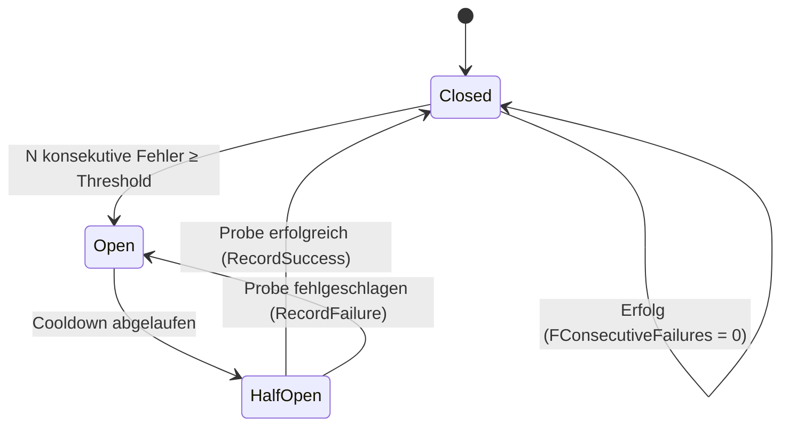
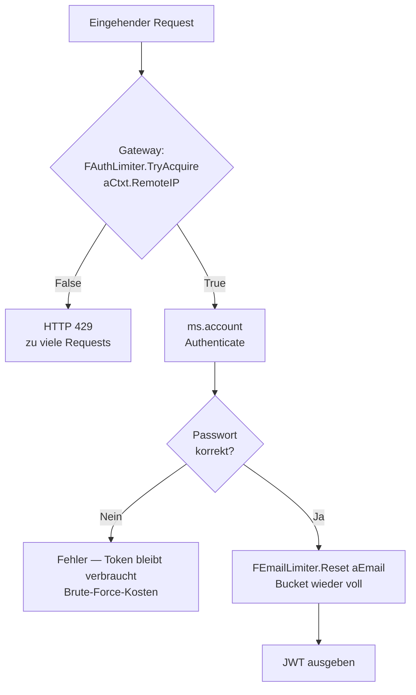

# 08 — Resilience: Rate Limiter & Circuit Breaker

## Zweck / Wann brauche ich das

Ein Microservice-System ist nur so stabil wie sein schwächstes Glied. Zwei unabhängige Probleme
treten regelmäßig auf: (1) Ein Client schickt in kurzer Zeit tausende Requests und überlastet einen
Endpunkt (Brute-Force, Fehler in der Client-Schleife). (2) Ein Backend-Service hängt — und jede
wartende Verbindung bindet einen Thread, bis der Pool erschöpft ist und der gesamte Gateway hängt.
Der **Token-Bucket-RateLimiter** löst Problem 1, der **3-State-CircuitBreaker** Problem 2.
Beide liegen in `shared/` und sind ohne Abhängigkeit voneinander einsetzbar.

## Kernkonzept

### Token-Bucket-RateLimiter

Jeder Client erhält einen unsichtbaren Eimer mit `Capacity` Tokens. Pro Request wird ein Token
verbraucht. Leerer Eimer → HTTP 429. Der Eimer füllt sich mit `RefillPerSec` Tokens pro Sekunde
nach. Das erlaubt kurze Bursts (ehrliche Nutzer sehen keine Reibung), drosselt aber dauerhaft
schnelle Angreifer auf die Refill-Rate. Buckets werden per Key isoliert: ein aggressiver Client
blockiert keine anderen.

Implementierungsdetails: der Backing-Store ist absichtlich ein flaches Array (kein Dictionary),
damit die Storage-Schicht später austauschbar bleibt (LRU-Cache, Redis). Idle-Eviction läuft
amortisiert — höchstens einmal pro `IdleTtlMs` — damit kein unbegrenztes Wachstum des Arrays
entsteht. Thread-Sicherheit via `TLightLock` (Spinlock); der Lock wird **nicht** über I/O
gehalten, nur für die kurze Lookup-Refill-Decrement-Sequenz.

### CircuitBreaker (3 Zustände)



- **Closed** (Normal): Calls passieren, Fehler werden gezählt.
- **Open** (Unhealthy): `AllowRequest` liefert sofort `False` — kein Socket, kein Timeout.
  Bleibt für die Cooldown-Dauer (`OpenTimeoutMs`) geöffnet.
- **HalfOpen** (Probe): genau ein Test-Call wird durchgelassen. Gelingt er → `Closed`;
  scheitert er → erneut `Open` für einen vollen Cooldown.

Nur **ein** Probe gleichzeitig: `FProbeInFlight` verhindert, dass ein recovering Backend sofort
von einem Anfrage-Storm getroffen wird.

Thread-Sicherheit: `TLightLock`; der Lock wird **nie** über den eigentlichen Upstream-Call
gehalten — nur für Zustandsinspektion und Transition.

## Schritt für Schritt

### RateLimiter einrichten

1. **Instanz anlegen** — einmal pro Service / Endpunkt-Gruppe im Konstruktor des Servers:
   ```pascal
   FAuthLimiter := TRateLimiter.Create('gateway.auth', 20.0, 0.5);
   ```
2. **Im Request-Handler prüfen** — vor jedem teuren Call:
   ```pascal
   if not FAuthLimiter.TryAcquire(aCtxt.RemoteIP) then
     Exit(HTTP_TOOMANYREQUESTS);
   ```
3. **Bei Erfolg refunden** (optional, für Login-Endpunkte):
   ```pascal
   if LoginSucceeded then
     FAuthLimiter.Reset(aEmail);
   ```
4. **Instanz freigeben** — im Destruktor des Servers: `FreeAndNil(FAuthLimiter)`.

### CircuitBreaker einrichten

1. **Eine Instanz pro geschütztes Backend** anlegen:
   ```pascal
   FCatalogBreaker := TCircuitBreaker.Create('ms.catalog');
   FOrderBreaker   := TCircuitBreaker.Create('ms.order', 5, 60000);
   ```
2. **Im Call-Wrapper prüfen** — `AllowRequest` vor dem eigentlichen Call:
   ```pascal
   if FCatalogBreaker.AllowRequest then
     try
       Result := FCatalogClient.ServiceOrFail.GetProduct(aId);
       FCatalogBreaker.RecordSuccess;
     except
       FCatalogBreaker.RecordFailure;
       // Fallback: leeres Ergebnis oder cached Wert zurückgeben
     end
   else
     // Fast-fail: Backend als nicht verfügbar markieren, kein Socket-Timeout
   ```
3. **Instanz freigeben** im Destruktor.

## Code-Skelette

### shared/shared.ratelimiter.pas (vollständige öffentliche API)

```pascal
/// <summary>
///   Token-Bucket-Rate-Limiter für heiße Endpunkte (Auth, Suche, …).
/// </summary>
unit shared.ratelimiter;

{$SCOPEDENUMS ON}
{$WARN SYMBOL_PLATFORM OFF}
{$WARN UNIT_PLATFORM   OFF}

interface

uses
  System.SysUtils,
  mormot.core.base,
  mormot.core.log,
  mormot.core.os,
  mormot.core.text;

const
  /// <summary>
  ///   Standard-Burst-Größe: 10 Tokens pro Bucket.
  /// </summary>
  DEFAULT_BUCKET_CAPACITY  = 10.0;

  /// <summary>
  ///   Standard-Refill-Rate: ~1 Token alle 6 Sekunden.
  /// </summary>
  DEFAULT_REFILL_PER_SEC   = 0.1667;

  /// <summary>
  ///   Standard-Idle-TTL: 10 Minuten, danach wird der Bucket evicted.
  /// </summary>
  DEFAULT_IDLE_TTL_MS      = 600000;

type

  /// <summary>
  ///   Ein einzelner per-Key-Token-Bucket.
  /// </summary>
  TRateBucket = record
  public
    /// <summary>Lookup-Key (z. B. Client-IP oder E-Mail-Adresse).</summary>
    Key: RawUtf8;
    /// <summary>Aktuelle Token-Anzahl (Fließkomma für genaue Teilrefills).</summary>
    Tokens: Double;
    /// <summary>Tick des letzten Refills (<c>GetTickCount64</c>).</summary>
    LastRefillTick: Int64;
    /// <summary>Tick des letzten Zugriffs (für Idle-Eviction).</summary>
    LastAccessTick: Int64;
  end;

  TRateBuckets = array of TRateBucket;

  /// <summary>
  ///   Thread-sicherer Token-Bucket-Rate-Limiter. Eine Instanz pro Ressource/Policy.
  /// </summary>
  TRateLimiter = class
  strict private
    FName: RawUtf8;
    FCapacity: Double;
    FRefillPerSec: Double;
    FIdleTtlMs: Int64;
    FBuckets: TRateBuckets;
    FLastEvictTick: Int64;
    FLock: TLightLock;

    /// <summary>
    ///   Linearer Such-Index des Buckets. Caller muss <c>FLock</c> halten.
    /// </summary>
    /// <param name="aKey">Lookup-Key.</param>
    /// <returns>Index oder <c>-1</c>.</returns>
    function FindBucketIdx(
      const aKey: RawUtf8
      ): PtrInt;

    /// <summary>
    ///   Befüllt Bucket zeitproportional nach. Caller muss <c>FLock</c> halten.
    /// </summary>
    /// <param name="aBucket">Bucket-Referenz.</param>
    /// <param name="aNowTick">Aktueller Tick-Count.</param>
    procedure RefillBucket(
      var aBucket: TRateBucket;
      const aNowTick: Int64
      );

    /// <summary>
    ///   Evicted Buckets mit Idle-Zeit ≥ <c>FIdleTtlMs</c>. Amortisiert.
    ///   Caller muss <c>FLock</c> halten.
    /// </summary>
    /// <param name="aNowTick">Aktueller Tick-Count.</param>
    procedure EvictIdle(
      const aNowTick: Int64
      );
  public

    /// <summary>
    ///   Erstellt einen Rate-Limiter mit der angegebenen Policy.
    /// </summary>
    /// <param name="aName">Bezeichner für Log-Meldungen.</param>
    /// <param name="aCapacity">Burst-Größe in Tokens.</param>
    /// <param name="aRefillPerSec">Refill-Rate in Tokens pro Sekunde.</param>
    /// <param name="aIdleTtlMs">Idle-Eviction-Timeout in Millisekunden.</param>
    constructor Create(
      const aName: RawUtf8;
      const aCapacity: Double = DEFAULT_BUCKET_CAPACITY;
      const aRefillPerSec: Double = DEFAULT_REFILL_PER_SEC;
      const aIdleTtlMs: Int64 = DEFAULT_IDLE_TTL_MS
      );

    /// <summary>
    ///   Versucht, einen Token vom Bucket <c>aKey</c> zu verbrauchen.
    ///   Erstellt den Bucket beim ersten Zugriff.
    /// </summary>
    /// <param name="aKey">Lookup-Key (IP, E-Mail, …).</param>
    /// <returns>
    ///   <c>True</c>: Token verbraucht, Call erlaubt.
    ///   <c>False</c>: Bucket leer, Call ablehnen (HTTP 429).
    /// </returns>
    function TryAcquire(
      const aKey: RawUtf8
      ): Boolean;

    /// <summary>
    ///   Wie <c>TryAcquire</c>, verbraucht aber <c>aTokens</c> auf einmal
    ///   (für aufwändigere Operationen).
    /// </summary>
    /// <param name="aKey">Lookup-Key.</param>
    /// <param name="aTokens">Zu verbrauchende Token-Anzahl (> 0).</param>
    /// <returns>
    ///   <c>True</c> wenn genug Token vorhanden, sonst <c>False</c>.
    /// </returns>
    function TryAcquireN(
      const aKey: RawUtf8;
      const aTokens: Double
      ): Boolean;

    /// <summary>
    ///   Setzt den Bucket <c>aKey</c> auf volle Kapazität zurück.
    ///   Einsatz: erfolgreicher Login → E-Mail-Bucket refunden, damit Tippfehler
    ///   den Nutzer nicht aussperren.
    /// </summary>
    /// <param name="aKey">Lookup-Key.</param>
    procedure Reset(
      const aKey: RawUtf8
      );

    /// <summary>Aktuelle Anzahl aktiver Buckets (Snapshot, für Tests/Metriken).</summary>
    /// <returns>Bucket-Anzahl.</returns>
    function BucketCount: PtrInt;

    /// <summary>Bezeichner für Log-Meldungen.</summary>
    property Name: RawUtf8 read FName;
    /// <summary>Burst-Größe in Tokens.</summary>
    property Capacity: Double read FCapacity;
    /// <summary>Refill-Rate in Tokens pro Sekunde.</summary>
    property RefillPerSec: Double read FRefillPerSec;
    /// <summary>Idle-Eviction-Timeout in Millisekunden.</summary>
    property IdleTtlMs: Int64 read FIdleTtlMs;
  end;

implementation
// ... (Implementierung entsprechend den öffentlichen Verträgen oben)
end.
```

### shared/shared.circuitbreaker.pas (vollständige öffentliche API)

```pascal
/// <summary>
///   3-State-Circuit-Breaker für Upstream-Service-Calls.
/// </summary>
unit shared.circuitbreaker;

{$SCOPEDENUMS ON}
{$WARN SYMBOL_PLATFORM OFF}
{$WARN UNIT_PLATFORM   OFF}

interface

uses
  System.SysUtils,
  mormot.core.base,
  mormot.core.log,
  mormot.core.os,
  mormot.core.text;

const
  /// <summary>
  ///   Standard-Fehler-Schwelle: 3 konsekutive Fehler öffnen den Breaker.
  /// </summary>
  DEFAULT_FAILURE_THRESHOLD = 3;

  /// <summary>
  ///   Standard-Cooldown: 30 Sekunden im Open-Zustand, bevor ein Probe erlaubt wird.
  /// </summary>
  DEFAULT_OPEN_TIMEOUT_MS = 30000;

type

  /// <summary>
  ///   Zustand eines <c>TCircuitBreaker</c>.
  /// </summary>
  TCircuitBreakerState = (
    /// <summary>
    ///   Normalbetrieb: Calls passieren, Fehler werden gezählt.
    /// </summary>
    Closed,

    /// <summary>
    ///   Backend unhealthy: <c>AllowRequest</c> liefert sofort <c>False</c>.
    ///   Kein Socket, kein Timeout.
    /// </summary>
    Open,

    /// <summary>
    ///   Recovery-Probe: genau ein Test-Call wird durchgelassen.
    /// </summary>
    HalfOpen
    );

  /// <summary>
  ///   Thread-sicherer Circuit-Breaker. Eine Instanz pro geschütztem Upstream,
  ///   geteilt über alle Request-Threads.
  /// </summary>
  TCircuitBreaker = class
  strict private
    FName: RawUtf8;
    FFailureThreshold: Integer;
    FOpenTimeoutMs: Int64;
    FState: TCircuitBreakerState;
    FConsecutiveFailures: Integer;
    FOpenedAtTick: Int64;
    FProbeInFlight: Boolean;
    FLock: TLightLock;

    /// <summary>
    ///   Führt eine Zustandsüberführung durch und loggt sie.
    ///   Caller muss <c>FLock</c> halten.
    ///   Übergang zu <c>Closed</c> setzt <c>FConsecutiveFailures</c> zurück.
    /// </summary>
    /// <param name="aNew">Ziel-Zustand.</param>
    procedure TransitionTo(
      const aNew: TCircuitBreakerState
      );
  public

    /// <summary>
    ///   Erstellt einen Breaker im <c>Closed</c>-Zustand.
    /// </summary>
    /// <param name="aName">Bezeichner (z. B. Upstream-Service-Name).</param>
    /// <param name="aFailureThreshold">Anzahl konsekutiver Fehler bis zum Trip.</param>
    /// <param name="aOpenTimeoutMs">Cooldown-Dauer in Millisekunden.</param>
    constructor Create(
      const aName: RawUtf8;
      const aFailureThreshold: Integer = DEFAULT_FAILURE_THRESHOLD;
      const aOpenTimeoutMs: Int64 = DEFAULT_OPEN_TIMEOUT_MS
      );

    /// <summary>
    ///   Prüft, ob ein Upstream-Call aktuell erlaubt ist.
    ///   Im <c>HalfOpen</c>-Zustand reserviert diese Methode den einzigen Probe-Slot.
    /// </summary>
    /// <returns>
    ///   <c>True</c>: Call erlaubt (<c>Closed</c> oder Probe-Slot gerade erworben).
    ///   <c>False</c>: Breaker <c>Open</c> oder Probe bereits in Flight.
    /// </returns>
    function AllowRequest: Boolean;

    /// <summary>
    ///   Meldet einen erfolgreichen Upstream-Call.
    ///   <c>Closed</c>: setzt Fehler-Counter zurück.
    ///   <c>HalfOpen</c>: schließt den Breaker wieder.
    /// </summary>
    procedure RecordSuccess;

    /// <summary>
    ///   Meldet einen fehlgeschlagenen Upstream-Call.
    ///   <c>Closed</c>: inkrementiert Counter, öffnet bei Threshold.
    ///   <c>HalfOpen</c>: öffnet den Breaker erneut für einen Cooldown.
    /// </summary>
    procedure RecordFailure;

    /// <summary>
    ///   Aktueller Zustand (Snapshot, kann sich sofort ändern).
    /// </summary>
    /// <returns><c>TCircuitBreakerState</c>.</returns>
    function CurrentState: TCircuitBreakerState;

    /// <summary>Bezeichner für Log-Meldungen.</summary>
    property Name: RawUtf8 read FName;
  end;

implementation
// ... (Implementierung entsprechend den öffentlichen Verträgen oben)
end.
```

### Integration im Gateway (ms.gateway/gateway.server.pas)

```pascal
// ---- Felder (strict private) ----
FCatalogBreaker:    TCircuitBreaker;
FOrderBreaker:      TCircuitBreaker;
FNotificationBreaker: TCircuitBreaker;
FAuthLimiter:       TRateLimiter;

// ---- Konstruktor ----
FCatalogBreaker    := TCircuitBreaker.Create('ms.catalog');
FOrderBreaker      := TCircuitBreaker.Create('ms.order');
FNotificationBreaker := TCircuitBreaker.Create('ms.notification');
// 20 Burst-Tokens, 0.5 Token/s (1 Request alle 2 Sekunden dauerhaft)
FAuthLimiter := TRateLimiter.Create('gateway.auth', 20.0, 0.5);

// ---- Rate Limiter: Auth-Endpunkt absichern ----
if IsAuthPath(aCtxt.Url) and not FAuthLimiter.TryAcquire(aCtxt.RemoteIP) then
  Exit(HTTP_TOOMANYREQUESTS);

// ---- Circuit Breaker: Catalog-Call absichern ----
if FCatalogBreaker.AllowRequest then
  try
    CatalogResult := FCatalogSvc.GetProducts(aFilter);
    FCatalogBreaker.RecordSuccess;
  except
    FCatalogBreaker.RecordFailure;
    CatalogResult := nil; // Fallback: leeres Ergebnis
  end;
// else: Fast-fail, kein Socket-Overhead

// ---- Integration mit Auth-Service: bei Erfolg Bucket refunden ----
// (im Auth-Service selbst, nicht im Gateway)
if AuthenticationSucceeded then
  FEmailLimiter.Reset(aEmail);
```

### Zwei-Schichten-Muster für Auth-Endpunkte



Der Gateway schützt mit IP-Schlüssel (grobe Ebene), der Account-Service mit E-Mail-Schlüssel
(feine Ebene). Ehrliche Nutzer sehen beim erfolgreichen Login nie eine Drosselung.

## Stolperfallen / Lessons

- **`TLightLock` nie über I/O halten**: der Spinlock ist für mikroskopisch kurze kritische
  Abschnitte (Lookup, Refill, Decrement) ausgelegt. Ein Upstream-Call unter dem Lock würde jeden
  anderen Request-Thread blockieren.
- **Probe-in-Flight-Flag**: ohne `FProbeInFlight` würden beim Übergang `Open → HalfOpen` mehrere
  parallele Request-Threads gleichzeitig den Probe machen und ein gerade erholendes Backend
  sofort wieder überlasten.
- **Threshold bewusst niedrig halten**: bei mehreren Sekunden Timeout pro Call bedeuten 10
  konsekutive Fehler bereits 10+ Sekunden Wartezeit für jeden Thread davor. Default 3 ist
  ein vernünftiger Ausgangspunkt; zu groß → zu lange Degradierung, zu klein → Flapping.
- **Separate Instanzen pro Backend**: ein Breaker pro Upstream, nicht ein globaler. Fällt
  `ms.notification` aus, sollen Calls an `ms.catalog` weiterhin funktionieren.
- **Rate Limiter `Reset` bei Erfolg**: nur bei Endpunkten sinnvoll, wo ein Erfolg beweist,
  dass der Aufrufer legitim ist (z. B. korrektes Passwort). Für reine Flood-Protection
  (z. B. Such-API) wird `Reset` nicht aufgerufen.
- **Idle-Eviction verhindert Memory-Leak**: ohne Eviction wächst das Bucket-Array mit jeder
  eindeutigen Client-IP unbegrenzt. `DEFAULT_IDLE_TTL_MS = 600000` (10 min) ist ein guter
  Kompromiss für typische Produktions-Szenarien.

## Querverweise

- [02-service-erstellen.md](02-service-erstellen.md) — TMicroService-Basisklasse, Konstruktor-Pattern
- [04-web-gateway.md](04-web-gateway.md) — Gateway-HandleRequest, OnBeforeCall
- [05-authentifizierung.md](05-authentifizierung.md) — Auth-Endpunkt, SCRAM-MCF, JWT
- [07-observability-logging.md](07-observability-logging.md) — LogWithCorrelation, das die Zustandsübergänge des Breakers sichtbar macht
- [10-testing.md](10-testing.md) — Unit-Tests für Breaker-Zustandsmaschine mit in-process TSynTestCase
