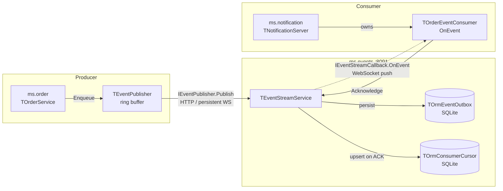
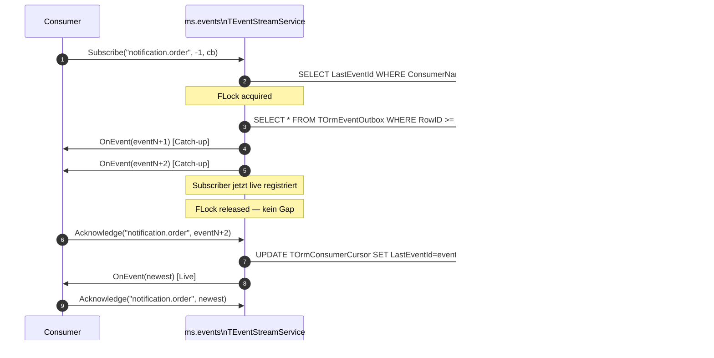

# 09 — Event-Bus: Persistente Domain-Events und Cross-Service-Kaskaden

## Zweck / Wann brauche ich das

Ein synchroner Aufruf zwischen Services — `ms.order` ruft `ms.notification` direkt auf —
koppelt beide Services auf Verfügbarkeit und Latenz. Fällt `ms.notification` kurz aus,
schlägt der Order-Write fehl. Der Event-Bus entkoppelt Producer und Consumer vollständig:
`ms.order` schreibt die Bestellung, enqueue ein `OrderPlaced`-Event, und antwortet dem
Client — ohne zu warten, ob `ms.notification` gerade erreichbar ist. Der Bus persistiert
das Event, der Consumer holt es nach, sobald er wieder online ist. Dieses Muster ist die
richtige Wahl, wenn Konsistenz über Servicegrenzen hinweg nötig ist, aber keine
synchrone Antwort des Downstream-Service gebraucht wird.

## Kernkonzept



Drei Transportebenen auf demselben Port:

- **HTTP**: Producer ruft `IEventPublisher.Publish` auf (ein Roundtrip).
- **WebSocket binary** (`synopsebin`): Consumer subscribiert via `IEventStream.Subscribe`;
  der Bus pusht `OnEvent`-Callbacks über denselben Socket zurück.
- **SOA in-process**: `Acknowledge` und `Unsubscribe` fahren über den gleichen Socket.

### Garantien

| Eigenschaft | Verhalten |
|---|---|
| At-least-once delivery | Event wird erneut zugestellt nach Consumer-Absturz oder Reconnect |
| Cursor-basiertes Resume | Consumer setzt beim letzten ACKed-Event fort — kein Re-Replay |
| Monotone ACK-Garde | Kleinere ID überschreibt nie den Cursor-Fortschritt |
| Outbox-first | Event ist in SQLite, bevor Broadcast startet |
| Fehler-Schwelle | Consumer mit ≥ 3 Fehlern in Folge wird evictiert; Reconnect-Thread holt ihn zurück |

Consumer müssen **idempotent** sein: at-least-once bedeutet, ein Event kann mehrfach
ankommen. Kaskaden wie „DELETE WHERE entity_id = X" sind von Natur aus idempotent; bei
inkrementellen Operationen ist eine eigene Dedup-Tabelle nötig.

## Schritt für Schritt

### 1. ORM-Modell in `ms.events` registrieren

Der Bus braucht zwei Tabellen. `TOrmEventOutbox` ist der persistente Event-Log;
seine SQLite-RowID wird zur bus-weit eindeutigen Event-ID. `TOrmConsumerCursor` hält
den Fortschritt jedes benannten Consumers.

```pascal
/// <summary>
///   Persistenter Event-Log. Die SQLite-RowID ist die monotone Bus-Event-ID.
/// </summary>
TOrmEventOutbox = class(TOrm)
public
  EventType:       RawUtf8;   // index 100
  PayloadJson:     RawUtf8;
  ProducerService: RawUtf8;   // index 64
  CreatedAt:       TDateTime;
  CorrelationId:   RawUtf8;   // index 64
  SchemaVersion:   Integer;
published
  property EventType:       RawUtf8   read FEventType       write FEventType;
  property PayloadJson:     RawUtf8   read FPayloadJson      write FPayloadJson;
  property ProducerService: RawUtf8   read FProducerService  write FProducerService;
  property CreatedAt:       TDateTime read FCreatedAt        write FCreatedAt;
  property CorrelationId:   RawUtf8   read FCorrelationId    write FCorrelationId;
  property SchemaVersion:   Integer   read FSchemaVersion    write FSchemaVersion;
end;

/// <summary>
///   Cursor-Zeile pro logischem Consumer; überlebt Service-Neustarts.
/// </summary>
TOrmConsumerCursor = class(TOrm)
public
  ConsumerName: RawUtf8;   // index 100, AS_UNIQUE
  LastEventId:  TID;
  UpdatedAt:    TDateTime;
published
  property ConsumerName: RawUtf8   read FConsumerName write FConsumerName;
  property LastEventId:  TID       read FLastEventId  write FLastEventId;
  property UpdatedAt:    TDateTime read FUpdatedAt    write FUpdatedAt;
end;
```

### 2. Shared API definieren (typed records + Interfaces)

Die Verträge leben in `shared/` und werden von Producer und Consumer gleichermaßen
eingebunden. Niemals `RawJson` als Interface-Rückgabe — nur typed records.

Event-Typ-Konstanten als eigene Strings statt Magic Literals: ein Tippfehler wird so
zum Compile-Error.

```pascal
const
  EVENT_ORDER_PLACED    = 'OrderPlaced';
  EVENT_ORDER_CANCELLED = 'OrderCancelled';
  EVENT_SCHEMA_ORDER_V1 = 1;

type

/// <summary>
///   Wire-Record für alle Bus-Events. Wird von Producer und Consumer geteilt.
/// </summary>
TEventDto = packed record
public
  /// <summary>Bus-zugewiesene monotone ID (0 vor Persistenz).</summary>
  ID:              TID;
  /// <summary>Logischer Ereignistyp, z. B. EVENT_ORDER_PLACED.</summary>
  EventType:       RawUtf8;
  /// <summary>Opakes JSON-Payload; Schema liegt beim Producer.</summary>
  PayloadJson:     RawJson;
  /// <summary>Ursprungs-Service-Name.</summary>
  ProducerService: RawUtf8;
  /// <summary>UTC-Akzeptanzzeit des Bus.</summary>
  CreatedAt:       TDateTime;
  /// <summary>Propagierter Trace-Identifier.</summary>
  CorrelationId:   RawUtf8;
  /// <summary>Payload-Schemaversion; ab 1, Increment bei Breaking Change.</summary>
  SchemaVersion:   Integer;
end;

TEventDtoArray = TArray<TEventDto>;

/// <summary>
///   Server-zu-Client-Push-Callback; wird über den WebSocket aufgerufen.
/// </summary>
IEventStreamCallback = interface(IInvokable)
  ['{A1B2C3D4-E5F6-7890-ABCD-EF1234567890}']

  /// <summary>
  ///   Wird für jedes publizierte Event pro Subscriber einmal aufgerufen.
  /// </summary>
  /// <param name="aEvent">
  ///   Das zugestellte Domain-Event.
  /// </param>
  procedure OnEvent(
    const aEvent: TEventDto
    );
end;

/// <summary>
///   Write-Pfad: ein Event publizieren.
/// </summary>
IEventPublisher = interface(IInvokable)
  ['{B2C3D4E5-F6A7-8901-BCDE-F12345678901}']

  /// <summary>
  ///   Publiziert ein Event; gibt die vom Bus zugewiesene ID zurück.
  /// </summary>
  /// <param name="aEventType">
  ///   Typ-Konstante, z. B. EVENT_ORDER_PLACED.
  /// </param>
  /// <param name="aPayloadJson">
  ///   Serialisiertes Event-Payload als JSON.
  /// </param>
  /// <param name="aProducerService">
  ///   Service-Name des Producers.
  /// </param>
  /// <param name="aSchemaVersion">
  ///   Payload-Schemaversion, ab 1.
  /// </param>
  /// <returns>
  ///   Bus-zugewiesene monotone Event-ID.
  /// </returns>
  function Publish(
    const aEventType:       RawUtf8;
    const aPayloadJson:     RawJson;
    const aProducerService: RawUtf8;
    const aSchemaVersion:   Integer
    ): TID;
end;

/// <summary>
///   Read-Pfad: Subscribe, Acknowledge, Unsubscribe.
/// </summary>
IEventStream = interface(IServiceWithCallbackReleased)
  ['{C3D4E5F6-A7B8-9012-CDEF-123456789012}']

  /// <summary>
  ///   Registriert einen Callback für eingehende Events.
  ///   aFromEventId = 0: nur live; > 0: Catch-up ab dieser ID; -1: Resume aus Cursor.
  /// </summary>
  /// <param name="aConsumerName">
  ///   Stabiler Name des Consumers; Schlüssel für den Cursor.
  /// </param>
  /// <param name="aFromEventId">
  ///   Startpunkt; -1 = aus persistiertem Cursor fortsetzen.
  /// </param>
  /// <param name="aCallback">
  ///   Callback-Interface; wird vom Framework per WebSocket gebunden.
  /// </param>
  procedure Subscribe(
    const aConsumerName: RawUtf8;
    const aFromEventId:  TID;
    const aCallback:     IEventStreamCallback
    );

  /// <summary>
  ///   Schiebt den Cursor des benannten Consumers vor. Idempotent; kleinere IDs werden ignoriert.
  /// </summary>
  /// <param name="aConsumerName">
  ///   Consumer-Name; muss mit dem bei Subscribe verwendeten Namen übereinstimmen.
  /// </param>
  /// <param name="aLastAckedId">
  ///   Höchste erfolgreich verarbeitete Event-ID.
  /// </param>
  procedure Acknowledge(
    const aConsumerName: RawUtf8;
    const aLastAckedId:  TID
    );

  /// <summary>
  ///   Explizites Abmelden. Normalerweise übernimmt CallbackReleased beim WS-Drop.
  /// </summary>
  /// <param name="aCallback">
  ///   Zuvor bei Subscribe übergebener Callback.
  /// </param>
  procedure Unsubscribe(
    const aCallback: IEventStreamCallback
    );
end;
```

### 3. Producer: gepufferter Publish-Client (`TEventPublisher`)

Der synchrone `IEventPublisher`-Proxy blockiert den Write-Pfad bei jedem Event auf den
Netzwerk-Roundtrip. `TEventPublisher` entkoppelt das: `Enqueue` kehrt sofort zurück; ein
Hintergrund-Thread drainiert die Queue.

```pascal
const
  MAX_PUBLISH_ATTEMPTS  = 5;
  EVENT_RETRY_BACKOFF_MS = 1000;
  MAX_EVENT_QUEUE_SIZE  = 10000;

type

TEventQueueItem = record
public
  EventType:     RawUtf8;
  PayloadJson:   RawJson;
  SchemaVersion: Integer;
  Attempts:      Integer;
end;

/// <summary>
///   Nicht-blockierender Event-Producer; Hintergrund-Thread drainiert Queue.
/// </summary>
TEventPublisher = class
strict private
  FProducerService: RawUtf8;
  FHost:            RawUtf8;
  FPort:            RawUtf8;
  FQueue:           TDynArray;
  FLock:            TLightLock;
  FWakeUp:          TSynEvent;
  FThread:          TThread;
  FClient:          TRestHttpClientWebsockets;
  FPublisher:       IEventPublisher;

  /// <summary>
  ///   Baut den WebSocket-Client lazy auf; gibt False zurück, wenn unerreichbar.
  /// </summary>
  function EnsurePublisher: Boolean;

  /// <summary>
  ///   Verwirft den gecachten Client; nächster EnsurePublisher reconnectet frisch.
  /// </summary>
  procedure ResetClient;

public

  /// <summary>
  ///   Legt den Publisher an; verbindet sich noch nicht.
  /// </summary>
  /// <param name="aProducerService">
  ///   Service-Name, der in TEventDto.ProducerService erscheint.
  /// </param>
  /// <param name="aHost">
  ///   Hostname des ms.events-Service.
  /// </param>
  /// <param name="aPort">
  ///   Port des ms.events-Service.
  /// </param>
  constructor Create(
    const aProducerService: RawUtf8;
    const aHost:            RawUtf8;
    const aPort:            RawUtf8
    );

  destructor Destroy; override;

  /// <summary>
  ///   Startet den Hintergrund-Thread. Idempotent.
  /// </summary>
  procedure Start;

  /// <summary>
  ///   Stoppt den Thread; wartet auf aktiven Drain-Schritt.
  /// </summary>
  procedure Stop;

  /// <summary>
  ///   Fügt ein Event der Queue hinzu. Bei Überlauf wird das älteste Entry verworfen.
  ///   Kehrt sofort zurück — blockiert nie auf Netzwerk.
  /// </summary>
  /// <param name="aEventType">
  ///   Event-Typ-Konstante.
  /// </param>
  /// <param name="aPayloadJson">
  ///   Payload als JSON-String.
  /// </param>
  /// <param name="aSchemaVersion">
  ///   Payload-Schemaversion.
  /// </param>
  procedure Enqueue(
    const aEventType:     RawUtf8;
    const aPayloadJson:   RawJson;
    const aSchemaVersion: Integer
    );
end;
```

**Drain-Loop-Skelett** (im Worker-Thread):

```pascal
procedure TEventPublisherThread.Execute;
var
  Item: TEventQueueItem;
begin
  while not Terminated do
  begin
    if not FOwner.DequeueOne(Item) then
    begin
      FWakeUp.WaitFor(EVENT_RETRY_BACKOFF_MS);
      Continue;
    end;
    if not FOwner.EnsurePublisher then
    begin
      FOwner.RequeueFailed(Item);
      FWakeUp.WaitFor(EVENT_RETRY_BACKOFF_MS);
      Continue;
    end;
    try
      FOwner.FPublisher.Publish(Item.EventType, Item.PayloadJson,
        FOwner.FProducerService, Item.SchemaVersion);
    except
      FOwner.ResetClient;
      FOwner.RequeueFailed(Item);
    end;
  end;
end;
```

### 4. Service-Integration: Produce nach Commit

Event erst enqueuen, wenn die eigene DB-Transaktion committed ist. Das Payload setzt
voraus, dass alle nötigen Felder **vor** dem Delete/Commit gelesen werden.

```pascal
procedure TOrderService.PlaceOrder(
  const aRequest: TPlaceOrderRequest
  );
var
  Order:       TOrderDto;
  PayloadJson: RawJson;
begin
  // 1. Bestellung in eigener DB persistieren
  Order := FRepo.InsertOrder(aRequest);

  // 2. Payload aus dem noch sichtbaren Order-State bauen
  PayloadJson := FormatJson('{"orderId":%,"customerId":%,"total":%}',
    [Order.ID, Order.CustomerId, Order.TotalAmount]);

  // 3. ERST nach erfolgreichem Commit enqueuen
  if FEventPublisher <> nil then
    FEventPublisher.Enqueue(EVENT_ORDER_PLACED, PayloadJson, EVENT_SCHEMA_ORDER_V1);
end;
```

Wenn `FEventPublisher` beim Start nicht konfiguriert ist (kein `EventsUrl` in der Config),
bleibt er `nil` — der Write-Pfad funktioniert weiterhin ohne Bus-Integration.

### 5. Bus-Service (`TEventStreamService`): Publish → persist → broadcast

```pascal
/// <summary>
///   Kernlogik: persistiert, aktualisiert Ring-Buffer, sendet Fan-out.
/// </summary>
/// <param name="aEvent">
///   Zu persistierendes und zu verteilendes Event.
/// </param>
/// <returns>
///   Bus-zugewiesene monotone ID.
/// </returns>
function TEventStreamService.AppendAndBroadcast(
  var aEvent: TEventDto
  ): TID;
var
  OutboxRow: TOrmEventOutbox;
  SubscriberIdx: Integer;
begin
  FLock.Lock;
  try
    // Outbox-first: erst persistieren, dann ID zuweisen
    if FOrm <> nil then
    begin
      OutboxRow := TOrmEventOutbox.Create;
      try
        OutboxRow.EventType       := aEvent.EventType;
        OutboxRow.PayloadJson     := aEvent.PayloadJson;
        OutboxRow.ProducerService := aEvent.ProducerService;
        OutboxRow.CreatedAt       := aEvent.CreatedAt;
        OutboxRow.CorrelationId   := aEvent.CorrelationId;
        OutboxRow.SchemaVersion   := aEvent.SchemaVersion;
        aEvent.ID := FOrm.Add(OutboxRow, True);
      finally
        OutboxRow.Free;
      end;
    end
    else
    begin
      aEvent.ID := FNextId;
      Inc(FNextId);
    end;

    // Ring-Buffer-Eintrag (schneller Cache für frische Catch-ups)
    FRingBuffer[aEvent.ID mod EVENT_BUFFER_SIZE] := aEvent;

    // Fan-out an alle aktiven Subscriber
    for SubscriberIdx := High(FSubscribers) downto 0 do
      DeliverToSubscriber(SubscriberIdx, aEvent);
  finally
    FLock.Unlock;
  end;
  Exit(aEvent.ID);
end;
```

### 6. Subscribe mit Catch-up unter Lock

Das Catch-up läuft **unter demselben Lock** wie `AppendAndBroadcast`. Damit gibt es keine
Lücke zwischen historischem Replay und der ersten Live-Zustellung.

```pascal
procedure TEventStreamService.Subscribe(
  const aConsumerName: RawUtf8;
  const aFromEventId:  TID;
  const aCallback:     IEventStreamCallback
  );
var
  FromId: TID;
  Entry:  TEventSubscriberEntry;
begin
  FLock.Lock;
  try
    // -1 = aus persistiertem Cursor fortsetzen
    if aFromEventId = -1 then
      FromId := ResolveFromCursor(aConsumerName)
    else
      FromId := aFromEventId;

    // Historische Events zustellen (ORM oder Ring-Buffer)
    if FromId > 0 then
      CatchUpLocked(FromId, FNextId, aConsumerName, aCallback);

    // Jetzt für Live-Events registrieren — kein Gap möglich
    Entry.ConsumerName := aConsumerName;
    Entry.Callback     := aCallback;
    Entry.FailureCount := 0;
    FSubscribers := FSubscribers + [Entry];
  finally
    FLock.Unlock;
  end;
end;
```

### 7. Consumer: `TOrderEventConsumer`

Der Consumer implementiert `IEventStreamCallback`. Er filtert auf relevante Event-Typen,
verarbeitet idempotent, und ACKed danach.

```pascal
/// <summary>
///   Verarbeitet OrderPlaced-Events; legt Benachrichtigungen an.
/// </summary>
TOrderEventConsumer = class(TInterfacedObject, IEventStreamCallback)
strict private
  FOrm:      IRestOrm;
  FStream:   IEventStream;
  FShutdown: Boolean;

public

  /// <summary>
  ///   Initialisiert den Consumer mit ORM-Zugriff und Rückkanal zum Bus.
  /// </summary>
  /// <param name="aOrm">
  ///   ORM-Zugriff auf die eigene Service-DB.
  /// </param>
  /// <param name="aStream">
  ///   Aufgelöste IEventStream-Referenz für Acknowledge-Calls.
  /// </param>
  constructor Create(
    const aOrm:    IRestOrm;
    const aStream: IEventStream
    );

  /// <summary>
  ///   Setzt das Shutdown-Flag; unterdrückt anschließend alle Bus-Calls.
  /// </summary>
  procedure Shutdown;

  /// <summary>
  ///   Empfängt ein Domain-Event vom Bus und verarbeitet es idempotent.
  /// </summary>
  /// <param name="aEvent">
  ///   Vom Bus zugestelltes Event.
  /// </param>
  procedure OnEvent(
    const aEvent: TEventDto
    );
end;

procedure TOrderEventConsumer.OnEvent(
  const aEvent: TEventDto
  );
var
  Doc:     TDocVariantData;
  OrderId: Int64;
begin
  // Master-try/except: Exception auf dem WS-Reader-Thread crasht den Prozess
  try
    if FShutdown then
      Exit;

    // Nur relevante Typen verarbeiten; alle anderen trotzdem ACKen
    if aEvent.EventType = EVENT_ORDER_PLACED then
    begin
      Doc.InitJson(aEvent.PayloadJson, JSON_FAST);
      OrderId := Doc.I['orderId'];
      // Idempotente Operation: INSERT OR IGNORE o. ä.
      FOrm.Add(BuildNotificationRow(OrderId), True);
    end;

    if FShutdown then
      Exit;  // Re-check vor dem Bus-Call zurück

    if FStream <> nil then
      try
        FStream.Acknowledge('notification.order', aEvent.ID);
      except
        // Acknowledge-Fehler sind nicht fatal; Cursor bleibt am alten Stand,
        // Event wird beim nächsten Reconnect erneut zugestellt
      end;
  except
    // Kein Re-raise: unbehandelte Exception hier crasht den Prozess
  end;
end;
```

### 8. Reconnect-Thread und Subscription-Lifecycle

Der Consumer-Host startet einen Hintergrund-Thread, der alle `N` Millisekunden
`EnsureSubscription` aufruft. Der Aufbau passiert vollständig in lokalen Variablen;
erst nach erfolgreichem `Subscribe` werden sie in die gemeinsamen Felder committed.

```pascal
procedure TNotificationServer.TrySubscribeToEvents;
var
  NewClient:   TRestHttpClientWebsockets;
  NewStream:   IEventStream;
  NewCallback: IEventStreamCallback;
  NewConsumer: TOrderEventConsumer;
begin
  NewClient := TRestHttpClientWebsockets.Create(FConfig.EventsHost, FConfig.EventsPort, nil);
  try
    NewClient.WebSocketsUpgrade(WEBSOCKETS_KEY);
    NewClient.ServiceDefine([IEventStream], sicShared);
    if not NewClient.Services.Resolve(IEventStream, NewStream) then
      raise ESynException.Create('IEventStream resolve failed');

    NewConsumer := TOrderEventConsumer.Create(FRestServer.Orm, NewStream);
    NewCallback := NewConsumer as IEventStreamCallback;

    // -1 = Resume aus persistiertem Cursor
    NewStream.Subscribe('notification.order', -1, NewCallback);

    // Erst hier in gemeinsame Felder committen (unter Lock)
    FConnectionLock.Lock;
    try
      FEventsClient   := NewClient;
      FEventStream    := NewStream;
      FEventCallback  := NewCallback;
      FEventConsumer  := NewConsumer;
      NewClient       := nil;  // Ownership übergeben
    finally
      FConnectionLock.Unlock;
    end;
  finally
    NewClient.Free;  // nil-safe; nur falls Aufbau scheiterte
  end;
end;
```

## Code-Skelett: Bus-Service-Host

```pascal
/// <summary>
///   ms.events-Service-Host: registriert ORM-Modell, startet Publisher und Stream-Service.
/// </summary>
TEventsServer = class(TMicroService)
strict private
  FStreamService:    TEventStreamService;
  FPublisherService: TEventPublisherService;

protected

  /// <summary>
  ///   Registriert TOrmEventOutbox und TOrmConsumerCursor im SQLite-Modell.
  /// </summary>
  procedure CreateModel; override;

  /// <summary>
  ///   Instanziiert und verknüpft Stream- und Publisher-Service; setzt SOA-Optionen.
  /// </summary>
  procedure SetupServices; override;

public

  destructor Destroy; override;
end;

procedure TEventsServer.CreateModel;
begin
  inherited CreateModel;
  TOrmModel.Create([TOrmEventOutbox, TOrmConsumerCursor]);
end;

procedure TEventsServer.SetupServices;
begin
  // Stream zuerst (Publisher referenziert ihn)
  FStreamService := TEventStreamService.Create(FRestServer.Orm);
  FRestServer.ServiceDefine(FStreamService, [IEventStream], sicShared)
    .SetOptions([optExecLockedPerInterface]);

  FPublisherService := TEventPublisherService.Create(FStreamService);
  FRestServer.ServiceDefine(FPublisherService, [IEventPublisher], sicShared);
end;
```

## Catch-up, Cursor und Replay — Mechanik



| `aFromEventId` | Verhalten |
|---|---|
| `0` | Nur live; keine History |
| `> 0` | Replay ab dieser ID, dann live |
| `-1` | Resume: Bus löst auf `cursor.LastEventId + 1`; erster Consumer: ab ID 1 |

## Stolperfallen / Lessons

### WS-Shutdown-Disziplin (kritisch)

Naiver Teardown blockiert 5–30 Sekunden:

```pascal
// NICHT so — blockiert auf Socket-Timeout:
FEventStream.Unsubscribe(FEventCallback);
FreeAndNil(FEventsClient);
```

Korrekte Reihenfolge:

```pascal
// 1. Shutdown-Flag setzen (zuerst — bevor Thread gestoppt wird)
if FEventConsumer <> nil then
  FEventConsumer.Shutdown;

// 2. Reconnect-Thread stoppen

// 3. Referenzen unter Lock nullen + Socket schließen (kein Unsubscribe!)
FConnectionLock.Lock;
try
  FEventConsumer := nil;
  FEventCallback := nil;
  FEventStream   := nil;
  FreeAndNil(FEventsClient);  // Framework triggert CallbackReleased server-seitig
finally
  FConnectionLock.Unlock;
end;
```

Regeln: (1) Kein synchroner Bus-Call im Teardown. (2) Shutdown-Flag **vor** allen anderen
Teardown-Schritten setzen. (3) Im `OnEvent`-Handler das Flag zweimal prüfen: am Eingang
und vor dem Acknowledge-Call zurück in den Bus.

### Master-try/except im Callback-Handler

Eine unbehandelte Exception in `OnEvent` propagiert auf den WebSocket-Reader-Thread und
crasht den Prozess beim Shutdown. Der Master-`try/except` darf **nie** fehlen.

### Pre-Registrierung der Callback-Interfaces

Vor dem ersten `Subscribe`-Aufruf müssen alle Callback-Interfaces beim Framework
bekannt sein, sonst wirft `GetFakeCallback`:

```pascal
// In der initialization-Sektion von ms.shared.api.pas (oder vor dem ersten Subscribe):
TInterfaceFactory.RegisterInterfaces([TypeInfo(IEventStreamCallback)]);
```

### Idempotenz ist Pflicht

Jede Kaskade, die nicht idempotent ist, bricht bei Replay. Geeignete Muster:
`INSERT OR IGNORE`, `DELETE WHERE entity_id = X` (naturally no-op when missing),
oder eine separate Dedup-Tabelle mit `(consumer_name, event_id) UNIQUE`.

### Payload vor Delete lesen

```pascal
// RICHTIG: Slug vor dem DELETE lesen
Slug := FOrm.OneFieldValue(TOrmOrder, 'Slug', aOrderId);
FOrm.Delete(TOrmOrder, aOrderId);
Enqueue(EVENT_ORDER_CANCELLED, BuildPayload(aOrderId, Slug));

// FALSCH: nach DELETE gibt es kein Record mehr
FOrm.Delete(TOrmOrder, aOrderId);
Enqueue(EVENT_ORDER_CANCELLED, BuildPayload(aOrderId, FOrm.OneFieldValue(...)));
```

### Event erst nach Commit enqueuen

Wenn ein Rollback passiert, darf kein Event gefeuert werden. `Enqueue` immer nach dem
erfolgreichen Commit aufrufen, nicht davor.

### Kein Dead-Letter-Queue — Logs sind die einzige Spur

Nach `MAX_PUBLISH_ATTEMPTS` wird ein Event still verworfen. Das zentralisierte Logging
(→ [07-observability-logging.md](07-observability-logging.md)) ist die einzige forensische
Spur. Kritische Events sollten dort explizit geloggt werden.

### Stage-1 vs. Stage-2 in Tests

`TEventStreamService.Create(nil)` aktiviert den In-Memory-Ring-Buffer (Stage 1) —
kein ORM, kein Persist, kein Catch-up über die Buffer-Kapazität hinaus. Für Tests ohne
End-to-End-WS-Stack ist das ausreichend; Persistenz-Tests brauchen
`TEventStreamService.Create(FRestServer.Orm)` mit `:memory:`-SQLite.

## Querverweise

- [06-websocket-callbacks.md](06-websocket-callbacks.md) — WS-Callback-Mechanismus,
  Pre-Registrierung, Browser-Interop (`TWebSocketProtocolChat`)
- [07-observability-logging.md](07-observability-logging.md) — zentrales Logging,
  `TLogShipper` (strukturelles Vorbild für `TEventPublisher`)
- [08-resilience.md](08-resilience.md) — Circuit Breaker + Rate Limiter
- [10-testing.md](10-testing.md) — TSynTestCase-Muster, Exception-Absicherung,
  `:memory:`-SQLite, End-to-End-WS-Tests
- [03-inter-service-kommunikation.md](03-inter-service-kommunikation.md) — synchrone
  SOA-Calls (Gegenstück zu asynchronen Domain-Events)
