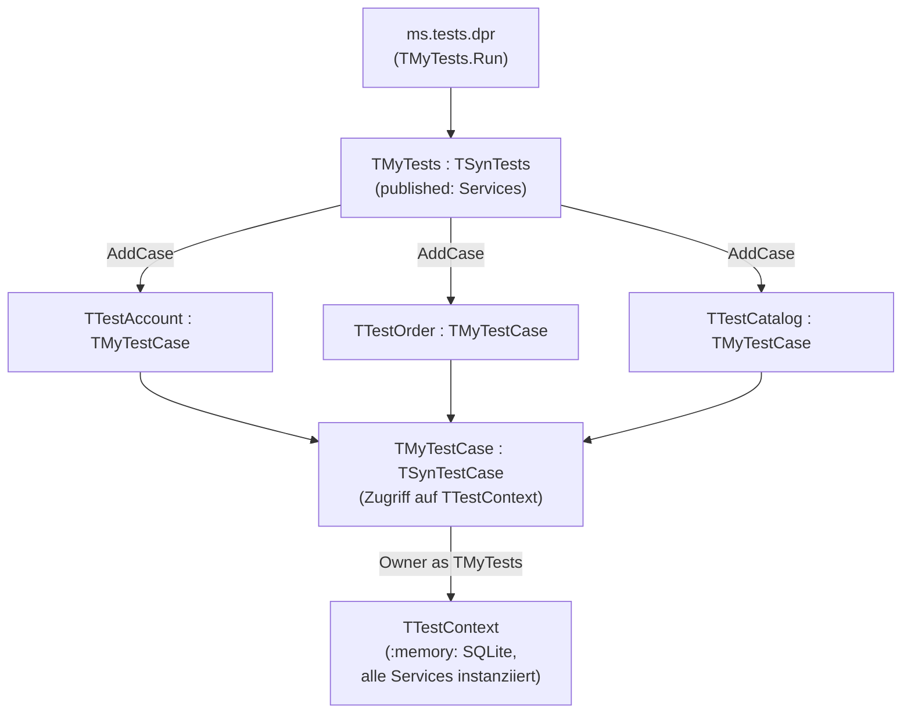

# 10 — Testing

## Zweck / Wann brauche ich das

Diese Datei beschreibt das Teststrategie-Muster für mORMot2-Microservice-Projekte. Tests
laufen vollständig in-process mit einer gemeinsamen `:memory:`-SQLite-Datenbank — kein
separater Server-Prozess, kein Netzwerk, kein Dateisystem. Das Testprojekt ist ein eigenes
Delphi-Konsolenprojekt, das alle Serviceimplementierungen direkt instanziiert.

## Kernkonzept

mORMot2 stellt `TSynTestCase` (Einzelfallklasse) und `TSynTests` (Suite-Verwaltung) bereit.
Alle `published`-Methoden einer `TSynTestCase`-Subklasse werden automatisch als Testfälle
erkannt und in Deklarationsreihenfolge ausgeführt. Exceptions, die in einem Testfall
auftreten, werden von `TSynTestCase` **still verschluckt** — ein fehlgeschlagener Test
erscheint als einfaches Fail, nicht als Exception-Trace. Deshalb müssen riskante Aufrufe
explizit mit `try/except` + `CheckEqual` abgesichert werden.



## Schritt für Schritt

1. `test/ms.tests.dpr` anlegen — drei Zeilen (Create, Run, Free in finally).
2. `test/ms.testCases.pas` anlegen: Kontext-Klasse + Suite-Klasse + alle Testfall-Klassen.
3. Kontext-Klasse (`TTestContext`) implementiert: Modell + `:memory:`-Server + alle Services.
4. Pro Fachbereich eine `TSynTestCase`-Subklasse, `published`-Testmethoden eintragen.
5. Suite-Klasse registriert alle Testfall-Klassen via `AddCase`.

## Code-Skelett

### Einstiegspunkt `ms.tests.dpr`

```pascal
/// <summary>
///   Konsolenprojekt — führt alle TSynTestCase-Tests in-process aus.
/// </summary>
program ms.tests;

{$APPTYPE CONSOLE}
{$I mormot.defines.inc}

{$SCOPEDENUMS ON}

{$WARN SYMBOL_PLATFORM OFF}
{$WARN UNIT_PLATFORM   OFF}

uses
  mormot.core.log,
  mormot.core.test,
  mormot.db.raw.sqlite3.static,  // statisch gelinkte SQLite — kein DLL-Deployment
  ms.testCases;

var
  Tests: TMyTests;
begin
  Tests := TMyTests.Create('My Microservice Suite');
  try
    Tests.Run;
  finally
    Tests.Free;
  end;
end.
```

### Hauptunit `ms.testCases.pas`

```pascal
/// <summary>
///   Alle TSynTestCase-Klassen, Testkontext und Suite-Registrierung.
/// </summary>
unit ms.testCases;

{$SCOPEDENUMS ON}

{$WARN SYMBOL_PLATFORM OFF}
{$WARN UNIT_PLATFORM   OFF}

interface

uses
  mormot.core.base,
  mormot.core.interfaces,
  mormot.core.test,
  mormot.db.core,
  mormot.orm.core,
  mormot.orm.sqlite3,
  mormot.rest.sqlite3,
  mormot.soa.core,
  ms.shared.api,       // IAccountService, IOrderService, …
  ms.account.model,    // TOrmAccount, …
  ms.account.server,   // TAccountService
  ms.catalog.model,
  ms.catalog.server,
  ms.order.model,
  ms.order.server;

type

  /// <summary>
  ///   Gemeinsamer In-Memory-Kontext: ein Server, alle Services instanziiert.
  /// </summary>
  TTestContext = class
  strict private
    FModel:   TOrmModel;
    FServer:  TRestServerDB;
    FAccount: IAccountService;
    FCatalog: ICatalogService;
    FOrder:   IOrderService;
  public

    /// <summary>
    ///   Erstellt alle ORM-Tabellen und Service-Instanzen gegen :memory: SQLite.
    /// </summary>
    constructor Create;

    /// <summary>
    ///   Gibt Server und Modell frei; nil-t Interfaces zuerst.
    /// </summary>
    destructor Destroy; override;

    property Account: IAccountService read FAccount;
    property Catalog: ICatalogService read FCatalog;
    property Order:   IOrderService   read FOrder;
  end;

  /// <summary>
  ///   Basis-Testfall — stellt Zugriff auf TTestContext bereit.
  /// </summary>
  TMyTestCase = class(TSynTestCase)
  protected

    /// <summary>
    ///   Gibt den gemeinsamen Kontext zurück (Owner muss TMyTests sein).
    /// </summary>
    function Context: TTestContext;
  end;

  /// <summary>
  ///   Account-Service-Tests.
  /// </summary>
  TTestAccount = class(TMyTestCase)
  published

    /// <summary>
    ///   Legt einen Account an und liest ihn zurück.
    /// </summary>
    procedure CreateAndRetrieve;

    /// <summary>
    ///   Doppeltes Anlegen desselben Accounts schlägt erwartungsgemäß fehl.
    /// </summary>
    procedure DuplicateIsRejected;
  end;

  /// <summary>
  ///   Order-Service-Tests inkl. Event-Kaskade.
  /// </summary>
  TTestOrder = class(TMyTestCase)
  published

    /// <summary>
    ///   Legt eine Bestellung an; prüft Status-Übergang.
    /// </summary>
    procedure CreateOrder;

    /// <summary>
    ///   Ungültige Eingabe darf keine Exception in TSynTestCase verbergen.
    /// </summary>
    procedure InvalidInputIsHandledSafely;
  end;

  /// <summary>
  ///   Test-Suite: registriert alle Testfall-Klassen.
  /// </summary>
  TMyTests = class(TSynTests)
  strict private
    FContext: TTestContext;
  public

    /// <summary>
    ///   Erstellt den gemeinsamen Kontext vor allen Tests.
    /// </summary>
    constructor Create(
      const aIdent: string = ''
      ); override;

    /// <summary>
    ///   Gibt den Kontext nach allen Tests frei.
    /// </summary>
    destructor Destroy; override;

    /// <summary>
    ///   Gemeinsamer Kontext für alle Testfall-Klassen.
    /// </summary>
    property Context: TTestContext read FContext;

  published

    /// <summary>
    ///   Registriert alle Service-Testfall-Klassen.
    /// </summary>
    procedure Services;
  end;

implementation

uses
  mormot.core.unicode;

{ TTestContext }

constructor TTestContext.Create;
var
  AccountImpl: TAccountService;
  CatalogImpl: TCatalogService;
  OrderImpl:   TOrderService;
begin
  inherited Create;
  // 1. ORM-Modell mit allen Tabellen
  FModel := TOrmModel.Create([
    TOrmAccount,
    TOrmCatalogItem,
    TOrmOrder
  ], 'root');
  // 2. In-Memory SQLite — kein Dateisystem-Zugriff
  FServer := TRestServerDB.Create(FModel, SQLITE_MEMORY_DATABASE_NAME);
  FServer.DB.Synchronous := smOff;
  FServer.Server.CreateMissingTables;
  // 3. Service-Instanzen anlegen und registrieren
  AccountImpl := TAccountService.Create(FServer.Orm);
  FServer.ServiceRegister(AccountImpl, [TypeInfo(IAccountService)]).
    ByPassAuthentication := True;
  FAccount := AccountImpl;
  CatalogImpl := TCatalogService.Create(FServer.Orm);
  FServer.ServiceRegister(CatalogImpl, [TypeInfo(ICatalogService)]).
    ByPassAuthentication := True;
  FCatalog := CatalogImpl;
  OrderImpl := TOrderService.Create(FServer.Orm);
  FServer.ServiceRegister(OrderImpl, [TypeInfo(IOrderService)]).
    ByPassAuthentication := True;
  FOrder := OrderImpl;
end;

destructor TTestContext.Destroy;
begin
  // Interfaces zuerst nil-en, DANN den Server freigeben
  FOrder   := nil;
  FCatalog := nil;
  FAccount := nil;
  FreeAndNil(FServer);
  FreeAndNil(FModel);
  inherited Destroy;
end;

{ TMyTestCase }

function TMyTestCase.Context: TTestContext;
begin
  Result := (Owner as TMyTests).Context;
end;

{ TTestAccount }

procedure TTestAccount.CreateAndRetrieve;
var
  NewId:   TID;
  Account: TAccountDto;
begin
  NewId := Context.Account.Create('user@example.com', 'Alice');
  Check(NewId > 0, 'Create muss eine positive ID zurückgeben');
  Account := Context.Account.GetById(NewId);
  CheckEqual(Account.Email, 'user@example.com');
  CheckEqual(Account.Name, 'Alice');
end;

procedure TTestAccount.DuplicateIsRejected;
var
  ExceptionMessage: RawUtf8;
begin
  // Ersten Account anlegen
  Context.Account.Create('dupe@example.com', 'Bob');
  // Denselben nochmal — TSynTestCase verschluckt Exceptions still,
  // deshalb explizit abfangen und als String prüfen.
  ExceptionMessage := '';
  try
    Context.Account.Create('dupe@example.com', 'Bob2');
  except
    on E: Exception do
      ExceptionMessage := StringToUtf8(E.ClassName + ': ' + E.Message);
  end;
  CheckEqual(ExceptionMessage, '', 'Duplikat darf keine unerwartete Exception werfen — ' +
    'Service soll einen definierten Fehler zurückgeben, nicht eine rohe Exception');
end;

{ TTestOrder }

procedure TTestOrder.CreateOrder;
var
  OrderId: TID;
  Order:   TOrderDto;
begin
  OrderId := Context.Order.Create(1 {AccountId}, 42 {CatalogItemId}, 3 {Menge});
  Check(OrderId > 0);
  Order := Context.Order.GetById(OrderId);
  CheckEqual(Ord(Order.Status), Ord(TOrderStatus.Pending));
end;

procedure TTestOrder.InvalidInputIsHandledSafely;
var
  ExceptionMessage: RawUtf8;
begin
  // Angriffs-ähnliche Eingabe darf nicht als raw Exception durchschlagen
  ExceptionMessage := '';
  try
    Context.Order.Create(-1 {ungültige AccountId}, 0, 0);
  except
    on E: Exception do
      ExceptionMessage := StringToUtf8(E.ClassName + ': ' + E.Message);
  end;
  CheckEqual(ExceptionMessage, '', 'Ungültige Eingabe muss sauber abgefangen werden');
end;

{ TMyTests }

constructor TMyTests.Create(
  const aIdent: string
  );
begin
  inherited Create(aIdent);
  FContext := TTestContext.Create;
end;

destructor TMyTests.Destroy;
begin
  FreeAndNil(FContext);
  inherited Destroy;
end;

procedure TMyTests.Services;
begin
  AddCase(TTestAccount);
  AddCase(TTestOrder);
  // weitere Testfall-Klassen hier eintragen
end;

end.
```

## Stolperfallen / Lessons

- **TSynTestCase verschluckt Exceptions still.** Ein Test, der eine unerwartete Exception
  wirft, erscheint lediglich als fehlgeschlagen — ohne Stack-Trace im normalen Testoutput.
  Deshalb: jede Methode, die eine Exception werfen *könnte*, in `try/except on E: Exception`
  einwickeln, die Nachricht in `RawUtf8` speichern, dann mit `CheckEqual(Msg, '')` prüfen.
  Das liefert einen lesbaren Diff im Fehlerfall.

- **Interfaces vor dem Server freigeben.** Im Destruktor von `TTestContext` müssen alle
  Interface-Referenzen auf `nil` gesetzt werden, bevor `FServer` freigegeben wird. Andernfalls
  ruft der Referenzzähler Destruktoren auf bereits freigegebenen Objekten auf.

- **`ByPassAuthentication := True` für Tests.** Im Testkontext gibt es keine JWT-Session;
  ohne dieses Flag schlägt jeder SOA-Aufruf mit 401 fehl.

- **`mormot.db.raw.sqlite3.static` in der uses-Liste des `.dpr`.** Diese Unit linkt SQLite
  statisch ein. Fehlt sie, sucht mORMot2 nach einer externen `sqlite3.dll` und schlägt mit
  einem Laufzeitfehler fehl — kein Compiler-Fehler, kein Hinweis.

- **`VarIsNull(Doc.Value['x'])` statt `Doc.IsNull('x')`.** Letzteres existiert in mORMot2
  nicht und führt zu einem Compiler-Fehler. Für Variant-basierte Dokument-Felder immer
  `VarIsNull` verwenden.

- **DTOs als typed records**, nie `RawJson`. Der Vertrag zwischen Service und Test muss zur
  Compile-Zeit prüfbar sein (s. [11-coding-conventions.md](11-coding-conventions.md)).

## Querverweise

- [01-projektstruktur.md](01-projektstruktur.md) — `test/`-Ordner in der Repo-Struktur
- [02-service-erstellen.md](02-service-erstellen.md) — Service-Implementierung, die hier getestet wird
- [11-coding-conventions.md](11-coding-conventions.md) — Delphi-Codierungsregeln
- [09-event-bus.md](09-event-bus.md) — Event-Kaskaden, die in Integrationstests abgedeckt werden
