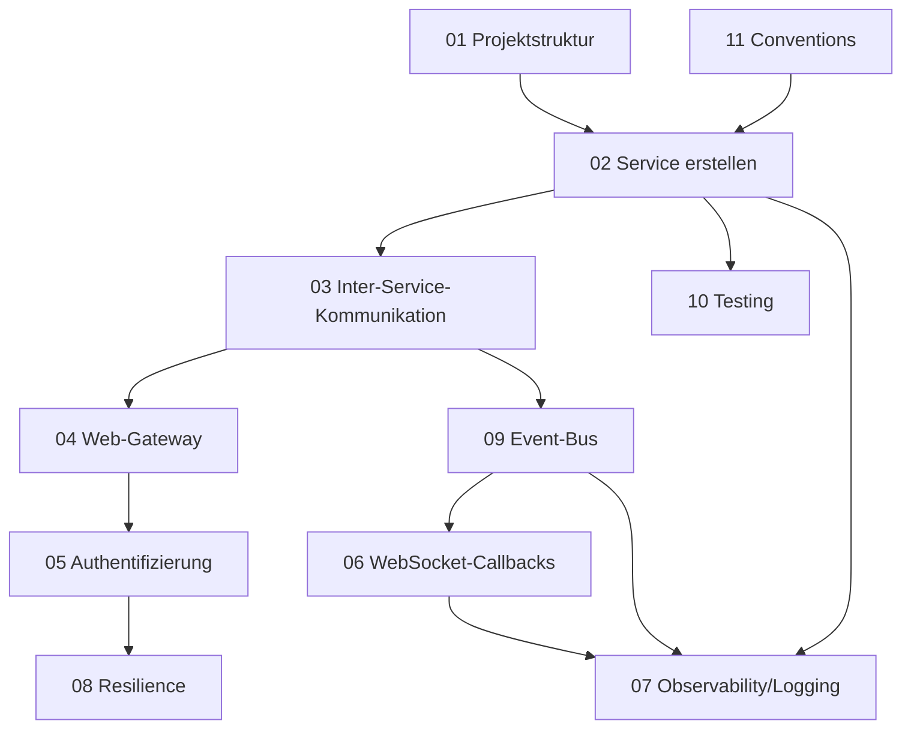

# Guide-Lines: Neue mORMot2-Microservice-Projekte

Diese Sammlung ist eine **projektneutrale Bauanleitung** für den Start neuer
Microservice-Projekte mit **mORMot2 (Delphi)** als Backend. Sie destilliert bewährte
Muster, Architekturentscheidungen und hart erarbeitete Lessons in wiederverwendbare
Vorlagen — gedacht zum **direkten Anwenden** beim Aufsetzen eines neuen Repos.

> Voraussetzung jedes hier beschriebenen Projekts: **mORMot2 als Backend, Delphi.**
> Die Dokumente enthalten bewusst **keine** Bezüge zu einem konkreten Bestandsprojekt —
> sie sind als allgemeine Richtlinie formuliert.

## Konventionen dieser Doku

- **Sprache:** Deutsch (Prosa); Code-Bezeichner, Schlüsselwörter und mORMot2-Typnamen englisch.
- **Format:** Erklärung + vollständige, adaptierbare Delphi-Code-Skelette (≤ 120 Spalten).
- **Stil:** Die Code-Skelette zeigen verbindlich nur **Struktur und Technik**. Ihre konkrete
  **Formatierung** (Einrückung, Signatur-Layout, Zeilenumbrüche, Doku-Stil, Benennung) ist
  illustrativ und NICHT verbindlich — sie folgt dem Delphi-Syntax-Styleguide des jeweiligen
  Projekts. System-/mORMot2-spezifische Konventionen stehen in
  [11-coding-conventions.md](11-coding-conventions.md).
- **Diagramme:** ausschließlich [mermaid](https://mermaid.js.org/), nie ASCII-Art.
- **Durchgängiges Beispiel-Domain** (neutral, nur zur Illustration):

  | Rolle               | Service           | Port | Datenbank             |
  |---------------------|-------------------|------|-----------------------|
  | Web-Gateway         | `ms.gateway`      | 8080 | — (keine eigene DB)   |
  | Accounts/Benutzer   | `ms.account`      | 8081 | `account.db`          |
  | Produktkatalog      | `ms.catalog`      | 8082 | `catalog.db`          |
  | Bestellungen        | `ms.order`        | 8083 | `order.db`            |
  | Benachrichtigungen  | `ms.notification` | 8084 | `notification.db`     |
  | Zentrales Logging   | `ms.log`          | 8090 | `log.db` (FTS5)       |
  | Event-Bus           | `ms.events`       | 8091 | `events.db` (Outbox)  |

  Wiederkehrende Beispiel-Kaskade: `ms.order` legt eine Bestellung an → publiziert ein Event
  auf `ms.events` → `ms.notification` konsumiert es → WS-Callback an den Browser.

## Dokumentstruktur

Jedes Konzept liegt in einer eigenen Datei. Aufbau jeweils: *Zweck → Kernkonzept →
Schritt für Schritt → Code-Skelett → Stolperfallen/Lessons → Querverweise*.

### Fundament & Aufbau

| Datei | Inhalt |
|-------|--------|
| [01-projektstruktur.md](01-projektstruktur.md) | Repo-/`.groupproj`-Layout, `shared/`, ein Verzeichnis je Service, separate SQLite-DB pro Service, Build-/Start-/Stop-Skripte, Port-Schema. |
| [02-service-erstellen.md](02-service-erstellen.md) | Interface-basierter SOA-Service Schritt für Schritt: Service-Interface, typed-record-DTOs, ORM-Klassen, Implementierung, Hosting/Registrierung, `.dpr`-Einstiegspunkt. |
| [03-inter-service-kommunikation.md](03-inter-service-kommunikation.md) | Service-zu-Service: synchron (Client-Interface, `Services.Resolve`) vs. asynchron (Event-Bus), gemeinsame Verträge im `shared/`, Correlation-ID-Weitergabe. |
| [04-web-gateway.md](04-web-gateway.md) | Gateway als Reverse-Proxy/Fassade: Routing, Auflösung der Backends, transparenter Proxy vs. Aggregation, WS-Weiterleitung, statische Dateien, Health-Endpoint. |

### Sicherheit & Echtzeit

| Datei | Inhalt |
|-------|--------|
| [05-authentifizierung.md](05-authentifizierung.md) | SCRAM-MCF-Login + JWT: Challenge/Authenticate/Validate, Token-Ausstellung & -Prüfung, Weitergabe durchs Gateway, Anti-Enumeration. |
| [06-websocket-callbacks.md](06-websocket-callbacks.md) | Interface-Callbacks über WebSockets: `synopsebin` (intern) vs. `TWebSocketProtocolChat` (Browser), Pre-Registrierung der Callback-Interfaces, **Shutdown-Disziplin**. |

### Querschnitt (Infrastruktur)

| Datei | Inhalt |
|-------|--------|
| [07-observability-logging.md](07-observability-logging.md) | Correlation-ID-Threadvar über Service-Grenzen, zentraler Log-Service mit FTS5-Volltextsuche und Live-WebSocket-Stream. |
| [08-resilience.md](08-resilience.md) | Token-Bucket-`TRateLimiter` (Brute-Force-/Last-Schutz) + 3-State-`TCircuitBreaker` (closed/open/half-open) und ihre Integration in Service-Calls. |
| [09-event-bus.md](09-event-bus.md) | Domain-Event-Bus: typed-record-Events, persistente **Outbox**, **Consumer-Cursor** & **Replay**, Publish/Subscribe, Zusammenspiel mit WS-Callbacks. |

### Prozess & Qualität

| Datei | Inhalt |
|-------|--------|
| [10-testing.md](10-testing.md) | `TSynTestCase` in-process mit `:memory:`-SQLite, Test-Aufbau, **Exception-Guard-Muster** (Exceptions werden still verschluckt), Beispiel-Testfall. |
| [11-coding-conventions.md](11-coding-conventions.md) | System-/mORMot2-spezifische Konventionen: typed-record-DTOs statt RawJson, `VarIsNull` statt `Doc.IsNull`, mORMot2-Unit-Zuordnungen, verbindliche 0-Hints/0-Warnings-Regel. Persönliche Formatierung/Stil gehört in den Delphi-Syntax-Styleguide des Projekts. |

## Empfohlene Lesereihenfolge

1. **Erstkontakt / Überblick:** dieses README, dann
   [01-projektstruktur.md](01-projektstruktur.md) und
   [11-coding-conventions.md](11-coding-conventions.md) (Fundament + systemspezifische Konventionen).
2. **Ersten Service bauen:** [02-service-erstellen.md](02-service-erstellen.md) →
   [10-testing.md](10-testing.md) (Service direkt testbar aufsetzen).
3. **Services verbinden:** [03-inter-service-kommunikation.md](03-inter-service-kommunikation.md) →
   [04-web-gateway.md](04-web-gateway.md).
4. **Absichern:** [05-authentifizierung.md](05-authentifizierung.md) →
   [08-resilience.md](08-resilience.md).
5. **Echtzeit & Entkopplung:** [06-websocket-callbacks.md](06-websocket-callbacks.md) →
   [09-event-bus.md](09-event-bus.md).
6. **Betrieb beobachten:** [07-observability-logging.md](07-observability-logging.md).

## Abhängigkeiten der Konzepte

