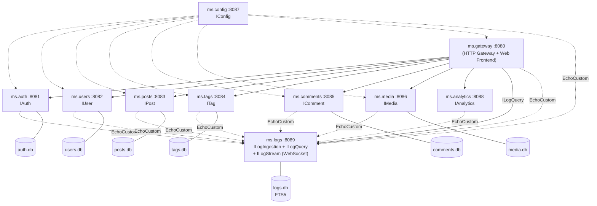
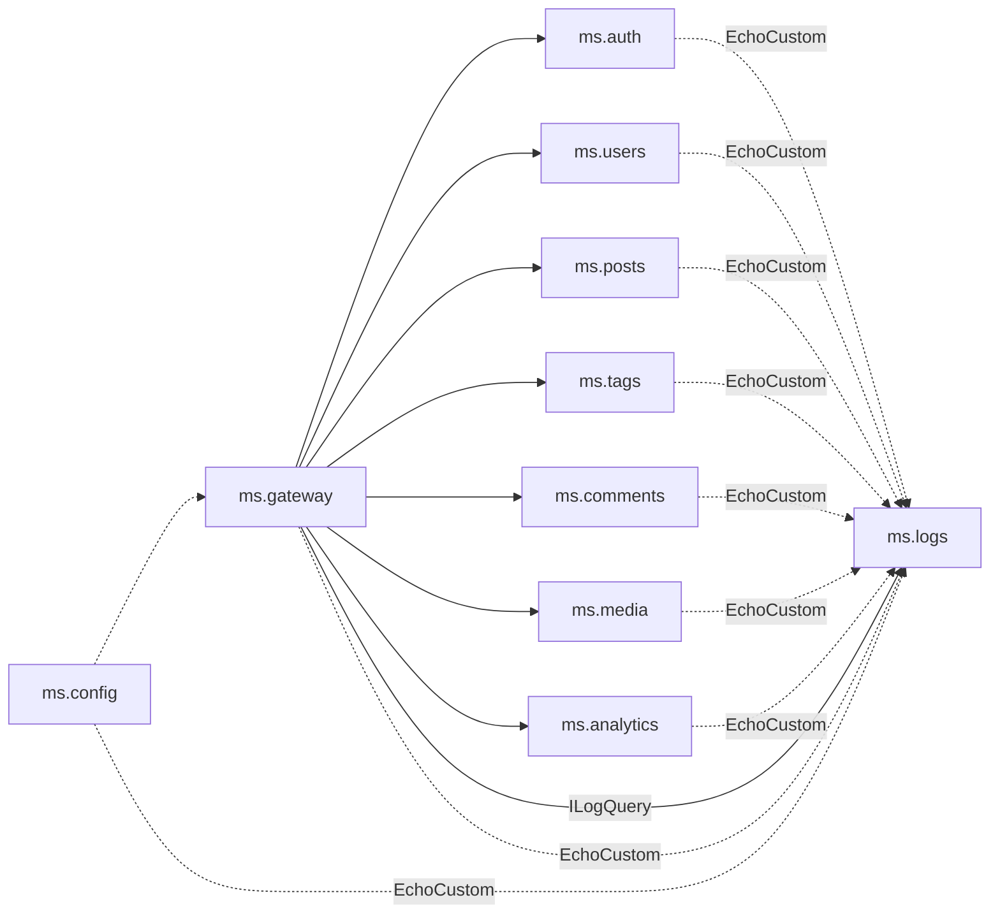

# Blog Microservices -- Architecture

## Goal

A simple blog system built as a microservice architecture with **Delphi 13** and **mORMot2**. Each business function runs in its own console EXE with its own SQLite database.

## Service Overview



## Services at a Glance

| # | Service | Port | Interface | Responsibility |
|---|---------|------|-----------|----------------|
| 1 | **ms.gateway** | 8080 | IBlog | API gateway, proxies, web frontend |
| 2 | **ms.auth** | 8081 | IAuth | SCRAM-MCF login, JWT tokens |
| 3 | **ms.users** | 8082 | IUser | Author profiles, bios |
| 4 | **ms.posts** | 8083 | IPost | Blog posts, SEO metadata |
| 5 | **ms.tags** | 8084 | ITag | Tags, post-tag associations (m:n) |
| 6 | **ms.comments** | 8085 | IComment | Comments, moderation workflow |
| 7 | **ms.media** | 8086 | IMedia | Image upload, storage |
| 8 | **ms.config** | 8087 | IConfig | Central configuration registry |
| 9 | **ms.analytics** | 8088 | IAnalytics | Cross-service data aggregation |
| 10 | **ms.logs** | 8089 | ILogIngestion + ILogQuery + ILogStream | Central log aggregation (SQLite FTS5) + live broadcast |

## API Style: mORMot2 SOA

All services use interface-based services (SOA), not classical REST endpoints.

- **URL format**: `POST /api/{InterfaceName}/{MethodName}`
- **Request body**: JSON array of positional parameters `[param1, param2, ...]`
- **Response**: JSON object with named output parameters (`ResultAsJsonObjectWithoutResult`)
- **Interfaces**: Defined in `ms.shared.api.pas`, shared by all services

### Example: Create a tag

```
POST /api/Tag/Add
Body: [{"Name":"Delphi","Description":"Everything about Delphi"}]
Response: {"Result":1}
```

## Communication

- **Browser -> Gateway**: HTTP/JSON (SOA format via `api.js`)
- **Gateway -> Backend**: mORMot2 SOA via `TRestHttpClient` + `TServiceFactoryClient`
- **Authentication**: SCRAM-MCF (Challenge/Authenticate), then JWT token in Authorization header
- **Database**: Each service has its own SQLite file (via mORMot2 ORM)

## Management Endpoints

Every service automatically provides (via `TMicroService` base class):

| Method | Endpoint | Description |
|--------|----------|-------------|
| GET | `/api/health` | Health check (service name, port, version, uptime) |
| POST | `/api/shutdown` | Graceful shutdown |

## Principles

1. **Single Responsibility** -- each service has exactly one business concern
2. **Own Data Store** -- no service accesses another service's database
3. **Loose Coupling** -- services communicate exclusively via SOA interfaces
4. **Gateway Pattern** -- all browser requests go through the gateway
5. **Custom Auth** -- SCRAM-MCF instead of mORMot2's built-in REST authentication

## Cross-Cutting Concerns

### Correlation IDs (Distributed Tracing)

Every HTTP request is tagged with an `X-Correlation-Id` header that
propagates from the browser through the gateway into every backend
service call. Each service logs the ID alongside its entries so a
single `grep` across all log files reconstructs one user request.

- **Storage**: per-request `threadvar` in `ms.shared.correlation.pas`
- **Gateway**: extracts the header (or generates a UUID) in
  `HandleRequest`; installs `OnBeforeCall` on every `TRestHttpClient`
  to forward the ID to backend calls
- **Backend services**: `TMicroService.HandleRequestWithCorrelation`
  wraps the HTTP handler once in `Run()` and logs every request as
  `{Service} REQ ...` / `{Service} RSP ... -> {Status}`
- **Logging helper**: `LogWithCorrelation` prepends `[ID]` to every
  log line automatically

All services inherit this behavior for free via the `TMicroService`
base class. See [correlation-ids.md](correlation-ids.md) for the full
design, rationale, and developer guide.

### Central Logging (ms.logs)

Correlation IDs are only useful if you can query logs across every
service from one place. `ms.logs` is a dedicated microservice that
receives every log line from every other service and persists it in
SQLite with an FTS5 full-text search index.

- **Shipper**: `TLogShipper` in `shared/ms.shared.logclient.pas` --
  installed as a `TSynLogFamily.EchoCustom` callback by every service
  (except `ms.logs` itself), backed by a thread-safe queue and a
  background flush thread that batches entries into
  `ILogIngestion.AppendBatch` calls
- **Store**: `TOrmLogEntry` + `TOrmLogEntryFts` in
  `ms.logs/ms.logs.model.pas`
- **Query**: `ILogQuery` with `ByCorrelationId`, `Recent`, `Search`
  (FTS5) and `Stats` -- proxied through the gateway so the browser
  UI at `/logs` can filter by service, level, correlation ID or text
- **Wiring**: `TMicroService` creates and attaches a `TLogShipper` in
  every service automatically -- no per-service code needed
- **Best effort**: if `ms.logs` is down, the queue drops oldest
  entries; local `TSynLog` file logging keeps running unchanged

This is the full payoff for correlation IDs: one click on an ID in
the log viewer reveals every entry from every service that belongs
to one user request. See [central-logging.md](central-logging.md)
for the full design.

### Real-time Event Distribution (WebSocket Callbacks)

Polling is a poor fit for "tell me when X happens". mORMot2 ships a
clean answer: **interface-based callbacks over WebSockets**. A server
method calls a regular Pascal interface on the client over a
persistent WebSocket connection, with no custom framing in user code.

- `TMicroService` now creates its `TRestHttpServer` with
  `WEBSOCKETS_DEFAULT_MODE` and calls `WebSocketsEnable(..., ajax=True)`.
  Every service therefore hosts plain HTTP, the binary `synopsebin`
  protocol (for Pascal clients) and the JSON `synopsejson` protocol
  (for browsers) on the **same** listen port -- browser traffic
  continues to flow only through the gateway.
- `ILogStream` / `ILogStreamCallback` in `shared/ms.shared.api.pas`
  define the pub/sub contract. `ILogStream` inherits
  `IServiceWithCallbackReleased`, so mORMot2 invokes `CallbackReleased`
  the moment a subscriber's refcount drops to zero (e.g. browser tab
  closed) -- no explicit close protocol needed.
- `TLogStreamService` in `ms.logs/ms.logs.server.pas` holds the
  subscriber list and is broadcast from `TLogIngestionService.AppendBatch`
  after every persisted entry.
- `TLogShipper` now uses `TRestHttpClientWebsockets` with a persistent
  WebSocket connection (replacing the old per-batch HTTP path).
- The gateway hosts a **broker**
  (`TGatewayLogBrokerCallback` + `TLogStreamBrokerService`) that
  subscribes to ms.logs once and re-broadcasts every entry to its own
  browser subscribers. This preserves the "all browser traffic via the
  gateway" rule even though events originate in ms.logs.
- Browser side: `api.js` opens the stream via
  `new WebSocket(url, 'synopsejson')`, and `app.js` prepends new rows
  live in `/logs` with a fade-in highlight.

This is a reusable foundation -- adding live comment moderation, live
analytics tiles, or cross-service cache invalidation means defining
one more callback interface and registering one more service; nothing
else. See [event-driven.md](event-driven.md) for the full design, the
mORMot2 building blocks, and the subscriber-bookkeeping idiom.

## Service Dependencies



All backend services are independent of each other.
Cross-references are stored as IDs only, resolved in the gateway via `IBlog.GetPostFull` / `IBlog.GetPostsByTag`.
