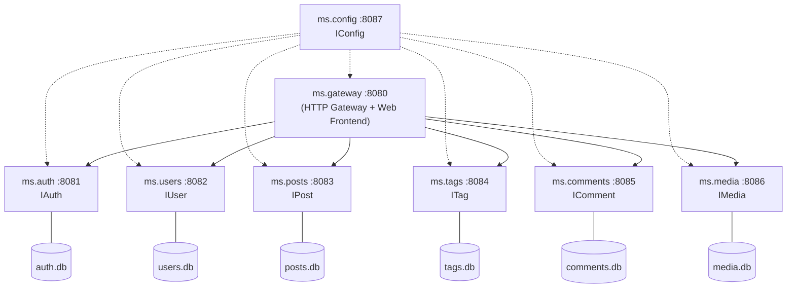
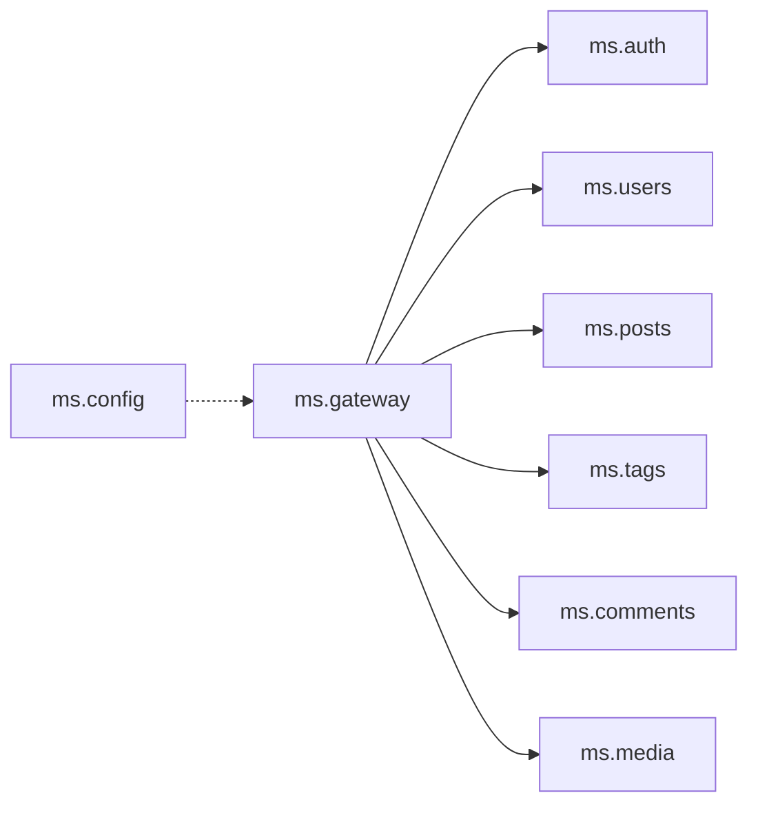

# Blog Microservices -- Architecture

## Goal

A simple blog system built as a microservice architecture with **Delphi 13** and **mORMot2**. Each business function runs in its own console EXE with its own SQLite database.

## Service Overview



## Services at a Glance

| # | Service | Port | Interface | Responsibility |
|---|---------|------|-----------|----------------|
| 1 | **ms.gateway** | 8080 | IBlog | API gateway, proxies, web frontend |
| 2 | **ms.auth** | 8081 | IAuth | SCRAM-MCF login, JWT tokens |
| 3 | **ms.users** | 8082 | IUser | Author profiles, bios |
| 4 | **ms.posts** | 8083 | IPost | Blog posts, SEO metadata |
| 5 | **ms.tags** | 8084 | ITag | Tags, post-tag associations (m:n) |
| 6 | **ms.comments** | 8085 | IComment | Comments, moderation workflow |
| 7 | **ms.media** | 8086 | IMedia | Image upload, storage |
| 8 | **ms.config** | 8087 | IConfig | Central configuration registry |

## API Style: mORMot2 SOA

All services use interface-based services (SOA), not classical REST endpoints.

- **URL format**: `POST /api/{InterfaceName}/{MethodName}`
- **Request body**: JSON array of positional parameters `[param1, param2, ...]`
- **Response**: JSON object with named output parameters (`ResultAsJsonObjectWithoutResult`)
- **Interfaces**: Defined in `ms.shared.api.pas`, shared by all services

### Example: Create a tag

```
POST /api/Tag/Add
Body: [{"Name":"Delphi","Description":"Everything about Delphi"}]
Response: {"Result":1}
```

## Communication

- **Browser -> Gateway**: HTTP/JSON (SOA format via `api.js`)
- **Gateway -> Backend**: mORMot2 SOA via `TRestHttpClient` + `TServiceFactoryClient`
- **Authentication**: SCRAM-MCF (Challenge/Authenticate), then JWT token in Authorization header
- **Database**: Each service has its own SQLite file (via mORMot2 ORM)

## Management Endpoints

Every service automatically provides (via `TMicroService` base class):

| Method | Endpoint | Description |
|--------|----------|-------------|
| GET | `/api/health` | Health check (service name, port, version, uptime) |
| POST | `/api/shutdown` | Graceful shutdown |

## Principles

1. **Single Responsibility** -- each service has exactly one business concern
2. **Own Data Store** -- no service accesses another service's database
3. **Loose Coupling** -- services communicate exclusively via SOA interfaces
4. **Gateway Pattern** -- all browser requests go through the gateway
5. **Custom Auth** -- SCRAM-MCF instead of mORMot2's built-in REST authentication

## Service Dependencies



All backend services are independent of each other.
Cross-references are stored as IDs only, resolved in the gateway via `IBlog.GetPostFull` / `IBlog.GetPostsByTag`.
