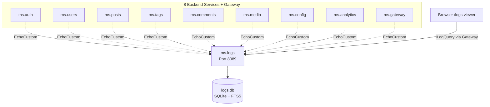
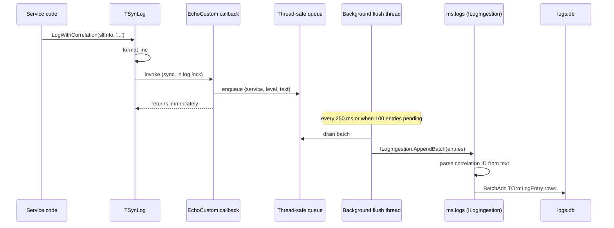

# Central Logging (`ms.logs`)

## Why a dedicated log service?

In a microservice architecture, the worst place to look for problems is "every log file on every machine". Centralizing logs into one queryable store -- with structured metadata -- turns post-mortem debugging from archaeology into a SQL query.

This project ships a dedicated `ms.logs` microservice that:

1. **Ingests** every log line from every other service via a custom SOA call
2. **Stores** entries in its own SQLite database with full-text search (FTS5)
3. **Exposes** a typed `ILogQuery` interface for time/level/correlation/text searches
4. **Renders** the results in a browser UI accessed through the gateway

The payoff for the [correlation IDs](correlation-ids.md) feature: a single click on a correlation ID in the log viewer reveals every entry from every service that belongs to one user request.

## Architecture



Solid arrows are the query path. Dashed arrows are the ingest path: every service ships its log lines as they happen.

## Building blocks chosen from mORMot2

mORMot2 offers several centralized logging primitives. We deliberately picked the ones that fit the SOA-with-typed-DTOs style of the rest of this project.

| mORMot2 primitive | Used? | Why |
|-------------------|-------|-----|
| `TSynLogFamily.EchoCustom` callback | Yes | Per-line hook that runs in-process; we forward each line to a queue |
| `TRestHttpClientGeneric.CreateForRemoteLogging` | No | Built-in, but text-only and loses the service name on the wire |
| `TRestHttpRemoteLogServer` | No | Receiver for the above; same limitation |
| `ISynLogCallback` SOA interface | No | Close to what we want, but its signature doesn't carry the service name |
| `TOrmFts5` | Yes | SQLite full-text search for fast `LIKE %text%` queries |
| `TSynLogFile` virtual table | No | Read-only view of `.log` files, doesn't aggregate across services |

We use a **custom `ILogIngestion` SOA interface** so the service name, level and correlation ID travel together as typed parameters. The async-queue pattern is borrowed from mORMot2's own `TRemoteLogThread`.

## Components

| File | Purpose |
|------|---------|
| `shared/ms.shared.api.pas` | `ILogIngestion`, `ILogQuery`, `TLogEntryDto`, `TLogQueryFilter` definitions |
| `shared/ms.shared.logclient.pas` | `EchoCustom` callback + thread-safe queue + background flush thread |
| `shared/ms.shared.service.pas` | `TMicroService` wires the log client into every service via `InitLogging` |
| `ms.logs/ms.logs.model.pas` | `TOrmLogEntry` (regular table) + `TOrmLogEntryFts` (FTS5 virtual table) |
| `ms.logs/ms.logs.server.pas` | `TLogIngestionService`, `TLogQueryService`, correlation-ID parser |
| `ms.logs/ms.logs.dpr` | Service entry point on port 8089 |
| `ms.gateway/ms.gateway.server.pas` | Adds `ILogQuery` to the proxy table |
| `ms.gateway/www/js/app.js` | `/logs` SPA view with filters and click-through |

## Per-line lifecycle



The callback never blocks the calling thread for more than the time it takes to push onto a queue. The background thread batches up to 100 entries per HTTP call, so even chatty services produce manageable network traffic.

## Database schema

`TOrmLogEntry` columns:

| Field | Type | Purpose | Indexed |
|-------|------|---------|---------|
| `ID` | TID | SQLite RowID | (auto) |
| `Timestamp` | TDateTime | When the log line was created | yes |
| `ServiceName` | RawUtf8 | e.g. `ms.posts`, `ms.gateway` | yes |
| `Level` | integer | Maps to `TSynLogLevel` ordinal | yes |
| `CorrelationId` | RawUtf8 | Extracted from the message text | yes |
| `Message` | RawUtf8 | Full log line text |  |

Plus a parallel **FTS5 virtual table** (`TOrmLogEntryFts`) on the `Message` column for fast full-text search:

```sql
SELECT * FROM LogEntry
JOIN LogEntryFts ON LogEntryFts.rowid = LogEntry.RowID
WHERE LogEntryFts MATCH 'connection AND timeout'
ORDER BY LogEntry.Timestamp DESC
LIMIT 100
```

## SOA interfaces

### `ILogIngestion` (write path, called by every service)

```pascal
ILogIngestion = interface(IInvokable)
  /// Ship a batch of log entries from a single service.
  procedure AppendBatch(const aEntries: TLogEntryIngestDtoArray);
end;
```

`TLogEntryIngestDto` carries `ServiceName`, `Timestamp`, `Level`, `Message`. The server parses the correlation ID from the message text using a UUID regex match -- no separate field needed on the client.

### `ILogQuery` (read path, called from the gateway / browser)

```pascal
ILogQuery = interface(IInvokable)
  /// All entries belonging to one user request.
  function ByCorrelationId(const aId: RawUtf8): TLogEntryDtoArray;

  /// Recent entries with optional service/level filters.
  function Recent(const aFilter: TLogQueryFilter): TLogEntryDtoArray;

  /// Full-text search via SQLite FTS5.
  function Search(const aText: RawUtf8; aLimit: integer): TLogEntryDtoArray;

  /// Aggregate counts grouped by service and level (for the dashboard tile).
  function Stats: TLogStatsDto;
end;
```

`TLogQueryFilter` is a record with `ServiceName`, `MinLevel`, `Since`, `Until`, `Limit` -- all optional, all PascalCase, mORMot2-serialized.

## Browser UI

A new `/logs` view in the SPA frontend:

- Search box (FTS5)
- Service-name dropdown
- Level slider (info / warn / error / all)
- Time range
- Results table with timestamp, service, level, truncated message
- Each row has a clickable correlation ID -- jumping to "all entries for this request"

The view talks only to the gateway, which proxies `ILogQuery` exactly like the other backend services.

## Failure handling

The log client is **best-effort**: if `ms.logs` is down, the queue drops oldest entries when it overflows (capped at 10 000 in memory). The local file logging configured in `TMicroService.InitLogging` keeps running unchanged, so nothing is ever permanently lost. When `ms.logs` comes back up, new entries flow again automatically -- no reconnect logic needed because each batch creates a fresh HTTP call.

## Performance notes

- The `EchoCustom` callback only does a queue push -- microsecond cost
- Batching keeps the HTTP overhead low even at thousands of log lines per second
- FTS5 indexing happens inside the same SQLite transaction as the row insert -- no additional round trip
- The ingestion endpoint accepts up to 100 entries per call; larger logs become multiple calls
- A simple ring buffer protects ms.logs from runaway producers

## What this demo teaches

- mORMot2's `TSynLogFamily.EchoCustom` extension point
- How to keep a custom log shipper non-blocking (background thread + queue)
- A real use case for SQLite FTS5 in mORMot2 via `TOrmFts5`
- Combining a typed SOA interface (ours) with a built-in extension hook (mORMot2's)
- The full payoff for [correlation IDs](correlation-ids.md): every distributed request becomes one click
- Cross-cutting concerns belong in their own service, not duplicated in every service

## Verification

1. Start all services (the new `ms.logs` is on port 8089)
2. Make a few browser requests
3. Open `http://localhost:8080/logs`
4. Search for any correlation ID -- every service that handled that request shows up in one timeline
5. Type a phrase ("connection timeout") into the search box -- FTS5 returns matching entries across all services in milliseconds
