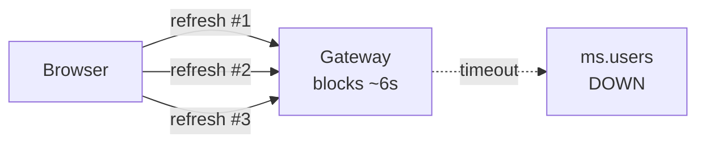
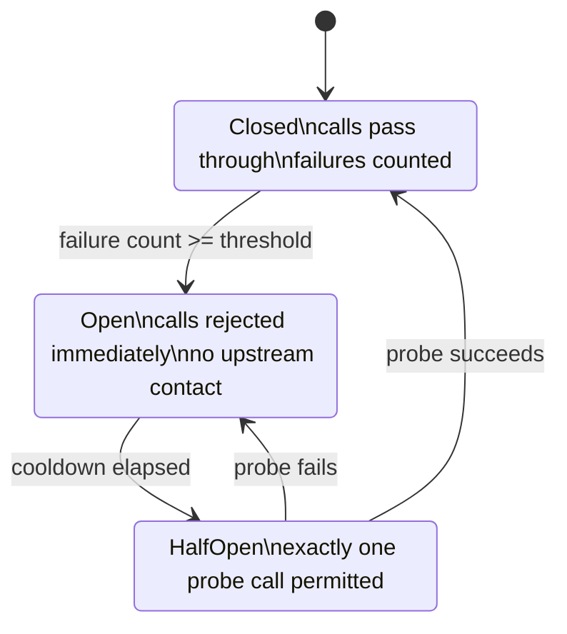
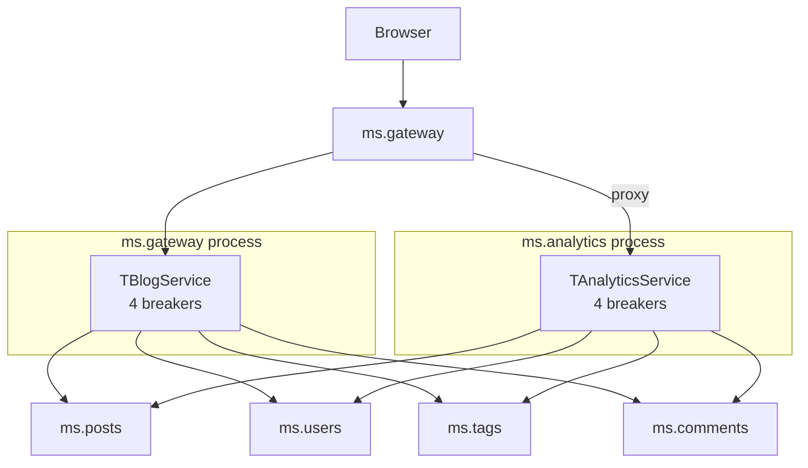

# Circuit Breaker

## What is a circuit breaker?

A **circuit breaker** is a fault-tolerance pattern that protects callers from a slow or unreachable upstream dependency. After a configured number of consecutive failures it stops sending requests to the upstream entirely for a cooldown period. Once the cooldown elapses it lets a single probe through to check whether the upstream has recovered. The pattern was popularised by Michael Nygard's book *Release It!* and is one of the canonical building blocks of resilient distributed systems.

It is the next step beyond plain "graceful degradation" via `try/except`.

## The problem without a breaker

Cross-service calls in this project use mORMot2's `TRestHttpClient`. The default per-call timeout is several seconds. Plain graceful degradation looks like this:

```pascal
try
  Result.Author := FUsers.Get(Post.AuthorId);
except
  Result.AuthorUnavailable := True;
end;
```

When `ms.users` is up and healthy this is fine. When `ms.users` is **down**, every single request still pays the full timeout cost before the `except` branch runs:



Three observed problems:

1. **Per-request latency stays at the full timeout.** A user refreshing the page waits ~6 s every time, not just on the first attempt.
2. **Worker pool exhaustion.** Under load every HTTP worker thread sits inside `FUsers.Get()` waiting for the TCP timeout. The gateway runs out of workers and starts queuing — even requests that do not need `ms.users` start backing up.
3. **Recovery storms.** The moment `ms.users` comes back, every queued request hits it simultaneously. The first thing a freshly recovered service experiences is a thundering herd.

## The solution: a three-state state machine

A circuit breaker tracks failures per upstream and short-circuits when there have been too many. It has three states:



State transitions in detail:

| From | Event | To | Side effect |
|------|-------|----|-------------|
| Closed | success | Closed | failure counter reset to 0 |
| Closed | failure (counter < threshold) | Closed | failure counter incremented |
| Closed | failure (counter >= threshold) | **Open** | open-time tick recorded |
| Open | `AllowRequest` (cooldown not elapsed) | Open | request rejected, no upstream call |
| Open | `AllowRequest` (cooldown elapsed) | **HalfOpen** | probe slot reserved, call permitted |
| HalfOpen | second `AllowRequest` while probe in flight | HalfOpen | request rejected (one probe at a time) |
| HalfOpen | probe success | **Closed** | failure counter reset, normal traffic resumes |
| HalfOpen | probe failure | **Open** | open-time tick refreshed, cooldown restarts |

## Implementation in this project

### Components

| File | Purpose |
|------|---------|
| `shared/ms.shared.circuitbreaker.pas` | `TCircuitBreaker` class, `TCircuitBreakerState` enum, default constants |
| `ms.gateway/ms.gateway.server.pas` | `TBlogService` holds 4 breakers (Posts/Users/Tags/Comments) for aggregation calls |
| `ms.analytics/ms.analytics.server.pas` | `TAnalyticsService` holds 4 breakers for cross-service stats and recent-posts enrichment |
| `test/ms.testCases.pas` | `TTestCircuitBreaker` — 11 unit + integration tests |

### The class

`TCircuitBreaker` is a simple, thread-safe, dependency-free Pascal class:

```pascal
TCircuitBreakerState = (Closed, Open, HalfOpen);

TCircuitBreaker = class
public
  constructor Create(
    const aName: RawUtf8;
    const aFailureThreshold: Integer = DEFAULT_FAILURE_THRESHOLD;
    const aOpenTimeoutMs: Int64 = DEFAULT_OPEN_TIMEOUT_MS
    );

  function AllowRequest: Boolean;
  procedure RecordSuccess;
  procedure RecordFailure;
  function CurrentState: TCircuitBreakerState;
  property Name: RawUtf8 read FName;
end;
```

Constants (in `ms.shared.circuitbreaker.pas`):

```pascal
const
  DEFAULT_FAILURE_THRESHOLD = 3;       // consecutive failures that trip Closed -> Open
  DEFAULT_OPEN_TIMEOUT_MS   = 30000;   // cooldown before HalfOpen probe
```

The threshold is deliberately low (3) so that under multi-second per-call timeouts the protection becomes user-visible after a handful of unsuccessful refreshes rather than dozens.

### Thread safety

All mutable state is guarded by a `TLightLock` (mORMot2's spin lock from `mormot.core.os`). The lock is held only for the duration of a state inspection or transition — never across the upstream call itself. The breaker is designed to be created once per protected upstream and shared across every request thread that may call into it.

### Standard call site pattern

```pascal
if FUsersBreaker.AllowRequest then
  try
    Author := FUsers.Get(Post.AuthorId);
    Result.Author := Author;
    FUsersBreaker.RecordSuccess;
  except
    FUsersBreaker.RecordFailure;
    Result.AuthorUnavailable := True;
  end
else
  Result.AuthorUnavailable := True;
```

Every protected call follows the same shape:

1. Ask `AllowRequest` — short-circuit immediately if `False`.
2. Wrap the call in `try/except`.
3. On success: assign the result and call `RecordSuccess`.
4. On failure: call `RecordFailure` and apply graceful degradation.
5. The `else` branch of the `if` mirrors the failure path so the caller still produces a valid (if degraded) response.

### Logging

Every state transition is logged through `TSynLog` with severity `sllInfo`:

```
20260410 14:23:45  IFO  CircuitBreaker[ms.users]: state Closed -> Open
20260410 14:24:15  IFO  CircuitBreaker[ms.users]: state Open -> HalfOpen
20260410 14:24:15  IFO  CircuitBreaker[ms.users]: state HalfOpen -> Open
```

These lines flow through the existing central logging pipeline (see [central-logging.md](central-logging.md)) so they are visible in the `/logs` viewer just like every other entry. Each breaker carries a name (the upstream service identifier such as `ms.users`) which appears in the bracketed prefix.

## Where it is used

The circuit breaker only protects calls that originate from a request handler and target a remote upstream. In this project that is exactly two places:



### `TBlogService` (gateway aggregation)

Lives inside `ms.gateway` and implements the `IBlog` aggregation interface (`/api/Blog/GetPostFull`, `/api/Blog/GetPostsByTag`). Every backend call for author/tag/comment enrichment goes through one of four breakers (`FPostsBreaker`, `FUsersBreaker`, `FTagsBreaker`, `FCommentsBreaker`).

### `TAnalyticsService`

Lives inside the `ms.analytics` process and implements the `IAnalytics` interface. All five methods — `GetOverview`, `GetAuthorStats`, `GetCommentActivity`, `GetRecentPostsFull`, `GetTagCloud` — perform cross-service calls and are now breaker-protected. The same four breaker fields are held on the service instance.

> **Note:** The breakers in `ms.gateway` and `ms.analytics` are **independent instances**. They live in different OS processes and do not share state. If `ms.comments` goes down, the gateway-side breaker for comments and the analytics-side breaker for comments will trip independently when each service has observed enough failures.

### Why not in `ms.controller`?

`ms.controller` does make HTTP calls (health checks via `/api/health`, graceful shutdown via `/api/shutdown`), but those calls:

- already use a fixed short timeout (3 s for health, 5 s for shutdown);
- run in a background timer thread, not in a user-request path;
- have a no-op fallback (a failed health check just marks the service as unhealthy).

A circuit breaker would not improve the user experience there, so the controller stays untouched.

### Why not in the per-service backend handlers?

Backend services like `ms.posts`, `ms.users`, `ms.tags`, `ms.comments`, `ms.media`, `ms.auth` only talk to their own SQLite database. They make no cross-service HTTP calls. There is nothing to protect with a circuit breaker on that side.

## How to use it as a developer

### Adding a new protected call

If you add a new method that calls an upstream service from `TBlogService` or `TAnalyticsService`, wrap the call in the standard pattern:

```pascal
if FCommentsBreaker.AllowRequest then
  try
    Result := FComments.GetByPost(PostId);
    FCommentsBreaker.RecordSuccess;
  except
    FCommentsBreaker.RecordFailure;
    // graceful fallback here
  end
else
  // same fallback for the fast-fail path
```

The breaker instance to use is determined by **which upstream service** the call targets, not by which method makes it.

### Adding breakers to a new aggregator

If a new service needs to call multiple upstreams, copy the field/constructor/destructor pattern from `TAnalyticsService`:

```pascal
strict private
  FPostsBreaker: TCircuitBreaker;
  FUsersBreaker: TCircuitBreaker;
  // ...

constructor Create(...);
begin
  inherited Create;
  // ... existing init ...
  FPostsBreaker := TCircuitBreaker.Create('ms.posts');
  FUsersBreaker := TCircuitBreaker.Create('ms.users');
end;

destructor Destroy; override;
begin
  FreeAndNil(FUsersBreaker);
  FreeAndNil(FPostsBreaker);
  inherited Destroy;
end;
```

The breaker name passed to `Create` is just a label for log output — using the upstream service identifier (`ms.posts`, `ms.users`, ...) keeps the logs grep-friendly.

### Tuning per breaker

The defaults (3 failures / 30 s cooldown) are appropriate for the demo. A production-style override looks like this:

```pascal
FUsersBreaker := TCircuitBreaker.Create('ms.users',
  /*aFailureThreshold*/ 10,
  /*aOpenTimeoutMs*/    60000);
```

Pick the threshold to balance two things: low enough that failed-backend latency does not pile up, but high enough that sporadic transient failures do not flap the breaker.

## Tests

`TTestCircuitBreaker` in `test/ms.testCases.pas` covers the breaker exhaustively:

| Test | What it checks |
|------|----------------|
| `InitialStateIsClosedAndAllows` | Fresh breaker is `Closed` and lets calls through |
| `FailuresBelowThresholdKeepClosed` | `threshold - 1` failures keep the breaker `Closed` |
| `ConsecutiveFailuresTripBreaker` | Reaching the threshold trips to `Open` |
| `SuccessResetsFailureCount` | A success in `Closed` resets the counter |
| `OpenRejectsRequests` | `Open` rejects every call (10 in a row) |
| `OpenTransitionsToHalfOpenAfterCooldown` | After the cooldown the next call enters `HalfOpen` |
| `HalfOpenAllowsOnlyOneProbe` | `HalfOpen` permits exactly one probe at a time |
| `HalfOpenSuccessClosesBreaker` | A successful probe closes the breaker |
| `HalfOpenFailureReopensBreaker` | A failed probe re-opens the breaker |
| `IntegrationFastFailsAfterTrip` | `TBlogService.GetPostFull` with a counting failing-user mock: exactly `DEFAULT_FAILURE_THRESHOLD` upstream calls before the breaker takes over |
| `AnalyticsBreakerTripsAndStopsCalls` | `TAnalyticsService.GetRecentPostsFull` with `2 * threshold` posts and a counting failing-comments mock: breaker trips mid-loop, remaining posts skip the upstream entirely |

The cooldown-related tests use a 50 ms cooldown plus a `SleepHiRes(80)` so the entire `TTestCircuitBreaker` suite runs in well under a second. The two integration tests reuse the existing `TPostService` and `TUserService` against an in-memory SQLite database, just like the rest of the resilience test cases.

## Caveats and known limitations

These are deliberate trade-offs, not bugs to fix:

1. **The first request after the upstream goes down still pays the full timeout.** A breaker that has never seen a failure is `Closed`, so the first call goes through. The breaker only helps from the (threshold + 1)th request onward.
2. **Mid-loop trip in batch operations.** `TAnalyticsService.GetRecentPostsFull` aggregates many posts in one call. If that single call accumulates enough failures to trip the breaker, the *first* request is still slow — only the *second* and subsequent requests fast-fail. There is no way around this without a per-call sliding-window estimator, which is out of scope.
3. **No half-open probe queue.** While a probe is in flight, every other concurrent caller in `HalfOpen` is rejected. The probe slot is acquired by whichever thread calls `AllowRequest` first; the rest take the fast-fail path. This is the standard *Release It!* design and is intentional.
4. **Process-local state.** The breakers in `ms.gateway` and `ms.analytics` do not coordinate. Each process learns about the upstream's health on its own. For a horizontally scaled deployment a shared breaker store (Redis, etcd) would be needed, but this demo runs one process per service.
5. **No metrics export.** State transitions are written to `TSynLog`. There is no Prometheus / OpenTelemetry exporter. The `/logs` viewer can be filtered by `CircuitBreaker[` to see all transitions chronologically (see [central-logging.md](central-logging.md)).
6. **Cooldown is a fixed timeout, not exponential backoff.** Each `Open` cycle lasts exactly `DEFAULT_OPEN_TIMEOUT_MS`. A real production breaker would back off exponentially on repeated probe failures. This is intentionally simple for the demo.

## Verification (manual)

1. Start all services (`start-all.cmd`).
2. Open `http://localhost:8080/analytics/recent` in the browser; confirm the page loads.
3. Stop `ms.comments` (close its console window or `taskkill /F /IM ms.comments.exe`).
4. Refresh the page. The first refresh still takes the full per-call timeout (~6 s) because the breaker had not seen any failures yet — this is expected (caveat #1 above) and during *that* one call the comments breaker trips internally.
5. Refresh again. The page now returns **immediately**: the breaker is `Open`, every `FComments.GetByPost` short-circuits, and posts come back with `CommentsUnavailable = True`.
6. Wait 30 s and refresh once more. Exactly one comments call goes through as a probe (it still times out because the service is still down) and the breaker re-opens for another 30 s.
7. Restart `ms.comments`. The next probe (within the next 30 s window) succeeds and the breaker closes; comments rejoin the response.

The same scenario reproduces from the in-process tests via `TTestCircuitBreaker.AnalyticsBreakerTripsAndStopsCalls`, but without the manual stopwatch.

## See also

- [central-logging.md](central-logging.md) — where breaker state transitions show up in the live log stream
- [correlation-ids.md](correlation-ids.md) — every breaker log line carries the correlation ID of the request that observed the failure
- [services.md](services.md) — the services that the breakers protect
