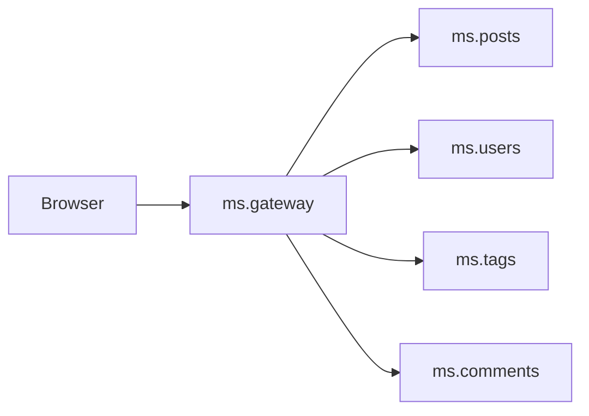
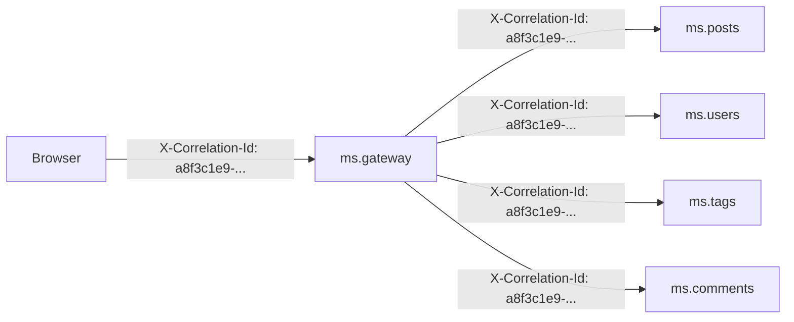
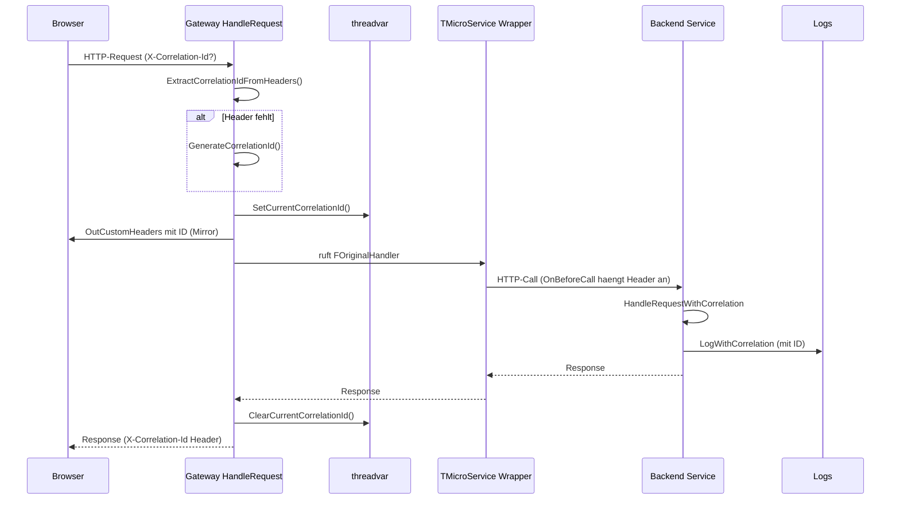

# Correlation IDs

## Was sind Correlation IDs?

Eine **Correlation ID** ist eine eindeutige Kennung, die einer einzelnen Benutzeranfrage zugeordnet wird und durch alle beteiligten Services propagiert wird. Sie ist eines der wichtigsten Werkzeuge zum Debuggen verteilter Systeme.

## Das Problem ohne Correlation IDs

Ein einfacher Browser-Klick auf "Post anzeigen" loest in unserer Architektur 4 Backend-Aufrufe aus:



Wenn etwas schief geht, hat jedes Service seine eigene Logdatei mit Eintraegen wie:
```
ms.posts.log:    20260409 10:23:45  IFO  Get(42) -> ID=42
ms.users.log:    20260409 10:23:45  IFO  Get(1) -> ID=1
ms.tags.log:     20260409 10:23:45  WRN  Database busy, retrying
ms.comments.log: 20260409 10:23:45  ERR  Connection timeout
```

**Die Frage:** Welche dieser Eintraege gehoeren zur gleichen Browser-Anfrage? Bei einem laufenden System mit hunderten Anfragen pro Sekunde ist das ohne Korrelation **unmoeglich** zu rekonstruieren.

## Die Loesung

Eine Correlation ID wird einmal pro Anfrage erzeugt und durch alle Services weitergereicht:



Jedes Service schreibt die Correlation ID in seine Logs:
```
ms.posts.log:    20260409 10:23:45 [a8f3c1e9-...] IFO  Get(42) -> ID=42
ms.users.log:    20260409 10:23:45 [a8f3c1e9-...] IFO  Get(1) -> ID=1
ms.tags.log:     20260409 10:23:45 [a8f3c1e9-...] WRN  Database busy, retrying
ms.comments.log: 20260409 10:23:45 [a8f3c1e9-...] ERR  Connection timeout
```

Mit `grep "a8f3c1e9-..."` ueber alle Logdateien sehe ich auf einen Blick **alle** Eintraege, die zu dieser einen Anfrage gehoeren.

## HTTP-Header-Konvention

Wir verwenden den de-facto Standard-Header:

```
X-Correlation-Id: <unique-id>
```

Die ID ist eine GUID/UUID (z.B. `a8f3c1e9-7d24-4b5f-9e1c-2a3b4c5d6e7f`). Sie wird:

1. Vom Browser mitgeschickt (sofern vorhanden) -- oder
2. Vom Gateway erzeugt (falls der Browser keine sendet)
3. Vom Gateway an alle Backend-Service-Aufrufe propagiert
4. Im Response-Header zurueckgegeben (Browser kann sie loggen)

## Implementierung im Projekt

### Komponenten

| Datei | Zweck |
|-------|-------|
| `shared/ms.shared.correlation.pas` | threadvar, Helper-Funktionen, Header-Konstante |
| `shared/ms.shared.service.pas` | TMicroService wrappt HTTP-Handler fuer alle Backend-Services |
| `ms.gateway/ms.gateway.server.pas` | Erweitert HandleRequest, propagiert IDs an Backend-Clients |
| `ms.gateway/www/js/api.js` | Browser sendet/empfaengt die ID |

### Threadvar als Speicher

Die Correlation ID wird in einer **threadvar** gespeichert, sodass sie pro HTTP-Request-Thread isoliert ist:

```pascal
threadvar
  CurrentCorrelationId: RawUtf8;
```

mORMot2's HTTP-Server (`THttpAsyncServer` mit `useHttpAsync`) verwendet einen Thread-Pool. Jede Anfrage laeuft in einem Thread, daher ist `threadvar` der korrekte Mechanismus zur Request-lokalen Speicherung.

### Lebenszyklus pro Request



Schritt fuer Schritt:

1. Request kommt am HTTP-Handler an
2. `ExtractCorrelationIdFromHeaders()` sucht `X-Correlation-Id` in `InHeaders`
3. Wenn nicht vorhanden: `GenerateCorrelationId()` erzeugt eine GUID
4. `SetCurrentCorrelationId()` speichert sie in der threadvar
5. `OutCustomHeaders` bekommt die ID zurueck
6. Original-Handler wird aufgerufen (mORMot2 verarbeitet den Request)
7. Im Original-Handler kann jeder Code `GetCurrentCorrelationId()` lesen
8. Nach dem Handler: `ClearCurrentCorrelationId()`

### Hook im TMicroService (Backend-Services)

Alle Backend-Services (auth, users, posts, tags, comments, media, analytics, config) erben von `TMicroService`. Die Basisklasse wrappt den HTTP-Handler einmal in `Run()`:

```pascal
FOriginalHandler := FHttpServer.HttpServer.OnRequest;
FHttpServer.HttpServer.OnRequest := HandleRequestWithCorrelation;
```

Der Wrapper extrahiert/setzt die ID und ruft den Original-Handler auf. Damit haben alle Backend-Services automatisch Correlation-ID-Support, ohne dass Service-Implementierungen geaendert werden muessen.

### Hook im Gateway

Das Gateway hat bereits einen eigenen `HandleRequest` (fuer CORS und Static-File-Serving). Dort wird die Extraktion in den existierenden Code integriert.

### Forwarding an Backend-Services

Das Gateway nutzt 7 `TRestHttpClient`-Instanzen, um Backend-Services aufzurufen. Vor jedem Call wird die threadvar gelesen und als Header an den Client uebergeben.

mORMot2 bietet `TRestHttpClient.SessionHttpHeader` (oder eine vergleichbare API) zum Setzen eines benutzerdefinierten Headers. Da die Clients zwischen Threads geteilt sind, wird die ID per-call gesetzt -- die threadvar im Gateway-Thread enthaelt die korrekte ID, weil das Setzen direkt vor dem Aufruf erfolgt.

### Logging

Der Helper `LogWithCorrelation` praependiert die Correlation ID automatisch:

```pascal
LogWithCorrelation(sllInfo, '% started on port %', [FServiceName, FPort], self);
// Ergibt im Log: 20260409 10:23:45 [a8f3c1e9-...] IFO ms.posts started on port 8083
```

Vorhandene `TSynLog.Add.Log`-Calls koennen schrittweise ersetzt werden. Der Standard-Logger funktioniert weiterhin -- nur ohne Correlation-ID-Praefix.

## Wie nutze ich Correlation IDs als Entwickler?

### In Pascal-Code

```pascal
uses
  ms.shared.correlation;

procedure DoSomething;
begin
  // Direkt loggen mit Correlation-ID-Praefix:
  LogWithCorrelation(sllInfo, 'Processing user %', [UserId], self);

  // Oder die ID lesen und manuell verwenden:
  Logger.Log('Custom message [%]', [GetCurrentCorrelationId]);
end;
```

### Im Browser

```javascript
// Aus dem Response-Header lesen:
const response = await fetch('/api/Post/Get', {...});
const correlationId = response.headers.get('X-Correlation-Id');
console.log('Request correlation:', correlationId);

// Eigene ID senden:
fetch('/api/Post/Get', {
  headers: {'X-Correlation-Id': 'my-test-id-123'},
  ...
});
```

### Per curl

```bash
curl -X POST http://localhost:8080/api/Post/Get \
  -H "Content-Type: application/json" \
  -H "X-Correlation-Id: my-test-id-123" \
  -d "[42]"
```

Anschliessend in den Logs:
```bash
grep "my-test-id-123" _out/Win32-Debug/APP/logs/*.log
```

## Performance-Hinweise

- Die threadvar-Speicherung ist O(1) und nahezu kostenlos
- Header-Extraktion erfolgt einmal pro Request
- GUID-Generierung verwendet mORMot2's `RandomGuid` (kryptografisch stark, aber schnell)
- Es entsteht **kein zusaetzlicher Netzwerk-Overhead** -- der Header ist nur ~50 Bytes

## Alternativen, die wir nicht implementiert haben

- **OpenTelemetry / W3C Trace Context**: Industriestandard fuer verteiltes Tracing mit Spans und Trace-IDs. Maechtiger, aber wesentlich aufwendiger zu integrieren. Fuer dieses Demo waere es Overkill.
- **Strukturiertes Logging mit JSON**: Wuerde das Filtern in Tools wie ELK/Loki erleichtern. mORMot2's TSynLog ist textbasiert, eine Umstellung waere eine eigene grosse Aufgabe.
- **Per-Request Logging-Context**: TSynLog hat keinen eingebauten Per-Request-Kontext. Stattdessen loesen wir es ueber threadvar und einen Logging-Helper.

## Verifikation

1. Alle Services starten
2. Browser oeffnet `http://localhost:8080`
3. Auf einen Post klicken
4. In den Logs nachschauen:
   ```bash
   grep -h "[A-F0-9]\{8\}-[A-F0-9]\{4\}-[A-F0-9]\{4\}-[A-F0-9]\{4\}-[A-F0-9]\{12\}" \
     _out/Win32-Debug/APP/logs/*.log | sort
   ```
5. Alle Eintraege zur gleichen Anfrage haben dieselbe ID
