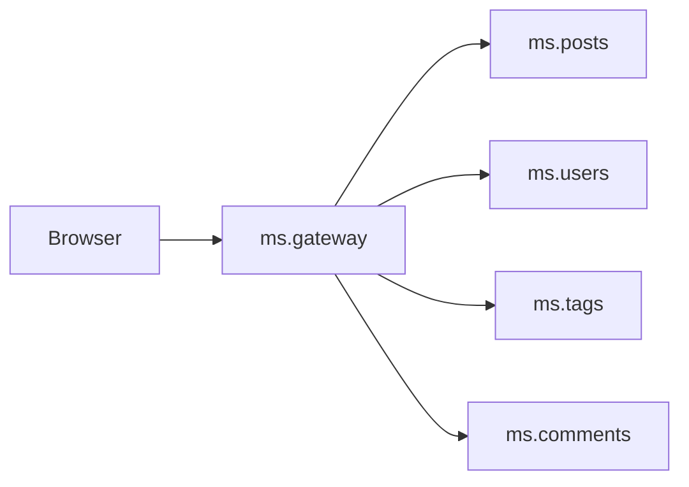
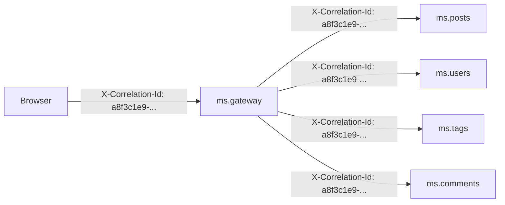
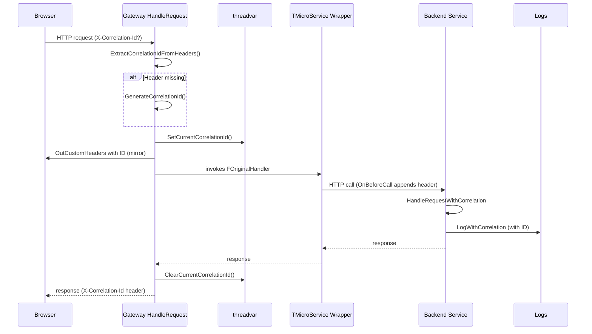

# Correlation IDs

## What are correlation IDs?

A **correlation ID** is a unique identifier attached to a single user request that propagates through every service involved in handling it. It is one of the most important debugging tools for distributed systems.

## The problem without correlation IDs

A simple browser click on "show post" triggers 4 backend calls in our architecture:



When something goes wrong, each service has its own log file with entries like:
```
ms.posts.log:    20260409 10:23:45  IFO  Get(42) -> ID=42
ms.users.log:    20260409 10:23:45  IFO  Get(1) -> ID=1
ms.tags.log:     20260409 10:23:45  WRN  Database busy, retrying
ms.comments.log: 20260409 10:23:45  ERR  Connection timeout
```

**The question:** which of these entries belong to the same browser request? In a running system with hundreds of requests per second this is **impossible** to reconstruct without correlation.

## The solution

A correlation ID is generated once per request and forwarded through every service:



Every service writes the correlation ID into its logs:
```
ms.posts.log:    20260409 10:23:45 [a8f3c1e9-...] IFO  Get(42) -> ID=42
ms.users.log:    20260409 10:23:45 [a8f3c1e9-...] IFO  Get(1) -> ID=1
ms.tags.log:     20260409 10:23:45 [a8f3c1e9-...] WRN  Database busy, retrying
ms.comments.log: 20260409 10:23:45 [a8f3c1e9-...] ERR  Connection timeout
```

A single `grep "a8f3c1e9-..."` across all log files immediately reveals **every** entry that belongs to that one request.

## HTTP header convention

We use the de-facto standard header:

```
X-Correlation-Id: <unique-id>
```

The ID is a GUID/UUID (e.g. `a8f3c1e9-7d24-4b5f-9e1c-2a3b4c5d6e7f`). It is:

1. Sent by the browser if it has one, or
2. Generated by the gateway if the browser does not send one
3. Forwarded by the gateway to every backend service call
4. Returned in the response header (so the browser can log it)

## Implementation in this project

### Components

| File | Purpose |
|------|---------|
| `shared/ms.shared.correlation.pas` | threadvar, helper functions, header constant |
| `shared/ms.shared.service.pas` | TMicroService wraps the HTTP handler for all backend services |
| `ms.gateway/ms.gateway.server.pas` | Extends HandleRequest, propagates the ID to backend clients |
| `ms.gateway/www/js/api.js` | Browser sends/receives the ID |

### threadvar as storage

The correlation ID is stored in a **threadvar** so it is isolated per HTTP request thread:

```pascal
threadvar
  CurrentCorrelationId: RawUtf8;
```

mORMot2's HTTP server (`THttpAsyncServer` with `useHttpAsync`) uses a thread pool. Each request runs on one thread, so `threadvar` is the correct mechanism for request-local storage.

### Per-request lifecycle



Step by step:

1. The request arrives at the HTTP handler
2. `ExtractCorrelationIdFromHeaders()` looks for `X-Correlation-Id` in `InHeaders`
3. If absent, `GenerateCorrelationId()` creates a GUID
4. `SetCurrentCorrelationId()` stores it in the threadvar
5. `OutCustomHeaders` receives the ID for the response
6. The original handler is invoked (mORMot2 processes the request)
7. Inside the handler, any code can read the ID via `GetCurrentCorrelationId()`
8. After the handler runs: `ClearCurrentCorrelationId()`

### Hook in TMicroService (backend services)

All backend services (auth, users, posts, tags, comments, media, analytics, config) inherit from `TMicroService`. The base class wraps the HTTP handler once in `Run()`:

```pascal
FInnerHttpHandler := FHttpServer.HttpServer.OnRequest;
FHttpServer.HttpServer.OnRequest := HandleRequestWithCorrelation;
```

The wrapper extracts/sets the ID and calls the inner handler. This means all backend services automatically have correlation ID support without any change to the service implementations themselves.

### Hook in the gateway

The gateway already has its own `HandleRequest` (for CORS and static-file serving). The extraction logic is integrated into the existing code at the very top.

### Forwarding to backend services

The gateway uses 7 `TRestHttpClient` instances to call backend services. mORMot2 provides the `OnBeforeCall` event on `TRestClientUri` -- a per-call hook that fires for every outgoing request, on the calling thread, and lets us mutate `Call.InHead` to append custom headers.

In `ConnectToBackend` we install `ForwardCorrelationId` as the `OnBeforeCall` handler. It reads the correlation ID from the threadvar (set by the gateway thread) and appends it to the outgoing request. Since the hook runs synchronously on the same thread that initiated the call, no race conditions can occur.

### Logging

The `LogWithCorrelation` helper automatically prepends the correlation ID:

```pascal
LogWithCorrelation(sllInfo, '% started on port %', [FServiceName, FPort], self);
// Produces: 20260409 10:23:45 [a8f3c1e9-...] IFO ms.posts started on port 8083
```

Every log call in the project goes through `LogWithCorrelation`. The helper also works without an active correlation ID (e.g. during service startup) -- the prefix is simply omitted.

In addition, the HTTP wrapper in `TMicroService.HandleRequestWithCorrelation` automatically logs every incoming request:

```
20260409 10:23:45 [a8f3c1e9-...] IFO ms.posts REQ POST /api/Post/Get
20260409 10:23:45 [a8f3c1e9-...] IFO ms.posts RSP POST /api/Post/Get -> 200
```

This means **every** request appears in the logs with its correlation ID, without any service implementation having to be modified.

## How do I use correlation IDs as a developer?

### In Pascal code

```pascal
uses
  ms.shared.correlation;

procedure DoSomething;
begin
  // Log directly with the correlation ID prefix:
  LogWithCorrelation(sllInfo, 'Processing user %', [UserId], self);

  // Or read the ID and use it manually:
  Logger.Log('Custom message [%]', [GetCurrentCorrelationId]);
end;
```

### In the browser

```javascript
// Read it from the response header:
const response = await fetch('/api/Post/Get', {...});
const correlationId = response.headers.get('X-Correlation-Id');
console.log('Request correlation:', correlationId);

// Or send your own:
fetch('/api/Post/Get', {
  headers: {'X-Correlation-Id': 'my-test-id-123'},
  ...
});
```

### Using curl

```bash
curl -X POST http://localhost:8080/api/Post/Get \
  -H "Content-Type: application/json" \
  -H "X-Correlation-Id: my-test-id-123" \
  -d "[42]"
```

Then in the logs:
```bash
grep "my-test-id-123" _out/Win32-Debug/APP/logs/*.log
```

## Performance notes

- threadvar storage is O(1) and essentially free
- Header extraction happens once per request
- GUID generation uses Delphi's `CreateGuid` (fast, no I/O)
- There is **no additional network overhead** -- the header is only ~50 bytes

## Alternatives we did not implement

- **OpenTelemetry / W3C Trace Context**: the industry standard for distributed tracing with spans and trace IDs. More powerful, but considerably more effort to integrate. For this demo it would be overkill.
- **Structured logging (JSON)**: would make filtering in tools like ELK/Loki easier. mORMot2's TSynLog is text-based and switching the format would be a separate, large task.
- **Per-request logging context**: TSynLog has no built-in per-request context. We solve it via threadvar plus a logging helper instead.

## Verification

1. Start all services
2. Open `http://localhost:8080` in the browser
3. Click on a post
4. Inspect the logs:
   ```bash
   grep -h "[A-F0-9]\{8\}-[A-F0-9]\{4\}-[A-F0-9]\{4\}-[A-F0-9]\{4\}-[A-F0-9]\{12\}" \
     _out/Win32-Debug/APP/logs/*.log | sort
   ```
5. All entries belonging to the same request share the same ID
