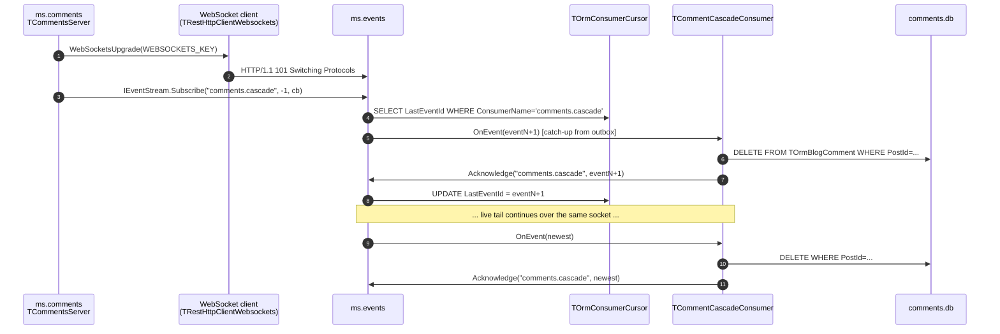

# Event Bus and Cross-Service Cascades

This document explains the **ms.events** microservice — the project's domain-event bus — and the cross-service cascade pipeline built on top of it. It is the companion piece to [event-driven.md](event-driven.md): that file shows the basic mORMot2 callback-over-WebSocket mechanism for live log tailing; this one covers the production-flavoured event bus with persistence, replay, and cursor-based resume.

## Why a second event mechanism at all?

The log tail in [event-driven.md](event-driven.md) is a one-way broadcast: the gateway tells browsers about new log lines, and nothing breaks if a browser misses some. Domain events are different. When `ms.posts` deletes a post, the `ms.comments` service must remove the orphaned comments — even if it was offline at the moment of the delete, even if the WebSocket dropped, even if the consumer crashed mid-handler. We therefore need:

1. **Persistence.** The event survives a server restart.
2. **Catch-up.** A reconnecting consumer can ask for "everything since I last acknowledged".
3. **At-least-once delivery.** Better to deliver twice than to lose an event.
4. **Idempotent consumers.** Because at-least-once means consumers must tolerate replays.

The `ms.events` service implements all four. The pipeline is intentionally minimal — no Kafka, no RabbitMQ, no external dependencies — using only mORMot2 + SQLite. The architectural decision to build cross-service consistency on this bus is documented in ADR-0001 (Knowledge-DB, doc_id=31); the implementation plan is PLAN-cross-service-cascades (Knowledge-DB, doc_id=32).

## High-level picture

```mermaid
graph LR
    subgraph Producer side
        Posts[ms.posts<br/>TPostsServer]
        BufClient[TEventPublisher<br/>buffered client<br/>shared/ms.shared.events.pas]
        Posts -->|Enqueue PostDeleted| BufClient
    end

    subgraph Bus
        Bus[ms.events<br/>TEventStreamService]
        Outbox[(TOrmEventOutbox<br/>persistent)]
        Cursors[(TOrmConsumerCursor<br/>per consumer)]
        Bus -->|insert| Outbox
        Bus -->|upsert on Acknowledge| Cursors
    end

    subgraph Consumer side
        Comments[ms.comments<br/>TCommentsServer]
        Cascade[TCommentCascadeConsumer<br/>OnEvent + DELETE WHERE]
        Comments -->|owns| Cascade
    end

    BufClient -->|HTTP IEventPublisher.Publish<br/>over persistent WS| Bus
    Bus -.->|WebSocket fan-out<br/>IEventStreamCallback.OnEvent| Cascade
    Cascade -->|Acknowledge name, id| Bus
```

Three transports meet on the same TCP port (8091):

- **HTTP**: producers POST to `IEventPublisher.Publish` (one round-trip per published event, but it is fire-and-forget from the producer's perspective because the buffered client returns immediately).
- **WebSocket binary** (`synopsebin`): the consumer subscribes through `IEventStream.Subscribe`; the bus then pushes `OnEvent(...)` calls back over the same socket.
- **REST/SOA** within mORMot2: `Acknowledge(name, id)` rides the same WebSocket back to the bus.

Same as the log-tail document, the trick is that the framework lets us define normal Pascal interfaces and arranges all of the above transparently.

## Two stages, one codebase

The bus shipped in two stages. The implementation supports both, selected by whether an `IRestOrm` is wired into `TEventStreamService.Create`.

| Aspect | Stage 1 (in-memory) | Stage 2 (persistent, default in production) |
|---|---|---|
| Constructor | `TEventStreamService.Create(nil)` | `TEventStreamService.Create(FRestServer.Orm)` |
| Storage | Ring buffer of `EVENT_BUFFER_SIZE = 1000` events | `TOrmEventOutbox` row per event, ID = SQLite RowID |
| Catch-up `aFromEventId > 0` older than buffer | Raises `EEventBufferOverrun` | Served from the outbox |
| `aFromEventId = -1` | Treated as live-only | Resolves to `TOrmConsumerCursor.LastEventId + 1` |
| `Acknowledge(name, id)` | No-op | Upserts the cursor row, monotonic guard |
| Survives restart | No | Yes |

The unit tests still rely on Stage 1 (`TEventStreamService.Create` with no args → `nil` orm), which is why both behaviours coexist. Stage 2 is what `TEventsServer.SetupServices` wires up at runtime.

## Component map

### Shared API (`shared/ms.shared.api.pas`)

- **`TEventDto`** — payload record carried across service boundaries. Fields: `ID`, `EventType`, `PayloadJson`, `ProducerService`, `CreatedAt`, `CorrelationId`, `SchemaVersion`. The `SchemaVersion` field is mandatory from day one so future payload-shape changes have a migration path.
- **`IEventPublisher.Publish(eventType, payloadJson, producer, schemaVersion)`** — synchronous SOA call. Returns the bus-assigned `ID` (Stage 2: the SQLite RowID of the new outbox row).
- **`IEventStream.Subscribe(consumerName, fromEventId, callback)`** — registers a callback to receive events. `fromEventId = 0` means live-only, `> 0` means catch-up from that ID, `-1` means resume from the persisted cursor (Stage 2 only).
- **`IEventStream.Acknowledge(consumerName, lastAckedId)`** — advances the persisted cursor for the named consumer. Idempotent and monotonic on the server side (a smaller ID never rewinds).
- **`IEventStream.Unsubscribe(callback)`** — explicit teardown; framework-driven cleanup via `CallbackReleased` is the normal path.
- **`IEventStreamCallback.OnEvent(event)`** — the server-to-client call, one invocation per event per subscriber.
- **Event-type constants** — `EVENT_POST_PUBLISHED`, `EVENT_POST_DELETED`, `EVENT_SCHEMA_POSTS_V1`. The string values are the wire contract; the constants exist so a typo in production code becomes a compile error.

### Bus implementation (`ms.events/`)

- **`TOrmEventOutbox`** — SQLite-backed mirror of `TEventDto`. Indexes on `EventType`, `ProducerService`, `CorrelationId` keep catch-up filters and trace lookups cheap. The SQLite `RowID` is what becomes `TEventDto.ID` on the wire.
- **`TOrmConsumerCursor`** — one row per logical consumer (`ConsumerName` is unique). `LastEventId` is the highest event the consumer has acknowledged; `Subscribe(name, -1, cb)` reads `LastEventId + 1` to resume.
- **`TEventStreamService`** — owns the ring buffer (still used as fast tail cache), the subscriber list, and the ORM handle. `AppendAndBroadcast` persists first, then broadcasts; `CatchUpFromOutboxLocked` streams historical rows under the bus lock so catch-up and live tail join without gap or duplicate.
- **`TEventPublisherService`** — thin façade implementing `IEventPublisher`. Builds a `TEventDto`, stamps the current correlation ID and producer service, hands it to `TEventStreamService.AppendAndBroadcast`.
- **`TEventsServer`** — the `TMicroService` host. Registers the two SOA services on its `TRestServerDB`, sets `optExecLockedPerInterface` on the stream so `OnEvent` calls per subscriber are serialized, and passes `FRestServer.Orm` into the stream service to enable the Stage-2 outbox path.

### Producer-side client (`shared/ms.shared.events.pas`)

The synchronous `IEventPublisher` proxy is fine for tests but bad for production: a HTTP round-trip per `Publish` would couple every blog-post write to the bus's availability. **`TEventPublisher`** is the buffered client every producing service should use:

- `Enqueue(eventType, payloadJson, schemaVersion)` returns immediately. The producer's write path never blocks on the network.
- A background `TEventPublisherThread` drains the queue **one item at a time**. One-at-a-time is deliberate: on a publish failure the item is requeued at the head with `Attempts += 1`, and the rest of the queue stays untouched for the retry.
- `MAX_PUBLISH_ATTEMPTS = 5` plus `EVENT_RETRY_BACKOFF_MS = 1000` between failed rounds. After five attempts the item is dropped — a poison-pill guard so one bad event cannot stall the whole pipeline.
- `EnsurePublisher` lazily builds the `TRestHttpClientWebsockets`. Connection failure is silent: the next loop iteration retries.
- `ResetClient` is called after exception-style failures (typical: a stale socket) so the next iteration starts from a clean WebSocket handshake.

The shape mirrors `TLogShipper` deliberately — same backpressure policy, same wake-up-event-driven worker, so anyone who has read [central-logging.md](central-logging.md) will recognize it.

## Producer flow: `ms.posts` emits `PostDeleted`

```mermaid
sequenceDiagram
    autonumber
    participant Caller as HTTP caller<br/>(gateway)
    participant Posts as ms.posts<br/>TPostService
    participant DB as posts.db
    participant Buf as TEventPublisher<br/>(in-process queue)
    participant Worker as TEventPublisherThread
    participant Bus as ms.events

    Caller->>Posts: POST IPost.Remove(123)
    Posts->>DB: SELECT slug FROM TOrmBlogPost WHERE ID=123
    Posts->>DB: BEGIN; DELETE TOrmBlogPost; DELETE TOrmBlogPostFts; COMMIT
    Posts->>Buf: Enqueue(PostDeleted, {postId, slug, deletedAt})
    Posts-->>Caller: HTTP 200
    Note over Buf,Worker: producer is no longer waiting
    Worker->>Bus: IEventPublisher.Publish(...)
    Bus->>Bus: insert TOrmEventOutbox; broadcast OnEvent
```

The order matters: the slug is read **before** the delete (it cannot be read back afterwards), the event is enqueued **after** the commit (so a rolled-back delete does not trigger downstream cascades), and the response goes back to the caller before any of the bus traffic happens.

`TPostsServer.SetupServices` constructs a single `TEventPublisher`, calls `Start`, and hands it into `TPostService`. `TPostsServer.Destroy` calls `Stop` then frees it. The lifecycle is owner-managed; `TPostService` only enqueues against it.

When `Config.EventsUrl` is empty or the construction fails, `FEventPublisher` stays `nil` and `TPostService.EmitPostDeleted` short-circuits — the post-deletion write path keeps working with no events emitted. This is the offline-friendly default the demo uses for unit tests.

## Consumer flow: `ms.comments` cascades



The cascade is implemented in two parts:

1. **`TCommentsServer`** — owns the `TRestHttpClientWebsockets`, the resolved `IEventStream`, the `IEventStreamCallback`, a critical section guarding all three (concurrent access from the reconnect thread vs. shutdown), and a background `TCommentsReconnectThread`. The interesting public surface is `EnsureEventSubscription`, which is what the reconnect thread wakes up to call every five seconds.

2. **`TCommentCascadeConsumer (IEventStreamCallback)`** — the event-handler proper. It filters on `EVENT_POST_DELETED`, parses `postId` from the JSON payload via `TDocVariantData`, runs `FOrm.Delete(TOrmBlogComment, FormatUtf8('PostId=%', [PostId]))`, and finally `Acknowledge`s. Other event types are still acknowledged so the cursor advances and the consumer does not re-receive them on every reconnect.

The DELETE-WHERE pattern is **naturally idempotent**: a replayed `PostDeleted` simply matches no rows on the second pass. This is the contract documented on the `EVENT_POST_DELETED` constant. New cascade types must preserve idempotency on their own merits — for example, "PostUpdated" cascades that bump a counter would need a dedup table.

## Catch-up, cursor, and replay mechanics

This is the trickiest part of the bus, so it gets its own walkthrough.

A subscriber requests a starting point on `Subscribe`:

| `aFromEventId` | Meaning |
|---|---|
| `0` | Live-only. No history. Useful when the consumer has its own state and only cares about new events. |
| `> 0` | Replay every event with `ID >= fromEventId`, then continue live. |
| `-1` | (Stage 2 only) Resolve to `cursor.LastEventId + 1`, then replay + live. First-time consumers get the entire outbox starting at ID 1. |

When the bus receives a `Subscribe` call, it acquires its lock and runs `CatchUpFromOutboxLocked(from, FNextId, callback)`. The query is `SELECT * FROM TOrmEventOutbox WHERE RowID >= ? AND RowID < ? ORDER BY RowID`, deserialized into `TEventDto` records and dispatched to `OnEvent` one at a time. Crucially this happens **under the same lock** that serializes new publishes:

```
EnterCriticalSection(FLock)
  resolve fromId (cursor lookup if -1)
  CatchUpFromOutboxLocked(from, FNextId, cb)   <-- replay
  add subscriber to FSubscribers              <-- now live
LeaveCriticalSection(FLock)
```

So a publisher that arrives during catch-up is queued behind the lock and will be delivered to the subscriber after `Subscribe` returns — no gap, no duplicate, no race. The cost is that publishers wait on slow catch-ups; for a learning project this is the right trade-off.

`Acknowledge(name, lastAckedId)` is a separate path: it loads or creates the matching `TOrmConsumerCursor` row and updates `LastEventId` only if `lastAckedId > Cursor.LastEventId`. The monotonic guard is what makes out-of-order or replayed ACKs safe (a delayed ACK from a long-running handler cannot rewind progress made in the meantime).

## Reconnect on the consumer

`TCommentsReconnectThread` runs as long as the comments service is up. Every five seconds (`CASCADE_RECONNECT_INTERVAL_MS`) it calls `TCommentsServer.EnsureEventSubscription`, which is a no-op when the subscription is currently live and a fresh `TrySubscribeToEvents` attempt when it is not.

`TrySubscribeToEvents` is the careful version: it builds the new `TRestHttpClientWebsockets`, performs the WebSocket upgrade, registers and resolves the service interfaces, and constructs the `TCommentCascadeConsumer` — all in **local variables**. Only after `IEventStream.Subscribe` returns successfully are those locals committed into `FEventsClient`/`FEventStream`/`FEventCallback` under the connection lock. Concurrent `OnEvent` calls (which run on the WebSocket worker thread) therefore never observe a half-built state.

Known limitation: silent socket deaths (the bus crashes without sending a FIN, the network drops a TCP keepalive) are not actively detected by this client. The reconnect thread only re-attempts when `FEventStream` has already been visibly nulled out by an exception. Active liveness (ping/pong, OnDisconnect hook) is a documented follow-up.

## Failure handling, in one table

| Failure | Where it surfaces | Behaviour |
|---|---|---|
| Producer can't reach bus on `Enqueue` | Worker thread sees `EnsurePublisher` return False | Item requeued at head, sleep `EVENT_RETRY_BACKOFF_MS`, retry. After `MAX_PUBLISH_ATTEMPTS` the item is dropped. |
| Producer exception during `Publish` | Worker thread `try/except` | `ResetClient` (drop cached client), requeue, retry. |
| Producer queue overflows | `Enqueue` (`MAX_EVENT_QUEUE_SIZE`) | Oldest pending entry dropped to make room. Same backpressure as `TLogShipper`. |
| Consumer raises in `OnEvent` | Bus's broadcast loop | Per-subscriber failure counter increments; after `DEFAULT_SUBSCRIBER_FAILURE_THRESHOLD = 3` the subscriber is evicted. The reconnect thread re-subscribes on next tick. |
| Consumer can't reach bus at startup | `TrySubscribeToEvents` exception path | All connection fields stay nil, comments service starts without cascades; reconnect thread keeps trying. |
| Outbox `Add` fails | `AppendAndBroadcast` raises `ESynException` | Publisher gets the exception. Producer-side `try/except` in `EmitPostDeleted` swallows it (the post is already gone; we don't want to surface bus failures into the caller's HTTP response). |
| Replayed event reaches consumer twice | `OnEvent` runs twice | DELETE WHERE matches no rows on second pass — silent no-op. Idempotency is the consumer's contract. |
| Acknowledge arrives out of order | `Acknowledge` server-side | Monotonic guard: smaller ID does not rewind. |

## Test layers

The bus is exercised at three depths:

1. **`TTestEventStream` (Stage 1, in-process, no ORM)** — six tests covering the ring buffer, fan-out, replay-from-buffer, overrun-raises, failing-subscriber eviction, unsubscribe.
2. **`TTestEventStreamPersistence` (Stage 2, in-process, in-memory ORM)** — five tests covering persist-on-publish, ORM catch-up beyond the ring buffer, cursor upsert, monotonic guard, resume-from-cursor.
3. **`TTestCommentCascadeConsumer` (in-process consumer-only)** — three tests covering the cascade body itself: matching delete, replay-is-no-op, unrelated event types are ignored.
4. **`TTestCascadeDelete` (full WebSocket round-trip)** — the end-to-end test: real `TRestHttpServer` on a high test port, real WebSocket upgrade, real `IEventPublisher.Publish` over HTTP, real `IEventStreamCallback.OnEvent` over WebSocket, real DELETE on a real (in-memory) SQLite DB. Two tests: the cascade itself, and the "subscribe with `aFromEventId = 1` after the cascade already ran" replay scenario.
5. **`TTestEventBusRoundtrip`** — the original Stage-1 round-trip regression test, kept as a guard for the `TInterfaceFactory.RegisterInterfaces` call in `ms.shared.api`'s initialization (without it `GetFakeCallback` raises).

Tests use the project's standard pattern: in-process `TRestServerDB` with `:memory:` SQLite, `optExecLockedPerInterface` on the stream service, and risky calls explicitly wrapped in `try/except` with `CheckEqual('')` because `TSynTestCase` swallows exceptions silently otherwise.

## Shutdown discipline

The naive teardown of a WebSocket-callback consumer looks innocent:

```pascal
// DON'T do this in DoFinalize:
FEventStream.Unsubscribe(FEventCallback);
FreeAndNil(FEventsClient);
```

It costs 5 to 30 seconds during `stop-all.cmd`. Two separate hazards conspire:

**Hazard 1: synchronous SOA calls over a dying WebSocket block on the socket timeout.** When `ms.events` shuts down before `ms.comments`, the `Unsubscribe` POST goes out, the server replies (or fails to reply) several seconds later, and only then does the call return. The client's `try/except` catches the exception — but only after the timeout. Observed in production: 5.1 s for `Unsubscribe`, 30.4 s for an in-flight `Acknowledge` from a stale `OnEvent`. Combined with the half-dozen other synchronous teardown steps, `ms.comments` took 44 s to stop.

**Hazard 2: in-flight `OnEvent` calls keep arriving on the WebSocket reader thread until the socket actually dies.** Each one runs the cascade body, then issues `Acknowledge` back to the bus — same blocking call, same timeout.

The fix is twofold and lives in `ms.comments/ms.comments.server.pas`:

```pascal
// 1. The consumer carries a one-way Shutdown flag.
TCommentCascadeConsumer = class(...)
strict private
  FShutdown: boolean;
public
  procedure Shutdown;  // sets FShutdown := True
end;

procedure TCommentCascadeConsumer.OnEvent(const aEvent: TEventDto);
begin
  if FShutdown then
    Exit;                                   // short-circuit at entry
  ...DELETE WHERE PostId=...
  if FShutdown then
    Exit;                                   // re-check before talking back
  if FStream <> nil then
    try FStream.Acknowledge(...) except end;
end;

// 2. DoFinalize sets the flag FIRST, then drops references without Unsubscribe.
procedure TCommentsServer.DoFinalize;
begin
  if FEventConsumer <> nil then
    FEventConsumer.Shutdown;                // flag the consumer

  // stop the reconnect worker

  EnterCriticalSection(FConnectionLock);
  try
    FEventConsumer := nil;
    FEventCallback := nil;
    FEventStream := nil;
    FreeAndNil(FEventsClient);              // closes the socket
  finally
    LeaveCriticalSection(FConnectionLock);
  end;
  ...
end;
```

Three rules for any future consumer wired into this bus:

1. **Never call back into the bus during teardown.** No `Unsubscribe`, no `Acknowledge`, nothing synchronous. Closing the socket via `FreeAndNil(client)` is sufficient — mORMot2 fires `CallbackReleased` server-side automatically when the WebSocket disconnects, which is the proper path to remove the subscriber from the bus's list.
2. **Carry a `Shutdown` flag the consumer checks before any work.** The flag must be set at the very start of `DoFinalize`, before the reconnect thread is stopped or the client is freed. Re-check the flag before each call back into the bus, because a single `OnEvent` can enter at any time and the flag may have flipped while the cascade body was running.
3. **Wrap every callback method body in a master `try/except`.** This is independent of the shutdown flag and protects against the other failure mode: if an exception escapes `OnEvent` it can crash the process via the WebSocket reader thread. The pair of guards — exception safety plus shutdown short-circuit — is what makes the consumer both crash-safe and shutdown-friendly.

The outbound producer client (`TEventPublisher` in `shared/ms.shared.events.pas`) does not need the same precaution because its worker thread already retries-on-failure rather than blocking — `Stop` simply terminates the worker and any in-flight publish is allowed to fail naturally.

## Trade-offs and non-goals

What the bus deliberately is not:

- **Not Kafka.** No partitioning, no consumer groups, no broker cluster. Single-instance bus with a single SQLite outbox. Vertical scaling only.
- **Not at-most-once.** The bus is firmly at-least-once; consumers must be idempotent. Every cascade introduced on top of this bus must satisfy that contract or implement its own dedup.
- **Not a generic cascade engine.** Each producer/consumer pair is wired by hand. There is no schema-driven "delete X cascades to Y" magic.
- **Not crash-safe on the producer queue.** `TEventPublisher`'s queue is in process memory only. If the producing service crashes between `Enqueue` and a successful `Publish`, the event is lost. For the demo this is acceptable; a real outbox-on-the-producer-side would persist the queue too (the so-called "transactional outbox" pattern) — a documented follow-up if anyone wants to extend this.
- **No dead-letter queue.** Items dropped after `MAX_PUBLISH_ATTEMPTS` or evicted subscribers are gone. Logs are the only forensic trail.
- **No outbox cleanup.** The outbox grows forever. A future job (TTL-based or "all consumers past this ID") would prune it.

## Where to look in the code

| Concern | File |
|---|---|
| Event DTO + service interfaces + event-type constants | `shared/ms.shared.api.pas` |
| Buffered producer client | `shared/ms.shared.events.pas` |
| Bus models (outbox + cursor) | `ms.events/ms.events.model.pas` |
| Bus implementation (publish, broadcast, catch-up, ack) | `ms.events/ms.events.server.pas` |
| Producer wiring | `ms.posts/ms.posts.server.pas` (`TPostsServer.SetupServices` + `TPostService.EmitPostDeleted`) |
| Consumer wiring + reconnect | `ms.comments/ms.comments.server.pas` (`TCommentsServer` + `TCommentsReconnectThread` + `TCommentCascadeConsumer`) |
| Tests | `test/ms.testCases.pas` (`TTestEventStream*`, `TTestCommentCascadeConsumer`, `TTestCascadeDelete`, `TTestEventBusRoundtrip`) |
| Architectural decision | ADR-0001 (Knowledge-DB, doc_id=31) |
| Implementation plan | PLAN-cross-service-cascades (Knowledge-DB, doc_id=32) |

## Reading order for newcomers

1. Skim [event-driven.md](event-driven.md) first — it explains the basic mORMot2 callback-over-WebSocket mechanism that this bus is built on.
2. Read ADR-0001 (Knowledge-DB, doc_id=31) — it is short and frames *why* the bus exists.
3. Walk through `TEventStreamService` in `ms.events/ms.events.server.pas` from top to bottom; the implementation is small enough to read in one sitting.
4. Open `TPostService.EmitPostDeleted` and `TCommentCascadeConsumer.OnEvent` side by side — the producer/consumer contract is two short methods.
5. Run `ms.tests.dpr` and watch the `TTestCascadeDelete` test pass; it exercises the entire pipeline end-to-end inside a single process.
