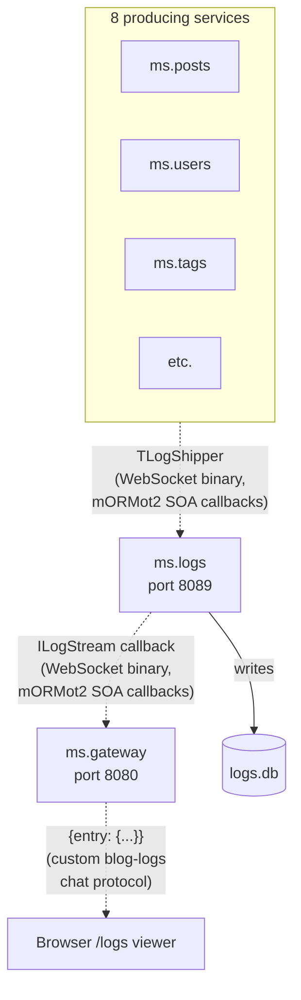
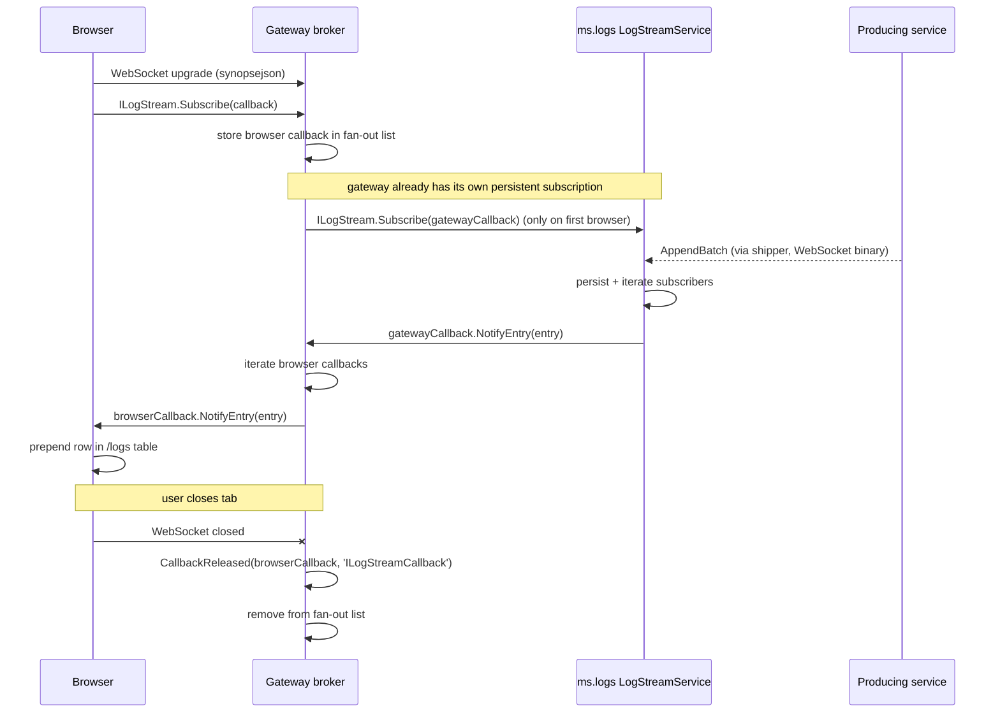

# Event-driven Service Communication

## Why event-driven?

Synchronous request/response is the right tool for "give me X". It is the wrong tool for "tell me when X happens". Polling burns CPU and bandwidth, adds latency, and produces clunky user experiences. The classic solution is **publish/subscribe**: a producer fires an event, the framework delivers it to every interested consumer.

mORMot2 implements pub/sub elegantly via **interface-based callbacks over WebSockets**. Instead of inventing a custom protocol, you define a normal Pascal interface; the framework arranges for **server-side calls to the client**, transparently transported over a persistent WebSocket connection.

This document explains how the demo uses that mechanism for one concrete feature: **live tail of every log entry across all services into the browser-side `/logs` viewer**.

## The mORMot2 building blocks

| Block | Class / Constant | Role |
|-------|------------------|------|
| Server hosting | `TRestHttpServer` created with `WEBSOCKETS_DEFAULT_MODE` + `WebSocketsEnable(...)` | Same port serves HTTP and WebSocket |
| Binary protocol | `TWebSocketProtocolBinary` (sub-protocol id `synopsebin`) | Service-to-service callbacks; fast, optionally compressed and encrypted |
| Custom chat protocol | `TWebSocketProtocolChat` (sub-protocol id `blog-logs`) | Browser ⟷ gateway; arbitrary text/JSON frames, no SOA framing baggage |
| Service contract | `IServiceWithCallbackReleased` | Interface that gets a hook when a client disconnects |
| Pascal client | `TRestHttpClientWebsockets` + `WebSocketsUpgrade(key)` | Replaces `TRestHttpClient` for persistent connections |
| Pascal callback | `TInterfacedCallback` | Refcount-managed; framework calls our `CallbackReleased` when the socket dies |

A single `TRestHttpServer` instance therefore handles three transports on the same port:

- Plain HTTP REST/SOA (existing traffic, unchanged)
- WebSocket binary (used by `TRestHttpClientWebsockets`, e.g. the gateway talking to ms.logs)
- Custom WebSocket chat (used by browsers via `new WebSocket(url, "blog-logs")`)

The protocol is selected at handshake time via the standard `Sec-WebSocket-Protocol` header.

### Why a custom chat protocol on the last hop?

mORMot2 also ships `TWebSocketProtocolJson` with sub-protocol id `synopsejson`. The temptation
is to use it for the browser, since `aWebSocketsAjax := True` advertises it in the handshake
and the name has "json" in it. **It does not work for raw browser WebSockets.** That protocol
is REST-over-WebSocket with mORMot2-specific framing: call IDs, callback registration sequence,
type-tagged parameter blobs. It is designed to be spoken by `TRestHttpClientWebsockets`, the
Pascal client. A `new WebSocket(url, "synopsejson")` from a browser completes the handshake
successfully but then sits idle -- the server is waiting for a registration frame the browser
cannot synthesize without re-implementing half of mORMot2's SOA layer in JavaScript.

The pragmatic alternative is `TWebSocketProtocolChat`: a tiny built-in protocol whose only
contract is "text frames in, text frames out". The application decides what those frames mean.
We register one chat protocol instance with the sub-protocol name `blog-logs`, hook its
`OnIncomingFrame` callback to track active connections in the broker, and the broker pushes a
JSON payload (`{"entry": {...}}`) to every active connection on each new log entry. The Pascal
stack from producers through ms.logs to the gateway keeps using mORMot2's proper binary
callback mechanism -- the showcase pattern is intact, only the very last hop to the browser
uses a hand-rolled application protocol that we control fully.

This is the right trade-off for a teaching demo: the elegant SOA-callback pattern is shown
where it shines (service-to-service over typed interfaces), and the limitation is documented
honestly where it bites (mORMot2 has no first-class browser-WebSocket bridge).

## Architecture for live log tail



Two independent transport segments:

1. **Producers → ms.logs → Gateway**: every service runs a `TLogShipper` that holds a persistent `TRestHttpClientWebsockets` connection to ms.logs. Log batches travel over the binary protocol as ordinary `ILogIngestion.AppendBatch` SOA calls -- they just happen to ride a WebSocket frame instead of an HTTP request, removing the per-batch handshake cost. The gateway in turn holds another persistent binary connection to ms.logs and registers an `ILogStreamCallback` which the framework invokes whenever a new entry is persisted. **This whole pipeline uses the elegant mORMot2 interface-based callback pattern with no application-level wire format code anywhere.**

2. **Gateway → Browser**: the broker on the gateway side does not expose the SOA callback to the browser. Instead, it owns a `TWebSocketProtocolChat` instance with sub-protocol id `blog-logs`. When a browser connects with `new WebSocket(url, "blog-logs")` and sends any frame, the broker remembers the sender. Each time the broker receives a new entry from ms.logs, it serializes the entry to JSON (`{"entry": {...}}`) and pushes it to every active chat connection via `SendFrameJson`. When a connection drops, the protocol's `OnIncomingFrame` callback fires with `focConnectionClose` and the broker removes the sender; if a hard-drop happens without a clean close, the next failed `SendFrameJson` evicts the dead entry as a safety net.

This keeps the rule "all browser traffic flows through the gateway" intact and preserves the mORMot2 SOA callback showcase exactly where it belongs (service-to-service traffic).

## SOA contract

`shared/ms.shared.api.pas`:

```pascal
ILogStreamCallback = interface(IInvokable)
  ['{...}']
  procedure NotifyEntry(const aEntry: TLogEntryDto);
end;

ILogStream = interface(IServiceWithCallbackReleased)
  ['{...}']
  procedure Subscribe(const aCallback: ILogStreamCallback);
  procedure Unsubscribe(const aCallback: ILogStreamCallback);
end;
```

`IServiceWithCallbackReleased` provides the inherited:

```pascal
procedure CallbackReleased(const callback: IInvokable; const interfaceName: RawUtf8);
```

The framework calls this on the **server side** the moment the corresponding client-side callback's refcount reaches zero -- typically because the client disconnected. This is how we discover that a browser closed its tab without writing any explicit close logic.

## Lifecycle of one subscription



The key elegance: every "register / unregister / call" action on a callback is a normal SOA call. No raw `WebSocket.send(...)` framing in user code, no manual subscription bookkeeping protocol -- mORMot2 handles all of that.

## Subscriber bookkeeping

The standard mORMot2 idiom for callback collections (lifted from the chat sample):

```pascal
TLogStreamService = class(TInterfacedObject, ILogStream)
strict private
  FLock: TRTLCriticalSection;
  FSubscribers: array of ILogStreamCallback;
public
  constructor Create;
  destructor Destroy; override;
  procedure Subscribe(const aCallback: ILogStreamCallback);
  procedure Unsubscribe(const aCallback: ILogStreamCallback);
  procedure CallbackReleased(const aCallback: IInvokable;
    const aInterfaceName: RawUtf8);
  procedure Broadcast(const aEntry: TLogEntryDto);
end;

procedure TLogStreamService.Broadcast(const aEntry: TLogEntryDto);
var
  SubscriberIdx: PtrInt;
begin
  EnterCriticalSection(FLock);
  try
    for SubscriberIdx := High(FSubscribers) downto 0 do
      try
        FSubscribers[SubscriberIdx].NotifyEntry(aEntry);
      except
        // Dead subscriber -- drop it. CallbackReleased usually arrives first,
        // but exception-on-call is the safety net.
        InterfaceArrayDelete(FSubscribers, SubscriberIdx);
      end;
  finally
    LeaveCriticalSection(FLock);
  end;
end;

procedure TLogStreamService.CallbackReleased(const aCallback: IInvokable;
  const aInterfaceName: RawUtf8);
begin
  if aInterfaceName <> 'ILogStreamCallback' then
    Exit;
  EnterCriticalSection(FLock);
  try
    InterfaceArrayDelete(FSubscribers, aCallback);
  finally
    LeaveCriticalSection(FLock);
  end;
end;
```

The service is registered with `optExecLockedPerInterface` so mORMot2 serializes calls per subscriber -- one slow subscriber cannot delay events from reaching others on different threads, but each subscriber sees its events in order.

## Server-side chat protocol setup

```pascal
// In TGatewayServer.SetupServices, after FLogBroker is created:
FLogChatProtocol := TWebSocketProtocolChat.Create('blog-logs', '', OnLogChatFrame);
(FHttpServer.HttpServer as TWebSocketAsyncServer).WebSocketProtocols.Add(FLogChatProtocol);
FLogBroker.AttachChatProtocol(FLogChatProtocol);

// Frame handler -- one entry point for all browser-side events:
procedure TGatewayServer.OnLogChatFrame(aSender: TWebSocketProcess;
  const aFrame: TWebSocketFrame; const aInfo: RawUtf8);
begin
  case aFrame.opcode of
    focText, focBinary:    FLogBroker.AddChatConnection(aSender);
    focConnectionClose:    FLogBroker.RemoveChatConnection(aSender);
  end;
end;
```

Inside `TLogStreamBrokerService.Broadcast` we then push to every active chat connection:

```pascal
EntryJson := RecordSaveJson(aEntry, TypeInfo(TLogEntryDto));
FrameJson := '{"entry":' + EntryJson + '}';
for ChatIdx := High(FChatConnections) downto 0 do
  if not FChatProtocol.SendFrameJson(FChatConnections[ChatIdx], FrameJson) then
    Delete(FChatConnections, ChatIdx, 1);  // dead connection -- evict
```

`RecordSaveJson` reuses the same RTTI registration as the SOA layer, so the JSON field names
match across binary and chat transports without any duplicated serialization code.

## Browser code

```javascript
// api.js
function openLogStream(onEntry) {
  const url = `${location.protocol === 'https:' ? 'wss' : 'ws'}://${location.host}/`;
  const ws = new WebSocket(url, 'blog-logs');

  ws.onopen = () => {
    // The gateway registers a sender as an active subscriber on the first frame it receives.
    // Frame content is irrelevant -- we only need the server to know we exist.
    ws.send('hello');
  };

  ws.onmessage = (event) => {
    const frame = JSON.parse(event.data);
    if (frame && frame.entry) onEntry(frame.entry);
  };

  ws.onclose = () => { /* reconnect with backoff */ };
  return ws;
}
```

That is the entire browser-side framing: send any frame to register, receive `{"entry": {...}}`
JSON for each new log line. The TLogEntryDto field names (`ID`, `Timestamp`, `ServiceName`,
`Level`, `CorrelationId`, `Message`) are preserved end-to-end so the rendering code in
`app.js` does not care which transport delivered the entry.

## TLogShipper over WebSocket

`TLogShipper` already has the right structure: a background thread drains a queue and calls `ILogIngestion.AppendBatch`. The only thing that changes is **how the client is constructed**:

```pascal
function TLogShipper.EnsureIngestion: boolean;
var
  WsClient: TRestHttpClientWebsockets;
  ClientModel: TOrmModel;
  UpgradeError: RawUtf8;
begin
  if FIngestion <> nil then
    Exit(True);
  if FClient = nil then
  begin
    try
      ClientModel := TOrmModel.Create([], 'api');
      WsClient := TRestHttpClientWebsockets.Create(FHost, FPort, ClientModel);
      WsClient.Model.Owner := WsClient;
      UpgradeError := WsClient.WebSocketsUpgrade(WEBSOCKETS_KEY);
      if UpgradeError <> '' then
      begin
        WsClient.Free;
        Exit(False);
      end;
      WsClient.ServiceRegister([TypeInfo(ILogIngestion)], sicShared);
      FClient := WsClient;
    except
      FreeAndNil(FClient);
      Exit(False);
    end;
  end;
  Result := FClient.Services.Resolve(ILogIngestion, FIngestion);
end;
```

The persistent WebSocket connection survives many batches; if it dies, the next batch reconstructs it via the lazy code path. The drain thread loop, the EchoCustom hook, the queue, the batch size -- all unchanged.

## Why this stays consistent with the rest of the project

- **Typed records all the way:** `TLogEntryDto` flows from producer → ms.logs → gateway → browser without any text parsing
- **All browser traffic via the gateway:** the broker pattern preserves this rule even though the data originates in ms.logs
- **TMicroService is the only opt-in point:** every service automatically gains WebSocket capability the moment we change `TMicroService.Run`. Adding live-comment-moderation later means defining one more callback interface and registering one more service -- nothing else
- **No new dependencies:** everything is built-in mORMot2

## Trade-offs

| Pro | Con |
|-----|-----|
| Real push, ~250 ms latency | Persistent connections raise the resource floor (one socket per browser tab) |
| Refcount-based cleanup -- no leaks | The custom chat protocol is hand-rolled (no compression, no auth) |
| mORMot2 SOA callbacks for backend hops | The browser hop needs its own framing (`{"entry": ...}`) |
| Reusable for any future event use case | Adds one more thing that must be running for the demo to feel "live" |

## Lessons learned (the hard way)

These were the surprises that ate the most debugging time. Documented here so the next person --
or future me -- skips them.

### 1. Callback interfaces must be pre-registered with `TInterfaceFactory`

**Symptom:** the gateway successfully calls `ILogStream.Subscribe(callback)` over the WebSocket, but
ms.logs raises:

```
EInterfaceFactory: Unexpected TServiceContainerServer.GetFakeCallback(ILogStreamCallback)
```

The error sounds cryptic. What it actually means: when ms.logs receives the SOA call, it tries to
materialize a fake (proxy) instance of `ILogStreamCallback` so the server can later call
`NotifyEntry` on it back over the WebSocket. To do that, the server needs the callback interface in
its global `TInterfaceFactory` registry. But `RegisterService` (and `ServiceRegister`) only register
the **directly named** interface (`ILogStream`), not callback parameter types referenced from its
methods. Auto-discovery does not cover that case.

**Fix:** explicitly pre-register the callback interface in `ms.shared.api.pas` initialization, so
both client and server units link the registration:

```pascal
initialization
  // ... DTO Rtti.RegisterType calls ...
  TInterfaceFactory.RegisterInterfaces([
    TypeInfo(ILogStream),
    TypeInfo(ILogStreamCallback)]);
```

This is a one-line fix that you only find by tracing the actual error message. It is not in any
mORMot2 sample I could find -- the chat sample happens to work because its callback interface lives
in the same unit as the service implementation, which causes Delphi RTTI to register it as a side
effect.

### 2. mORMot2's `synopsejson` is not browser-compatible

**Don't be fooled by the name.** `TWebSocketProtocolJson` (sub-protocol id `synopsejson`) sounds like
"plain JSON over WebSocket for any client". It is not. It is mORMot2's REST-over-WebSocket protocol
with mORMot2-specific framing: call IDs, callback registration sequences, type-tagged parameter
blobs. It is designed to be spoken by `TRestHttpClientWebsockets`, not by `new WebSocket(...)` from a
browser.

A `new WebSocket(url, "synopsejson")` from a browser **completes the handshake successfully** -- you
get an HTTP 101 response with `Sec-WebSocket-Protocol: synopsejson`. But then the connection sits
idle. The server is waiting for an mORMot2-internal handshake frame the browser cannot synthesize.
No close, no error, no frames flow.

**Fix:** for browsers, register a separate `TWebSocketProtocolChat` instance with a custom
sub-protocol name (`blog-logs` in our case). The chat protocol is the simplest mORMot2 WebSocket
protocol -- it just exchanges arbitrary text frames. The application decides what those frames mean.
The Pascal stack from producers through ms.logs to the gateway keeps using the proper binary
callback mechanism via `synopsebin` -- only the very last hop to the browser uses the hand-rolled
chat protocol.

### 3. The 3-parameter `TWebSocketProtocolChat.Create` is unreliable

mORMot2 has a 3-parameter constructor:

```pascal
TWebSocketProtocolChat.Create('blog-logs', '', OnIncomingFrame);  // BAD
```

It compiles. It does not crash. But the per-connection clones that mORMot2 creates do not reliably
inherit `OnIncomingFrame` set this way. The result is "handshake succeeds, frames arrive at the
server, but `OnIncomingFrame` is never invoked".

**Fix:** follow the canonical pattern from mORMot2's `restws_simpleechoserver` example -- 2-param
constructor + property assignment:

```pascal
FLogChatProtocol := TWebSocketProtocolChat.Create('blog-logs', '');
FLogChatProtocol.OnIncomingFrame := OnLogChatFrame;
WsServer.WebSocketProtocols.Add(FLogChatProtocol);
```

### 4. Custom protocol registration must happen in `DoInitialize`, not `SetupServices`

**Symptom:** `EAccessViolation` reading address 8 inside `SetupServices`.

**Root cause:** `TMicroService.SetupServices` runs **before** `FHttpServer` is created. Trying to
access `FHttpServer.HttpServer.WebSocketProtocols` from `SetupServices` dereferences a nil object.

**Fix:** add the custom protocol in `DoInitialize` (the post-startup hook) instead. The `SetupServices`
override should only create the broker object; the protocol registration happens later.

### 5. Chrome DevTools sometimes does not display WebSocket frames

This is a Chrome quirk, not a bug in our code. With certain sub-protocols (and we hit it with
`blog-logs`), Chrome's Network → WS → Messages tab shows zero frames even when frames are flowing
over the wire. The `console.log` from our `ws.onmessage` handler does fire, the server-side log
shows the receive callback running -- but the DevTools UI stays empty.

**Workaround:** use `console.debug` in the `onmessage` handler for in-browser debugging instead of
relying on the Messages tab. Trust the server-side log and the Console output, not the DevTools
WebSocket frame viewer.

### 6. Diagnose server-side first, not client-side first

When something goes wrong with WebSocket callbacks, the temptation is to stare at Chrome DevTools.
This wasted hours in our case. The real diagnostic path is:

1. Add `TSynLog.Add.Log(sllInfo, ...)` calls at every step of the server-side pipeline:
   - The protocol's `OnIncomingFrame` (does the server even receive a frame?)
   - The Subscribe handler on the receiving service (does the server-side Subscribe fire?)
   - The Broadcast loop (how many subscribers, where are they from?)
   - The send-frame call (does it succeed?)
2. Reproduce the failure once.
3. `grep` the per-service log files in `_out/Win32-Debug/APP/logs/`. The line that is missing tells
   you which step is broken. The line that is present with a wrong value (e.g. `Broadcast: 0 subs`
   when you expected 1) tells you the same thing more loudly.
4. Remove the diagnostic logs once the bug is found.

This is much faster than trying to read Chrome's mind.

## Future use cases that ride the same infrastructure

- **Live comment moderation:** new pending comment → notification badge in the dashboard
- **Real-time analytics tile:** post published → counters update without refresh
- **Cross-service cache invalidation:** post deleted → gateway flushes its in-process enriched-post cache
- **Operational alerts:** sllError log entry from any service → dashboard tile turns red
