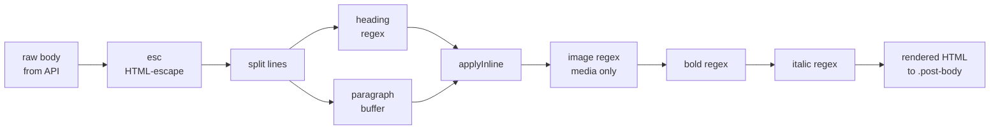

# Media uploads & Markdown rendering

This document covers how the SPA lets an author upload an image from the
post editor and render it back inside a published post, end-to-end.

Two small pieces make this work:

1. A tiny **binary passthrough route** in the gateway
   (`GET /media/:id`) that serves media bytes with the correct
   `Content-Type`, so the browser can write ``
   directly.
2. A **hand-rolled Markdown subset renderer** in the SPA that supports
   exactly what the demo needs (headings, bold, italic, images), all over
   HTML-escaped text so it is XSS-safe by construction.

No external JavaScript dependencies, no build step, no Markdown library.

## Upload flow

```mermaid
sequenceDiagram
  participant U as Author
  participant E as Post editor (app.js)
  participant G as ms.gateway (SOA proxy)
  participant M as ms.media
  participant F as media/ folder

  U->>E: Click "Insert Image"
  E->>U: File picker
  U-->>E: PNG/JPG file
  E->>E: FileReader.readAsDataURL
  E->>E: strip "data:...;base64," prefix
  E->>G: POST /api/Media/Upload [name, base64, alt, userId]
  G->>M: IMedia.Upload(...)
  M->>M: Base64ToBin -> check MAX_UPLOAD_SIZE (3 MB)
  M->>F: write {id}_{filename}
  M->>M: ORM insert TOrmMediaFile
  M-->>G: new media ID
  G-->>E: { Result: 42 }
  E->>E: insertAtCursor("")
```

Client code (`ms.gateway/www/js/app.js`, `handleImageUpload`):

```js
async function handleImageUpload(event) {
  const file = event.target.files[0];
  if (!file) return;
  if (file.size > 3 * 1024 * 1024) { alert('Image too large.'); return; }
  const dataUrl = await readAsDataURL(file);
  const base64 = dataUrl.replace(/^data:[^;]+;base64,/, '');
  const r = await API.uploadMedia(file.name, base64, altText);
  const id = r.ok ? r.data?.Result : 0;
  insertAtCursor(`\n\n\n\n`);
}
```

`API.uploadMedia` was already present in `api.js`; it just calls
`IMedia.Upload(fileName, base64, altText, userId)` over SOA.

## Display flow

```mermaid
sequenceDiagram
  participant B as Browser
  participant G as ms.gateway
  participant M as ms.media

  B->>G: GET /posts/42
  Note over G: SPA fallback (no file match)
  G-->>B: index.html

  B->>G: POST /api/Blog/GetPostFull [42]
  G-->>B: post aggregate (Body contains "")

  B->>B: renderMarkdown(body)
  Note over B: !\[alt\](/media/7)<br/>becomes<br/>&lt;img src="/media/7"&gt;

  B->>G: GET /media/7
  G->>M: IMedia.GetFile(7)
  M-->>G: bytes + "image/png"
  G-->>B: 200 OK (binary)<br/>Cache-Control: public, max-age=31536000, immutable
```

### Why a direct binary route instead of reusing `IMedia.GetFile` via SOA?

`IMedia.GetFile` exists and returns `RawByteString` + content type, but
SOA calls are JSON-encoded. A `RawByteString` inside a JSON envelope ends
up Base64-encoded, adding ~33% size, forcing the browser to decode the
string, and preventing the browser's own caching and decoding pipeline
from taking over. For `` we want a plain binary response.

The route is a straight passthrough in `ms.gateway.server.pas`:

```pascal
function TGatewayServer.HandleMediaFile(
  aCtxt: THttpServerRequestAbstract
  ): cardinal;
var
  IdText:      RawUtf8;
  MediaId:     TID;
  Content:     RawByteString;
  ContentType: RawUtf8;
begin
  IdText := Copy(aCtxt.Url, 8, MaxInt); // skip '/media/'
  MediaId := GetInt64(pointer(IdText));
  if MediaId <= 0 then
    Exit(HTTP_NOTFOUND);
  Content := FMedia.GetFile(MediaId, ContentType);
  if (Content = '') or (ContentType = '') then
    Exit(HTTP_NOTFOUND);
  aCtxt.OutContent := Content;
  aCtxt.OutContentType := ContentType;
  aCtxt.OutCustomHeaders :=
    aCtxt.OutCustomHeaders + #13#10 +
    'Cache-Control: public, max-age=31536000, immutable';
  Result := HTTP_SUCCESS;
end;
```

Hook in `HandleRequest`:

```pascal
if IdemPChar(pointer(aCtxt.Url), '/API/') then
  Result := FOriginalHandler(aCtxt)
else if IdemPChar(pointer(aCtxt.Url), '/MEDIA/') then
  Result := HandleMediaFile(aCtxt)
else
  Result := HandleStaticFile(aCtxt);
```

Media records have immutable IDs (`{id}_{filename}` on disk), so the
`Cache-Control: immutable` header is correct -- the same URL always maps
to the same bytes.

## Markdown subset

The renderer in `app.js` handles exactly these constructs:

| Markdown                  | HTML                                     |
|---------------------------|------------------------------------------|
| `# Title`                 | `<h1>Title</h1>`                         |
| `## Subtitle`             | `<h2>Subtitle</h2>`                      |
| ... up to `######`        | `<h6>...</h6>`                           |
| `**bold**`                | `<strong>bold</strong>`                  |
| `*italic*`                | `<em>italic</em>`                        |
| ``       | ``    |
| blank line                | paragraph break                          |
| anything else             | plain paragraph text                     |

Everything else -- `<script>`, HTML tags, other Markdown constructs,
third-party image URLs -- is treated as literal text.

### Safety argument

The renderer runs in **exactly** this order:



1. **`esc()` first.** `esc` uses `textContent` on a throwaway `<div>`,
   which encodes every HTML-significant character. After this step there
   can be no `<`, no `>`, no `"` and no `&` in the text -- whatever the
   author typed is inert.
2. **Transforms operate on escaped text.** The heading, bold and italic
   regexes add `<h1>`, `<strong>` and `<em>` tags, but they can only wrap
   text that is already escaped. There is no way for user input to
   produce a new tag other than the ones we explicitly write.
3. **Images are whitelisted to `/media/:id`.** The image regex is
   `/!\[([^\]]*)\]\(\/media\/(\d+)\)/g`. The URL is not arbitrary: the
   literal prefix `/media/` and the numeric ID are both part of the
   regex. An author cannot write `` or
   `` -- those simply do not match
   and fall through as plain text.
4. **Alt text is safe because it was escaped in step 1.** By the time
   the image regex runs, the alt text cannot contain `"` or `>` or
   anything else that would break out of the attribute.

The net effect is that `renderMarkdown(body)` produces HTML that can
contain **only** these tags: `<p>`, `<h1>`...`<h6>`, `<strong>`, `<em>`,
and ``. Nothing else.

### What is deliberately missing

- No lists, no links, no code blocks, no tables, no blockquotes.
- No third-party image hosts.
- No HTML passthrough.
- No `target="_blank"` / `rel="noopener"` dance (because no links).
- No client-side Markdown preview (the post renderer is the preview --
  save & view).

If any of these become important, the rule of thumb stays the same:
**escape first, add tags second, never interpret raw HTML from the
user**.

## Editor UX

The editor toolbar lives right above the body textarea:

| Button        | Effect                                                     |
|---------------|------------------------------------------------------------|
| **B**         | Wraps selection with `**...**`                             |
| *I*           | Wraps selection with `*...*`                               |
| H             | Inserts `## ` at the start of the line                     |
| Insert Image  | Opens a file picker, uploads, inserts ``  |

`insertMarkdown(prefix, suffix, placeholder)` and
`insertAtCursor(text)` both preserve textarea focus and leave the caret
at the end of the inserted content so the author can keep typing.

File size is clipped client-side at 3 MB to match `MAX_UPLOAD_SIZE` in
`ms.shared.pas`; a friendlier error than the server's silent `0`
return.

## Extending

To add another inline construct (e.g. `\`code\``):

1. Extend `applyInline` in `app.js` with a new regex that replaces
   `` `([^`]+)` `` by `<code>$1</code>`. Keep it **after** the image
   regex (images contain arbitrary characters inside `()` and `[]`).
2. Add a CSS rule under `.post-body code { ... }`.
3. Optionally add a toolbar button that calls
   `insertMarkdown('`', '`', 'code')`.

To support a new media endpoint path (e.g. `/media/thumb/:id`), extend
the image regex and add the matching route in
`TGatewayServer.HandleRequest`. Keep the whitelist explicit -- never
accept arbitrary URLs in the image regex.
