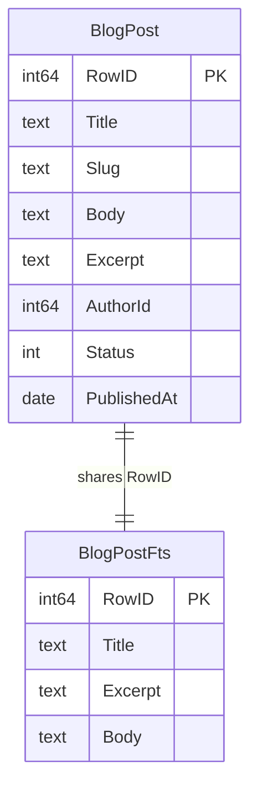
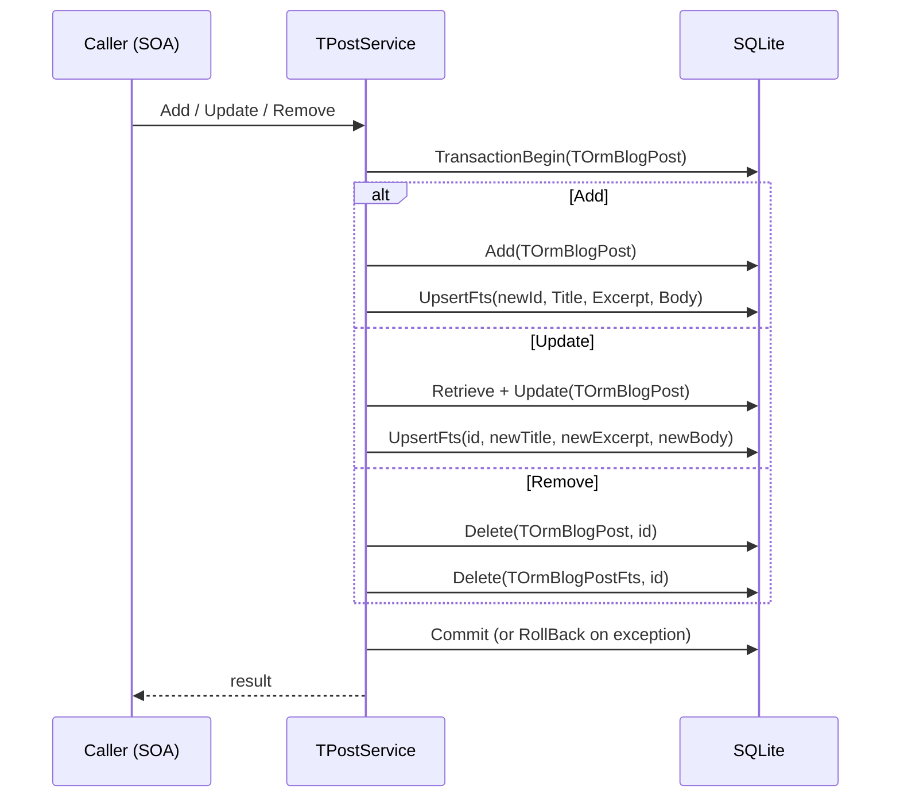
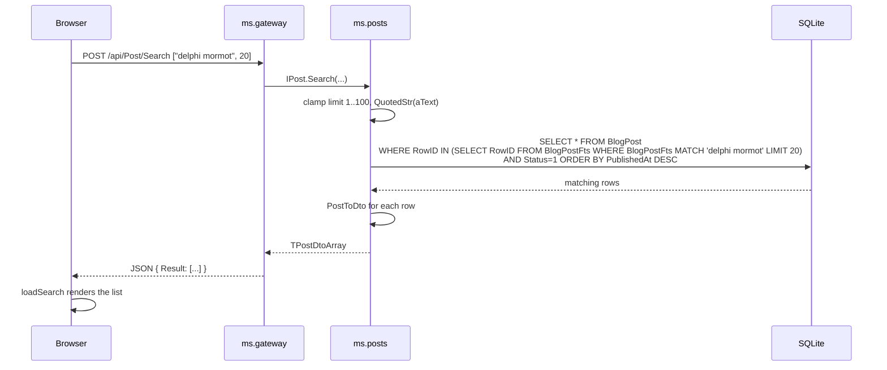

# Full-text post search (SQLite FTS5)

`ms.posts` exposes an `IPost.Search` SOA method backed by a parallel
SQLite FTS5 virtual table. The gateway proxies the call unchanged and
the SPA surfaces it via a header search box plus a `/search?q=...`
route.

The implementation reuses the exact pattern `ms.logs` uses for its
central log search (`TOrmLogEntryFts`), so there are no new frameworks
or libraries involved.

## Schema



- `TOrmBlogPost` is the canonical table the service already had.
- `TOrmBlogPostFts = class(TOrmFts5)` is a new **virtual** table that
  mORMot2 creates with `CREATE VIRTUAL TABLE BlogPostFts USING
  fts5(Title, Excerpt, Body)`.
- Rows in both tables share the same `RowID`, so joining is a cheap
  `RowID IN (...)` subquery.
- Registered together in `TPostsServer.CreateModel`:
  ```pascal
  Result := TOrmModel.Create([TOrmBlogPost, TOrmBlogPostFts], MODEL_ROOT);
  ```

## Write path

Every post mutation wraps the canonical write and the FTS shadow in the
same SQLite transaction. If either write fails, the rollback leaves the
two tables consistent.



`UpsertFts` is a private helper that retrieves the existing FTS row
first, then either `FOrm.Update(Fts)` or `FOrm.Add(Fts, ForceID=True)`
depending on whether the row already exists. The `ForceID=True` form
tells mORMot2 to honour the `Fts.IDValue` we set, which must match the
canonical post's `RowID`.

## Read path



Three things matter here:

1. **Table-level MATCH.** `BlogPostFts MATCH 'query'` searches all three
   indexed columns (Title, Excerpt, Body). Column-scoped matches like
   `Title : word` are also valid FTS5 syntax but are not exposed in the
   UI today.
2. **Only published posts.** `AND Status=POST_STATUS_PUBLISHED` is a
   hard rule in `Search`; drafts never leak via search.
3. **Chronological order, not rank.** `ORDER BY PublishedAt DESC` keeps
   the search result layout identical to the home feed. FTS5 does
   provide a `rank` column but relevance sorting would be a separate
   decision.

## Quoting and safety

`IPost.Search` takes a free-text string. The expression is handed to
SQLite inside a quoted SQL literal, so single quotes must be doubled.
The service uses mORMot2's `QuotedStr` (from `mormot.core.unicode`),
which returns the string with outer `'...'` quotes and every embedded
`'` doubled to `''`. The `FormatUtf8` call then inlines that literal
directly:

```pascal
WhereClause := FormatUtf8(
  'RowID IN (SELECT RowID FROM BlogPostFts WHERE BlogPostFts MATCH % LIMIT %) ' +
  'AND Status=% ORDER BY PublishedAt DESC',
  [QuotedStr(aText), aLimit, POST_STATUS_PUBLISHED]);
```

Everything else in the query is either a clamped integer (`aLimit`,
`POST_STATUS_PUBLISHED`) or a literal SQL fragment, so there is no
injection surface even though the query is built by string
concatenation.

## Backfill on first run

FTS5 indexes do not automatically populate from existing rows -- they
only receive what you write into them. For dev machines that already
have a `ms.posts.db` from before this change, `TPostsServer.SetupServices`
detects the mismatch and runs `BackfillFtsIndex` once:

```mermaid
flowchart TD
  A[SetupServices] --> B{PostCount > 0<br/>and<br/>FtsCount &lt; PostCount?}
  B -- no --> D[done]
  B -- yes --> C[BackfillFtsIndex:<br/>iterate BlogPost,<br/>insert BlogPostFts<br/>in one transaction]
  C --> E[log 'indexed N post(s)']
  E --> D
```

The backfill is idempotent: after it runs the two row counts match and
subsequent startups skip it. A fresh database simply starts with 0 =
0 and the branch is a no-op.

## Frontend

- **Header search box** (`index.html`): a small `<form class="site-search">`
  next to the logo. Submitting it calls `submitSearch(event)`, which
  calls `navigate('/search?q=' + encodeURIComponent(query))`.
- **Route**: `^\/search$` in the `routes` table in `app.js`. The query
  is read from `location.search` via `URLSearchParams`, so deep-links
  like `/search?q=mormot` restore the same result page on reload.
- **View**: `loadSearch(query)` renders a post list identical in look
  to the home feed, with the query echoed in the heading and the
  header input.
- **Pageable?** No, not today. `aLimit` is clamped to 100 on the server
  and the SPA asks for 50. If the repository ever grows past that, the
  query would need `OFFSET` support -- trivial, just not worth the
  extra surface area for a demo.

## Extending

- **Column-scoped matches** (e.g. title-only search): expose a second
  optional parameter on `IPost.Search` or a new method, and pass the
  column prefix through to the FTS5 MATCH expression. The FTS5 table
  is already multi-column, no schema change needed.
- **Relevance ranking**: replace the `ORDER BY PublishedAt DESC` clause
  with `ORDER BY bm25(BlogPostFts)`. Beware that mixing rank order with
  the outer `BlogPost` query requires returning the `bm25` value from
  the subquery and ordering the outer query by it; easier to write a
  raw SQL via `TRestServerDB.DB.Execute`.
- **Highlight snippets**: SQLite FTS5 has a `snippet(table, colIndex,
  '<b>', '</b>', '...', 64)` function. Using it from mORMot2 means
  switching away from the typed ORM fill and building the DTO manually
  from an SQL result set.

For the demo, plain matching plus published-only + chronological order
is plenty.
