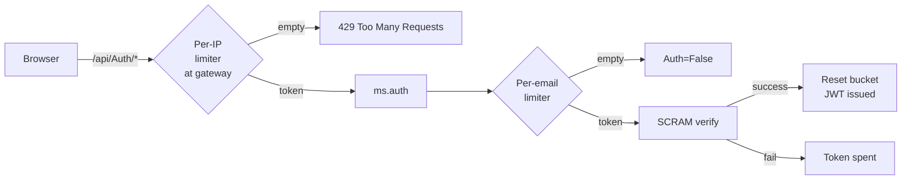
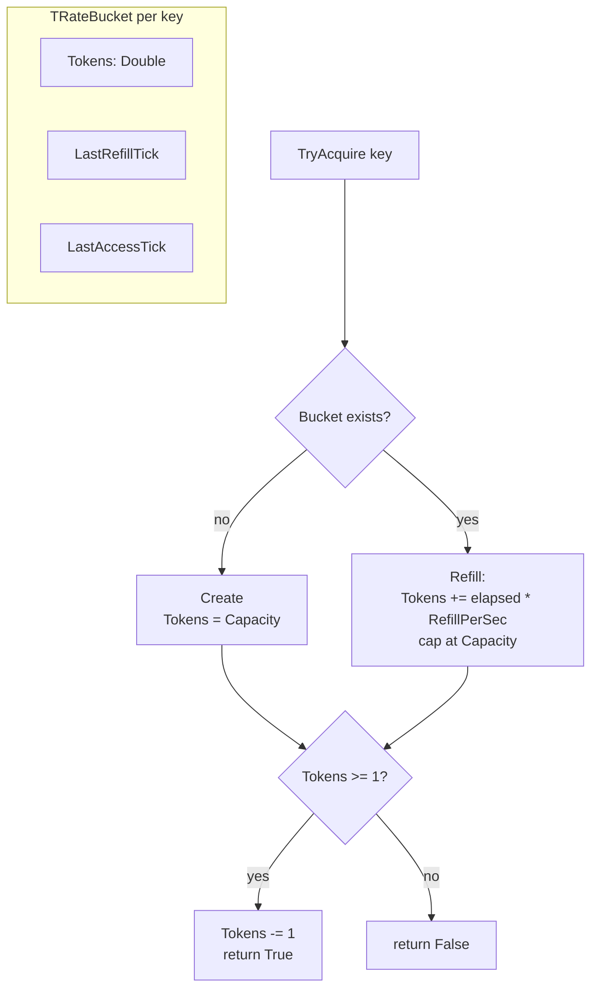
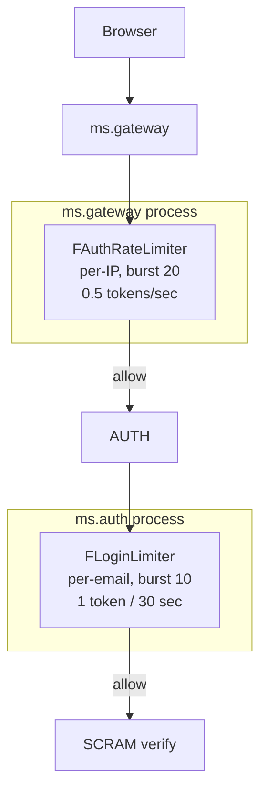
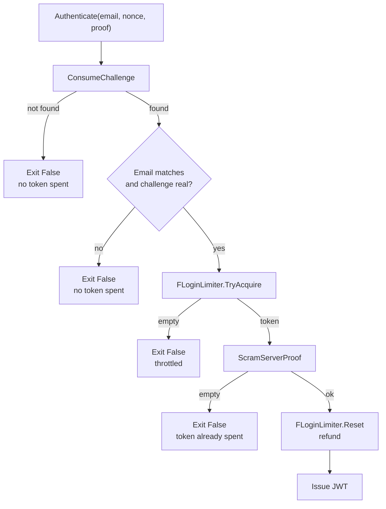

# Rate Limiting

## What is rate limiting?

**Rate limiting** caps how many operations a single client (or identity) may perform per unit of time. It is the standard defence against brute-force attacks, scraping, accidental request floods, and any other workload pattern that abuses an endpoint faster than honest traffic ever would. Like the [circuit breaker](circuit-breaker.md), rate limiting is a small piece of plumbing that lives in front of expensive or sensitive code paths and decides whether the call is allowed to proceed at all.

This project uses rate limiting specifically to harden the authentication endpoints against brute force.

## The problem without a rate limiter

The auth flow is SCRAM-MCF (see [services.md](services.md)) with three reachable endpoints:

- `POST /api/Auth/Challenge`
- `POST /api/Auth/Authenticate`
- `POST /api/Auth/Register`

Without a rate limiter, a script can hit `Authenticate` as fast as the network allows. Three concrete problems:

1. **Online password guessing.** A 6-character lower-case password has ~300 M combinations. At 1000 requests/second from a single IP an attacker exhausts the keyspace in a few days, undetected. The cryptographic strength of SCRAM-MCF (PBKDF2-SHA256, 310 000 iterations) protects the *stored* secret if the database leaks; it does **not** slow down a remote guesser.
2. **Account-targeted brute force.** Even with a strong password, an attacker who knows a user's email address can hammer that account specifically. Anti-enumeration (`ModularCryptFakeInfo`) hides whether the email exists, but it does not stop the guessing itself.
3. **Challenge-state exhaustion.** Every `Challenge` call appends an entry to `FChallenges` in `TAuthService`. The TTL sweep removes expired entries on every new call, but a focused flood of `Challenge` requests can still inflate the working set and burn CPU for no business reason.

## The solution: a two-layer token bucket

A **token bucket** has a fixed *capacity* (the burst size) and a fixed *refill rate* (sustained throughput in tokens per second). Every operation costs one token. Honest clients see no friction below the burst, while abusive clients are slowed to the refill rate.

The defence is **two-layered** because each layer covers an attack the other one cannot:



| Layer | Where | Key | What it stops |
|-------|-------|-----|----------------|
| 1. Per-IP | `ms.gateway` (in front of `/api/Auth/*`) | client IP address | Blanket request floods, all three auth endpoints |
| 2. Per-email | `ms.auth` (inside `Authenticate`) | the email being authenticated | Account-targeted brute force, including attackers rotating IPs |

A rotating-IP attacker bypasses layer 1 (each new IP gets a fresh bucket) but still hits layer 2, because they are still guessing the same user. A fast scraper using one IP gets stopped at layer 1 long before they can exhaust any single account's bucket.

## Token bucket mechanics



Three details worth knowing:

- **Lazy refill.** Tokens are not refilled by a background timer. They are refilled on the next access, based on the elapsed wall-clock time since `LastRefillTick`. This costs nothing when the bucket is idle and stays correct under arbitrary access patterns.
- **Fractional tokens.** `Tokens` is a `Double` so that a refill rate slower than one token per second still accounts for partial refills between accesses. A bucket with `RefillPerSec = 0.5` gains 0.05 tokens after 100 ms; over time those fractions accumulate into a whole token without rounding loss.
- **Idle eviction.** Buckets that have not been touched for `IdleTtlMs` are removed by an amortised sweep that runs at most once per TTL window. Without it the bucket array would grow without bound under churn (one bucket per distinct client IP).

## Implementation in this project

### Components

| File | Purpose |
|------|---------|
| `shared/ms.shared.ratelimiter.pas` | `TRateLimiter` class, `TRateBucket` record, default constants |
| `ms.gateway/ms.gateway.server.pas` | `TGatewayServer` holds `FAuthRateLimiter` and consults it in `HandleRequest` for `/api/Auth/*` |
| `ms.auth/ms.auth.server.pas` | `TAuthService` holds `FLoginLimiter` and consults it in `Authenticate` after challenge consumption |
| `test/ms.testCases.pas` | `TTestRateLimiter` (8 unit tests) + `TTestAuthService.LoginThrottlesAfterRepeatedFailures` (integration test) |

### The class

`TRateLimiter` is a simple, thread-safe, dependency-free Pascal class:

```pascal
TRateLimiter = class
public
  constructor Create(
    const aName: RawUtf8;
    const aCapacity: Double = DEFAULT_BUCKET_CAPACITY;
    const aRefillPerSec: Double = DEFAULT_REFILL_PER_SEC;
    const aIdleTtlMs: Int64 = DEFAULT_IDLE_TTL_MS
    );

  function TryAcquire(const aKey: RawUtf8): Boolean;
  function TryAcquireN(const aKey: RawUtf8; const aTokens: Double): Boolean;
  procedure Reset(const aKey: RawUtf8);
  function BucketCount: PtrInt;

  property Name: RawUtf8 read FName;
  property Capacity: Double read FCapacity;
  property RefillPerSec: Double read FRefillPerSec;
  property IdleTtlMs: Int64 read FIdleTtlMs;
end;
```

Constants (in `ms.shared.ratelimiter.pas`):

```pascal
const
  DEFAULT_BUCKET_CAPACITY = 10.0;     // burst
  DEFAULT_REFILL_PER_SEC  = 0.1667;   // ~1 token every 6 s -> 10/min sustained
  DEFAULT_IDLE_TTL_MS     = 600000;   // evict buckets idle for 10 min
```

The defaults are deliberately conservative; the two production call sites both override them with policy-specific values (see below).

### Storage choice

The bucket store is a flat dynamic array (`TRateBuckets = array of TRateBucket`), **not** `TSynDictionary` or `TDynArrayHashed`. This is a deliberate trade-off:

- The expected working set is small (a few hundred buckets at most for a demo gateway). Linear search wins on constant factors below ~1000 entries.
- A flat array makes future extension much easier — swapping the storage layer to a hashed map, an LRU cache, or a Redis-backed distributed bucket store would not touch any call site.
- The implementation has zero dependencies on the mORMot ORM/SOA layer, so the unit can be reused in any Pascal codebase without dragging in `mormot.core.data` and friends.

### Thread safety

All mutable state (`FBuckets`, `FLastEvictTick`) is guarded by a `TLightLock` (mORMot2's spin lock from `mormot.core.os`). The lock is held only for the duration of a lookup, refill and decrement — never across IO. Like the circuit breaker, the limiter is designed to be created once per protected endpoint and shared across every request thread.

### Standard call site pattern

```pascal
if not Limiter.TryAcquire(ClientKey) then
begin
  // fast-fail path: 429, error result, etc.
  Exit;
end;
try
  ResultValue := DoExpensiveOperation;
  if SuccessfulOutcome then
    Limiter.Reset(ClientKey); // refund honest callers
except
  // failure path: token already consumed, that is the brute-force cost
end;
```

The `Reset` on success is the *refund* idiom. It is the difference between *throttling guesses* (good) and *locking honest users out after a typo* (bad). A typo-prone honest user who eventually types the right password gets their full budget back; an attacker who never lands on the correct password slowly grinds the bucket to zero.

### Logging

Throttle decisions are logged through `TSynLog`:

- `ms.shared.ratelimiter` logs every reject with severity `sllInfo`:
  ```
  20260410 14:23:45  IFO  RateLimiter[gateway.auth]: throttled key=192.0.2.7 tokens=0.42/20 requested=1
  ```
- `ms.gateway` adds an `sllWarning` line so the central log viewer surfaces it without needing to filter to `IFO`:
  ```
  20260410 14:23:45  WRN  ms.gateway AUTH rate-limit hit ip=192.0.2.7 url=/api/Auth/Authenticate
  ```

Both lines flow through the central logging pipeline (see [central-logging.md](central-logging.md)) and carry the request's correlation ID just like every other entry.

## Where it is used



### Gateway: `FAuthRateLimiter` (per IP)

Lives inside `TGatewayServer` and is consulted in `HandleRequest` *before* delegating to the inner REST handler. The check fires for any URL matching `/api/Auth/*` (case-insensitive via `IdemPChar`), so it covers `Challenge`, `Authenticate`, and `Register` in one place. The lookup key is `aCtxt.RemoteIP`; the response on rejection is `429 Too Many Requests` with a JSON body.

| Setting | Value | Reasoning |
|---------|-------|-----------|
| Capacity (burst) | 20 | A full SCRAM login spends 2-3 tokens (Challenge + Authenticate, sometimes Register). 20 absorbs honest tab refreshes and password manager retries with margin. |
| Refill rate | 0.5/sec (~30/min) | Sustains roughly 30 auth requests per minute per IP in steady state. Honest traffic from a single browser never approaches that. |
| Idle TTL | default (10 min) | Same constant for all gateway-level buckets. |

CORS preflights (`OPTIONS`) are checked **before** the rate limiter so they never burn tokens — otherwise an honest browser could throttle itself just by negotiating CORS.

### Auth service: `FLoginLimiter` (per email)

Lives inside `TAuthService` and is consulted by `Authenticate` after the challenge has been consumed and validated. The lookup key is the email address; on a successful proof verification the bucket is restored to full via `Reset`.

| Setting | Value | Reasoning |
|---------|-------|-----------|
| Capacity (burst) | 10 | Allows ten failed attempts per email before throttling kicks in. Generous enough that nobody is locked out by a few typos. |
| Refill rate | 1 token / 30 sec (~2/min) | Once exhausted, an attacker is throttled to two guesses per minute against the targeted account, regardless of how many IPs they rotate through. |
| Idle TTL | default (10 min) | Inactive emails get pruned after ten minutes. |

The order of operations inside `Authenticate` is important:



A stale browser tab that posts an expired nonce gets a clean rejection without spending a rate-limit token, so it cannot contribute to the brute-force budget.

### Why nowhere else?

The other backend services (`ms.users`, `ms.posts`, `ms.tags`, `ms.comments`, `ms.media`, `ms.analytics`) don't have a brute-force vector to protect — they manipulate data, they don't grant credentials. If you ever build a flow where an unauthenticated caller can trigger an expensive computation (e.g. a public search-by-tag with regex), that would be a candidate for a third limiter instance in front of it.

## How to use it as a developer

### Adding a new protected endpoint

Pick the policy first, then create one limiter instance per logical resource:

```pascal
strict private
  FSearchLimiter: TRateLimiter;

constructor Create(...);
begin
  inherited Create;
  // ... existing init ...
  FSearchLimiter := TRateLimiter.Create('public.search', 5.0, 0.5);
end;

destructor Destroy; override;
begin
  FreeAndNil(FSearchLimiter);
  inherited Destroy;
end;
```

Inside the call site, follow the standard pattern:

```pascal
if not FSearchLimiter.TryAcquire(ClientIP) then
begin
  aCtxt.OutContent := '{"errorText":"too many requests"}';
  aCtxt.OutContentType := JSON_CONTENT_TYPE;
  Exit(HTTP_TOO_MANY_REQUESTS);
end;
// ... do the actual work ...
```

The limiter name passed to `Create` is just a label for log output — using a `category.purpose` form (`gateway.auth`, `auth.email`, `public.search`) keeps the logs grep-friendly.

### Tuning capacity and refill

A quick mental model: pick the burst large enough that a normal user session never triggers it, then pick the refill rate so a worst-case attacker is throttled to a tolerable guess rate. The two parameters are independent:

- **Capacity** = how many requests you tolerate as a *one-time* burst before any throttling kicks in.
- **Refill rate** = the *sustained* rate the limiter eventually settles into.

For password guessing, a sustained rate around 1-2 attempts per minute per identity is a good default — slow enough that brute force becomes infeasible, fast enough that a real user with a typo or two does not feel locked out.

### Choosing the key

The key is what defines an *isolation unit*. Two requests with the same key share a bucket; two requests with different keys are independent.

- Use **client IP** when you care about "one human at one machine". Easy to obtain (`THttpServerRequestAbstract.RemoteIP`) but spoofable in some deployment topologies and false-positive-prone behind shared NAT.
- Use **identity** (email, user ID, JWT subject) when you care about "one account being attacked". Resistant to IP rotation but only available after the request has been parsed.
- For maximum protection, **layer both** — exactly what this project does for auth.

## Tests

`TTestRateLimiter` in `test/ms.testCases.pas` covers the limiter exhaustively:

| Test | What it checks |
|------|----------------|
| `FirstAcquireOnNewKeyAlwaysSucceeds` | Fresh limiter has zero buckets; first acquire seeds a full bucket |
| `BurstAllowsExactlyCapacityRequests` | Capacity-many acquires succeed in a row; the next is rejected |
| `BucketsAreIsolatedPerKey` | Exhausting one key does not affect another |
| `RefillRestoresTokensOverTime` | After waiting, a previously-empty bucket allows new acquires |
| `ResetRestoresFullCapacity` | `Reset` on an exhausted bucket restores it to full |
| `ResetIsNoopForUnknownKey` | `Reset` on a never-seen key does not crash or create a spurious bucket |
| `TryAcquireNRespectsCost` | Variable-cost acquires deduct the correct number of tokens |
| `IdleEvictionRemovesUnusedBuckets` | Buckets idle past `IdleTtlMs` are dropped on the next acquire |

Plus an integration test on the auth service:

| Test | What it checks |
|------|----------------|
| `TTestAuthService.LoginThrottlesAfterRepeatedFailures` | Ten failed `Authenticate` calls drain the per-email bucket; an eleventh attempt with the **correct** password is rejected (proving the limiter blocked it, not the proof check); a separate email remains authenticatable in the same instant |

The wall-clock-dependent tests (`RefillRestoresTokensOverTime`, `IdleEvictionRemovesUnusedBuckets`) use short `SleepHiRes` waits so the entire `TTestRateLimiter` suite runs in well under a second.

## Caveats and known limitations

These are deliberate trade-offs, not bugs to fix:

1. **The `RemoteIP` is whatever the HTTP socket sees.** If the gateway is deployed behind a reverse proxy or load balancer, every request appears to come from the proxy's IP and the per-IP limiter degenerates into a global limiter. Production deployments would need to honour `X-Forwarded-For` (or an equivalent trusted header) — out of scope for this demo.
2. **Per-email throttling is a foot-gun for targeted DoS.** A motivated attacker can intentionally drain a known user's bucket to lock them out for ~30 seconds at a time. The refund-on-success design mitigates this for the legitimate user *if* they manage to slip a correct attempt in between the attacker's, but it cannot fully prevent the lockout. The trade-off is accepted because the alternative — no per-email limit — is worse.
3. **Process-local state.** Each gateway process has its own bucket store. In a horizontally scaled deployment a shared store (Redis, memcached) would be needed so an attacker cannot evade the limit by hitting different gateway replicas. This is why the storage layer is intentionally pluggable.
4. **Linear bucket lookup.** Lookups are O(N) over the live bucket count. For the demo's expected working set (hundreds of buckets) this is faster than a hash map by constant factors. If the working set ever grows past ~1000 active buckets, swap the storage to a `TDynArrayHashed`.
5. **No distributed coordination on `Reset`.** The refund-on-success only happens in the same process that observed the success. For multi-replica deployments the same caveat as #3 applies.
6. **No metrics export.** Throttle decisions go to `TSynLog`. There is no Prometheus / OpenTelemetry exporter. The `/logs` viewer can be filtered by `RateLimiter[` or `rate-limit hit` to see all decisions chronologically (see [central-logging.md](central-logging.md)).

## Verification (manual)

1. Start all services (`start-all.cmd`).
2. Open `http://localhost:8080/login` and confirm a normal login works.
3. From a terminal, hammer `Challenge` with `curl` faster than the burst:
   ```sh
   for /L %i in (1,1,30) do curl -s -X POST http://localhost:8080/api/Auth/Challenge -H "Content-Type: application/json" -d "[\"victim@example.com\"]" -o NUL -w "%%{http_code}\n"
   ```
   The first ~20 calls return `200`, the rest return `429 Too Many Requests`. Wait two seconds and a single new call goes through (one token refilled).
4. To exercise the per-email limiter, run the same loop pointing at `Authenticate` with garbage proofs and watch the central log viewer at `http://localhost:8080/logs`. After ten failures the auth service starts logging `RateLimiter[auth.email]: throttled` lines; correct logins for that email are also rejected until the bucket refills.
5. Both scenarios reproduce from in-process tests via `TTestRateLimiter` and `TTestAuthService.LoginThrottlesAfterRepeatedFailures`, but without the manual stopwatch.

## See also

- [circuit-breaker.md](circuit-breaker.md) — same shape of resilience plumbing, protecting *upstream* calls instead of *incoming* ones
- [central-logging.md](central-logging.md) — where throttle decisions show up in the live log stream
- [correlation-ids.md](correlation-ids.md) — every rate-limit log line carries the correlation ID of the request that observed the throttle
- [services.md](services.md) — the SCRAM-MCF auth flow that the limiters protect
