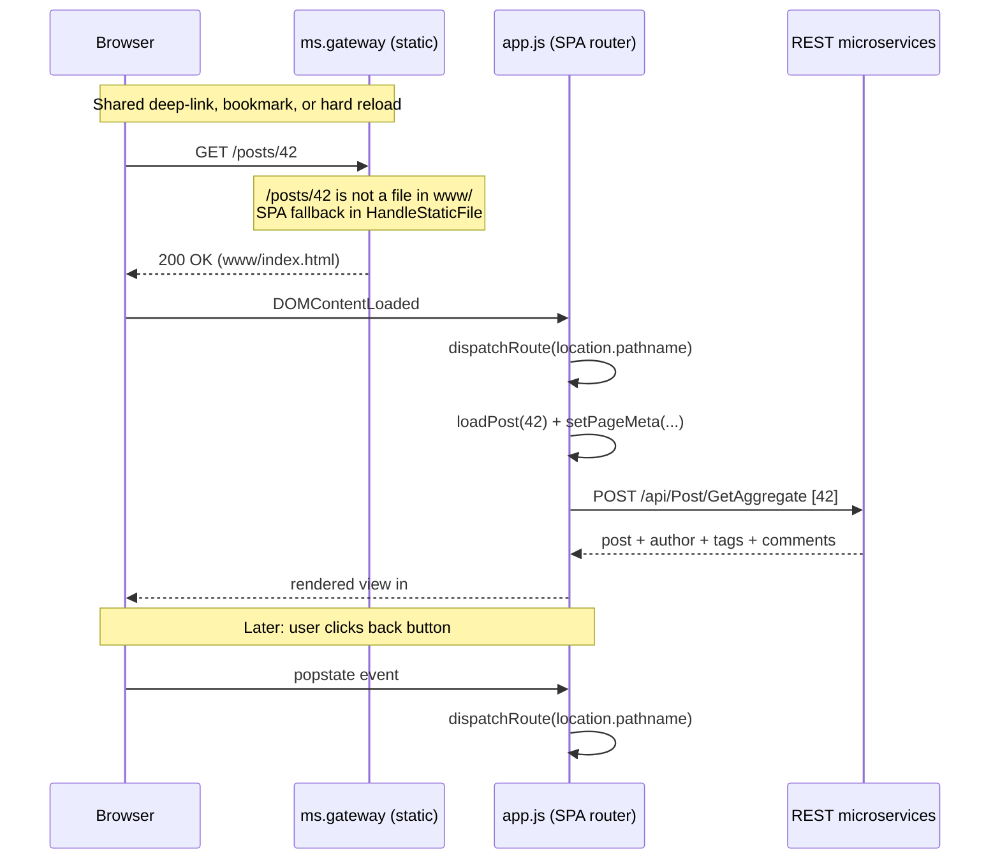

# SPA Routing and Deep-Linking

The web frontend (`ms.gateway/www/`) is a vanilla-JavaScript single-page
application. Every view the user can reach is backed by a real URL so that

- the browser **back/forward buttons** traverse the view history,
- any page can be **bookmarked**,
- any page can be **shared** by right-click > "Copy link address".

No frameworks, no build step -- just the History API, one `click` listener
and one route table.

## Architecture



Two cooperating pieces make this work:

1. **Server-side SPA fallback** (`ms.gateway/ms.gateway.server.pas`,
   `HandleStaticFile`). Any non-`/api/` request that does not match a file in
   `www/` returns `index.html` with `200 OK`, so a hard reload on
   `/posts/42` or a shared link still loads the app.
2. **Client-side router** (`ms.gateway/www/js/app.js`). On the first load
   and on every `popstate` event the router reads `location.pathname`,
   matches it against a regex table, and dispatches to the right view
   loader.

## Route table

| Path                             | View                       | Handler                       |
|----------------------------------|----------------------------|-------------------------------|
| `/`                              | Home (post list, page 1)   | `loadPosts(1)`                |
| `/page/:n`                       | Home (post list, page n)   | `loadPosts(n)`                |
| `/posts/:id`                     | Single post (aggregated)   | `loadPost(id)`                |
| `/tags`                          | All tags                   | `loadTags()`                  |
| `/tags/:id`                      | Posts for one tag          | `loadPostsByTag(id)`          |
| `/authors/:id`                   | Author profile + posts     | `loadAuthor(id)`              |
| `/dashboard`                     | Dashboard (my posts)       | `loadDashboard()`             |
| `/dashboard/moderation`          | Comment moderation         | `loadModeration()`            |
| `/dashboard/profile`             | Edit profile               | `loadProfileEditor()`         |
| `/analytics`                     | Analytics overview         | `loadAnalytics()`             |
| `/analytics/authors`             | Author stats               | `loadAuthorStats()`           |
| `/analytics/tags`                | Tag cloud                  | `loadTagCloudView()`          |
| `/analytics/comments`            | Comment activity           | `loadCommentActivityView()`   |
| `/analytics/recent`              | Enriched recent posts      | `loadRecentPostsFullView()`   |
| `/logs`                          | Live central log stream    | `loadLogs()`                  |
| `/logs/correlation/:id`          | Single correlation trace   | `loadLogsByCorrelation(id)`   |
| _any other_                      | Home (fallback)            | `loadPosts(1)`                |

Modal dialogs (sign-in, post editor) intentionally have **no** route -- they
are transient overlays, not shareable views.

## How it works in code

### 1. Routes as regex table

```js
const routes = [
  { re: /^\/$/,             handler: ()  => loadPosts(1) },
  { re: /^\/posts\/(\d+)$/, handler: (m) => loadPost(parseInt(m[1])) },
  // ...
];
```

Each entry is a regex and a handler that receives the match array. New views
are added by appending one line.

### 2. `navigate(path)` is the single entry point

```js
function navigate(path, opts) {
  const current = location.pathname + location.search;
  if (path !== current) {
    if (opts && opts.replace) history.replaceState({}, '', path);
    else                       history.pushState({}, '', path);
  }
  dispatchRoute(path);
}
```

- Pushes a new history entry (unless the target equals the current URL, in
  which case the call is just a re-render).
- Delegates to `dispatchRoute` to actually render the view.
- All in-app navigation eventually goes through `navigate()`.

### 3. `dispatchRoute(path)` runs the handler

```js
function dispatchRoute(path) {
  const pathname = path.split('?')[0];
  if (!pathname.startsWith('/logs')) closeActiveLogStream();
  for (const r of routes) {
    const m = pathname.match(r.re);
    if (m) { r.handler(m); return; }
  }
  loadPosts(1);
}
```

The only cross-cutting concern at dispatch time is closing the live log
WebSocket when leaving `/logs*`. Everything else is the view's own
responsibility.

### 4. `popstate` connects the back/forward buttons

```js
window.addEventListener('popstate', () =>
  dispatchRoute(location.pathname + location.search));
```

When the user presses the browser back button, the URL changes but no
reload happens -- `popstate` fires and we just re-dispatch.

### 5. Link interceptor -- real `href` attributes stay real

```js
document.addEventListener('click', (e) => {
  const a = e.target.closest('a');
  if (!a) return;
  const href = a.getAttribute('href');
  if (!href || href.startsWith('#') || /^[a-z]+:\/\//i.test(href) || a.target === '_blank') return;
  if (e.defaultPrevented || e.ctrlKey || e.metaKey || e.shiftKey || e.altKey || e.button !== 0) return;
  e.preventDefault();
  navigate(href);
});
```

This delegated handler lets us write plain HTML:

```html
<a href="/posts/42">My post title</a>
```

instead of the old

```html
<a href="#" onclick="loadPost(42); return false;">My post title</a>
```

The advantages are:

- **Right-click > Copy link address** yields `/posts/42`, which is the
  shareable URL -- exactly what the user expects.
- **Ctrl+click / middle-click** open the target in a new tab (the handler
  bails out when modifier keys are pressed or `button !== 0`), and the new
  tab hits the SPA fallback so the deep-link works.
- **External links** (`http://...`, `https://...`) and `target="_blank"`
  links are left alone.
- Buttons like pagination or dashboard actions still use
  `<button onclick="navigate('/page/2')">` when a real `href` is not
  semantically appropriate.

### 6. Document title & meta description

`setPageMeta(title, description)` updates `<title>` and
`<meta name="description">` on every view change. This matters for:

- the browser tab label,
- browser history entries,
- link-unfurling when a URL is pasted into chat apps that fetch the page
  (they see the correct `<title>` and description because the gateway
  returns `index.html` with JS enabled).

> Note: link previews from services that do **not** run JavaScript (older
> scrapers, Slack's default unfurler) will only see the static
> `<meta name="description">` from `index.html`. If richer previews become
> important later, the gateway could server-render the relevant
> OpenGraph/Twitter meta tags for `/posts/:id` by fetching the post
> aggregate before returning HTML. That is deliberately **not** done today
> -- this is a demo, and the extra coupling is not worth it.

## Gateway SPA fallback

The relevant code in `ms.gateway/ms.gateway.server.pas`:

```pascal
function TGatewayServer.HandleStaticFile(
  aCtxt: THttpServerRequestAbstract): cardinal;
var
  Path: RawUtf8;
  FilePath: TFileName;
begin
  Path := aCtxt.Url;
  if (Path = '/') or (Path = '') then
    FilePath := FWwwPath + 'index.html'
  else
  begin
    if PosEx('..', Path) > 0 then
      Exit(HTTP_FORBIDDEN);
    FilePath := FWwwPath + StringReplace(
      Utf8ToString(Copy(Path, 2, MaxInt)), '/', PathDelim, [rfReplaceAll]);
  end;
  Result := ServeStaticFile(FilePath, aCtxt);
  // SPA fallback: unmatched routes serve index.html
  if Result = HTTP_NOTFOUND then
    Result := ServeStaticFile(FWwwPath + 'index.html', aCtxt);
end;
```

The important invariants:

- Only requests that do **not** start with `/api/` reach `HandleStaticFile`
  (the split happens in `HandleRequest`). API misses still return 404.
- `..` path traversal is rejected.
- Existing files (`/css/style.css`, `/js/app.js`, ...) are served as-is.
- Anything else returns `index.html` so the client-side router can take
  over.

## Adding a new routed view

1. Write the view function, e.g. `loadDrafts()`. It should read data,
   render into `#app`, and call `setPageMeta('Drafts')`.
2. Add one row to the `routes` table in `app.js`:
   ```js
   { re: /^\/drafts$/, handler: () => loadDrafts() },
   ```
3. Link to it with a real `href`:
   ```html
   <a href="/drafts">Drafts</a>
   ```
   or, from JS, call `navigate('/drafts')`.
4. If the view needs to clean up resources on navigation away (like the
   log stream does), either close them at the top of every *other*
   loader, or add the cleanup to `dispatchRoute`.

That's all -- no build step, no framework, no routing library.
