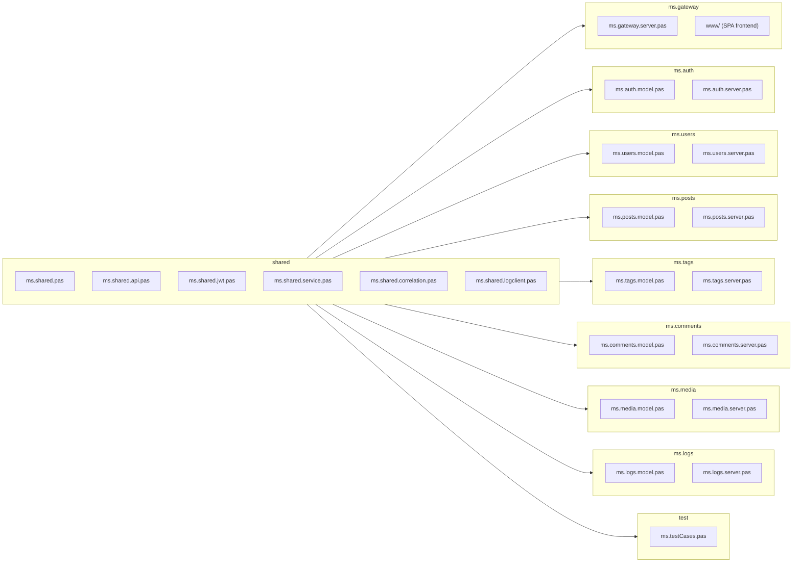

# Blog Microservices -- Technology and mORMot2 Usage

## mORMot2 Modules by Purpose

### All Services (shared)

| Purpose | mORMot2 Unit | Usage |
|---------|--------------|-------|
| ORM / data model | `mormot.orm.core` | Define `TOrm` classes |
| SQLite database | `mormot.orm.sqlite3` | `TRestServerDB` as DB backend |
| REST HTTP server | `mormot.rest.http.server` | `TRestHttpServer` per service, created with `WEBSOCKETS_DEFAULT_MODE` + `WebSocketsEnable(..., ajax=True)` so HTTP, `synopsebin` and `synopsejson` share the same port |
| WebSocket server | `mormot.net.ws.core`, `mormot.net.ws.server` | `TWebSocketProtocolBinary` (Pascal clients, `synopsebin`) and `TWebSocketProtocolJson` (browsers, `synopsejson`) for interface-based callbacks |
| SOA interfaces | `mormot.soa.core`, `mormot.soa.server` | Interface-based services |
| SOA callbacks | `mormot.soa.core` | `TInterfacedCallback` + `IServiceWithCallbackReleased` for server-to-client method invocation with automatic refcount-based cleanup |
| JSON processing | `mormot.core.json` | `TDocVariantData` for JSON parsing |
| Logging | `mormot.core.log` | `TSynLog` for all services |
| Base types | `mormot.core.base`, `mormot.core.text`, `mormot.core.unicode` | RawUtf8, helper functions |

### ms.auth (additional)

| Purpose | mORMot2 Unit | Usage |
|---------|--------------|-------|
| SCRAM/PBKDF2 | `mormot.crypt.core` | Password hashing (MCF format) |
| JWT tokens | `mormot.crypt.jwt` | `TJwtHS256` for token creation |

### ms.gateway (additional)

| Purpose | mORMot2 Unit | Usage |
|---------|--------------|-------|
| HTTP client | `mormot.rest.http.client` | `TRestHttpClient` to backend services |
| SOA client | `mormot.soa.client` | `TServiceFactoryClient` for proxies |
| Async HTTP | `mormot.net.async` | `THttpAsyncServer` for requests |
| Per-call hook | `mormot.rest.client` | `OnBeforeCall` on `TRestClientUri` for correlation ID propagation |

### ms.logs (additional)

| Purpose | mORMot2 Unit | Usage |
|---------|--------------|-------|
| Custom log echo | `mormot.core.log` | `TSynLogFamily.EchoCustom` callback per log line |
| FTS5 full-text search | `mormot.orm.core` | `TOrmFts5` virtual table paired with `TOrmLogEntry` |
| Batched inserts | `mormot.orm.core` | `TransactionBegin` / `Commit` around per-batch `Add` calls |

### All Services (log shipping)

| Purpose | mORMot2 Unit | Usage |
|---------|--------------|-------|
| Log shipper | `mormot.core.log` + `mormot.rest.http.client` + `mormot.net.ws.client` | `TLogShipper` (in `shared/ms.shared.logclient.pas`) installs an `EchoCustom` hook and ships entries via a persistent `TRestHttpClientWebsockets` connection (upgraded with `WebSocketsUpgrade(WEBSOCKETS_KEY)`) on a background thread |

## Cross-Cutting Concerns

### Observability: Correlation IDs

Every HTTP request is tagged with an `X-Correlation-Id` header that
propagates end-to-end across all services. The implementation uses:

- A `threadvar` (`CurrentCorrelationId`) for per-request isolation on
  mORMot2's `THttpAsyncServer` thread pool
- `TMicroService.HandleRequestWithCorrelation` to wrap the HTTP
  handler for all backend services (installed once in `Run`)
- `OnBeforeCall` on each gateway `TRestHttpClient` to append the ID
  to outgoing backend calls (synchronous, same-thread, no races)
- `LogWithCorrelation` helper that prepends `[ID]` to every log entry

This gives us log filtering across all 10 services with a single
`grep` over `_out/Win32-Debug/APP/logs/*.log`. See
[correlation-ids.md](correlation-ids.md) for the full design doc.

### Observability: Central Logging (ms.logs)

Grep over local files works -- but doesn't scale. The `ms.logs`
service collects log lines from every other service in a queryable
SQLite store with an FTS5 full-text index:

- `shared/ms.shared.logclient.pas` -- `TLogShipper` installs a
  `TSynLogFamily.EchoCustom` callback, queues entries, and ships them
  via `ILogIngestion.AppendBatch` on a background thread (batch size
  100, flush interval 250 ms)
- `TMicroService` creates and attaches a `TLogShipper` in every
  service except `ms.logs` itself, so the cross-cutting concern is
  implemented once
- `ms.logs` parses the correlation ID from each message and stores
  it indexed, enabling the `ILogQuery.ByCorrelationId` pivot
- The gateway proxies `ILogQuery` so the browser UI at `/logs` can
  filter by service, level, correlation ID, time range or FTS5 text

See [central-logging.md](central-logging.md) for the full design,
including the mORMot2 primitives considered and the per-line
lifecycle diagram.

### Real-time Events: Interface-based Callbacks over WebSockets

Polling is the wrong answer to "tell me when X happens". mORMot2
provides a clean primitive: **interface-based callbacks over
WebSockets** -- a server-side method call on a Pascal interface is
delivered over a persistent WebSocket connection to the client.

Key mORMot2 building blocks:

| Block | Class / Constant | Role |
|-------|------------------|------|
| Server hosting | `TRestHttpServer` with `WEBSOCKETS_DEFAULT_MODE` + `WebSocketsEnable` | Same port serves HTTP + WebSocket |
| Binary protocol | `TWebSocketProtocolBinary` (`synopsebin`) | Service-to-service callbacks |
| Browser protocol | `TWebSocketProtocolJson` (`synopsejson`) | Browser-compatible JSON frames (`aWebSocketsAjax := True`) |
| Contract hook | `IServiceWithCallbackReleased` | Fired when a subscriber's refcount drops to zero |
| Pascal client | `TRestHttpClientWebsockets` + `WebSocketsUpgrade(key)` | Persistent connection replacing `TRestHttpClient` |
| Pascal callback | `TInterfacedCallback` | Refcount-managed server-to-client invocations |

- `TMicroService` opts in once -- every service automatically gains
  WebSocket capability on the same port as plain HTTP
- `ILogStream` / `ILogStreamCallback` in `shared/ms.shared.api.pas`
  are the first concrete use: live log tail into the `/logs` browser
  viewer, with the gateway acting as a broker that subscribes to
  ms.logs over the binary protocol and re-broadcasts to browsers
  over the JSON protocol
- `TLogShipper` uses the persistent WebSocket connection for the
  log-ingestion path, replacing the per-batch HTTP handshake

See [event-driven.md](event-driven.md) for the full design, the
subscriber-bookkeeping idiom, the broker pattern and the trade-offs.

## Project Structure



### Key Directories

| Path | Contents |
|------|----------|
| `shared/` | Constants, SOA interfaces, JWT, correlation ID helpers, TMicroService base class |
| `ms.gateway/www/` | SPA frontend (index.html, css/, js/) |
| `ms.controller/` | Service orchestrator (optional) |
| `test/` | Integration tests (130+ assertions, all services in-process) |

## Service Architecture Pattern

Every microservice follows the same structure:

### 1. ORM Model (model.pas)

```pascal
TOrmBlogPost = class(TOrm)
  property Title: RawUtf8 index 300
    read FTitle write FTitle;
  property Slug: RawUtf8 index 300
    read FSlug write FSlug stored AS_UNIQUE;
  // ...
end;
```

### 2. Service Implementation (server.pas)

```pascal
TPostService = class(TInterfacedObject, IPost)
private
  FOrm: IRestOrm;
public
  constructor Create(const aOrm: IRestOrm);
  function Get(aId: TID): TPostDto;
  function Add(const aData: TPostCreateDto): TID;
  // ...
end;
```

### 3. Server Class (server.pas)

```pascal
TPostsServer = class(TMicroService)
protected
  function CreateModel: TOrmModel; override;
  procedure SetupServices; override;
end;

procedure TPostsServer.SetupServices;
begin
  FPostImpl := TPostService.Create(FRestServer.Orm);
  RegisterService(FPostImpl, TypeInfo(IPost));
end;
```

### 4. Main Program (dpr)

```pascal
begin
  with TPostsServer.Create(SERVICE_POSTS, PORT_POSTS) do
  try
    Run;
  finally
    Free;
  end;
end.
```

## Configuration

Each service reads its configuration from `{service-name}.config.json`:

```json
{
  "Port": "8083",
  "LogLevel": "debug",
  "JwtSecret": "..."
}
```

Defaults are applied automatically if the file is missing.

## ORM Naming Convention

ORM class names must NOT match their SOA interface name (after stripping
the TOrm/I prefixes), as mORMot2 would report a routing conflict.

| Service | Interface | ORM Class | Table Name |
|---------|-----------|-----------|------------|
| ms.auth | IAuth | TOrmAuthUser | AuthUser |
| ms.users | IUser | TOrmAuthor | Author |
| ms.posts | IPost | TOrmBlogPost | BlogPost |
| ms.tags | ITag | TOrmBlogTag | BlogTag |
| ms.tags | -- | TOrmPostTag | PostTag |
| ms.comments | IComment | TOrmBlogComment | BlogComment |
| ms.media | IMedia | TOrmMediaFile | MediaFile |
| ms.logs | ILogIngestion + ILogQuery | TOrmLogEntry | LogEntry |
| ms.logs | -- | TOrmLogEntryFts | LogEntryFts (FTS5) |
