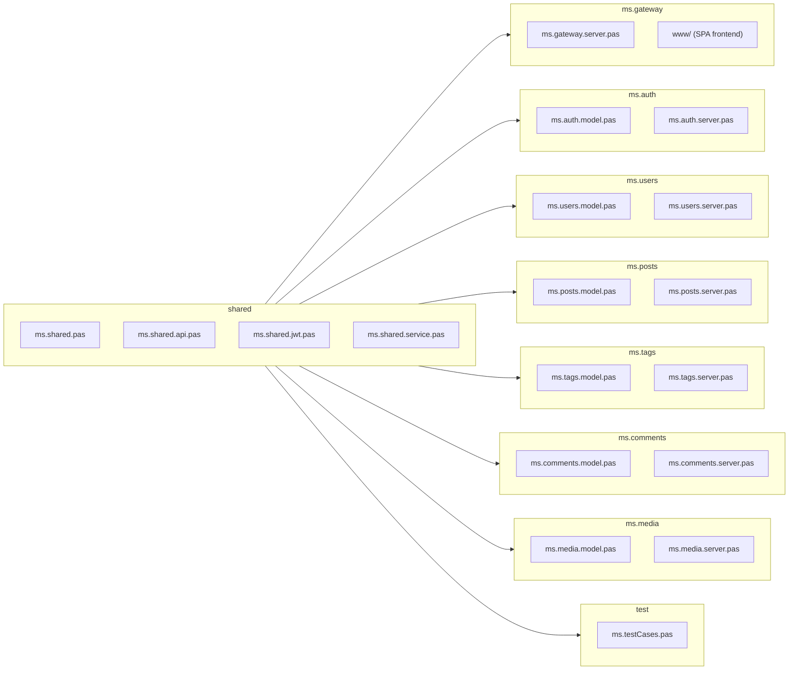

# Blog Microservices -- Technology and mORMot2 Usage

## mORMot2 Modules by Purpose

### All Services (shared)

| Purpose | mORMot2 Unit | Usage |
|---------|--------------|-------|
| ORM / data model | `mormot.orm.core` | Define `TOrm` classes |
| SQLite database | `mormot.orm.sqlite3` | `TRestServerDB` as DB backend |
| REST HTTP server | `mormot.rest.http.server` | `TRestHttpServer` per service |
| SOA interfaces | `mormot.soa.core`, `mormot.soa.server` | Interface-based services |
| JSON processing | `mormot.core.json` | `TDocVariantData` for JSON parsing |
| Logging | `mormot.core.log` | `TSynLog` for all services |
| Base types | `mormot.core.base`, `mormot.core.text`, `mormot.core.unicode` | RawUtf8, helper functions |

### ms.auth (additional)

| Purpose | mORMot2 Unit | Usage |
|---------|--------------|-------|
| SCRAM/PBKDF2 | `mormot.crypt.core` | Password hashing (MCF format) |
| JWT tokens | `mormot.crypt.jwt` | `TJwtHS256` for token creation |

### ms.gateway (additional)

| Purpose | mORMot2 Unit | Usage |
|---------|--------------|-------|
| HTTP client | `mormot.rest.http.client` | `TRestHttpClient` to backend services |
| SOA client | `mormot.soa.client` | `TServiceFactoryClient` for proxies |
| Async HTTP | `mormot.net.async` | `THttpAsyncServer` for requests |

## Project Structure



### Key Directories

| Path | Contents |
|------|----------|
| `shared/` | Constants, SOA interfaces, JWT, TMicroService base class |
| `ms.gateway/www/` | SPA frontend (index.html, css/, js/) |
| `ms.controller/` | Service orchestrator (optional) |
| `test/` | Integration tests (130+ assertions, all services in-process) |

## Service Architecture Pattern

Every microservice follows the same structure:

### 1. ORM Model (model.pas)

```pascal
TOrmBlogPost = class(TOrm)
  property Title: RawUtf8 index 300
    read FTitle write FTitle;
  property Slug: RawUtf8 index 300
    read FSlug write FSlug stored AS_UNIQUE;
  // ...
end;
```

### 2. Service Implementation (server.pas)

```pascal
TPostService = class(TInterfacedObject, IPost)
private
  FOrm: IRestOrm;
public
  constructor Create(const aOrm: IRestOrm);
  function Get(aId: TID): TPostDto;
  function Add(const aData: TPostCreateDto): TID;
  // ...
end;
```

### 3. Server Class (server.pas)

```pascal
TPostsServer = class(TMicroService)
protected
  function CreateModel: TOrmModel; override;
  procedure SetupServices; override;
end;

procedure TPostsServer.SetupServices;
begin
  FPostImpl := TPostService.Create(FRestServer.Orm);
  RegisterService(FPostImpl, TypeInfo(IPost));
end;
```

### 4. Main Program (dpr)

```pascal
begin
  with TPostsServer.Create(SERVICE_POSTS, PORT_POSTS) do
  try
    Run;
  finally
    Free;
  end;
end.
```

## Configuration

Each service reads its configuration from `{service-name}.config.json`:

```json
{
  "Port": "8083",
  "LogLevel": "debug",
  "JwtSecret": "..."
}
```

Defaults are applied automatically if the file is missing.

## ORM Naming Convention

ORM class names must NOT match their SOA interface name (after stripping
the TOrm/I prefixes), as mORMot2 would report a routing conflict.

| Service | Interface | ORM Class | Table Name |
|---------|-----------|-----------|------------|
| ms.auth | IAuth | TOrmAuthUser | AuthUser |
| ms.users | IUser | TOrmAuthor | Author |
| ms.posts | IPost | TOrmBlogPost | BlogPost |
| ms.tags | ITag | TOrmBlogTag | BlogTag |
| ms.tags | -- | TOrmPostTag | PostTag |
| ms.comments | IComment | TOrmBlogComment | BlogComment |
| ms.media | IMedia | TOrmMediaFile | MediaFile |
