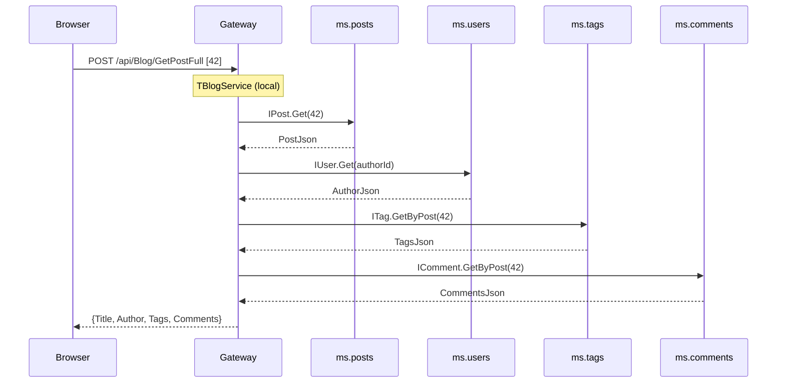
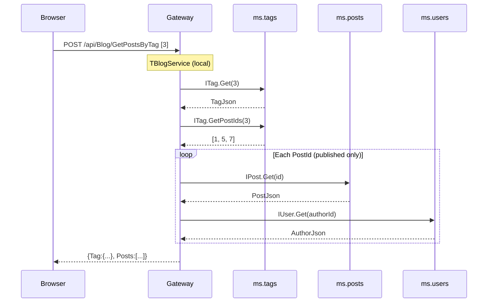
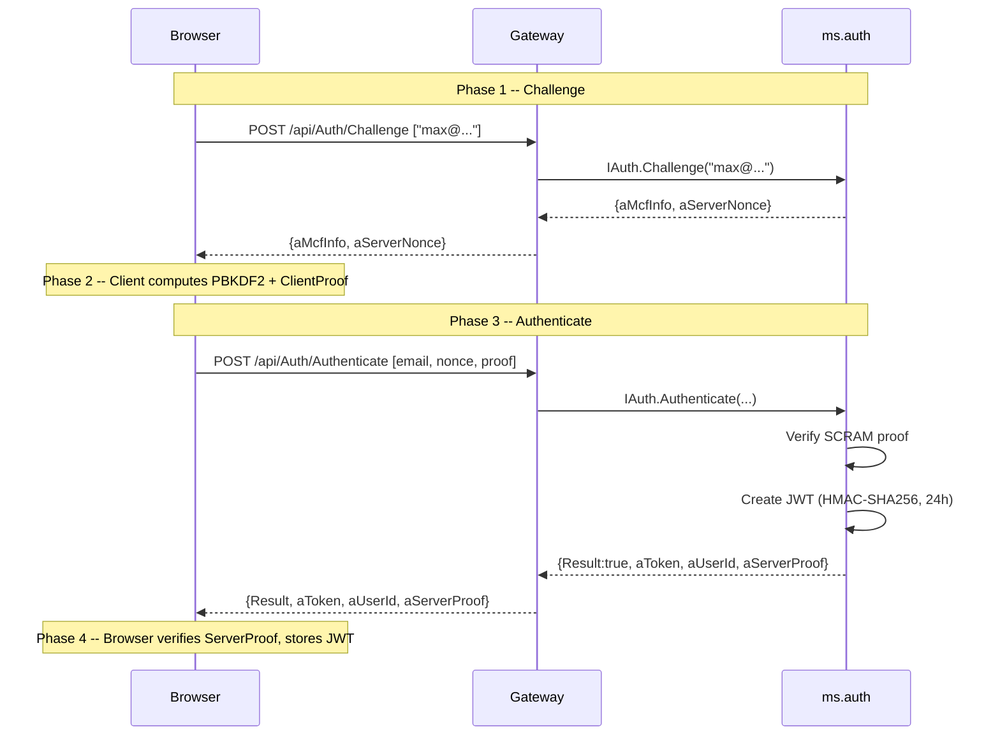
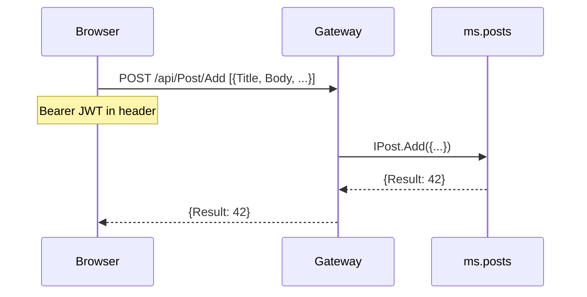
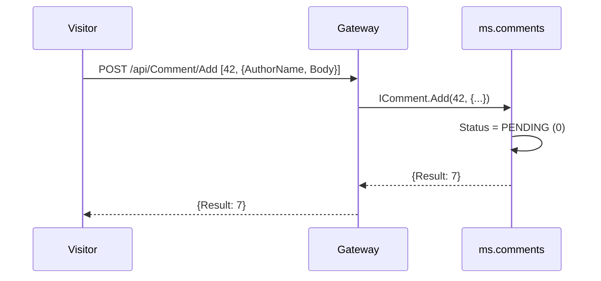
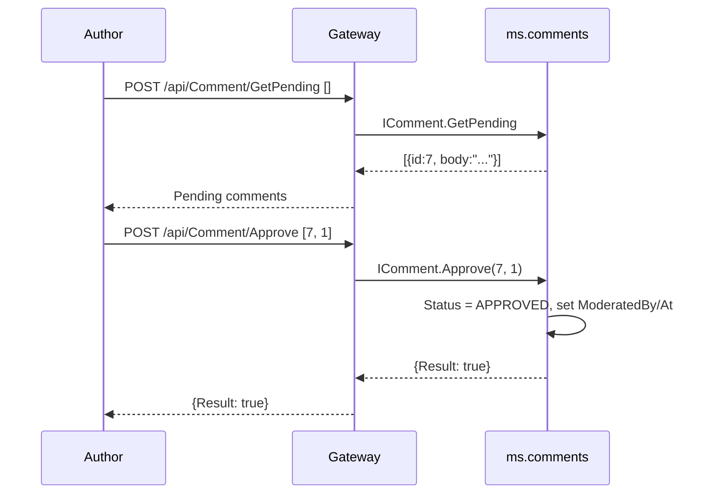
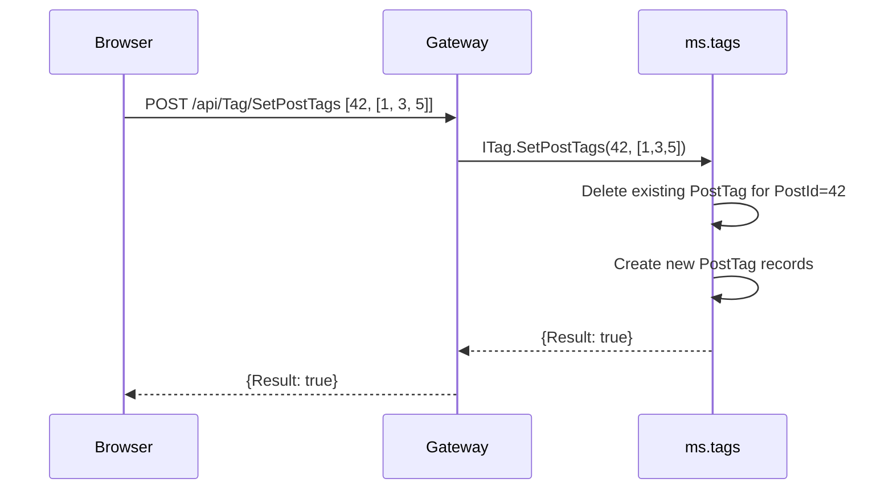
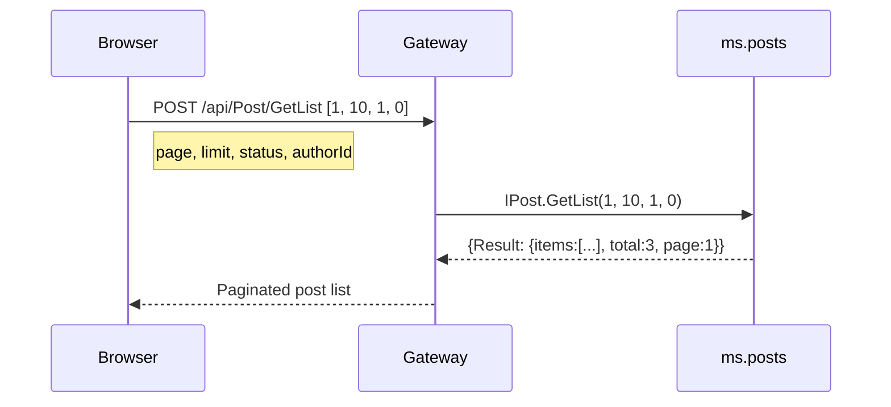

# Blog Microservices -- Workflows and Sequence Diagrams

All calls use mORMot2 SOA format:
`POST /api/{Interface}/{Method}` with JSON array body.

## 1. Read a Published Post (aggregated via IBlog)

## 2. Posts by Tag (aggregated via IBlog)

## 3. SCRAM-MCF Login

## 4. Create a New Post (authenticated)

## 5. Submit a Comment (no login required)

## 6. Moderate a Comment (authenticated)

## 7. Assign Tags to a Post

## 8. Load Post List (home page)

