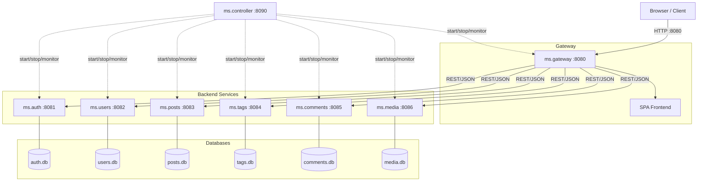
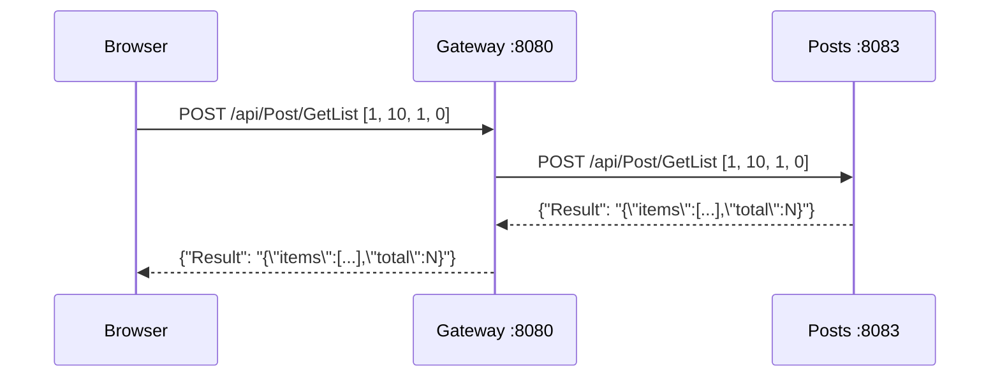
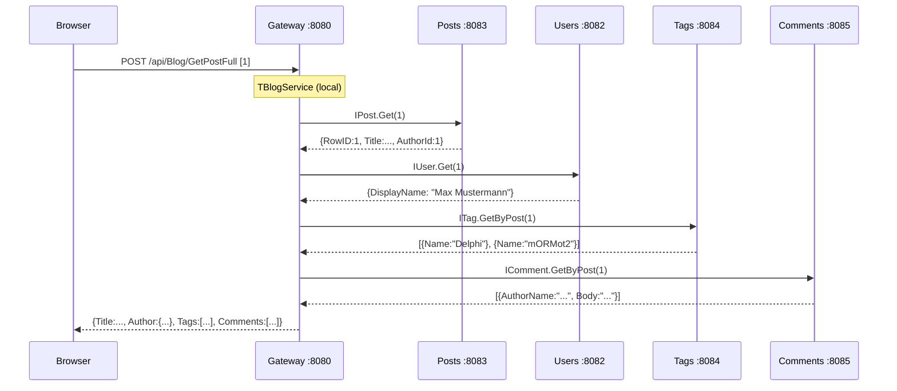
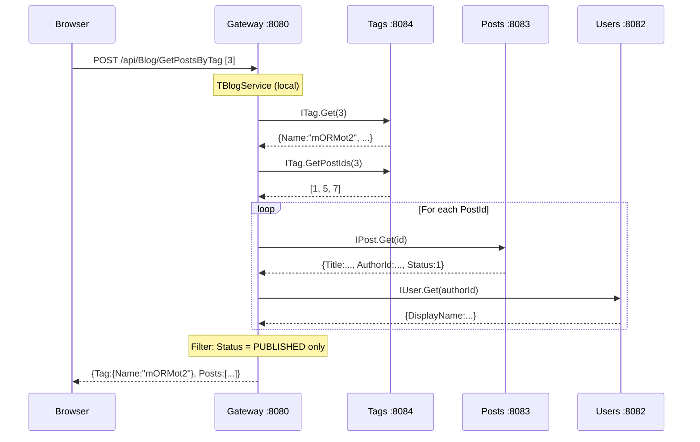
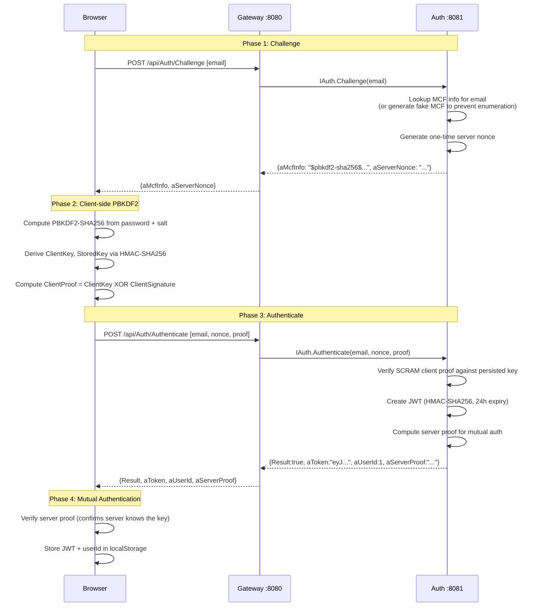
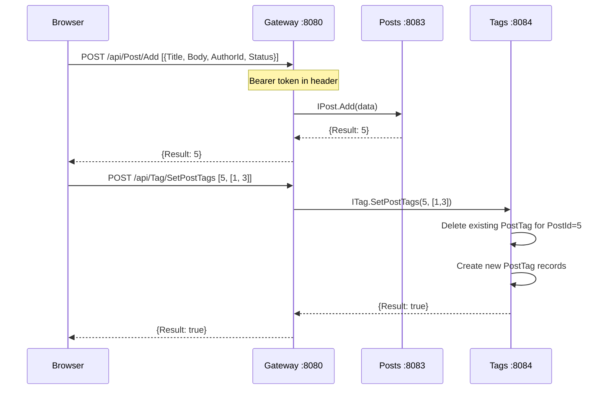
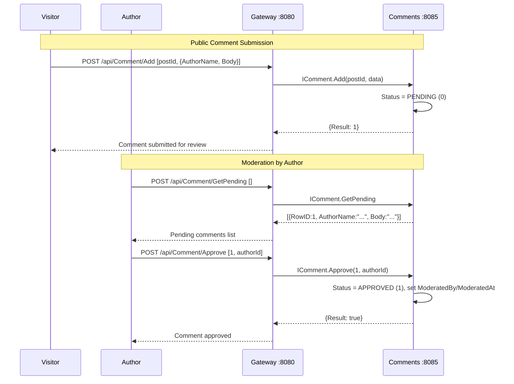
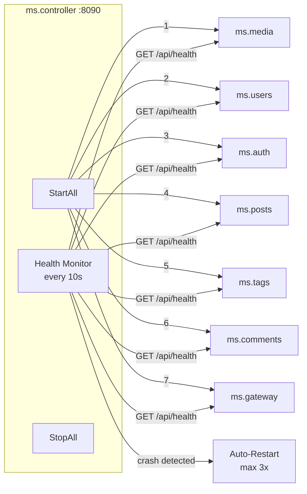
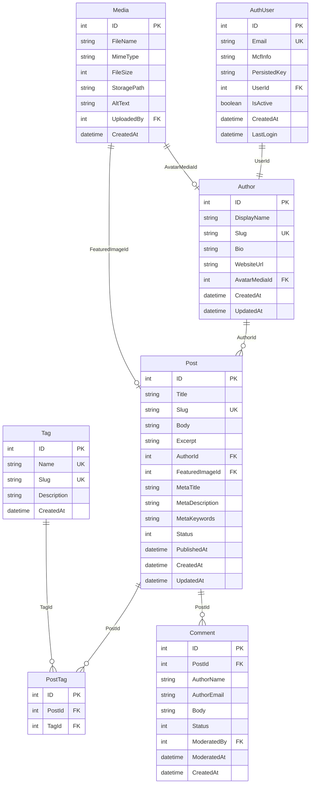

# Blog Microservices Architecture

A microservice-based blog platform built with Delphi 13 and mORMot2.

---

## System Overview



---

## Service Ports

| Service | Port | Purpose |
|---------|------|---------|
| ms.gateway | 8080 | API Gateway + SPA Frontend |
| ms.auth | 8081 | Authentication (SCRAM-MCF + JWT) |
| ms.users | 8082 | Author Profiles |
| ms.posts | 8083 | Blog Posts CRUD |
| ms.tags | 8084 | Tags + Post-Tag Associations |
| ms.comments | 8085 | Comments + Moderation |
| ms.media | 8086 | File Uploads |
| ms.controller | 8090 | Service Orchestrator |

---

## SOA URL Format

All services use mORMot2 interface-based services (SOA). The URL format is:

```
POST /api/{InterfaceName}/{MethodName}
```

Request body: JSON array of positional input parameters.
Response body: JSON object with named output parameters.

Example:

```
POST /api/Post/GetList
Body: [1, 10, 1, 0]
Response: {"Result": "{\"items\":[...],\"total\":5,\"page\":1}"}
```

---

## Request Flow

### Post List (Public)



### Single Post (Aggregated via IBlog)



### Posts by Tag (Aggregated via IBlog)



### Authentication Flow (SCRAM-MCF)

Authentication uses the SCRAM protocol (RFC 5802) adapted for mORMot2
with MCF (Modular Crypt Format) credential storage. The plaintext
password is **never** transmitted over the wire.



### Post Creation with Tags



### Comment Moderation



---

## Controller Orchestrator



### Controller API

| Method | Endpoint | Description |
|--------|----------|-------------|
| GET | `/api/status` | Status of all services |
| POST | `/api/start-all` | Start all services |
| POST | `/api/stop-all` | Stop all services |
| POST | `/api/restart/{name}` | Restart single service |
| POST | `/api/shutdown` | Shutdown everything |

### Startup Order

Services start in dependency order:

1. **ms.media** (8086) -- no dependencies
2. **ms.users** (8082) -- no dependencies
3. **ms.auth** (8081) -- references users
4. **ms.posts** (8083) -- no dependencies
5. **ms.tags** (8084) -- no dependencies
6. **ms.comments** (8085) -- no dependencies
7. **ms.gateway** (8080) -- depends on all others

Shutdown happens in **reverse order** (gateway first).

---

## Gateway Architecture

The gateway combines three responsibilities:

1. **Transparent SOA proxying**: Resolves backend service interfaces
   via `TRestHttpClient` + `Services.Resolve`, which returns a
   `TInterfacedObjectFake`. These are re-registered on the gateway's
   own `TRestServerDB` -- no manual proxy classes needed.

2. **Response aggregation** (`TBlogService`): The `IBlog` interface
   provides `GetPostFull` and `GetPostsByTag`, which query multiple
   backend services and merge their responses using `TDocVariantData`.

3. **Static file serving**: Non-API requests serve the SPA frontend
   from the `www/` directory. Unmatched routes fall back to
   `index.html` for client-side routing.

### Proxied Interfaces

| Interface | Backend | Methods |
|-----------|---------|---------|
| IAuth | ms.auth :8081 | Challenge, Authenticate, Register, Validate, ChangePassword |
| IUser | ms.users :8082 | Get, GetAll, Add, Update, Remove |
| IPost | ms.posts :8083 | Get, GetBySlug, GetList, Add, Update, Remove |
| ITag | ms.tags :8084 | Get, GetAll, GetByPost, GetPostIds, SetPostTags, Add, Update, Remove |
| IComment | ms.comments :8085 | GetByPost, GetPending, Add, Approve, Reject, Remove |
| IMedia | ms.media :8086 | Upload, GetInfo, GetFile, Remove |

### Local Aggregation Interface

| Interface | Methods | Description |
|-----------|---------|-------------|
| IBlog | GetPostFull, GetPostsByTag | Enriches posts with author, tags, comments |

---

## Data Model



### Status Codes

| Entity | Value | Meaning |
|--------|-------|---------|
| Post | 0 | Draft |
| Post | 1 | Published |
| Post | 2 | Archived |
| Comment | 0 | Pending |
| Comment | 1 | Approved |
| Comment | 2 | Rejected |

---

## Technology Stack

| Layer | Technology |
|-------|------------|
| Language | Delphi 13 (Object Pascal) |
| Framework | [mORMot2](https://github.com/synopse/mORMot2) |
| HTTP Server | THttpAsyncServer (IOCP) |
| ORM | mORMot2 TRestServerDB |
| Database | SQLite (one per service) |
| Auth | SCRAM-MCF (RFC 5802) + JWT (HMAC-SHA256, 24h) |
| Frontend | Vanilla JavaScript SPA |
| IPC | REST/JSON over HTTP (SOA interface-based) |
