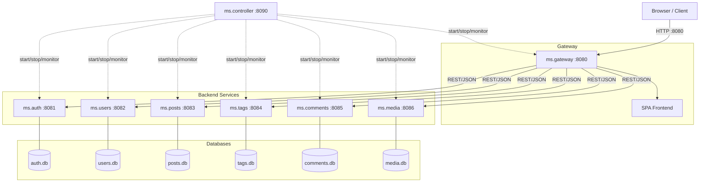
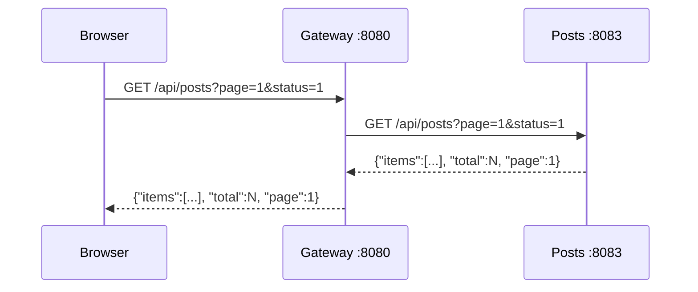
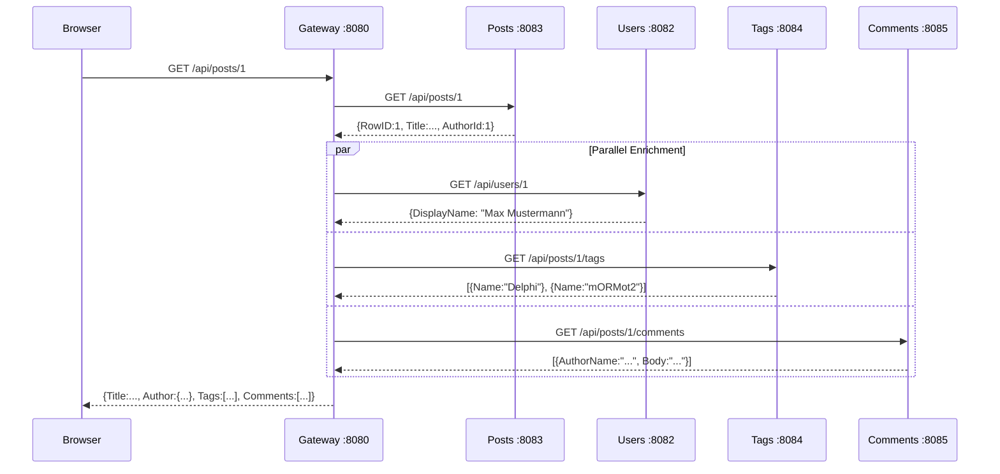
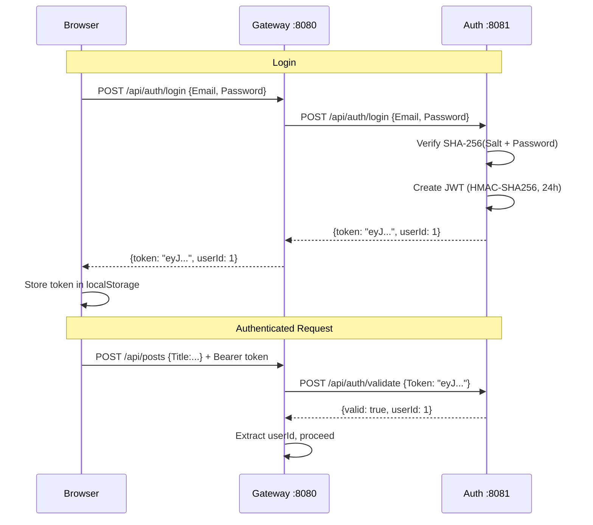
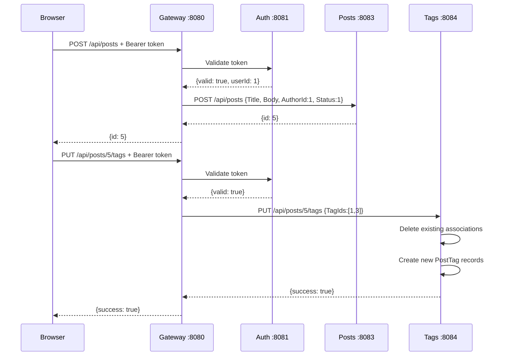
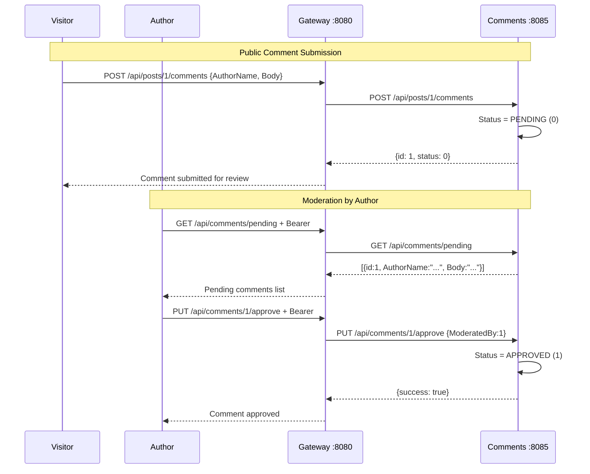
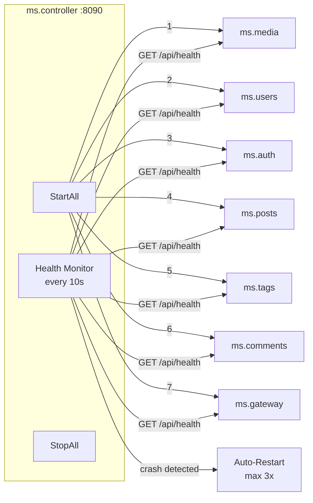
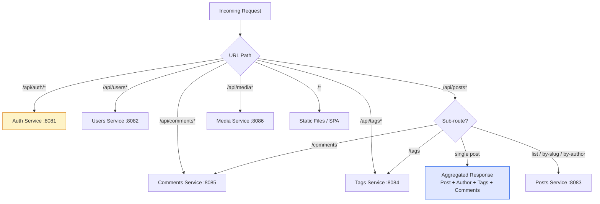
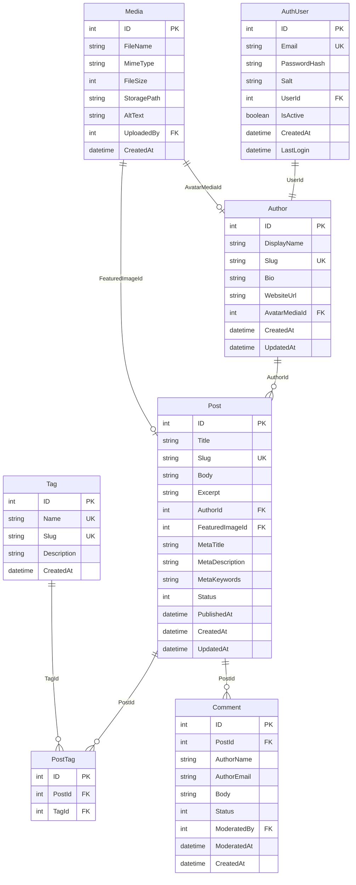

# Blog Microservices Architecture

A microservice-based blog platform built with Delphi 13 and mORMot2.

---

## System Overview

---

## Service Ports

| Service | Port | Purpose |
|---------|------|---------|
| ms.gateway | 8080 | API Gateway + SPA Frontend |
| ms.auth | 8081 | Authentication (JWT) |
| ms.users | 8082 | Author Profiles |
| ms.posts | 8083 | Blog Posts CRUD |
| ms.tags | 8084 | Tags + Post-Tag Associations |
| ms.comments | 8085 | Comments + Moderation |
| ms.media | 8086 | File Uploads |
| ms.controller | 8090 | Service Orchestrator |

---

## Request Flow

### Public Page Request

### Single Post (Aggregated)

### Authentication Flow

### Post Creation with Tags

### Comment Moderation

---

## Controller Orchestrator

### Controller API

| Method | Endpoint | Description |
|--------|----------|-------------|
| GET | `/api/status` | Status of all services |
| POST | `/api/start-all` | Start all services |
| POST | `/api/stop-all` | Stop all services |
| POST | `/api/restart/{name}` | Restart single service |
| POST | `/api/shutdown` | Shutdown everything |

### Startup Order

Services start in dependency order:

1. **ms.media** (8086) -- no dependencies
2. **ms.users** (8082) -- no dependencies
3. **ms.auth** (8081) -- references users
4. **ms.posts** (8083) -- no dependencies
5. **ms.tags** (8084) -- no dependencies
6. **ms.comments** (8085) -- no dependencies
7. **ms.gateway** (8080) -- depends on all others

Shutdown happens in **reverse order** (gateway first).

---

## Gateway Routing Map

### Authentication Requirements

| Endpoint | GET | POST | PUT | DELETE |
|----------|-----|------|-----|--------|
| `/api/auth/*` | -- | Public | Auth | -- |
| `/api/users*` | Public | Auth | Auth | Auth |
| `/api/posts` | Public | Auth | Auth | Auth |
| `/api/posts/{id}/comments` | Public | **Public** | -- | -- |
| `/api/posts/{id}/tags` | Public | Auth | Auth | -- |
| `/api/tags*` | Public | Auth | Auth | Auth |
| `/api/comments/pending` | Auth | -- | -- | -- |
| `/api/comments/{id}/*` | Public | Auth | Auth | Auth |
| `/api/media*` | Public | Auth | -- | Auth |

---

## Data Model

### Status Codes

| Entity | Value | Meaning |
|--------|-------|---------|
| Post | 0 | Draft |
| Post | 1 | Published |
| Post | 2 | Archived |
| Comment | 0 | Pending |
| Comment | 1 | Approved |
| Comment | 2 | Rejected |

---

## Technology Stack

| Layer | Technology |
|-------|------------|
| Language | Delphi 13 (Object Pascal) |
| Framework | [mORMot2](https://github.com/synopse/mORMot2) |
| HTTP Server | THttpAsyncServer (IOCP) |
| ORM | mORMot2 TRestServerDB |
| Database | SQLite (one per service) |
| Auth | JWT (HMAC-SHA256, 24h expiry) |
| Frontend | Vanilla JavaScript SPA |
| IPC | REST/JSON over HTTP |
