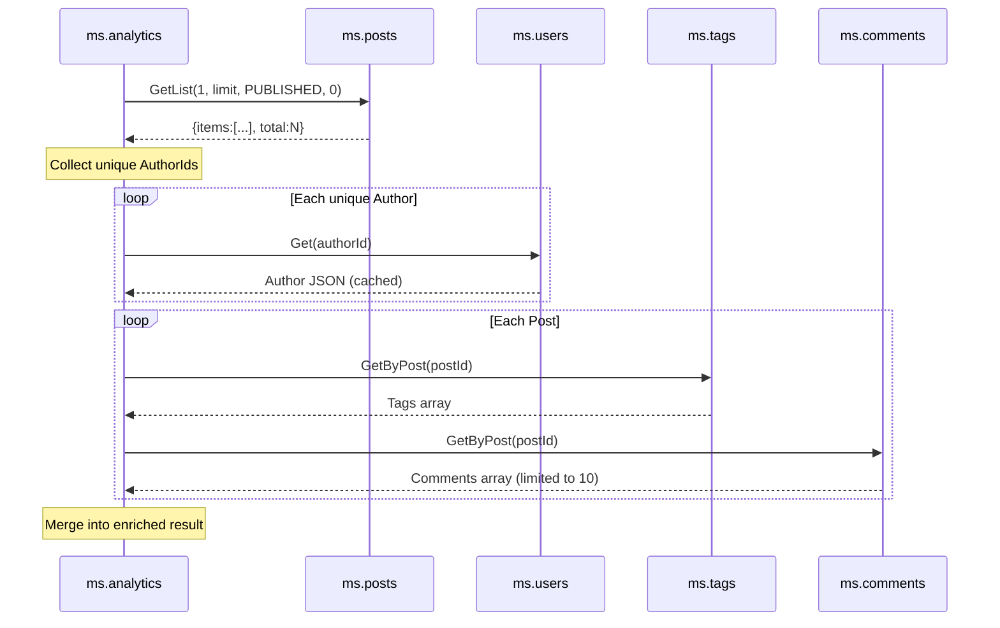

# ms.analytics -- Analytics Service

Port **8088** | Interface **IAnalytics** | No database

Cross-service data aggregation -- the microservice equivalent of SQL JOINs. Connects directly to backend services and combines their data at runtime. Demonstrates two aggregation patterns: statistics and cross-service JOINs.

## SOA Interface

```
POST /api/Analytics/{Method}
```

| Method | Calls | Returns |
|--------|-------|---------|
| GetOverview | Posts, Users, Tags, Comments | `TOverviewDto` (Posts, Authors, Tags, PendingComments) |
| GetAuthorStats | Users, Posts, Comments | `TAuthorStatDtoArray` (AuthorId, DisplayName, PostCount, CommentCount) |
| GetTagCloud | Tags | `TTagCloudItemDtoArray` (TagId, Name, Slug, PostCount) sorted by usage |
| GetCommentActivity | Comments, Posts | `TCommentActivityDto` (PendingCount, TopCommentedPosts) |
| GetRecentPostsFull | Posts, Users, Tags, Comments | `TPostFullDtoArray` -- enriched posts with Author, Tags, Comments |

## The Cross-Service JOIN (GetRecentPostsFull)

The key teaching method. In a traditional database, this would be a multi-table JOIN:

```sql
SELECT p.*, u.DisplayName, t.Name, c.*
FROM Posts p
JOIN Users u ON p.AuthorId = u.Id
JOIN PostTag pt ON pt.PostId = p.Id
JOIN Tags t ON pt.TagId = t.Id
LEFT JOIN Comments c ON c.PostId = p.Id AND c.Status = 1
WHERE p.Status = 1
ORDER BY p.PublishedAt DESC LIMIT 10
```

In a microservice architecture, this becomes:



## Resilience

Each backend call is wrapped in try/except. If a service is unavailable:

| Service Down | Effect |
|---|---|
| Posts | `'[]'` returned, method cannot proceed |
| Users | `Author: null`, `AuthorUnavailable: true` per post |
| Tags | `Tags: []`, `TagsUnavailable: true` per post |
| Comments | `Comments: []`, `CommentsUnavailable: true` per post |

## Implementation Details

- **No database** -- pure runtime aggregation, no caching
- **Author cache** -- `GetRecentPostsFull` builds a lookup cache to avoid duplicate `IUser.Get` calls when multiple posts share the same author
- **Comment limiting** -- max 10 comments per post in `GetRecentPostsFull`
- **Selection sort** -- `GetTagCloud` and `GetCommentActivity` sort results by count (acceptable for small blog data)
- **N+1 queries** -- intentional for the demo: shows the cost of cross-service JOINs and why batch APIs would help in production
