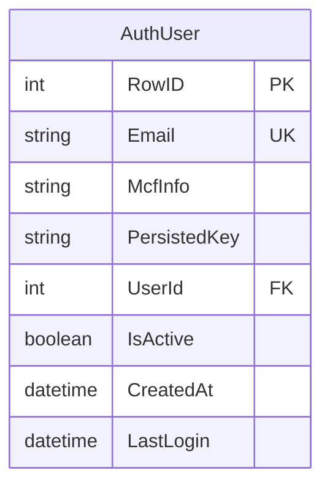
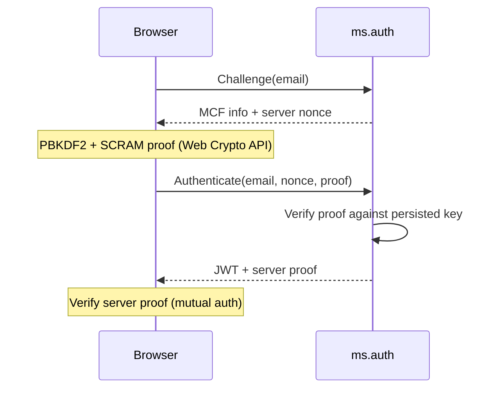

# ms.auth -- Authentication Service

Port **8081** | Interface **IAuth** | Database `ms.auth.db`

SCRAM-MCF authentication (RFC 5802) with PBKDF2-SHA256 and JWT token management. The plaintext password is never transmitted or stored.

## SOA Interface

```
POST /api/Auth/{Method}
```

| Method | Signature | Description |
|--------|-----------|-------------|
| Challenge | `(aEmail) -> (aMcfInfo, aServerNonce)` | Phase 1: returns MCF salt/rounds + one-time nonce |
| Authenticate | `(aEmail, aServerNonce, aClientProof) -> (aToken, aUserId, aServerProof): boolean` | Phase 2: verifies SCRAM proof, returns JWT |
| Register | `(aEmail, aPassword, aUserId): TID` | Creates account with PBKDF2-hashed credentials |
| Validate | `(aToken) -> (aUserId): boolean` | Validates JWT, extracts user ID |
| ChangePassword | `(aUserId, aOldPassword, aNewPassword): boolean` | Changes password after verifying old one |

## Data Model



## Authentication Flow



## Implementation Details

- **SCRAM persisted key**: derived via `ModularCryptHash` + `ScramPersistedKey` from `mormot.crypt.core`
- **Anti-enumeration**: returns fake MCF info for non-existent emails
- **Challenge TTL**: nonces expire after 60 seconds
- **JWT**: HMAC-SHA256 via `TJwtHS256`, 24-hour expiry, custom `uid` claim
