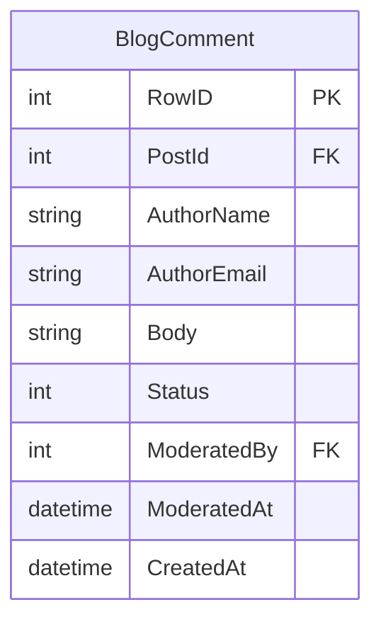
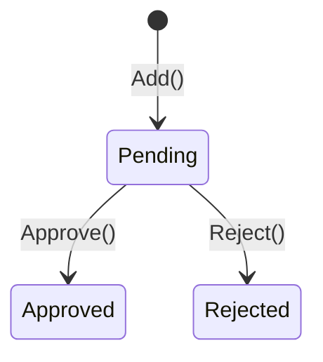

# ms.comments -- Comment Service

Port **8085** | Interface **IComment** | Database `ms.comments.db`

Comment system with a moderation workflow. Visitors can comment without login; authors approve or reject.

## SOA Interface

```
POST /api/Comment/{Method}
```

| Method | Signature | Description |
|--------|-----------|-------------|
| GetByPost | `(aPostId): RawJson` | Approved comments for a post |
| GetPending | `(): RawJson` | All comments awaiting moderation |
| Add | `(aPostId, aData): TID` | Submit comment (status: pending) |
| Approve | `(aId, aModeratedBy): boolean` | Approve a pending comment |
| Reject | `(aId, aModeratedBy): boolean` | Reject a pending comment |
| Remove | `(aId): boolean` | Delete permanently |

## Data Model



### Status Codes

| Value | Meaning |
|-------|---------|
| 0 | Pending |
| 1 | Approved |
| 2 | Rejected |

## Moderation Workflow



## Implementation Details

- **No authentication required** for submitting comments
- **GetByPost** only returns approved comments (status = 1)
- **Selective field updates**: `Approve`/`Reject` only write `Status`, `ModeratedBy`, `ModeratedAt` to avoid overwriting other fields
- **Validation**: rejects empty body or invalid post ID with result `0`
