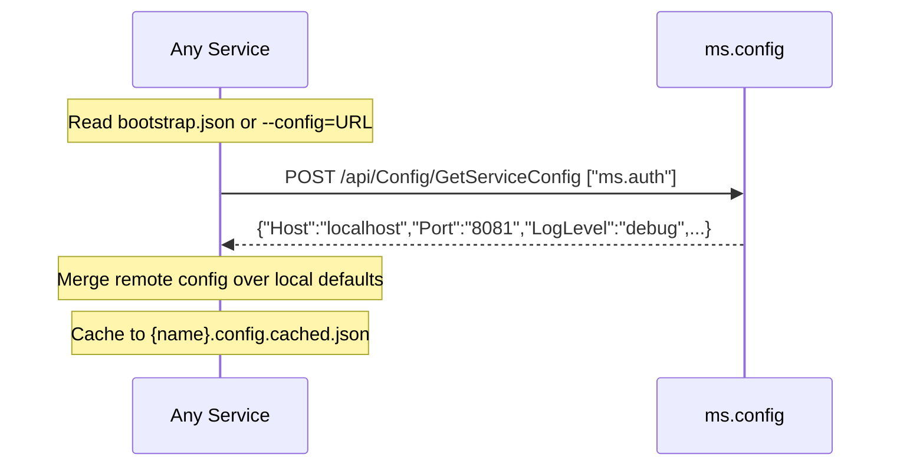

# ms.config -- Configuration Service

Port **8087** | Interface **IConfig** | No database

Central configuration registry. Loads a master JSON file at startup and serves configuration to all other services via SOA interface. Must start before all other services.

## SOA Interface

```
POST /api/Config/{Method}
```

| Method | Signature | Description |
|--------|-----------|-------------|
| GetServiceConfig | `(aServiceName): RawJson` | Config for one service, or `'{}'` |
| GetAllConfigs | `(): RawJson` | Complete config for all services |
| GetServiceRegistry | `(): RawJson` | Host + Port only (no secrets) |

## Bootstrap Flow



## Master Config File

`ms.config.master.json` -- single source of truth, keyed by service name:

```json
{
  "ms.auth": {
    "Host": "localhost",
    "Port": "8081",
    "Database": "ms.auth.db",
    "LogLevel": "debug",
    "JwtSecret": "...",
    "ModelRoot": "api",
    "HttpThreads": 4,
    "HttpSecurity": "secNone",
    "HttpBind": "+"
  }
}
```

## Fallback Chain

If ms.config is unreachable, services fall back in this order:

1. Local `{name}.config.json`
2. Cached `{name}.config.cached.json` (from last successful fetch)
3. Hardcoded defaults

## Implementation Details

- **No database** -- config loaded into memory from JSON file
- **No self-fetch** -- ms.config reads its own `ms.config.config.json` directly
- **GetServiceRegistry filters secrets** -- only `Host` and `Port` are exposed
- **Startup order** -- ms.controller starts ms.config first, health-checks it, then starts remaining services
