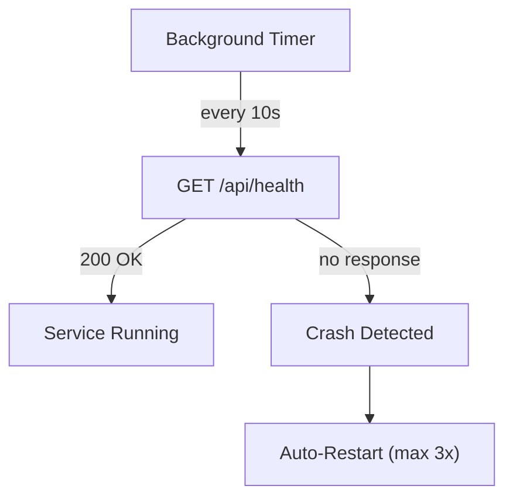

# ms.controller -- Service Orchestrator

Port **8090** | No SOA interface | No database

Starts, monitors, and stops all backend microservices. Provides a REST API for management and automatic crash recovery.

## REST API

| Method | Endpoint | Description |
|--------|----------|-------------|
| GET | `/api/status` | Status of all services (JSON) |
| POST | `/api/start-all` | Start all services |
| POST | `/api/stop-all` | Stop all services |
| POST | `/api/restart/{name}` | Restart a single service |
| POST | `/api/shutdown` | Shut down controller + all services |

## Startup Order

Services start sequentially in dependency order:

Shutdown happens in **reverse order** (gateway first).

## Health Monitoring

## Implementation Details

- **Process management**: Windows `CreateProcessW` / `TerminateProcess` API
- **Health checks**: `GET /api/health` every 10 seconds via `TSynBackgroundTimer`
- **Graceful shutdown**: sends `POST /api/shutdown` first, force-terminates after 5 seconds if still running
- **Auto-restart**: up to 3 restart attempts per service after crash detection
- **Executable discovery**: searches in the same directory as the controller, then the parent directory
- **Console UI**: services start minimized (`SW_SHOWMINNOACTIVE`)
