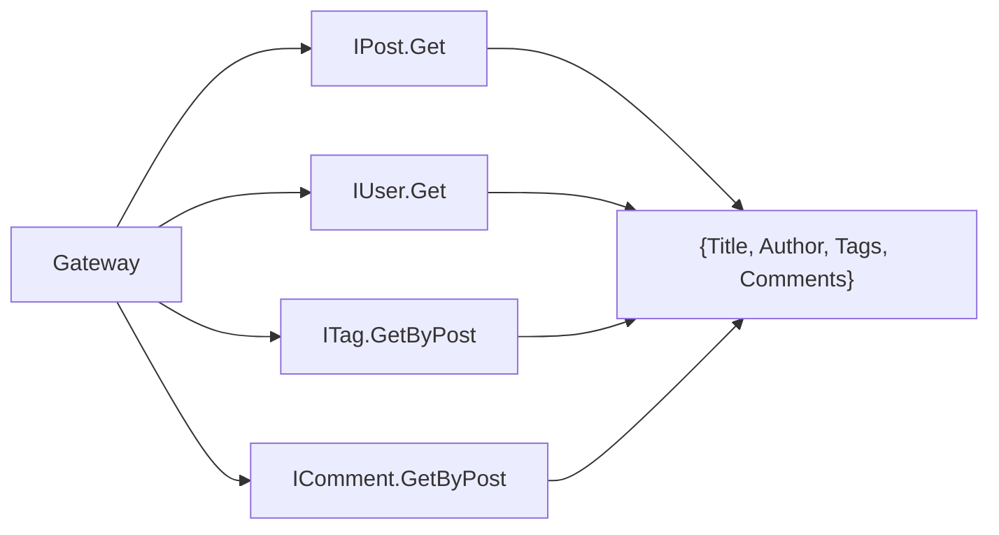
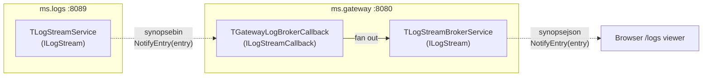
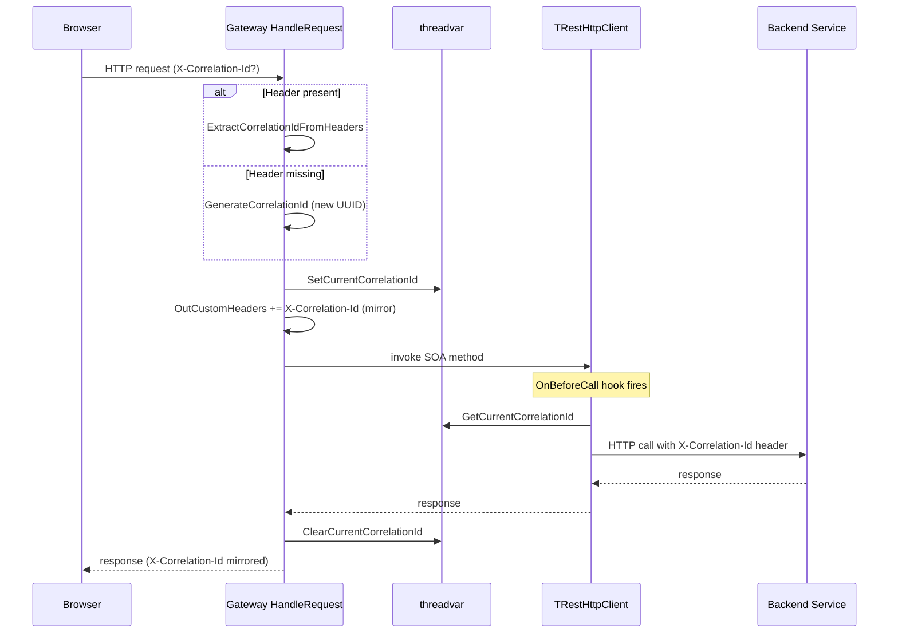

# ms.gateway -- API Gateway

Port **8080** | Interface **IBlog** + 7 proxied interfaces | No own database

Central entry point for all browser requests. Combines four responsibilities: transparent SOA proxying, response aggregation, static file serving, and correlation ID propagation.

## Aggregation Interface (IBlog)

```
POST /api/Blog/{Method}
```

| Method | Signature | Description |
|--------|-----------|-------------|
| GetPostFull | `(aId): TPostFullDto` | Post enriched with author, tags, comments |
| GetPostsByTag | `(aTagId): TPostsByTagDto` | Published posts for a tag, with author info |

### GetPostFull Response

Queries 4 backend services and merges the results:



### GetPostsByTag Response

Returns `{Tag: {...}, Posts: [...]}` where each post includes its author. Only published posts are included.

## Proxied Interfaces

Seven backend interfaces are transparently forwarded without manual proxy classes:

| Interface | Backend | Port |
|-----------|---------|------|
| IAuth | ms.auth | 8081 |
| IUser | ms.users | 8082 |
| IPost | ms.posts | 8083 |
| ITag | ms.tags | 8084 |
| IComment | ms.comments | 8085 |
| IMedia | ms.media | 8086 |
| IAnalytics | ms.analytics | 8088 |
| ILogQuery | ms.logs | 8089 |

## Real-time Log Stream Broker

`ILogStream` on ms.logs is **not** a transparent proxy. It uses
mORMot2 **interface-based callbacks over WebSockets**, and the
gateway sits between ms.logs and the browser as a broker so that
"all browser traffic flows through the gateway" continues to hold
even for live events.

Two Pascal types implement the broker:

- **`TGatewayLogBrokerCallback`** -- implements `ILogStreamCallback`
  and is registered with ms.logs as a subscriber. ms.logs calls
  `NotifyEntry` on it over the binary `synopsebin` protocol for
  every persisted log entry.
- **`TLogStreamBrokerService`** -- a full `ILogStream` SOA service
  hosted by the gateway itself. Browsers subscribe to it over the
  JSON `synopsejson` protocol. When an entry arrives via the
  Pascal-side callback, the broker service iterates its own
  subscriber list and calls `NotifyEntry` on every browser
  callback.



The gateway subscribes to ms.logs **once** and reuses that single
upstream connection for every browser subscriber. Dead browser
subscribers are cleaned up via the inherited `CallbackReleased`
from `IServiceWithCallbackReleased` -- no explicit close protocol.

Every service (including the gateway) now hosts HTTP, the binary
`synopsebin` protocol and the JSON `synopsejson` protocol on the
same port, because `TMicroService` creates its `TRestHttpServer`
with `WEBSOCKETS_DEFAULT_MODE` and calls `WebSocketsEnable(..., ajax=True)`.
The browser opens the live stream with
`new WebSocket('/api', 'synopsejson')` -- see `api.js` /
`openLogStream(onEntry)`.

See [.claude/event-driven.md](../.claude/event-driven.md) for the full design, the mORMot2 building blocks, the subscriber-bookkeeping idiom and the lifecycle of one subscription.

## Static File Serving

| URL | Behavior |
|-----|----------|
| `/api/*` | Routed to SOA services |
| `OPTIONS` | CORS preflight response |
| `/*` | Static files from `www/` directory |
| Fallback | `index.html` (SPA routing) |

## Correlation ID Propagation

The gateway is the origin point for correlation IDs in this architecture. Every request that passes through gets a unique `X-Correlation-Id` that then rides along to every backend service call.



### Implementation points

- **Header extraction**: `HandleRequest` reads `X-Correlation-Id` from `InHeaders` at the top of the method, before any routing or CORS logic. If absent, a new UUID is generated.
- **Response mirror**: The ID is appended to `OutCustomHeaders` so the browser (and any intermediate proxy) can log it.
- **Backend forwarding**: `ConnectToBackend` installs `ForwardCorrelationId` as the `OnBeforeCall` handler on every `TRestHttpClient`. This mORMot2 hook fires synchronously on the calling thread before every outgoing request, so reading the threadvar is always safe.
- **Browser side**: `www/js/api.js` generates a UUID per call, sends it as `X-Correlation-Id`, and reads the mirrored ID from the response headers.

See [.claude/correlation-ids.md](../.claude/correlation-ids.md) for the full design, logging examples, and developer guide.

## Implementation Details

- **Transparent proxying**: `TRestHttpClient.Services.Resolve` returns `TInterfacedObjectFake` instances that are re-registered as server-side services -- no manual proxy classes needed
- **Format matching**: both client and server factories use `ResultAsJsonObjectWithoutResult := True`
- **CORS**: `Access-Control-Allow-Origin: *` on all responses
- **SPA fallback**: unmatched routes serve `index.html` for client-side routing
- **Correlation IDs**: `X-Correlation-Id` extracted (or generated) per request, stored in a threadvar, forwarded to every backend via `OnBeforeCall`, and mirrored in the response
