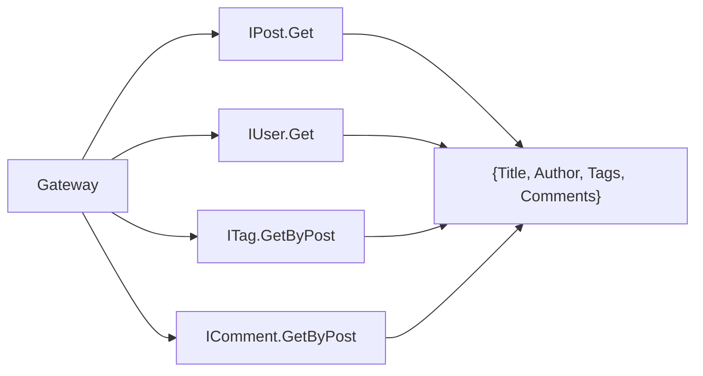

# ms.gateway -- API Gateway

Port **8080** | Interface **IBlog** + 6 proxied interfaces | No own database

Central entry point for all browser requests. Combines three responsibilities: transparent SOA proxying, response aggregation, and static file serving.

## Aggregation Interface (IBlog)

```
POST /api/Blog/{Method}
```

| Method | Signature | Description |
|--------|-----------|-------------|
| GetPostFull | `(aId): RawJson` | Post enriched with author, tags, comments |
| GetPostsByTag | `(aTagId): RawJson` | Published posts for a tag, with author info |

### GetPostFull Response

Queries 4 backend services and merges the results:



### GetPostsByTag Response

Returns `{Tag: {...}, Posts: [...]}` where each post includes its author. Only published posts are included.

## Proxied Interfaces

Six backend interfaces are transparently forwarded without manual proxy classes:

| Interface | Backend | Port |
|-----------|---------|------|
| IAuth | ms.auth | 8081 |
| IUser | ms.users | 8082 |
| IPost | ms.posts | 8083 |
| ITag | ms.tags | 8084 |
| IComment | ms.comments | 8085 |
| IMedia | ms.media | 8086 |

## Static File Serving

| URL | Behavior |
|-----|----------|
| `/api/*` | Routed to SOA services |
| `OPTIONS` | CORS preflight response |
| `/*` | Static files from `www/` directory |
| Fallback | `index.html` (SPA routing) |

## Implementation Details

- **Transparent proxying**: `TRestHttpClient.Services.Resolve` returns `TInterfacedObjectFake` instances that are re-registered as server-side services -- no manual proxy classes needed
- **Format matching**: both client and server factories use `ResultAsJsonObjectWithoutResult := True`
- **CORS**: `Access-Control-Allow-Origin: *` on all responses
- **SPA fallback**: unmatched routes serve `index.html` for client-side routing
