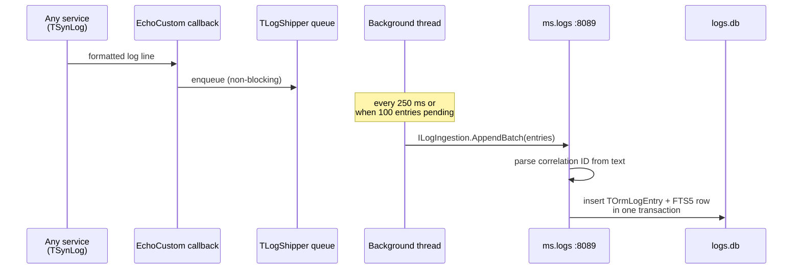

# ms.logs -- Central Logging Service

Port **8089** | Interfaces **ILogIngestion** + **ILogQuery** + **ILogStream** | Own SQLite database (FTS5) | HTTP + WebSocket on the same port

Central log aggregation for every other microservice. Receives log entries via a custom SOA interface, stores them in SQLite with an FTS5 full-text search index, exposes a typed query API that the gateway proxies through to the browser UI at `/logs`, and broadcasts every new entry in real time to subscribers over `ILogStream` (mORMot2 interface-based callbacks over WebSockets).

The full design docs live at [`.claude/central-logging.md`](../.claude/central-logging.md) (ingest + query) and [`.claude/event-driven.md`](../.claude/event-driven.md) (live broadcast). This readme covers the service as a deployable unit.

## Why this service exists

Correlation IDs let you stamp every log line with one request identifier, but you still need a place to query those lines. Grepping `.log` files on every machine is painful at best and impossible at scale. `ms.logs` is the central store that turns post-mortem debugging from archaeology into a SQL query.

## Ingestion Flow



- The `EchoCustom` callback only enqueues -- microsecond cost for the producing service
- The background thread batches up to 100 entries per HTTP call
- Ingestion is best-effort: if `ms.logs` is down, the queue drops oldest on overflow (cap 10 000). Local `TSynLog` file logging keeps running unchanged.

## SOA Interfaces

### ILogIngestion (write path, called by every service)

```
POST /api/LogIngestion/AppendBatch
Body: [[{"ServiceName":"ms.posts","Timestamp":45645.23,"Level":4,"Message":"[uuid] IFO Post.Get(42)"}]]
```

`TLogEntryIngestDto` fields: `ServiceName`, `Timestamp`, `Level` (TSynLogLevel ordinal), `Message`. The server parses the correlation ID out of the message text.

### ILogQuery (read path, proxied through the gateway)

```
POST /api/LogQuery/{Method}
```

| Method | Input | Returns |
|--------|-------|---------|
| ByCorrelationId | `[aId]` | `TLogEntryDtoArray` -- every entry for one request, ordered by timestamp ascending |
| Recent | `[{ServiceName, MinLevel, Since, UntilTime, Limit}]` | `TLogEntryDtoArray` -- most recent entries matching the filter |
| Search | `[aText, aLimit]` | `TLogEntryDtoArray` -- FTS5 MATCH on the message column |
| Stats | `[]` | `TLogStatsDto` -- total, oldest, newest, per-service breakdown |

`TLogQueryFilter` fields are all optional: empty `ServiceName`, zero `MinLevel`, zero `Since`/`UntilTime`, zero `Limit` disable the corresponding filter. `Limit` is clamped server-side to 1..1000 (default 100).

`TLogEntryDto` adds the parsed `CorrelationId` to what the client sent.

### ILogStream (real-time broadcast, WebSocket callbacks)

```pascal
ILogStreamCallback = interface(IInvokable)
  ['{...}']
  procedure NotifyEntry(const aEntry: TLogEntryDto);
end;

ILogStream = interface(IServiceWithCallbackReleased)
  ['{...}']
  procedure Subscribe(const aCallback: ILogStreamCallback);
  procedure Unsubscribe(const aCallback: ILogStreamCallback);
end;
```

`ILogStream` is **not** a plain HTTP SOA method -- it rides an interface-based callback over a persistent WebSocket connection. `TLogStreamService` holds a thread-safe subscriber list, and `TLogIngestionService.AppendBatch` fans out every persisted entry to it. The server receives `CallbackReleased` (from the inherited `IServiceWithCallbackReleased`) the moment a subscriber's refcount drops to zero, so dead subscribers are removed automatically without an explicit close protocol. Inside `Broadcast`, any exception calling a subscriber also drops it as a safety net.

The service is registered with `optExecLockedPerInterface` so mORMot2 serializes calls per subscriber -- one slow subscriber cannot delay events from reaching others, but each subscriber sees its entries in order.

Subscribers connect with `TRestHttpClientWebsockets` (Pascal) or `new WebSocket(url, 'synopsejson')` (browser). In this project the gateway is the only direct subscriber to ms.logs; it re-broadcasts over its own `ILogStream` broker so browsers never talk to ms.logs directly. See [`.claude/event-driven.md`](../.claude/event-driven.md) for the broker pattern and the synopsebin / synopsejson protocol details.

## Data Model

```pascal
TOrmLogEntry = class(TOrm)
  property Timestamp: TDateTime     // indexed
  property ServiceName: RawUtf8     // indexed, e.g. "ms.posts"
  property Level: integer           // indexed, TSynLogLevel ordinal
  property CorrelationId: RawUtf8   // indexed, parsed from Message
  property Message: RawUtf8         // full log line
end;

TOrmLogEntryFts = class(TOrmFts5)
  property Message: RawUtf8         // virtual FTS5 table, parallel to TOrmLogEntry
end;
```

The FTS5 virtual table lives alongside the regular table with matching RowIDs, so a query joins them by `RowID`:

```sql
SELECT * FROM LogEntry
WHERE RowID IN (
  SELECT RowID FROM LogEntryFts WHERE Message MATCH 'connection AND timeout'
)
ORDER BY Timestamp DESC
LIMIT 100
```

## Typical Query Examples

```bash
# One full request across every service that handled it
curl -s -X POST http://localhost:8080/api/LogQuery/ByCorrelationId \
  -H "Content-Type: application/json" \
  -d '["a8f3c1e9-7d24-4b5f-9e1c-2a3b4c5d6e7f"]'

# All errors from ms.posts in the last 500 entries
curl -s -X POST http://localhost:8080/api/LogQuery/Recent \
  -H "Content-Type: application/json" \
  -d '[{"ServiceName":"ms.posts","MinLevel":5,"Limit":500}]'

# Full-text search for any mention of "timeout" across all services
curl -s -X POST http://localhost:8080/api/LogQuery/Search \
  -H "Content-Type: application/json" \
  -d '["timeout",100]'

# Dashboard snapshot
curl -s -X POST http://localhost:8080/api/LogQuery/Stats \
  -H "Content-Type: application/json" \
  -d '[]'
```

## Browser UI

The gateway proxies `ILogQuery` (not `ILogIngestion`, which is internal). The SPA frontend at [http://localhost:8080/logs](http://localhost:8080/logs) renders:

- Search box (FTS5)
- Service-name dropdown
- Level slider
- Time range
- Results table with clickable correlation IDs that pivot to `ByCorrelationId`

## mORMot2 Primitives Used

| Primitive | Purpose |
|-----------|---------|
| `TSynLogFamily.EchoCustom` | Per-line hook that fires inside the log lock -- the producer pushes onto a queue and returns immediately |
| `TRestHttpClientWebsockets` + `WebSocketsUpgrade(WEBSOCKETS_KEY)` | `TLogShipper` holds a persistent WebSocket connection and calls `ILogIngestion.AppendBatch` over the binary `synopsebin` protocol -- no per-batch handshake |
| `TRestHttpServer` with `WEBSOCKETS_DEFAULT_MODE` + `WebSocketsEnable(..., ajax=True)` | Same port serves HTTP, `synopsebin` (Pascal clients) and `synopsejson` (browsers) |
| `TWebSocketProtocolBinary` / `TWebSocketProtocolJson` | Transport for the interface-based callbacks used by `ILogStream` |
| `IServiceWithCallbackReleased` | Server hook that fires the instant a subscriber's refcount drops to zero -- removes dead subscribers without an explicit close protocol |
| `TInterfacedCallback` | Refcount-managed server-to-client invocations of `ILogStreamCallback.NotifyEntry` |
| `TOrmFts5` | SQLite FTS5 virtual table for fast full-text search |
| `TransactionBegin` / `Commit` | Both the regular row and the FTS5 row are inserted in one transaction |

See [`.claude/central-logging.md`](../.claude/central-logging.md) for the full rationale on why these were chosen over `TRestHttpClientGeneric.CreateForRemoteLogging`, `TRestHttpRemoteLogServer` and `ISynLogCallback`.

## Management Endpoints

Inherited from `TMicroService`:

| Method | Endpoint | Description |
|--------|----------|-------------|
| GET | `/api/health` | Health check (service name, port, version, uptime) |
| POST | `/api/shutdown` | Graceful shutdown |

## Configuration

`ms.logs.config.json` (defaults if absent):

```json
{
  "Port": "8089",
  "LogLevel": "debug"
}
```

`ms.logs` does **not** attach a `TLogShipper` to itself -- otherwise it would ship its own log lines back to itself and create a feedback loop. The file-based `TSynLog` keeps running.
