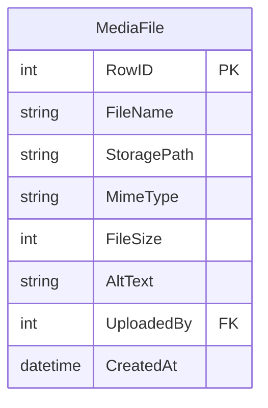

# ms.media -- Media Service

Port **8086** | Interface **IMedia** | Database `ms.media.db`

File upload and storage. Files are transferred as Base64, stored on the filesystem, with metadata tracked in SQLite.

## SOA Interface

```
POST /api/Media/{Method}
```

| Method | Signature | Description |
|--------|-----------|-------------|
| Upload | `(aFileName, aFileData, aAltText, aUploadedBy): TID` | Upload Base64-encoded file |
| GetInfo | `(aId): RawJson` | File metadata (name, MIME, size) |
| GetFile | `(aId) -> (aContentType): RawByteString` | Raw file content |
| Remove | `(aId): boolean` | Delete file + metadata |

## Data Model



## Implementation Details

- **Storage**: files saved to `{executable_path}/media/{id}_{filename}` on the filesystem
- **Transfer format**: Base64-encoded string in the `aFileData` parameter
- **Size limit**: 3 MB after Base64 decoding (`MAX_UPLOAD_SIZE`)
- **MIME detection**: automatic via `GuessMimeType` (covers HTML, CSS, JS, JSON, images, fonts)
- **Cleanup**: `Remove` deletes both the database record and the file from disk
