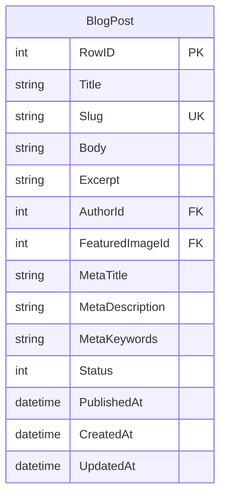

# ms.posts -- Blog Post Service

Port **8083** | Interface **IPost** | Database `ms.posts.db`

Blog post CRUD with pagination, status filtering, author filtering, and SEO metadata.

## SOA Interface

```
POST /api/Post/{Method}
```

| Method | Signature | Description |
|--------|-----------|-------------|
| Get | `(aId): RawJson` | Single post, or `'{}'` |
| GetBySlug | `(aSlug): RawJson` | Lookup by URL slug |
| GetList | `(aPage, aLimit, aStatus, aAuthorId): RawJson` | Paginated list with filters |
| Add | `(aData): TID` | Creates post, auto-generates slug |
| Update | `(aId, aData): boolean` | Partial update |
| Remove | `(aId): boolean` | Deletes post |

### GetList Parameters

| Parameter | Type | Description |
|-----------|------|-------------|
| aPage | integer | Page number (1-based) |
| aLimit | integer | Items per page (1..100) |
| aStatus | integer | 0 = all, 1 = published, 2 = archived |
| aAuthorId | TID | 0 = all authors |

Returns: `{"items":[...], "total": N, "page": N}`

## Data Model



### Status Codes

| Value | Meaning |
|-------|---------|
| 0 | Draft |
| 1 | Published |
| 2 | Archived |

## Implementation Details

- **Slug generation**: auto-generated from `Title` via `TextToSlug`
- **PublishedAt**: set automatically on first transition to status `Published`
- **Pagination**: SQL `LIMIT`/`OFFSET` with `ORDER BY RowID DESC`
- **Partial updates**: only fields present in the JSON are modified
