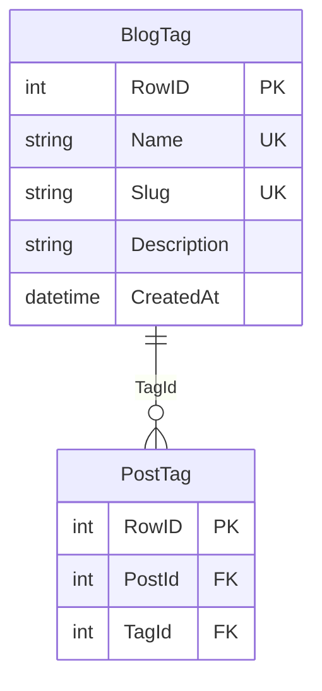

# ms.tags -- Tag Service

Port **8084** | Interface **ITag** | Database `ms.tags.db`

Tag management and many-to-many post-tag associations via a junction table.

## SOA Interface

```
POST /api/Tag/{Method}
```

| Method | Signature | Description |
|--------|-----------|-------------|
| Get | `(aId): RawJson` | Single tag, or `'{}'` |
| GetAll | `(): RawJson` | All tags as JSON array |
| GetByPost | `(aPostId): RawJson` | Tags assigned to a post |
| GetPostIds | `(aTagId): RawJson` | Post IDs that have this tag, e.g. `[1,3,5]` |
| SetPostTags | `(aPostId, aTagIds): boolean` | Replace all tag assignments for a post |
| Add | `(aData): TID` | Creates tag, auto-generates slug |
| Update | `(aId, aData): boolean` | Partial update |
| Remove | `(aId): boolean` | Deletes tag + all associations |

## Data Model



## Implementation Details

- **Junction table**: `TOrmPostTag` links posts and tags (m:n relationship)
- **SetPostTags**: atomic replace -- deletes existing associations, creates new ones, with duplicate prevention
- **Cascade delete**: removing a tag also deletes all its `PostTag` entries
- **Slug generation**: auto-generated from `Name` via `TextToSlug`
- **GetPostIds**: used by the gateway's `IBlog.GetPostsByTag` aggregation
