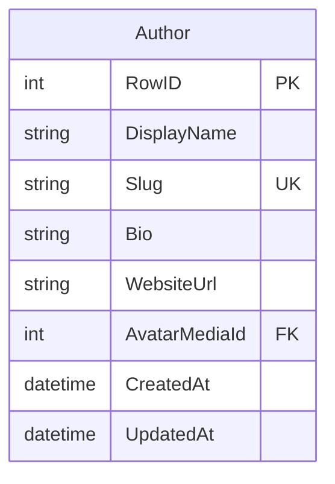

# ms.users -- Author Profile Service

Port **8082** | Interface **IUser** | Database `ms.users.db`

CRUD operations for author profiles (display name, bio, website).

## SOA Interface

```
POST /api/User/{Method}
```

| Method | Signature | Description |
|--------|-----------|-------------|
| Get | `(aId): TAuthorDto` | Single author profile, ID=0 if not found |
| GetAll | `(): TAuthorDtoArray` | All authors as typed array |
| Add | `(const aData: TAuthorCreateDto): TID` | Creates profile, auto-generates slug |
| Update | `(aId, aData): boolean` | Partial update (only provided fields) |
| Remove | `(aId): boolean` | Deletes profile |

## Data Model



## Implementation Details

- **Slug generation**: auto-generated from `DisplayName` via `TextToSlug` (with German umlaut support)
- **Partial updates**: only fields present in the JSON are modified (PATCH semantics via `GetValueIndex` checks)
- **Timestamps**: `CreatedAt` set on insert, `UpdatedAt` on every update
