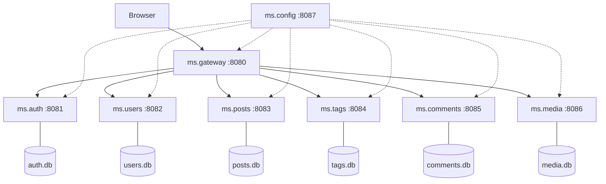

# Blog Microservices with Delphi and mORMot2

A fully functional blog platform built as a microservice architecture using **Delphi 13** and the **mORMot2** framework. Each feature -- authentication, posts, tags, comments, media -- runs as an independent console application with its own SQLite database, communicating via mORMot2 SOA (interface-based services).

This project serves as both a working application and a learning resource for developers interested in building microservices with native Delphi.

---

## Learning to use Claude by Anthropic

I use this demo project to learn coding with the AI Claude. I am using Claude as console app. 

What I've learned so far: Do not trust the results ;-) Okay, I knew that upfront, but I believe I do have to tell you that upfront. Just so you know that there are hard limits. Claude, at this point, seems to be the best AI for Delphi coding, however, the best is not great.

If you ask Claude to do something, do not expect Claude to take the best approach. Not at all, expect a working approach after a few rounds of AI coding. Agreed, mormot2 is a complex framework with many ways to reach your goal, but shouldn't AI know that? Shouldn't AI take the best approach automatically? Well, yes, it should! But it won't. You have to tell it which way to go, down to the nuts and bolts. And do not expect it to do it next time the way you asked it last time. Whether in the same session or the next makes no big difference.

However, if you want to get better in telling your AI to do something, ask it afterwards, within the same session, how you should have phrased your prompt. Learn from it and try to aim better next time.

Therefore, almost all codes in this demo are Claude generated, guided by me. Some fixes I implemented by hand, just because that's faster, but my aim was learning to AI code, not to present my coding style.

Big Thanks to Arnaud Bouchez, "father" of [mORMot2](https://github.com/synopse/mORMot2). First for providing this great framework, but importantly for ruthlessly reviewing the demo and providing feedback. All feedback is (and will be) implemented by Claude and my prompts. This [repo](https://github.com/sakura1977/mormot2-microservices-blog-sample) has the biggest steps in the evolution of the demo as commits. Have fun browsing the steps.

---

## The Idea

Most microservice tutorials use Node.js, Go, or Java. But what about Delphi? With its native compilation, minimal runtime dependencies, and the powerful mORMot2 framework, Delphi is an excellent -- and underappreciated -- choice for microservices:

- **Multi-EXE deployment** -- no runtime, no container, no VM needed
- **Tiny footprint** -- each service uses ~5 MB RAM
- **Fast startup** -- services are ready in milliseconds
- **SQLite embedded** -- no external database server required
- **mORMot2 SOA** -- interface-based services with automatic JSON serialization

The blog platform demonstrates how to decompose a monolithic application into independent services that can be developed, deployed, and scaled separately.

---

## Architecture at a Glance



Eight independent services, each a standalone console application:

| Service | Port | SOA Interface | Responsibility |
|---------|------|---------------|----------------|
| **ms.config** | 8087 | IConfig | Central configuration registry |
| **ms.gateway** | 8080 | IBlog + Proxies | API routing, response aggregation, SPA frontend |
| **ms.auth** | 8081 | IAuth | SCRAM-MCF authentication, JWT token management |
| **ms.users** | 8082 | IUser | Author profiles |
| **ms.posts** | 8083 | IPost | Blog post CRUD with pagination and filtering |
| **ms.tags** | 8084 | ITag | Tag management and post-tag associations (m:n) |
| **ms.comments** | 8085 | IComment | Comments with moderation workflow |
| **ms.media** | 8086 | IMedia | File uploads with Base64 encoding |

For detailed diagrams (request flows, data model, routing map), see [ARCHITECTURE.md](ARCHITECTURE.md).

---

## Prerequisites

- **Delphi 13** (or Delphi 12.x with minor adjustments)
- **mORMot2** -- clone from [github.com/synopse/mORMot2](https://github.com/synopse/mORMot2)
- **curl** -- for the seed data and status scripts (included with Windows 10+)

### Setting Up mORMot2

1. Clone the mORMot2 repository
2. Ensure the mORMot2 `src` and `static` directories are accessible
3. Adjust the search paths in the `.dproj` files (or the `gitroot` environment variable) to point to your mORMot2 installation

---

## Getting Started

### 1. Compile

Open `BlogMicroservices.groupproj` in the Delphi IDE and build all projects (Ctrl+Shift+F9). This compiles all services into the configured output directory.

### 2. Start the Services

```
start-all.cmd
```

This starts each service in a minimized console window. Use `stop-all.cmd` to shut them down gracefully via `POST /api/shutdown`.

### 3. Populate Demo Data

```
seed-data.cmd
```

Creates a demo author (Max), 4 tags, and 3 sample blog posts with tag assignments. Login credentials: `max@example.com` / `demo1234`.

### 4. Open the Blog

Navigate to [http://localhost:8080](http://localhost:8080) in your browser.

### 5. Check Service Health

```
status.cmd
```

Queries `GET /api/health` on each service and reports the HTTP status.

---

## API Style: mORMot2 SOA

This project uses **interface-based services** (SOA), not classical REST endpoints.

- **URL format**: `POST /api/{InterfaceName}/{MethodName}`
- **Request body**: JSON array of positional parameters `[param1, param2, ...]`
- **Response**: JSON object with named output parameters

### Example: Create a tag

```
POST /api/Tag/Add
Body: [{"Name":"Delphi","Description":"Everything about Delphi"}]
Response: {"Result":1}
```

### Example: Get paginated posts

```
POST /api/Post/GetList
Body: [1, 10, 1, 0]    // page, limit, status, authorId
Response: {"Result":{"items":[...],"total":3,"page":1}}
```

### Authentication: SCRAM-MCF

Login uses the SCRAM protocol (RFC 5802) with MCF format:

1. `IAuth.Challenge(email)` -- server returns MCF info (salt, rounds) + nonce
2. Browser computes PBKDF2 locally, derives SCRAM client proof
3. `IAuth.Authenticate(email, nonce, proof)` -- server verifies, returns JWT + server proof
4. Browser verifies server proof (mutual authentication)

All subsequent requests include the JWT in the `Authorization: Bearer` header.

---

## Project Structure

```
mormot2-microservices/
|
|-- shared/                      Shared units (used by all services)
|   |-- ms.shared.pas              Constants, config loading, slug generation, MIME types
|   |-- ms.shared.api.pas          SOA interface definitions (IAuth, IUser, ...)
|   |-- ms.shared.jwt.pas          JWT token creation and validation
|   +-- ms.shared.service.pas      TMicroService base class, RegisterService helper,
|                                    OrmGetById/OrmGetAll, health + shutdown endpoints
|
|-- ms.auth/                     Authentication service
|   |-- ms.auth.dpr                Entry point
|   |-- ms.auth.model.pas          TOrmAuthUser (email, MCF hash)
|   +-- ms.auth.server.pas         SCRAM-MCF auth, register, validate
|
|-- ms.users/                    User/author profiles
|   +-- ms.users.model.pas         TOrmAuthor
|-- ms.posts/                    Blog posts with pagination
|   +-- ms.posts.model.pas         TOrmBlogPost
|-- ms.tags/                     Tags and post-tag associations
|   +-- ms.tags.model.pas          TOrmBlogTag, TOrmPostTag
|-- ms.comments/                 Comments with moderation
|   +-- ms.comments.model.pas      TOrmBlogComment
|-- ms.media/                    File upload and storage
|   +-- ms.media.model.pas         TOrmMediaFile
|
|-- ms.config/                   Central configuration registry
|   |-- ms.config.server.pas       TConfigService (IConfig), TConfigServer
|   +-- ms.config.master.json      Master config for all services
|
|-- ms.gateway/                  API Gateway
|   |-- ms.gateway.dpr
|   |-- ms.gateway.server.pas      Transparent SOA proxying, IBlog aggregation,
|   |                                static file serving
|   +-- www/                       Frontend SPA
|       |-- index.html
|       +-- js/
|           |-- api.js               SOA client + SCRAM-MCF crypto (Web Crypto API)
|           +-- app.js               UI logic and routing
|
|-- test/                        Integration test suite
|   |-- ms.tests.dpr               Test runner (console)
|   +-- ms.testCases.pas           130+ assertions, all services in-process
|
|-- BlogMicroservices.groupproj  Delphi project group
|-- start-all.cmd                Start all services
|-- stop-all.cmd                 Stop all services (POST /api/shutdown)
|-- seed-data.cmd                Create demo data
|-- status.cmd                   Check service health (GET /api/health)
+-- ARCHITECTURE.md              Detailed architecture diagrams
```

---

## Key Features

### API Gateway with Response Aggregation

The gateway doesn't just proxy requests. The `IBlog.GetPostFull` method **aggregates** data from multiple services into one response:

```
POST /api/Blog/GetPostFull [42]  -->  Gateway queries:
                                        1. IPost.Get(42)      -> post data
                                        2. IUser.Get(authorId) -> author profile
                                        3. ITag.GetByPost(42)  -> assigned tags
                                        4. IComment.GetByPost(42) -> comments
                                      Returns unified JSON with all data
```

### SCRAM-MCF Authentication

- Passwords hashed with PBKDF2-SHA256 in MCF format
- SCRAM protocol with mutual authentication (client and server verify each other)
- PBKDF2 key derivation runs in the browser (Web Crypto API) -- password never sent to server
- JWT tokens (HMAC-SHA256) with 24-hour expiration

### Comment Moderation Workflow

1. Visitors submit comments without login (status: **pending**)
2. Authors see pending comments in their dashboard
3. Authors approve or reject each comment
4. Only approved comments appear on the blog

### Tag System

- Tags are managed as a separate service with m:n relationships
- `TOrmPostTag` junction table links posts to tags
- Tags can be assigned via `ITag.SetPostTags`

### Management Endpoints

Every service automatically provides (via `TMicroService` base class):

- `GET /api/health` -- JSON health check (service name, port, version, uptime)
- `POST /api/shutdown` -- graceful shutdown

---

## Configuration

Each service reads its configuration from `{service-name}.config.json` in the executable directory. If the file doesn't exist, sensible defaults are used.

Example (`ms.gateway.config.json`):

```json
{
  "Port": "8080",
  "LogLevel": "debug",
  "JwtSecret": "my-secret-key"
}
```

| Field | Description | Default |
|-------|-------------|---------|
| `Port` | HTTP listening port | Service-specific |
| `LogLevel` | `trace`, `debug`, `info`, `error` | `debug` |
| `JwtSecret` | HMAC key for JWT signing | Built-in default |

---

## What You Can Learn

### Microservice Patterns

- **Service decomposition** -- splitting a monolith into focused services
- **API Gateway** -- central entry point with routing, authentication, and response aggregation
- **Database per service** -- each service owns its data, no shared databases
- **Inter-service communication** -- SOA interface calls between services

### mORMot2 Framework

- **Interface-based services (SOA)** -- `TServiceFactoryServer`, `TServiceFactoryClient`
- **TRestServerDB + SQLite** -- ORM with automatic table creation and CRUD
- **TDocVariantData** -- flexible JSON parsing and manipulation
- **TRestHttpClient** -- HTTP client for service-to-service communication
- **THttpAsyncServer** -- high-performance async HTTP server with IOCP
- **JWT authentication** -- token creation and validation with `TJwtHS256`
- **SCRAM-MCF** -- password hashing with `mormot.crypt.core`

### Web Development

- **SOA API design** -- interface-based services with automatic JSON serialization
- **SCRAM authentication** -- secure password protocol with mutual verification
- **CORS handling** -- cross-origin headers for API access
- **SPA architecture** -- single-page application with vanilla JavaScript
- **Web Crypto API** -- PBKDF2 key derivation in the browser

### Testing with mORMot2

- **In-process integration tests** -- all 7 services run in a single process with in-memory SQLite (`:memory:`) -- no HTTP, no ports, no separate processes
- **TSynTestCase** -- mORMot2's test framework with `Check`, `CheckEqual` assertions
- **130+ assertions** covering happy paths, validation errors, not-found cases, SCRAM authentication, cascading deletes, and upload limits
- **Constructor injection** -- service implementations receive `IRestOrm` for easy test wiring

### Delphi Techniques

- **Console applications** as lightweight services
- **Interface-based programming** with `TInterfacedObject`
- **Configuration via JSON** with `RecordLoadJson`
- **Method-based services** for health checks and shutdown endpoints
- **Slug generation** with umlaut replacement and normalization
- **Graceful shutdown** via HTTP endpoint and console key detection

---

## License

This project is provided as an educational resource.
GNU GENERAL PUBLIC LICENSE, Version 3, 29 June 2007

---

## Acknowledgments

- [mORMot2](https://github.com/synopse/mORMot2) by Arnaud Bouchez -- the backbone of this project
- Built with [Delphi](https://www.embarcadero.com/products/delphi) by Embarcadero
